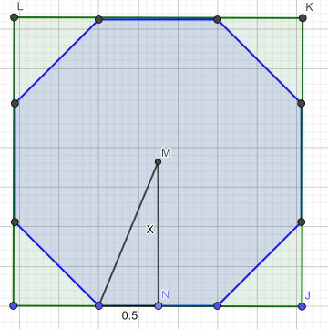
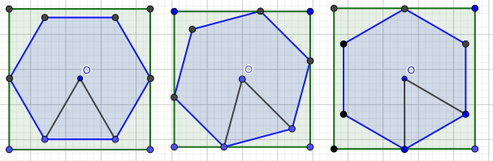

# Tutorial

[1354A - Alarm Clock](../problems/A._Alarm_Clock.md "Educational Codeforces Round 87 (Rated for Div. 2)")

Idea: [BledDest](https://codeforces.com/profile/BledDest "International Grandmaster BledDest")

 **Tutorial**
### [1354A - Alarm Clock](../problems/A._Alarm_Clock.md "Educational Codeforces Round 87 (Rated for Div. 2)")

Let's handle some cases. Firstly, if $b \ge a$ then Polycarp wakes up rested enough immediately, so $b$ is the answer. 

Otherwise, what does Polycarp do? He sets alarm to go off in $c$ minutes and falls asleep in $d$ minutes. Thus, he spends $c-d$ minutes sleeping. Notice that if $c-d$ is non-positive, then Polycarp always resets his alarm without sleeping. So for that case the answer is -1.

Finally, if Polycarp resets his alarm $x$ times then he ends up with $b + x \cdot (c - d)$ minutes of sleep in total and ends up spending $b + x \cdot c$ minutes of time. We know that $b + x \cdot (c - d)$ should be greater or equal to $a$ and $x$ should be the smallest possible. 

$$b + x \cdot (c - d) \ge a \leftrightarrow x \cdot (c - d) \ge a - b \leftrightarrow x \ge \frac{a - b}{c - d}$$ 

Thus, the smallest possible integer $x$ is equal to $\lceil \frac{a - b}{c - d} \rceil$. And the answer is $b + x \cdot c$.

Overall complexity: $O(1)$ per testcase.

 **Solution (pikmike)**
```cpp
t = int(input())
for _ in range(t):
	a, b, c, d = map(int, input().split())
	if b >= a:
		print(b)
		continue
	if c <= d:
		print(-1)
		continue
	a -= b
	dif = c - d
	print(b + (a + dif - 1) // dif * c)
```
[1354B - Ternary String](../problems/B._Ternary_String.md "Educational Codeforces Round 87 (Rated for Div. 2)")

Idea: [BledDest](https://codeforces.com/profile/BledDest "International Grandmaster BledDest")

 **Tutorial**
### [1354B - Ternary String](../problems/B._Ternary_String.md "Educational Codeforces Round 87 (Rated for Div. 2)")

There are multiple solutions involving advanced methods such as binary search or two pointers, but I'll try to describe a simpler one.

The main idea of my solution is that the answer should look like abb...bbbbbc: one character of type $a$, a block of characters of type $b$, and one character of type $c$. If we find all blocks of consecutive equal characters in our string, each candidate for the answer can be obtained by expanding a block to the left and to the right by exactly one character. So the total length of all candidates is $O(n)$, and we can check them all.

Why does the answer look like abb...bbbbbc? If the first character of the substring appears somewhere else in it, it can be deleted. The same applies for the last character. So, the first and the last characters should be different, and should not appear anywhere else within the string. Since there are only three types of characters, the answer always looks like abb...bbbbbc.

 **Solution (BledDest)**
```cpp
#include<bits/stdc++.h>

using namespace std;

char buf[200043];

int main()
{
	int t;
	scanf("%d", &t);
	for(int i = 0; i < t; i++)
	{
		scanf("%s", buf);
		string s = buf;
		int ans = int(1e9);
		int n = s.size();
		vector<pair<char, int> > c;
		for(auto x : s)
		{
			if(c.empty() || c.back().first != x)
				c.push_back(make_pair(x, 1));
			else
				c.back().second++;
		}
		int m = c.size();
		for(int i = 1; i < m - 1; i++)
			if(c[i - 1].first != c[i + 1].first)
				ans = min(ans, c[i].second + 2);
		if(ans > n)
			ans = 0;
		printf("%dn", ans);
	}
}
```
[1354C1 - Simple Polygon Embedding](../problems/C1._Simple_Polygon_Embedding.md "Educational Codeforces Round 87 (Rated for Div. 2)")

Idea: [adedalic](https://codeforces.com/profile/adedalic "International Master adedalic")

 **Tutorial**
### [1354C1 - Simple Polygon Embedding](../problems/C1._Simple_Polygon_Embedding.md "Educational Codeforces Round 87 (Rated for Div. 2)")

It's not hard to come up with a solution if you just imagine how $2n$-gon looks when $n$ is even. The solution is to rotate $2n$-gon in such way that several its sides are parallel to sides of the square. 

  And the answer is equal to the distance from center to any side multiplied by two, or: $$ ans = \frac{1}{\tan{\frac{\pi}{2 \cdot n}}} $$

[1354C2 - Not So Simple Polygon Embedding](../problems/C2._Not_So_Simple_Polygon_Embedding.md "Educational Codeforces Round 87 (Rated for Div. 2)")

Idea: [adedalic](https://codeforces.com/profile/adedalic "International Master adedalic")

 **Tutorial**
### [1354C2 - Not So Simple Polygon Embedding](../problems/C2._Not_So_Simple_Polygon_Embedding.md "Educational Codeforces Round 87 (Rated for Div. 2)")

At first, lets place $2n$-gon in such way that the lowest side of $2n$-gon is horizontal. Now we can, without loss of generality, think that the square has horizontal and vertical sides and we just rotate $2n$-gon around its center. 

If we rotate the $2n$-gon at angle $\frac{\pi}{n}$ then it will move on itself. Moreover, after rotating at angle $\frac{\pi}{2n}$ we'll get left and right sides vertical and the following rotation is meaningless since it's the same as if we just swap $x$ and $y$ coordinates. So we don't we to rotate more than $\frac{\pi}{2n}$.

  Also, we can see that while rotating the difference between max $x$ and min $x$ decreasing while the distance between max $y$ and min $y$ increasing. The answer is, obviously, the maximum among these differences. So, for example, we can just ternary search the optimal answer.

Or we can note that the behavior of differences is symmetrical (just swap $x$ and $y$ coordinates) so the answer is in the middle angle, i.e. we just need to rotate $2n$-gon at angle $\frac{\pi}{4n}$.

Finally, observing several right triangles we can come up with quite an easy answer:

$$ ans = \frac{\cos(\frac{\pi}{4n})}{\sin(\frac{\pi}{2n})} $$

 **Solution (adedalic)**
```cpp
import kotlin.math.*

fun main() {
    val PI = acos(-1.0)
    val T = readLine()!!.toInt()
    for (tc in 1..T) {
        val n = readLine()!!.toInt()
        var ans : Double
        if (n % 2 == 0) {
            ans = 1.0 / tan(PI / (2 * n))
        } else {
            ans = cos(PI / (4 * n)) / sin(PI / (2 * n))
        }
        println("%.9f".format(ans))
    }
}
```
[1354D - Multiset](../problems/D._Multiset.md "Educational Codeforces Round 87 (Rated for Div. 2)")

Idea: [BledDest](https://codeforces.com/profile/BledDest "International Grandmaster BledDest")

 **Tutorial**
### [1354D - Multiset](../problems/D._Multiset.md "Educational Codeforces Round 87 (Rated for Div. 2)")

First solution: write some data structure that would simulate the operations as they are given, for example, a segment tree or a Fenwick tree. Probably will require optimization since the limits are strict.

Second solution: notice that we have to find only one number belonging to the multiset. For example, let's find the minimum element. We can do it with binary search as follows: let's write a function that, for a given element $x$, tells the number of elements not greater than $x$ in the resulting multiset. To implement it, use the fact that all elements $\le x$ are indistinguishable, and all elements $> x$ are indistinguishable too, so the multiset can be maintained with just two counters.

Okay, how does this function help? The minimum in the resulting multiset is the minimum $x$ such that this function returns non-zero for it, and since the function is monotonous, we can find the answer with binary search.

 **Solution (BledDest)**
```cpp
#include<bits/stdc++.h>

using namespace std;

int n, q;
vector<int> a, k;

int count_le(int x)
{
	int cnt = 0;
	for(auto y : a)
		if(y <= x)
			cnt++;
	for(auto y : k)
	{
		if(y > 0 && y <= x)
			cnt++;
		if(y < 0 && abs(y) <= cnt)
			cnt--;
	}
	return cnt;
}

int main()
{
	scanf("%d %d", &n, &q);
	a.resize(n);
	k.resize(q);
	for(int i = 0; i < n; i++)
		scanf("%d", &a[i]);
	for(int i = 0; i < q; i++)
		scanf("%d", &k[i]);
	if(count_le(int(1e9)) == 0)
	{
		puts("0");
		return 0;
	}
	int lf = 0;
	int rg = int(1e6) + 1;
	while(rg - lf > 1)
	{
		int mid = (lf + rg) / 2;
		if(count_le(mid) > 0)
			rg = mid;
		else
			lf = mid;
	}
	printf("%dn", rg);
	return 0;
}
```
[1354E - Graph Coloring](../problems/E._Graph_Coloring.md "Educational Codeforces Round 87 (Rated for Div. 2)")

Idea: [BledDest](https://codeforces.com/profile/BledDest "International Grandmaster BledDest")

 **Tutorial**Tutorial is loading... **Solution (pikmike)**
```cpp
#include <bits/stdc++.h>

using namespace std;

#define x first
#define y second
#define mp make_pair
#define pb push_back
#define sqr(a) ((a) * (a))
#define sz(a) int(a.size())
#define all(a) a.begin(), a.end()
#define forn(i, n) for(int i = 0; i < int(n); i++) 
#define fore(i, l, r) for(int i = int(l); i < int(r); i++)

typedef long long li;
typedef long double ld;
typedef pair<int, int> pt;

template <class A, class B> ostream& operator << (ostream& out, const pair<A, B> &a) {
	return out << "(" << a.x << ", " << a.y << ")";
}

template <class A> ostream& operator << (ostream& out, const vector<A> &v) {
	out << "[";
	forn(i, sz(v)) {
		if(i) out << ", ";
		out << v[i];
	}
	return out << "]";
}

mt19937 rnd(time(NULL));

const int INF = int(1e9);
const li INF64 = li(1e18);
const int MOD = int(1e9) + 7;
const ld EPS = 1e-9;
const ld PI = acos(-1.0);

const int N = 5000 + 7;

int n, m;
int a[3];
vector<int> g[N];

bool read () {
	if (scanf("%d%d", &n, &m) != 2)
		return false;
	forn(i, 3) scanf("%d", &a[i]);
	forn(i, n)
		g[i].clear();
	forn(i, m){
		int v, u;
		scanf("%d%d", &v, &u);
		--v, --u;
		g[v].pb(u);
		g[u].pb(v);
	}
	return true;
}

int tot0, tot1;
int clr[N];
vector<vector<int>> vts[2];
bool ok;

void dfs(int v){
	tot0 += clr[v] == 0;
	tot1 += clr[v] == 1;
	vts[clr[v]].back().pb(v);
	for (auto u : g[v]){
		if (clr[u] == -1){
			clr[u] = clr[v] ^ 1;
			dfs(u);
		}
		else if (clr[u] == clr[v]){
			ok = false;
		}
	}
}

int dp[N][N];
int res[N];

void solve() {
	vector<pt> siz;
	memset(clr, -1, sizeof(clr));
	vts[0].clear();
	vts[1].clear();
	forn(i, n) if (clr[i] == -1){
		tot0 = tot1 = 0;
		clr[i] = 0;
		ok = true;
		vts[0].pb(vector<int>());
		vts[1].pb(vector<int>());
		dfs(i);
		if (!ok){
			puts("NO");
			return;
		}
		siz.pb(mp(tot0, tot1));
	}
	
	memset(dp, -1, sizeof(dp));
	dp[0][0] = 0;
	forn(i, sz(siz)) forn(j, N) if (dp[i][j] != -1){
		dp[i + 1][j + siz[i].x] = 0;
		dp[i + 1][j + siz[i].y] = 1;
	}
	
	if (dp[sz(siz)][a[1]] == -1){
		puts("NO");
		return;
	}
	
	puts("YES");
	memset(res, -1, sizeof(res));
	int cur = a[1];
	for (int i = sz(siz); i > 0; --i){
		for (auto it : vts[dp[i][cur]][i - 1])
			res[it] = 2;
		cur -= sz(vts[dp[i][cur]][i - 1]);
	}
	
	forn(i, n) if (res[i] == -1){
		if (a[0] > 0){
			res[i] = 1;
			--a[0];
		}
		else{
			res[i] = 3;
			--a[2];
		}
	}
	
	forn(i, n) printf("%d", res[i]);
	puts("");
}

int main() {
#ifdef _DEBUG
	freopen("input.txt", "r", stdin);
//	freopen("output.txt", "w", stdout);
	
	int tt = clock();
	
#endif
	
	cerr.precision(15);
	cout.precision(15);
	cerr << fixed;
	cout << fixed;

	while(read()) {	
		solve();
		
#ifdef _DEBUG
	cerr << "TIME = " << clock() - tt << endl;
	tt = clock();
#endif

	}
}
```
[1354F - Summoning Minions](../problems/F._Summoning_Minions.md "Educational Codeforces Round 87 (Rated for Div. 2)")

Idea: [BledDest](https://codeforces.com/profile/BledDest "International Grandmaster BledDest")

 **Tutorial**Tutorial is loading... **Solution 1 (BledDest)**
```cpp
#include<bits/stdc++.h>

using namespace std;

const int N = 243;

struct edge
{
    int y, c, f, cost;
    edge() {};
    edge(int y, int c, int f, int cost) : y(y), c(c), f(f), cost(cost) {};
};

int s, t, V;
vector<int> g[N];
vector<edge> e;

void add(int x, int y, int c, int cost)
{
    g[x].push_back(e.size());
    e.push_back(edge(y, c, 0, cost));
    g[y].push_back(e.size());
    e.push_back(edge(x, 0, 0, -cost));
}

int rem(int num)
{
    return e[num].c - e[num].f;
}   

int p[N];
int d[N];
int pe[N];
int inq[N];

bool enlarge()
{
    for(int i = 0; i < V; i++)
    {
        d[i] = int(1e9);
        p[i] = -1;
        pe[i] = -1;
        inq[i] = 0;
    }
    d[s] = 0;
    queue<int> q;
    q.push(s);
    inq[s] = 1;
    while(!q.empty())
    {
        int k = q.front();
        q.pop();
        inq[k] = 0;
        for(auto z : g[k])
        {
            if(!rem(z)) continue;
            if(d[e[z].y] > d[k] + e[z].cost)
            {
                p[e[z].y] = k;
                pe[e[z].y] = z;
                d[e[z].y] = d[k] + e[z].cost;
                if(!inq[e[z].y])
                {
                    q.push(e[z].y);
                    inq[e[z].y] = 1;
                }
            }
        }
    }
    if(p[t] == -1)
        return false;
    int cur = t;
    while(cur != s)
    {
        e[pe[cur]].f++;
        e[pe[cur] ^ 1].f--;
        cur = p[cur];
    }
    return true;
}

void process_test()
{
	int n, k;
	cin >> n >> k;
	vector<int> a(n), b(n);
	for(int i = 0; i < n; i++)
	{
		cin >> a[i] >> b[i];
	}
	s = 2 * n;
	t = 2 * n + 1;
	V = 2 * n + 2;
	for(int i = 0; i < n; i++)
	{
		add(s, i, 1, 0);
		add(i + n, t, 1, 0);
	}
	for(int i = 0; i < n; i++)
		for(int j = 0; j < n; j++)
		{
			if(j < k - 1)
				add(i, j + n, 1, -(a[i] + b[i] * j));
			else if(j == n - 1)
				add(i, j + n, 1, -(a[i] + b[i] * (k - 1)));
			else
				add(i, j + n, 1, -(b[i] * (k - 1)));
		}
	for(int i = 0; i < n; i++)
		enlarge();
	vector<int> order(n);
	for(int i = 0; i < n; i++)
		for(auto x : g[i])
		{
			int to = e[x].y;
			if(to >= n && to < 2 * n && e[x].f == 1)
				order[to - n] = i;
		}
	cout << k + (n - k) * 2 << endl;
	for(int i = 0; i < n; i++)
	{
		cout << order[i] + 1 << " ";
		if(i >= k - 1 && i < n - 1)
			cout << -(order[i] + 1) << " ";
	}
	cout << endl;
	e.clear();
	for(int i = 0; i < V; i++)
		g[i].clear();
}

int main()
{                       
    int t;
	cin >> t;
	for(int i = 0; i < t; i++)
		process_test();
}
```
 **Solution 2 (neal)**
```cpp
#include <algorithm>
#include <array>
#include <cassert>
#include <iostream>
#include <vector>
using namespace std;

template<typename T> ostream& operator<<(ostream &os, const vector<T> &v) { os << '{'; string sep; for (const auto &x : v) os << sep << x, sep = ", "; return os << '}'; }
template<typename A, typename B> ostream& operator<<(ostream &os, const pair<A, B> &p) { return os << '(' << p.first << ", " << p.second << ')'; }

void dbg_out() { cerr << endl; }
template<typename Head, typename... Tail> void dbg_out(Head H, Tail... T) { cerr << ' ' << H; dbg_out(T...); }

#ifdef NEAL_DEBUG
#define dbg(...) cerr << "(" << #__VA_ARGS__ << "):", dbg_out(__VA_ARGS__)
#else
#define dbg(...)
#endif

template<typename T>
void output_vector(const vector<T> &v, bool add_one = false, int start = -1, int end = -1) {
    if (start < 0) start = 0;
    if (end < 0) end = int(v.size());

    for (int i = start; i < end; i++)
        cout << v[i] + (add_one ? 1 : 0) << (i < end - 1 ? ' ' : 'n');
}

const int64_t INF64 = int64_t(2e18) + 5;

vector<int> assignment;

template<typename T>
int64_t hungarian(vector<vector<T>> costs) {
    int n = int(costs.size());
    int m = costs.empty() ? 0 : int(costs[0].size());

    if (n > m) {
        vector<vector<T>> new_costs(m, vector<T>(n));

        for (int i = 0; i < n; i++)
            for (int j = 0; j < m; j++)
                new_costs[j][i] = costs[i][j];

        swap(costs, new_costs);
        swap(n, m);
    }

    vector<int64_t> u(n + 1), v(m + 1);
    vector<int> p(m + 1), way(m + 1);

    for (int i = 1; i <= n; i++) {
        vector<int64_t> min_v(m + 1, INF64);
        vector<bool> used(m + 1, false);
        p[0] = i;
        int j0 = 0;

        do {
            used[j0] = true;
            int i0 = p[j0], j1 = 0;
            int64_t delta = INF64;

            for (int j = 1; j <= m; j++)
                if (!used[j]) {
                    int64_t cur = costs[i0 - 1][j - 1] - u[i0] - v[j];

                    if (cur < min_v[j]) {
                        min_v[j] = cur;
                        way[j] = j0;
                    }

                    if (min_v[j] < delta) {
                        delta = min_v[j];
                        j1 = j;
                    }
                }

            for (int j = 0; j <= m; j++)
                if (used[j]) {
                    u[p[j]] += delta;
                    v[j] -= delta;
                } else {
                    min_v[j] -= delta;
                }

            j0 = j1;
        } while (p[j0] != 0);

        do {
            int j1 = way[j0];
            p[j0] = p[j1];
            j0 = j1;
        } while (j0 != 0);
    }

    // Note that p[j] is the row assignment of column j (both 1-based). If p[j] = 0, the column is unassigned.
    assignment = p;
    return -v[0];
}


void run_case() {
    int N, K;
    cin >> N >> K;
    vector<int> A(N), B(N);

    for (int i = 0; i < N; i++)
        cin >> A[i] >> B[i];

    vector<vector<int>> costs(N, vector<int>(N, 0));

    for (int i = 0; i < N; i++)
        for (int position = 0; position < N; position++)
            if (position < K)
                costs[i][position] = -(A[i] + position * B[i]);
            else
                costs[i][position] = -((K - 1) * B[i]);

    int64_t score = -hungarian(costs);
    dbg(score);
    vector<int> solution;

    for (int k = 1; k < K; k++)
        solution.push_back(assignment[k]);

    for (int k = K + 1; k <= N; k++) {
        solution.push_back(assignment[k]);
        solution.push_back(-assignment[k]);
    }

    solution.push_back(assignment[K]);
    assert(int(solution.size()) == 2 * N - K);
    cout << solution.size() << 'n';
    output_vector(solution);
}

int main() {
    ios::sync_with_stdio(false);
#ifndef NEAL_DEBUG
    cin.tie(nullptr);
#endif

    int tests;
    cin >> tests;

    while (tests-- > 0)
        run_case();
}
```
 **Solution 3 (pikmike)**
```cpp
#include <bits/stdc++.h>
 
using namespace std;
 
#define x first
#define y second
#define mp make_pair
#define pb push_back
#define sqr(a) ((a) * (a))
#define sz(a) int(a.size())
#define all(a) a.begin(), a.end()
#define forn(i, n) for(int i = 0; i < int(n); i++) 
#define fore(i, l, r) for(int i = int(l); i < int(r); i++)
 
typedef long long li;
typedef long double ld;
typedef pair<int, int> pt;
 
template <class A, class B> ostream& operator << (ostream& out, const pair<A, B> &a) {
	return out << "(" << a.x << ", " << a.y << ")";
}
 
template <class A> ostream& operator << (ostream& out, const vector<A> &v) {
	out << "[";
	forn(i, sz(v)) {
		if(i) out << ", ";
		out << v[i];
	}
	return out << "]";
}
 
mt19937 rnd(time(NULL));
 
const int INF = int(1e9);
const li INF64 = li(1e18);
const int MOD = int(1e9) + 7;
const ld EPS = 1e-9;
const ld PI = acos(-1.0);
 
const int N = 100;
 
int n, k;
pair<pt, int> a[N];
 
bool read () {
	if (scanf("%d%d", &n, &k) != 2)
		return false;
	forn(i, n){
		scanf("%d%d", &a[i].x.x, &a[i].x.y);
		a[i].y = i;
	}
	return true;
}
 
int dp[N][N];
int p[N][N];
 
void solve() {
	sort(a, a + n, [](const pair<pt, int> &a, const pair<pt, int> &b){
		if (a.x.y != b.x.y)
			return a.x.y < b.x.y;
		return a.x.x < b.x.x;
	});
	
	forn(i, N) forn(j, N)
		dp[i][j] = -INF;
	dp[0][0] = 0;
	forn(i, n) forn(j, N) if (dp[i][j] >= 0){
		if (dp[i + 1][j] < dp[i][j] + a[i].x.y * (k - 1)){
			dp[i + 1][j] = dp[i][j] + a[i].x.y * (k - 1);
			p[i + 1][j] = j;
		}
		if (dp[i + 1][j + 1] < dp[i][j] + a[i].x.y * j + a[i].x.x){
			dp[i + 1][j + 1] = dp[i][j] + a[i].x.y * j + a[i].x.x;
			p[i + 1][j + 1] = j;
		}
	}
	
	vector<int> ans1, ans2;
	int cur = k;
	for (int i = n; i > 0; --i){
		if (p[i][cur] == cur)
			ans2.pb(a[i - 1].y + 1);
		else
			ans1.pb(a[i - 1].y + 1);
		cur = p[i][cur];
	}
	
	reverse(all(ans1));
	reverse(all(ans2));
	printf("%dn", sz(ans1) + sz(ans2) * 2);
	forn(i, sz(ans1) - 1)
		printf("%d ", ans1[i]);
	for (auto it : ans2)
		printf("%d %d ", it, -it);
	printf("%dn", ans1.back());
}
 
int main() {
#ifdef _DEBUG
	freopen("input.txt", "r", stdin);
//	freopen("output.txt", "w", stdout);
	
	int tt = clock();
	
#endif
	
	cerr.precision(15);
	cout.precision(15);
	cerr << fixed;
	cout << fixed;
 
	int tc;
	scanf("%d", &tc);
	while(tc--) {	
		read();
		solve();
		
#ifdef _DEBUG
	cerr << "TIME = " << clock() - tt << endl;
	tt = clock();
#endif
 
	}
}
```
[1354G - Find a Gift](../problems/G._Find_a_Gift.md "Educational Codeforces Round 87 (Rated for Div. 2)")

Idea: [adedalic](https://codeforces.com/profile/adedalic "International Master adedalic")

 **Tutorial**Tutorial is loading... **Solution (adedalic)**
```cpp
#include<bits/stdc++.h>

using namespace std;

#define fore(i, l, r) for(int i = int(l); i < int(r); i++)
#define sz(a) int((a).size())

#define x first
#define y second

typedef long long li;
typedef pair<int, int> pt;

const int MAG = 30;
int lst;

int n, k;

inline bool read() {
	if(!(cin >> n >> k))
		return false;
	return true;
}

int ask(int l1, int r1, int l2, int r2) {
	assert(l1 < r1 && l2 < r2);
	assert(r1 <= l2 || r2 <= l1);
	
	cout << "? " << r1 - l1 << " " << r2 - l2 << endl;
	fore(i, l1, r1) {
		if (i > l1) cout << " ";
		cout << i + 1;
	}
	cout << endl;
	fore(i, l2, r2) {
		if (i > l2) cout << " ";
		cout << i + 1;
	}
	cout << endl;
	cout.flush();
	
	string resp;
	cin >> resp;
	
	if (resp == "FIRST")
		return -1;
	if (resp == "SECOND")
		return 1;
	if (resp == "EQUAL")
		return 0;
	
	exit(0);
}

inline void solve() {
	//check first position
	mt19937 rnd(lst ^ (n * 1024 + k));
	for(int q = 0; q < MAG; q++) {
		int cur = 1 + rnd() % (n - 1);
		
		int resp = ask(0, 1, cur, cur + 1);
		if (resp == 1) {
			cout << "! 1" << endl;
			cout.flush();
			return;
		}
	}
	
	int len = 1;
	while(true) {
		int cnt = min(len, n - len);
		int resp = ask(0, cnt, len, len + cnt);
		if (resp != 0) {
			assert(resp == -1);
			break;
		}
		len <<= 1;
	}
	
	int lf = len, rg = min(2 * len, n);
	while(rg - lf > 1) {
		int mid = (lf + rg) >> 1;
		int resp = ask(0, mid - lf, lf, mid);
		assert(resp != 1);
		
		if (resp == 0)
			lf = mid;
		else
			rg = mid;
	}
	cout << "! " << lf + 1 << endl;
	cout.flush();
	
	lst = lf + 1;
}

int main() {
	int tc;
	cin >> tc;
	
	lst = tc;
	while(tc--) {
		assert(read());
		solve();
	}
	return 0;
}
```
