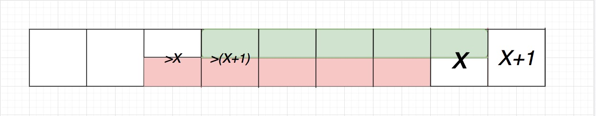

# Tutorial

This is our first contest for the three of us ([Alexdat2000](https://codeforces.com/profile/Alexdat2000 "Candidate Master Alexdat2000"), [crazyilian](https://codeforces.com/profile/crazyilian "Candidate Master crazyilian"), [sevlll777](https://codeforces.com/profile/sevlll777 "Master sevlll777")), so we would like to share our impressions of creating this contest. Check it if you want to!

 **ROUND LOG**First problem — task rejections. [300iq](https://codeforces.com/profile/300iq "Legendary Grandmaster 300iq") rejected about 13 problems, 6 of which were supposed to be problem D. In the end, we came up with E, and the old E moved to D.

These are the verdicts with which the problems were rejected:

 1. The idea is very simple here and the implementation is very simple too, this problem is definitely not D1C-D and definitely not interesting.
2. Not an interesting problem, too standard, without new ideas.
3. This is a known problem which is solved quite simply by a compressed tree.
4. Unfortunately, it seems to me that this problem does not fit D1B. It is a funny construct but it is too technical (not interesting enough) for this position and too simple for the next ones.
5. This problem is solved very simply by taking a close look at the sequence, so it is not very interesting.
6. It seems to me that this problem is too standard. It is as if in the condition it is written, which dp should be written.
7. The idea of 4 consecutive numbers is known.
8. It's a known problem.
9. It's a known problem.
10. It's too standard.
11. There's some greed in there. Is that the right thing to do?
12. Well, first of all, it's doubtful you have any proof. Second of all, isn't that on oeis?
13. It doesn't make her any better, it's a known problem.

When the problems were already formed, their creation began. In some problems, it was necessary to lower the constraints, which made it impossible to cut off some non-deterministic or not optimal solutions. 

Otherwise, everything was fine until the last 18 hours before the contest began...

 * Mike [MikeMirzayanov](https://codeforces.com/profile/MikeMirzayanov "Headquarters, MikeMirzayanov") Mirzayanov sent 7 issues to problem A. It was necessary to redo all the tests in the problem and much more.
* While we were correcting them, coordinator Ildar [300iq](https://codeforces.com/profile/300iq "Legendary Grandmaster 300iq") Gainullin told us to remove all the illustrations for the problem (memes and just cool pictures at the bottom of the notes). We did not like it *very* much, we wanted the pictures to be included in the contest.
* We finished fixing problem A, and went to bed. At that time Ildar (thank him very much) was polishing the conditions of all the other problems. Unfortunately, at that moment he removed the pictures. He also suddenly renamed problem F and city in the English version of problem D.
* 4 hours before the beginning. Mikhail Mirzayanov started sending issues to other problems.
* We had to redo almost all the tests for problems B, C and D.
* Heroically won the limits in E 2 hours before the contest start.

A total of 475 commits to the Polygon were made.

During the round there were many of the same type, but also some funny clares. For example:

 * Problem C. *i cant solve it*
* Problem E. *When will a COVID 19 vaccine come out???*

Thanks to everyone who upvotes this editorial!

And, of course, here's the tutorial of the round.

[1358A - Park Lighting](../problems/A._Park_Lighting.md "Codeforces Round 645 (Div. 2)")  
 Idea: [Alexdat2000](https://codeforces.com/profile/Alexdat2000 "Candidate Master Alexdat2000")

 **Picture**

  **Tutorial**  
### [1358A - Park Lighting](../problems/A._Park_Lighting.md "Codeforces Round 645 (Div. 2)")

Note that if at least one of the sides is even, the square can be divided into pairs of neighbors and the answer is $\frac{nm}{2}$. 

If both sides are odd, we can first light up a $(n - 1) \times m$ part of the park. Then we'll still have the part $m \times 1$. We can light it up with $\frac{m + 1}{2}$ lanterns. Then the total number of the lanterns is $\frac{(n-1) \cdot m}{2} + \frac{m + 1}{2} = \frac{nm - m + m + 1}{2} = \frac{nm + 1}{2}$.

Note that both cases can be combined into one formula: $\lfloor \frac{nm + 1}{2} \rfloor$.

The overall compexity is $\mathcal{O}(1)$ per test.

  **Solution**
```cpp
#include <iostream>

using namespace std;

int main() {
    int t, n, m;
    cin >> t;
    while (t--) {
        cin >> n >> m;
        cout << (n * m + 1) / 2 << 'n';
    }
}
```
[1358B - Maria Breaks the Self-isolation](../problems/B._Maria_Breaks_the_Self-isolation.md "Codeforces Round 645 (Div. 2)")  
 Idea: [crazyilian](https://codeforces.com/profile/crazyilian "Candidate Master crazyilian")

 **Picture**

  **Tutorial**  
### [1358B - Maria Breaks the Self-isolation](../problems/B._Maria_Breaks_the_Self-isolation.md "Codeforces Round 645 (Div. 2)")

Let $x$ be the maximum number of grannies that can go out to the yard. Then if Maria Ivanovna calls them all at the same time, then everyone will see $x$ grannies. Since $x$ is the maximum answer, then each granny of them satisfy $a_i \le x$ (otherwise there's no way for these grannies to gather in the yard), that is, such call is correct. So it is always enough to call once.

Note that if you order grannies by $a_i$, Maria Ivanovna will have to call $x$ first grannies from this list. She can take $x$ grannies if $a_x \le x$ (otherwise, after all $x$ grannies arrived, the last one will leave). To find $x$ we can do a linear search.

The overall compexity is $\mathcal{O}(n\log{n})$ per test.

  **Solution**
```cpp
#include <iostream>
#include <vector>
#include <algorithm>

using namespace std;

void solve() {
    int n;
    cin >> n;
    vector<int> arr(n);
    for (int &el : arr)
        cin >> el;
    sort(arr.begin(), arr.end());
    for (int i = n - 1; i >= 0; i--) {
        if (arr[i] <= i + 1) {
            cout << i + 2 << 'n';
            return;
        }
    }
    cout << 1 << 'n';
}

int main() {
    int t;
    cin >> t;
    while (t--)
        solve();
}

```
[1358C - Celex Update](../problems/C._Celex_Update.md "Codeforces Round 645 (Div. 2)")  
 Idea: [crazyilian](https://codeforces.com/profile/crazyilian "Candidate Master crazyilian")

 **Picture**

  **Tutorial**  Tutorial is loading...  **Solution**
```cpp
#include <iostream>

using namespace std;

int main() {
    int t;
    cin >> t;
    while (t--) {
        long long a, b, c, d;
        cin >> a >> b >> c >> d;
        cout << (c - a) * (d - b) + 1 << 'n';
    }
}
```
[1358D - The Best Vacation](../problems/D._The_Best_Vacation.md "Codeforces Round 645 (Div. 2)")  
 Idea: [sevlll777](https://codeforces.com/profile/sevlll777 "Master sevlll777")

 **Picture**

  **Tutorial**  
### [1358D - The Best Vacation](../problems/D._The_Best_Vacation.md "Codeforces Round 645 (Div. 2)")

We will double the array of days and solve the problem when the day vacation starts and the day it ends is always in the same year. Then $a$ is an array of number of days in each of the months.

Consider array $B = [1, 2, ..., a_1] + [1, 2, ..., a_2] + ... [1, 2, ..., a_n] + [1, 2, ..., a_n]$. Our task is to find a subsection of length $k$ with the maximum sum in it. Further we will call this segment optimal. 

Statement: We will find such an optimal segment that its end coincides with the end of some month. 

Proof by contradiction: Pretend that's not the case. Consider the rightmost optimal segment. Let its last element be $x$, then the next one is $x+1$, otherwise $x$ coincides with $a_i$. Note that if we move this segment to the right, the sum must be reduced, which means that the first element of the segment $>x+1$. Then its left neighbor $>x$. It means that you can move the segment by $1$ to the left so that the sum increases. So, the chosen segment is not optimal. Contradiction. (see picture) 



Solution: now we just need to go through all the possible ends of the segment, which are only $\mathcal{O}(n)$. Let's build two arrays of prefix sums:

$c_i = a_1 + a_2 + ... + a_i\\\$ $d_i = \frac{a_1 (a_1 + z)}{2} + ... + \frac{a_i (a_i + 1)}{2}$

$c_i$ is responsible for the number of days before the $i$-th month, and $d_i$ is responsible for the sum of numbers of all days before the $i$-th month.

For each of the n ends, let's make a binsearch to find which month contains its left border ($k$ days less than the right one). You can use array $c_i$ to check whether the left border lies to the left/in the block/to the right, and use array $d_i$ to restore the answer.

The overall compexity is $\mathcal{O}(n\log{n})$.

  **Solution**
```cpp
#include <iostream>
#include <algorithm>
#include <vector>

#define int long long

using namespace std;

signed main() {
  int n, len;
  cin >> n >> len;
  vector<int> A(2 * n);
  for (int i = 0; i < n; i++) {
    cin >> A[i];
    A[n + i] = A[i];
  }
  n *= 2;
  
  vector<int> B = {0}, C = {0};
  for (int i = 0; i < n; i++) 
    B.push_back(B.back() + A[i]);
  for (int i = 0; i < n; i++) 
    C.push_back(C.back() + (A[i] * (A[i] + 1)) / 2);
  int ans = 0;
  for (int i = 0; i < n; i++) {
    if (B[i + 1] >= len) {
      int z = upper_bound(B.begin(), B.end(), B[i + 1] - len) - B.begin();
      int cnt = C[i + 1] - C[z];
      int days = B[i + 1] - B[z];
      int too = len - days;
      cnt += ((A[z - 1] * (A[z - 1] + 1)) / 2);
      cnt -= (((A[z - 1] - too) * (A[z - 1] - too + 1)) / 2);
      ans = max(ans, cnt);
    }
  }
  cout << ans;
}
```
[1358E - Are You Fired?](../problems/E._Are_You_Fired_.md "Codeforces Round 645 (Div. 2)")  
 Idea: [sevlll777](https://codeforces.com/profile/sevlll777 "Master sevlll777") и [crazyilian](https://codeforces.com/profile/crazyilian "Candidate Master crazyilian")

 **Picture**

  **Tutorial**  
### [1358E - Are You Fired?](../problems/E._Are_You_Fired_.md "Codeforces Round 645 (Div. 2)")

Let's call the value of all elements in the second half of the array $x$.

Let $s_i = a_i + a_{i+1} + \ldots + a_{i+k-1}$ — the reported incomes.

Pretend there exists such a $k$ that $k\le\tfrac{n}{2}$. Consider the following reported incomes: $s_i$ and $s_{i+k}$. Notice that if we double $k$, the $i$-th reported income will be equal to $s_i+s_{i+k}$. $s_i>0$ and $s_{i+k}>0$ imply $s_i+s_{i+k}>0$. It means that after doubling $k$, the new value will still be correct $\ \implies\ $ if some $k$ exists, there's also $k>\tfrac{n}{2}$.

Now, let's notice that $s_{i+1} = s_i + (a_{i + k} - a_i)$.

It means we can think of $s_i$ as prefix sums of the following array: $\\\p = [s_1,\ a_{k+1}-a_1,\ a_{k+2}-a_2,\ \ldots,\ a_n - a_{n-k}]$. $ \\\$ As $k>\tfrac{n}{2}$, $a_{k+j} = x$ holds for $j \ge 0$, so, actually $\\\p = [s_1,\ x-a_1,\ x-a_2,\ \ldots,\ x-a_{n-k}]$.

How is this array changed when we increment $k$ by 1? $\\\p_{new} = [s_1+a_{k+1},\ a_{k+2}-a_1,\ a_{k+3}-a_2,\ \ldots,\ a_n-a_{n-k-1}]$, which equals $[s_1+x,\ x-a_1,\ x-a_2,\ \ldots,\ x-a_{n-k-1}]$. $ \\\$ So, when you increase $k$ by 1, the first element is changed, and the last element is removed — and that's it.

Recall that $s_i = p_1 + p_2 + \ldots + p_i$. Notice that the minimum reported income (some number from $s$) doesn't depend on the first element of $p$ because it's a term of all sums ($s_1, s_2, \ldots$). For example, if $p_1$ is increased by $1$, all $s_i$ are increased by $1$ too. So, let's calculate the following array $m$: $ \\\$ $m_i = min(s_1-p_1, s_2-p_1, \ldots, s_i-p_1) = min(0, p_2,\ p_2+p_3,\ \ldots,\ p_2+\ldots+p_i)$. $ \\\$ This can be done in $\mathcal{O}(n)$. 

Notice that this array is the same for all $k$, except its size. So, it's obvious that the minimum reported income for a particular $k$ is $p_1+m_{n-k+1}=a_1+\ldots+a_k+m_{n-k+1}$. So, we can just check if this number is greater than $0$ for some $k$.

We can calculate prefix sums and $m$ in $\mathcal{O}(n)$, so the overall complexity is $\mathcal{O}(n)$.

  **Solution**
```cpp
#include <iostream>
#include <vector>

using namespace std;

#define int long long

signed main() {
  int n;
  cin >> n;
  int N = (n + 1) / 2;
  vector<int> a(N);
  for (int &el : a)
    cin >> el;
  int Ax;
  cin >> Ax;
  vector<int> m(N + 1, 0);
  int Pprefsm = 0;
  for (int i = 1; i < N + 1; ++i) {
    Pprefsm += Ax - a[i - 1];
    m[i] = min(m[i - 1], Pprefsm);
  }
  int Aprefsm = 0;
  for (int k = 1; k <= N; ++k)
    Aprefsm += a[k - 1];
  for (int k = N; k <= n; ++k) {
    if (Aprefsm + m[n - k] > 0)
      return cout << k, 0;
    Aprefsm += Ax;
  }
  cout << -1;
}
```
[1358F - Tasty Cookie](../problems/F._Tasty_Cookie.md "Codeforces Round 645 (Div. 2)")  
 Idea: [sevlll777](https://codeforces.com/profile/sevlll777 "Master sevlll777") и [crazyilian](https://codeforces.com/profile/crazyilian "Candidate Master crazyilian")

 **Picture**

  **Tutorial**  Tutorial is loading...  **Solution by Alexdat2000**
```cpp
#include <bits/stdc++.h>

using namespace std;

#define int long long
const int LIM = 2e5;

bool is_increasing(const vector<int> &vec) {
  for (int i = 0; i < vec.size() - 1; i++) {
    if (vec[i] >= vec[i + 1])
      return false;
  }
  return true;
}

bool is_decreasing(const vector<int> &vec) {
  for (int i = 0; i < vec.size() - 1; i++) {
    if (vec[i] <= vec[i + 1])
      return false;
  }
  return true;
}

vector<int> rollback(const vector<int> &vec) {
  vector<int> ans(vec.size());
  ans[0] = vec[0];
  for (int i = 1; i < vec.size(); i++)
    ans[i] = vec[i] - vec[i - 1];
  return ans;
}

signed main() {
  int n;
  cin >> n;
  vector<int> a(n), b(n);
  for (int &i : a)
    cin >> i;
  for (int &i : b)
    cin >> i;
  vector<int> a_rev = a;
  reverse(a_rev.begin(), a_rev.end());

  if (n == 1) {
    if (a == b)
      cout << "SMALL" << 'n' << 0 << 'n';
    else
      cout << "IMPOSSIBLE" << 'n';
    return 0;
  }

  int sum_a = accumulate(a.begin(), a.end(), 0LL);
  int sum_b = accumulate(b.begin(), b.end(), 0LL);
  int rollback_cnt = 0;

  if (n == 2) {
    vector<int> ans; // -1 = R, X = PPP..PP (x times)
    int move_cnt = 0, roll_cnt = 0;  // both types

    bool rev = a[0] > a[1];
    if (rev)
      swap(a[0], a[1]);

    if (b[0] > b[1]) {
      swap(b[0], b[1]);
      ans.push_back(-1);
      move_cnt++;
    }
    while (true) {
      if (sum_a > sum_b) {
        cout << "IMPOSSIBLE" << 'n';
        return 0;
      }

      if (sum_a == sum_b) {
        if (a != b) {
          cout << "IMPOSSIBLE" << 'n';
          return 0;
        }

        if (rev) {
          ans.push_back(-1);
          move_cnt++;
        }

        if (rollback_cnt > LIM) {
          cout << "BIG" << 'n' << rollback_cnt << 'n';
          return 0;
        } else {
          cout << "SMALL" << 'n' << move_cnt << 'n';
          reverse(ans.begin(), ans.end());
          for (auto i : ans) {
            if (i == -1)
              cout << "R";
            else {
              for (int _ = 0; _ < i; _++)
                cout << "P";
            }
          }
          cout << 'n';
          return 0;
        }
      }

      if (a[0] == b[0]) {
        if ((b[1] - a[1]) % b[0] == 0) {
          roll_cnt = (b[1] - a[1]) / b[0];
          ans.push_back(roll_cnt);
          move_cnt += roll_cnt, rollback_cnt += roll_cnt;
          b = a;
          sum_b = b[0] + b[1];
        } else {
          cout << "IMPOSSIBLE" << 'n';
          return 0;
        }
      } else {
        roll_cnt = b[1] / b[0];
        ans.push_back(roll_cnt);
        move_cnt += roll_cnt, rollback_cnt += roll_cnt;

        ans.push_back(-1);
        move_cnt++;
        swap(b[0], b[1]);
        b[0] %= b[1];
        sum_b = b[0] + b[1];
      }
    }
  }

  string ans;

  while (true) {
    if (sum_a == sum_b) {
      if (a_rev == b) {
        ans.push_back('R');
        reverse(b.begin(), b.end());
      }
      if (a == b) {
        reverse(ans.begin(), ans.end());
        if (rollback_cnt > LIM)
          cout << "BIG" << 'n' << rollback_cnt << 'n';
        else
          cout << "SMALL" << 'n' << ans.size() << 'n' << ans << 'n';
      } else
        cout << "IMPOSSIBLE" << 'n';
      return 0;
    } else if (is_increasing(b)) {
      b = rollback(b);
      sum_b = accumulate(b.begin(), b.end(), 0LL);
      ans += 'P';
      rollback_cnt++;
    } else if (is_decreasing(b)) {
      reverse(b.begin(), b.end());
      ans += 'R';
    } else {
      cout << "IMPOSSIBLE" << 'n';
      return 0;
    }
  }
}
```
 **Solution by Alivk06 (much shorter)**
```cpp
#include <bits/stdc++.h>

using namespace std;
#define int long long

signed main() {
  int n;
  cin >> n;
  vector<int> a(n), b(n);
  for (int i = 0; i < n; ++i) cin >> a[i];
  for (int i = 0; i < n; ++i) cin >> b[i];
  if (n == 1) {
    if (a[0] == b[0]) cout << "SMALLn" << 0;
    else cout << "IMPOSSIBLE";
    return 0;
  }
  if (n == 2) {
    vector<pair<int, bool>> res;
    int kol = 0;
    while (true) {
      if (b[0] == 0 || b[1] == 0) {
        cout << "IMPOSSIBLE";
        return 0;
      }
      if (a == b) break;
      if (a[0] == b[1] && a[1] == b[0]) {
        res.emplace_back(1, false);
        break;
      }
      if (b[0] == b[1]) {
        cout << "IMPOSSIBLE";
        return 0;
      }
      if (b[0] > b[1]) {
        res.emplace_back(1, false);
        swap(b[0], b[1]);
      }
      if (a[0] == b[0] && a[1] < b[1] && a[1] % b[0] == b[1] % b[0]) {
        res.emplace_back((b[1] - a[1]) / b[0], true);
        kol += res.back().first;
        break;
      }
      if (a[1] == b[0] && a[0] < b[1] && a[0] % b[0] == b[1] % b[0]) {
        res.emplace_back((b[1] - a[0]) / b[0], true);
        kol += res.back().first;
        res.emplace_back(1, false);
        break;
      }
      kol += b[1] / b[0];
      res.emplace_back(b[1] / b[0], true);
      b[1] %= b[0];
    }
    if (kol > 2e5) {
      cout << "BIGn";
      cout << kol;
    } else {
      cout << "SMALLn";
      int flex = 0;
      for (auto i : res) flex += i.first;
      cout << flex << "n";
      for (int i = res.size() - 1; i >= 0; --i) {
        for (int j = 0; j < res[i].first; ++j) {
          if (res[i].second) cout << "P";
          else cout << "R";
        }
      }
    }
    return 0;
  }
  vector<bool> ans;
  int kol = 0;
  while (true) {
    if (a == b) break;
    reverse(b.begin(), b.end());
    if (a == b) {
      ans.push_back(false);
      break;
    }
    reverse(b.begin(), b.end());
    bool vozr = false, ub = false, r = false;
    for (int i = 1; i < n; ++i) {
      if (b[i] > b[i - 1]) vozr = true;
      else if (b[i] < b[i - 1]) ub = true;
      else r = true;
    }
    if (r || (vozr && ub)) {
      cout << "IMPOSSIBLE";
      return 0;
    }
    vector<int> c(n);
    if (ub) {
      ans.push_back(false);
      reverse(b.begin(), b.end());
    }
    c[0] = b[0];
    for (int i = 1; i < n; ++i) {
      c[i] = b[i] - b[i - 1];
    }
    ans.push_back(true);
    b = c;
    ++kol;
  }
  if (kol > 2e5) {
    cout << "BIGn" << kol;
  } else {
    cout << "SMALLn" << ans.size() << "n";
    for (int i = ans.size() - 1; i >= 0; --i) {
      if (ans[i]) cout << "P";
      else cout << "R";
    }
  }
}
```
Thank you, everyone, for participating in the round! We hope you've raised your rating! And if you haven't, don't be sad, you'll do it!

