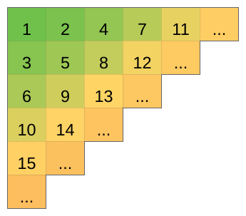
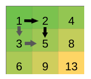

<h1 style='text-align: center;'> C. Celex Update</h1>

<h5 style='text-align: center;'>time limit per test: 2 seconds</h5>
<h5 style='text-align: center;'>memory limit per test: 256 megabytes</h5>

During the quarantine, Sicromoft has more free time to create the new functions in "Celex-2021". The developers made a new function GAZ-GIZ, which infinitely fills an infinite table to the right and down from the upper left corner as follows:

   The cell with coordinates $(x, y)$ is at the intersection of $x$-th row and $y$-th column. Upper left cell $(1,1)$ contains an integer $1$.The developers of the SUM function don't sleep either. Because of the boredom, they teamed up with the developers of the RAND function, so they added the ability to calculate the sum on an arbitrary path from one cell to another, moving down or right. Formally, from the cell $(x,y)$ in one step you can move to the cell $(x+1, y)$ or $(x, y+1)$. 

After another Dinwows update, Levian started to study "Celex-2021" (because he wants to be an accountant!). After filling in the table with the GAZ-GIZ function, he asked you to calculate the quantity of possible different amounts on the path from a given cell $(x_1, y_1)$ to another given cell $(x_2, y_2$), if you can only move one cell down or right.

Formally, consider all the paths from the cell $(x_1, y_1)$ to cell $(x_2, y_2)$ such that each next cell in the path is located either to the down or to the right of the previous one. Calculate the number of different sums of elements for all such paths.

### Input

The first line contains one integer $t$ ($1 \le t \le 57179$) — the number of test cases.

Each of the following $t$ lines contains four natural numbers $x_1$, $y_1$, $x_2$, $y_2$ ($1 \le x_1 \le x_2 \le 10^9$, $1 \le y_1 \le y_2 \le 10^9$) — coordinates of the start and the end cells. 

### Output

For each test case, in a separate line, print the number of possible different sums on the way from the start cell to the end cell.

## Example

### Input


```text
4
1 1 2 2
1 2 2 4
179 1 179 100000
5 7 5 7
```
### Output


```text
2
3
1
1
```
## Note

In the first test case there are two possible sums: $1+2+5=8$ and $1+3+5=9$. 


#### Tags 

#1600 #NOT OK #math 

## Blogs
- [All Contest Problems](../Codeforces_Round_645_(Div._2).md)
- [Announcement](../blogs/Announcement.md)
- [Tutorial](../blogs/Tutorial.md)
