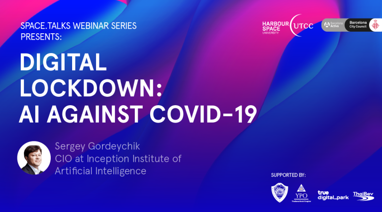

# Announcement

Hello Codeforces!

On [Thursday, May 28, 2020 at 20:35UTC+6](https://codeforces.com/https://www.timeanddate.com/worldclock/fixedtime.html?day=28&month=5&year=2020&hour=17&min=35&sec=0&p1=166) [Educational Codeforces Round 88 (Rated for Div. 2)](https://codeforces.com/contest/1359 "Educational Codeforces Round 88 (Rated for Div. 2)") will start.

Series of Educational Rounds continue being held as [Harbour.Space University](https://codeforces.com/https://harbour.space/) initiative! You can read the details about the cooperation between [Harbour.Space University](https://codeforces.com/https://harbour.space/) and Codeforces in the [blog post](//codeforces.com/blog/entry/51208).

This round will be **rated for the participants with rating lower than 2100**. It will be held on extended ICPC rules. The penalty for each incorrect submission until the submission with a full solution is 10 minutes. After the end of the contest you will have 12 hours to hack any solution you want. You will have access to copy any solution and test it locally.

You will be given **6 or 7 problems** and **2 hours** to solve them.

The problems were invented and prepared by Roman [Roms](https://codeforces.com/profile/Roms "Master Roms") Glazov, Adilbek [adedalic](https://codeforces.com/profile/adedalic "International Master adedalic") Dalabaev, Vladimir [vovuh](https://codeforces.com/profile/vovuh "Master vovuh") Petrov, Ivan [BledDest](https://codeforces.com/profile/BledDest "International Grandmaster BledDest") Androsov, Maksim [Neon](https://codeforces.com/profile/Neon "Candidate Master Neon") Mescheryakov and me. Also huge thanks to Mike [MikeMirzayanov](https://codeforces.com/profile/MikeMirzayanov "Headquarters, MikeMirzayanov") Mirzayanov for great systems Polygon and Codeforces.

Good luck to all the participants!

Our friends at Harbour.Space also have a message for you:

*Hey Codeforces!* 

*As you may remember, we have a free webinar series starring our all-star faculty members who share valuable content and insiders’ knowledge that you don’t get to learn about in traditional classrooms.*

*Join us tomorrow, Thursday, May 28 at 12h (BCN) / 17h (BKK) to watch Sergey Gordeychik, CIO of the Inception Institute of Artificial Intelligence, share his expertise and insights in his “Digital Lockdown: AI against COVID-19” session. Sergey will discuss how AI is being used both positively and negatively during the COVID-19 global pandemic.* *Tune in for some practical examples of how companies are using AI to innovate and disrupt during a time of crisis, exploring topics like Medical Imaging for CT analysis, diagnosis and mass surveillance.*

*By participating in this webinar you will get a certificate of participation, a special digital gift from Sergey, and stand a chance to win a FREE 3-week module at Harbour.Space University depending on the availability and prerequisites of the course.* 

*See you tomorrow, and good luck on your round!* 

  [Reserve your spot now!](https://codeforces.com/https://bit.ly/2WBPu6L) Congratulations to the winners: 

| Rank | Competitor | Problems Solved | Penalty |
| --- | --- | --- | --- |
| 1 | [244mhq](https://codeforces.com/profile/244mhq "International Grandmaster 244mhq") | 6 | 174 |
| 2 | [bmerry](https://codeforces.com/profile/bmerry "Legendary Grandmaster bmerry") | 6 | 219 |
| 3 | [dlalswp25](https://codeforces.com/profile/dlalswp25 "Grandmaster dlalswp25") | 6 | 233 |
| 4 | [hepth](https://codeforces.com/profile/hepth "Candidate Master hepth") | 6 | 238 |
| 5 | [Volkov_Ivan](https://codeforces.com/profile/Volkov_Ivan "Grandmaster Volkov_Ivan") | 6 | 251 |

Congratulations to the best hackers: 

| Rank | Competitor | Hack Count |
| --- | --- | --- |
| 1 | [Hideki_Ryuga_L](https://codeforces.com/profile/Hideki_Ryuga_L "Specialist Hideki_Ryuga_L") | **37** |
| 2 | [KonaeAkira](https://codeforces.com/profile/KonaeAkira "Master KonaeAkira") | **19****:-1** |
| 3 | [ujjwalsingh30](https://codeforces.com/profile/ujjwalsingh30 "Expert ujjwalsingh30") | **18****:-1** |
| 4 | [veteran_](https://codeforces.com/profile/veteran_ "Expert veteran_") | **14** |
| 5 | [hashlib](https://codeforces.com/profile/hashlib "Expert hashlib") | **13** |

 318 successful hacks and 469 unsuccessful hacks were made in total!And finally people who were the first to solve each problem: 

| Problem | Competitor | Penalty |
| --- | --- | --- |
| A | [andryusha_na_knopke](https://codeforces.com/profile/andryusha_na_knopke "Expert andryusha_na_knopke") | 0:01 |
| B | [thech0sen1](https://codeforces.com/profile/thech0sen1 "Candidate Master thech0sen1") | 0:03 |
| C | [IAKWF](https://codeforces.com/profile/IAKWF "Specialist IAKWF") | 0:11 |
| D | [Kerim.K](https://codeforces.com/profile/Kerim.K "Master Kerim.K") | 0:06 |
| E | [HeHere](https://codeforces.com/profile/HeHere "Grandmaster HeHere") | 0:06 |
| F | [user202729_](https://codeforces.com/profile/user202729_ "International Grandmaster user202729_") | 0:44 |

**UPD:** [Editorial is out](Tutorial.md)

