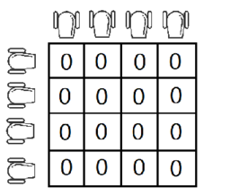

<h1 style='text-align: center;'> E. Polygon</h1>

<h5 style='text-align: center;'>time limit per test: 2 seconds</h5>
<h5 style='text-align: center;'>memory limit per test: 256 megabytes</h5>

Polygon is not only the best platform for developing problems but also a square matrix with side $n$, initially filled with the character 0.

On the polygon, military training was held. The soldiers placed a cannon above each cell in the first row and a cannon to the left of each cell in the first column. Thus, exactly $2n$ cannons were placed.

  Initial polygon for $n=4$. Cannons shoot character 1. At any moment of time, no more than one cannon is shooting. When a 1 flies out of a cannon, it flies forward (in the direction of the shot) until it collides with a polygon border or another 1. After that, it takes the cell in which it was before the collision and remains there. Take a look at the examples for better understanding.

More formally: 

* if a cannon stands in the row $i$, to the left of the first column, and shoots with a 1, then the 1 starts its flight from the cell ($i, 1$) and ends in some cell ($i, j$);
* if a cannon stands in the column $j$, above the first row, and shoots with a 1, then the 1 starts its flight from the cell ($1, j$) and ends in some cell ($i, j$).

For example, consider the following sequence of shots:

   1. Shoot the cannon in the row $2$.                         2. Shoot the cannon in the row $2$.                         3. Shoot the cannon in column $3$. 

You have a report from the military training on your desk. This report is a square matrix with side length $n$ consisting of 0 and 1. You wonder if the training actually happened. In other words, is there a sequence of shots such that, after the training, you get the given matrix?

Each cannon can make an arbitrary number of shots. Before the training, each cell of the polygon contains 0.

### Input

The first line contains an integer $t$ ($1 \le t \le 1000$) — the number of test cases. Then $t$ test cases follow.

Each test case starts with a line containing an integer $n$ ($1 \le n \le 50$) — the size of the polygon.

This is followed by $n$ lines of length $n$, consisting of 0 and 1 — the polygon matrix after the training.

The total area of the matrices in all test cases in one test does not exceed $10^5$.

### Output

For each test case print:

* YES if there is a sequence of shots leading to a given matrix;
* NO if such a sequence does not exist.

The letters in the words YES and NO can be printed in any case.

## Example

### Input


```text
5
4
0010
0011
0000
0000
2
10
01
2
00
00
4
0101
1111
0101
0111
4
0100
1110
0101
0111
```
### Output


```text
YES
NO
YES
YES
NO
```
## Note

The first test case was explained in the statement.

The answer to the second test case is NO, since a 1 in a cell ($1, 1$) flying out of any cannon would continue its flight further.


#### Tags 

#1300 #NOT OK #dp #graphs #implementation #shortest_paths 

## Blogs
- [All Contest Problems](../Codeforces_Round_644_(Div._3).md)
- [Announcement](../blogs/Announcement.md)
- [Tutorial](../blogs/Tutorial.md)
