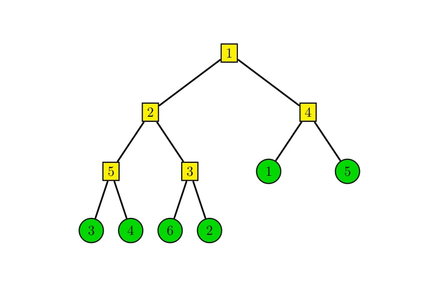

# Tutorial_(en)

[1362A - Johnny and Ancient Computer](https://codeforces.com/contest/1362/problem/A "Codeforces Round 647 (Div. 2) - Thanks, Algo Muse!")

Author: [Anadi](https://codeforces.com/profile/Anadi "International Grandmaster Anadi")

 **Tutorial**
### [1362A - Johnny and Ancient Computer](https://codeforces.com/contest/1362/problem/A "Codeforces Round 647 (Div. 2) - Thanks, Algo Muse!")

Let us write $a$ as $r_a \cdot 2^x$ and $b$ as $r_b \cdot 2^y$, where $r_a$ and $r_b$ are odd. The only operation we have changes $x$ by $\{-3, -2, -1, 1, 2, 3\}$ so $r_a$ must be equal to $r_b$, otherwise the answer is $-1$. It is easy to notice that we can greedily move $x$ toward $y$ so the answer is equal to $\lceil \frac{|x - y|}{3} \rceil$.

 **Solution**
```cpp
#include <bits/stdc++.h>

using namespace std;

typedef long long LL;

LL getR(LL a){
	while(a % 2 == 0)
		a /= 2;
	return a;
}

void solve(){
	LL a, b;
	scanf("%lld %lld", &a, &b);
	if(a > b)	swap(a, b);
	
	LL r = getR(a);
	if(getR(b) != r){
		puts("-1");
		return;
	}
	
	int ans = 0;
	b /= a;
	
	while(b >= 8)
		b /= 8, ++ans;
	if(b > 1)	++ans;
	printf("%dn", ans);
}

int main(){
	int quest;
	scanf("%d", &quest);
	
	while(quest--)
		solve();
	return 0;
}

```
[1362B - Johnny and His Hobbies](https://codeforces.com/contest/1362/problem/B "Codeforces Round 647 (Div. 2) - Thanks, Algo Muse!")

Authors: [Anadi](https://codeforces.com/profile/Anadi "International Grandmaster Anadi") and [Okrut](https://codeforces.com/profile/Okrut "Master Okrut")

 **Tutorial**
### [1362B - Johnny and His Hobbies](https://codeforces.com/contest/1362/problem/B "Codeforces Round 647 (Div. 2) - Thanks, Algo Muse!")

Consider $i$-th least significant bit ($0$ indexed). If it is set in $k$, but not in $s$, it will be set in $k \oplus s$. Hence $k \oplus s \geq 2^i$.

Consider such minimal positive integer $m$, that $2^m > s$ holds for all $s \in S$. $k$ cannot have the $i$-th bit set for any $i \geq m$. From this follows that $k < 2^m$. So there are only $2^m$ feasible choices of $k$. We can verify if a number satisfies the condition from the statement in $ \mathcal{O} \left(n \right) $ operations. This gives us a solution with complexity $\mathcal{O} \left(n \cdot 2^m \right)$. Note that in all tests $m$ is at most $10$.

There is also another solution possible. It uses the observation that if $k$ satisfies the required conditions, then for every $s \in S$ there exists such $t \in S$ ($t \neq s$) , that $t \oplus s = k$. This gives us $n-1$ feasible choices of $k$ and thus the complexity of this solution is $\mathcal{O} \left( n^2 \right)$.

 **Solution**
```cpp
//O(n * maxA) solution

#include <bits/stdc++.h>

using namespace std;

const int N = 1025;

int n;
int in[N];
bool is[N];

bool check(int k){
	for(int i = 1; i <= n; ++i)
		if(!is[in[i] ^ k])
			return false;
	return true;
}

void solve(){
	for(int i = 0; i < N; ++i)
		is[i] = false;
	
	scanf("%d", &n);
	for(int i = 1; i <= n; ++i){
		scanf("%d", &in[i]);
		is[in[i]] = true;
	}
	
	for(int k = 1; k < 1024; ++k)
		if(check(k)){
			printf("%dn", k);
			return;
		}
	
	puts("-1");
}

int main(){
	int cases;
	scanf("%d", &cases);
	
	while(cases--)
		solve();
	return 0;
}

```
[1362C - Johnny and Another Rating Drop](https://codeforces.com/contest/1362/problem/C "Codeforces Round 647 (Div. 2) - Thanks, Algo Muse!")

Author: [MicGor](https://codeforces.com/profile/MicGor "International Grandmaster MicGor")

 **Tutorial**
### [1362C - Johnny and Another Rating Drop](https://codeforces.com/contest/1362/problem/C "Codeforces Round 647 (Div. 2) - Thanks, Algo Muse!")

Let us start by calculating the result for $n = 2^k$. It can be quickly done by calculating the results for each bit separately and summing these up. For $i$-th bit, the result is equal to $\frac{2^k}{2^{i}}$ as this bit is different in $d-1$ and $d$ iff $d$ is a multiple of $2^i$. Summing these up we get that the result for $n = 2^k$ is equal to $2^{k + 1} - 1 = 2n - 1$.

How to compute the answer for arbitrary $n$? Let us denote $b_1 > b_2 > \ldots > b_k$ as set bits in the binary representation of $n$. I claim that the answer is equal to the sum of answers for $2^{b_1}, 2^{b_2}, \ldots, 2^{b_k}$. Why?

We can compute results for intervals $[0, 2^{b_1}], [2^{b_1}, 2^{b_1} + 2^{b_2}], \ldots, [n - 2^{b_k}, n]$. We can notice that the result for interval $[s, s + 2^i]$, where $s$ is a multiple of $2^i$, is equal to the answer for $[0, 2^i]$ so we can just compute the results for intervals $[0, 2^{b_1}], [0, 2^{b_2}], \ldots, [0, 2^{b_k}]$!

This allows us to compute the answer for arbitrary $n$ in $\mathcal{O}(\log n)$ – just iterate over all bits $b$ and add $2^{b + 1} - 1$ if $b$ is set. Equivalently we can just write down $2n - \texttt{#bits set}$ as the answer.

Final complexity is $\mathcal{O}(t \log n)$.

 **Solution**
```cpp
#include <bits/stdc++.h>

using namespace std;

typedef long long LL;

void solve(){
	LL a;
	scanf("%lld", &a);
	
	LL ans = 0;
	for(int i = 0; i < 60; ++i)
		if(a & (1LL << i))
			ans += (1LL << (i + 1)) - 1;
	printf("%lldn", ans);
}

int main(){
	int quest;
	scanf("%d", &quest);
	
	while(quest--)
		solve();
	return 0;
}

```
[1361A - Johnny and Contribution](../problems/A._Johnny_and_Contribution.md "Codeforces Round 647 (Div. 1) - Thanks, Algo Muse!")

Author: [Anadi](https://codeforces.com/profile/Anadi "International Grandmaster Anadi")

 **Tutorial**
### [1361A - Johnny and Contribution](../problems/A._Johnny_and_Contribution.md "Codeforces Round 647 (Div. 1) - Thanks, Algo Muse!")

We can view blogs as a graph, references as edges, and topics as colors. Now we can reformulate our problem as finding a permutation of vertices such that given in the statement greedy coloring algorithm returns coloring as described in the input.

Let us start with two observations:

Observation 1: If there is an edge between vertices with the same color, then the answer is $-1$.

Observation 2: If for a vertex $u$ with color $c$ there exist a color $c' < c$ such that $u$ has no edge to any vertex with color $c'$ then the answer is $-1$.

Both observations are rather straightforward to prove, so we skip it. Let us create permutation where vertices are sorted firstly by desired color and secondly by indices. We claim that if there exists any ordering fulfilling given regulations, then this permutation fulfills these too. Let us prove it:

Let us analyze vertex $u$ with color $c$. From observation $2$ we know that for each color $c' < c$ there exist $v$ with color $c'$ such that $u$ and $v$ are connected by an edge. Because vertices are sorted by colors in our permutation, $v$ is before $u$ in ordering. So the greedy algorithm will assign that vertex color $k \geq c$. From observation $1$, we now that $u$ does not have an edge to vertex with color $c$, so the greedy algorithm has to assign to $u$ color $k \leq c$. Combining both inequalities, we reach that greedy must assign color $k = c$, which completes our proof.

So now the algorithm is rather straightforward – sort vertices by colors, check if that ordering fulfills given regulations, if so, then write it down, otherwise print $-1$. This can be implemented in $\mathcal{O}(n \log n)$ or $\mathcal{O}(n)$.

 **Solution**
```cpp
#include <bits/stdc++.h>

using namespace std;

const int N = 1e6 + 7;

int n, m;
int ans[N];

int last[N];
vector <int> G[N];
vector <int> in[N];

int main(){
	scanf("%d %d", &n, &m);
	for(int i = 1; i <= m; ++i){
		int u, v;
		scanf("%d %d", &u, &v);
		
		G[u].push_back(v);
		G[v].push_back(u);
	}
	
	for(int i = 1; i <= n; ++i){
		int color;
		scanf("%d", &color);

		in[color].push_back(i);
		if(color > n){
			puts("-1");
			exit(0);
		}
	}
	
	vector <int> result;
	for(int i = 1; i <= n; ++i){
		for(auto u: in[i]){
			for(auto v: G[u])
				last[ans[v]] = u;
			
			ans[u] = 1;
			while(last[ans[u]] == u)
				++ans[u];
			
			if(ans[u] != i){
				puts("-1");
				exit(0);
			}
			
			result.push_back(u);
		}
	}
	
	for(int i = 0; i < n; ++i)
		printf("%d%c", result[i], i == n - 1 ? 'n' : ' ');
	return 0;
}
```
[1361B - Johnny and Grandmaster](../problems/B._Johnny_and_Grandmaster.md "Codeforces Round 647 (Div. 1) - Thanks, Algo Muse!")

Author: [Okrut](https://codeforces.com/profile/Okrut "Master Okrut")

 **Tutorial**
### [1361B - Johnny and Grandmaster](../problems/B._Johnny_and_Grandmaster.md "Codeforces Round 647 (Div. 1) - Thanks, Algo Muse!")

The solution for the case $p = 1$ is trivial, the answer is $1$ for odd $n$ and $0$ for even $n$. From now on, I will assume that $p > 1$. Instead of partitioning the elements into two sets, I will think of placing plus and minus signs before them to minimize the absolute value of the resulting expression.

We will process the exponents in non-increasing order and maintain the invariant that the current sum is nonnegative. Say we are processing $k_i.$ In such cases, we will know the current sum modulo $10^{9}+7$ and its exact value divided by $p^{k_i}$ (denoted as $v$) or information that it's too big.

Initially, the sum (I will denote it $s$) equals $0$. While processing elements:

If $s > 0$, subtract the current element from the sum (it easy to show that it won't be negative after this operation).

If $s = 0$, add the current element to the sum.

If at any point of the algorithm, $v = \frac{s}{p^{k_i}} > n$, there is no need to store the exact value of $v$ anymore, because it is so big that all the elements from this moment on will be subtracted. Thus, it is enough to store this information and the current sum modulo $10^{9}+7$.

When we move to the next element, the exponent may change, and $v$ needs to be multiplied by a power of $p$. Since the exponents can be large, we use fast multiplication. 

The time complexity of this solution is $\mathcal{O}(n \log n + n \log \max k_i)$.

 **Solution**
```cpp
#include <bits/stdc++.h>
using namespace std;
typedef long long ll;

const ll INF = 1e6+100;
const ll mod = ll(1e9)+7;

ll fexp (ll a, int e)
{
	ll ret = 1LL;
	while (e>0)
	{
		if (e%2==1) ret = ret * a % mod;
		a = a*a % mod;
		e/=2;
	}
	return ret;
}

int main ()
{
	int t;
	scanf ("%d", &t);
	for (int test = 0; test < t; test++)
	{
		int n;
		ll p;
		scanf ("%d %lld", &n, &p);
		vector <int> K(n);
		for (int &x: K) scanf ("%d", &x);
		sort(K.begin(), K.end());
		
		vector <int> Exp = K;
		
		ll currSum = 0;
		ll result = 0;
		bool infty = false;
		
		int prevExp = 1e6+10;
		while (!Exp.empty())
		{
			/* Update the currSum and result (multiply by a power of k) */
			int k = Exp.back();
			Exp.pop_back();
			int delta = prevExp - k;
			prevExp = k;
			
			result = result * fexp(p, delta) % mod;
			
			/* Multiplying by p 20 times will either 
			not change the currSum at all or make it bigger than n */
			for (int i=0; i<min(delta, 20); i++)
			{
				currSum *= p;
				if (currSum > INF) infty = true;
			}
			
			/* Process all the elements equal p^k */
			while (!K.empty() && K.back()==k)
			{
				K.pop_back();
				if (infty || currSum > 0)
				{
					currSum--;
					result+=mod - 1;
				}
				else
				{
					currSum++;
					result++;
				}
				result%=mod;
			}
		}
		
		result = result * fexp(p, prevExp) % mod;
		
		printf ("%lldn", result % mod);
	}
}

```
[1361C - Johnny and Megan's Necklace](../problems/C._Johnny_and_Megan's_Necklace.md "Codeforces Round 647 (Div. 1) - Thanks, Algo Muse!")

Author: [Okrut](https://codeforces.com/profile/Okrut "Master Okrut")

 **Tutorial**
### [1361C - Johnny and Megan's Necklace](../problems/C._Johnny_and_Megan's_Necklace.md "Codeforces Round 647 (Div. 1) - Thanks, Algo Muse!")

Say that we want to check if it is possible to construct a necklace with beauty at least $b$. To this end, we will construct a graph of $2^{b}$ vertices. For a necklace part with pearls in colors $u$ and $v$ there will be an edge in this graph between vertices with zero-based indices $v\text{ & }(2^b-1)$ and $u\text{ & }(2^b-1)$. In a necklace with beauty (at least) $b$, only pearl with colors having last $b$ bits the same can be glued together. Note that this is the exact condition that the edge endpoints have to satisfy to be in the same vertex. Since all the necklace parts have to be used, a necklace of beauty at least $b$ is an Euler cycle of this graph.

The solution will construct the graph mentioned above for all possible values of $b$ (we can iterate over all of them since there are only $21$ of them). If the constructed graph is Eulerian, it is possible to achieve the current value of $b$.

In order to find a sample necklace with the optimal beauty, one has to find the Euler cycle in the graph corresponding to the optimal value. 

Challenge: In another version of this task you are not allowed to glue pearls of the same color together. There is also a guarantee that there are no three pearls of the same color. Time complexity of the solution is the same.

 **Solution**
```cpp
#include <bits/stdc++.h>

using namespace std;

#define st first
#define nd second
#define PII pair <int, int>

const int N = 1 << 20;

int n;
int part[N][2];

bool vis[N];
vector <int> ans;
vector <PII> G[N];

//mark whole component as visited
void dfs(int u){
	vis[u] = true;
	for(auto v: G[u])
		if(!vis[v.st])
			dfs(v.st);
}

//check if the graph for a given Mask is correct
bool check(int Mask){
	for(int i = 0; i <= Mask; ++i)
		G[i].clear(), vis[i] = false;

	for(int i = 1; i <= n; ++i){
		int u = part[i][0] & Mask;
		int v = part[i][1] & Mask;
		
		G[u].push_back({v, 2 * i - 1});
		G[v].push_back({u, 2 * i - 2});
	}
	
	//calculate number of components and check if all degrees are even
	int comps = 0;
	for(int i = 0; i <= Mask; ++i){
		if(G[i].size() & 1)
			return false;
		
		if(!vis[i] && G[i].size() > 0){
			++comps;
			dfs(i);
		}
	}
	
	return comps == 1;
}

//find euler cycle
void go(int u, int prv = -1){
	while(G[u].size()){
		auto e = G[u].back();
		G[u].pop_back();

		if(vis[e.nd / 2])
			continue;
		
		vis[e.nd / 2] = true;
		go(e.st, e.nd);
	}
	
	if(prv != -1){
		ans.push_back(prv);
		ans.push_back(prv ^ 1);
	}
}

//restore the sequence corresponding to the result for given mask
//the result is already checked so the graph is built
void restore(int Mask){
	for(int i = 0; i <= n; ++i)
		vis[i] = false;
	
	for(int i = 0; i <= Mask; ++i)
		if(G[i].size()){
			go(i);
			break;
		}
	
	//cycle is reversed but thats fine
	for(int i = 0; i < n + n; ++i)
		printf("%d%c", ans[i] + 1, " n"[i + 1 == n + n]);
}

int main(){
	scanf("%d", &n);
	for(int i = 1; i <= n; ++i)
		scanf("%d %d", &part[i][0], &part[i][1]);

	for(int i = 20; i >= 0; --i)
		if(check((1 << i) - 1)){
			printf("%dn", i);
			restore((1 << i) - 1);
			exit(0);
		}
	
	assert(false);
	return 0;
}
```
[1361D - Johnny and James](../problems/D._Johnny_and_James.md "Codeforces Round 647 (Div. 1) - Thanks, Algo Muse!")

Author: [Okrut](https://codeforces.com/profile/Okrut "Master Okrut")

 **Tutorial**
### [1361D - Johnny and James](../problems/D._Johnny_and_James.md "Codeforces Round 647 (Div. 1) - Thanks, Algo Muse!")

We can easily model the way of calculating distances from the problem statement as a tree with $n$ vertices, each corresponding to a base. This tree has the following structure: there is only one vertex which can have degree bigger than $2$ (the one corresponding to the central base), I will call it the center of the tree. There are also some paths consisting of vertices corresponding to bases lying on the same half-line starting at point $(0, 0)$. We will call those arms of the tree. Assume that the center does not belong to any arm.

The task is to choose $k$ vertices in a way that maximizes the sum of distances between them. Let us start with a lemma:

If $x$ vertices are chosen from an arm, at least $ min(x, \lfloor \frac{k}{2} \rfloor)$ of them are the ones furthest from the center.

Say that less than $min(x, \lfloor \frac{k}{2} \rfloor)$ is chosen from the end of the arm (counting from the center). Then there exists such chosen vertex $v$ on the arm, that the next (counting from the center) vertex $u$ is not chosen. Let the length of the edge between them be $l$ and let there be $t$ vertices further from the center than $v$. If we had chosen $u$ instead of $v$, the sum of distances would change by $l \cdot (k - t - 1) - l \cdot t = l \cdot (k - 2t - 1)$ (the chosen vertex would move closer by $l$ to $t$ vertices, but also it's distance to $k-t-1$ vertices would increase by $l$). But since $t < \frac{k}{2}$, this value is non-negative (the sum of distances would not decrease).

There are two cases which will be solved independently:

First case: there is no arm containing more than $\frac{k}{2}$ vertices chosen. By the lemma, in every arm, only vertices furthest from the center will be selected in an optimal solution. 

If a vertex is chosen, all the ones in the same arm further from the center are chosen as well. Using this knowledge, we can assign weights to vertices in such a way that the result for a set will be the sum of weights. Weight for vertex $v$ equals: $ w_v = dist(center, v) * (k - 1 - t - t) $ where $t$ is the number of vertices further from center in the same arm as $v$. The weight of the center equals $0$. Note that (with exception to the center) $w_v \leq 0 $ iff taking $v$ would violate the condition that at most $\frac{k}{2}$ are chosen from every arm.

The algorithm for this case is to add the vertices greedily to the set until $k$ vertices have been chosen. The complexity of the above algorithm is $\mathcal{O}(n \log n)$.

Second case: there is an arm, in which more than $\frac{k}{2}$ vertices are chosen in the optimal solution.

From the lemma, we know that $\lfloor \frac{k}{2} \rfloor$ vertices lying furthest from the center will be chosen. It can be proved (in a similar manner as the lemma) that in an optimal solution, all other selected vertices from this arm will be as close to the center as possible. Furthermore, the center and all the vertices in the other arms will be selected. Intuitively, when there are $\lfloor \frac{k}{2} \rfloor$ chosen vertices on a single-arm, we will not decrease the sum of distances by moving another selected vertex further from them along an edge.

There is at most one set of $k$ vertices satisfying those conditions so that this part can be implemented in $\mathcal{O}(n)$.

The time complexity of this solution is $\mathcal{O}(n \log n)$.

 **Solution**
```cpp
#include <bits/stdc++.h>

using namespace std;

typedef long double T;

#define st first
#define nd second
#define PII pair <int, int>

const int N = 1e6 + 7;

int n, m, k;
vector <T> arms[N];

void read(){
	map <PII, int> M;

	scanf("%d %d", &n, &k);	
	for(int i = 1; i <= n; ++i){
		int x, y;
		scanf("%d %d", &x, &y);
		
		if(x == 0 && y == 0)
			continue;
		
		int d = __gcd(abs(x), abs(y));
		PII my_id = {x / d, y / d};
		
		if(!M.count(my_id))
			M[my_id] = ++m;
		
		auto id = M[my_id];
		arms[id].push_back(sqrtl((T)x * x + (T)y * y));
	}
	
	for(int i = 1; i <= m; ++i){
		sort(arms[i].begin(), arms[i].end());
		reverse(arms[i].begin(), arms[i].end());
	}
}

T solve_center(){
	T ans = 0;
	vector <T> vals = {0};

	for(int i = 1; i <= m; ++i){
		int it = 0;
		for(auto v: arms[i]){
			++it;
			vals.push_back(v * (k - it - it + 1));
		}
	}
	
	sort(vals.begin(), vals.end());
	reverse(vals.begin(), vals.end());

	for(int i = 0; i < k; ++i)
		ans += vals[i];
	return ans;
}

T solve_arm(int id){
	T ans = 0;
	for(int i = 1; i <= m; ++i){
		if(i == id)
			continue;
		
		int it = 0;
		for(auto v: arms[i]){
			++it;
			ans += v * (k - it - it + 1);
		}
	}
	
	int half = k / 2;
	int first_half = k - half - (n - arms[id].size());
		
	for(int i = 0; i < half; ++i)
		ans += arms[id][i] * (k - i - i - 1);
	
	for(int i = 0; i < first_half; ++i){
		T val = arms[id][arms[id].size() - i - 1];
		ans += val * (k - half - half - 2 * first_half + 2 * i + 1);
	}
	
	return ans;
}

int main(){
	read();
	T ans = solve_center();
	if(k < n){
		for(int i = 1; i <= m; ++i)
			if(2 * (n - (int)arms[i].size()) <= k)
				ans = max(ans, solve_arm(i));
	}

	printf("%.10Lfn", ans);
	return 0;
}
```
[1361E - James and the Chase](../problems/E._James_and_the_Chase.md "Codeforces Round 647 (Div. 1) - Thanks, Algo Muse!")

Author: [Anadi](https://codeforces.com/profile/Anadi "International Grandmaster Anadi")

 **Tutorial**
### [1361E - James and the Chase](../problems/E._James_and_the_Chase.md "Codeforces Round 647 (Div. 1) - Thanks, Algo Muse!")

First, let us describe an algorithm for checking if a vertex is interesting. Let $v$ be the vertex we want to check. Find any DFS tree rooted in that vertex. We can see that $v$ is interesting if and only if that tree is unique. The tree is unique iff every non-tree edge leads from some vertex $u$ to $u$'s ancestor. That condition can be easily checked in $\mathcal{O}(n)$.

Using the fact that we are interested only in cases when at least $20\%$ of vertices are interesting, we can find any interesting vertex by choosing a random vertex, checking if it is interesting and repeating that algorithm $T$ times or until we find an interesting vertex. For $T = 100$ the probability of failure is around $2 \cdot 10^{-10}$.

Denote that vertex as $r$. Find the DFS tree rooted in that vertex. We can notice that vertex is interesting if and only if it has a unique path to all of its ancestors in this tree. We will say that edge is passing vertex $v$ if it starts in its subtree (including $v$) and ends in one of the proper ancestors of $v$. It is evident that if two edges pass through $v$, then $v$ cannot be interesting.

Let us pick vertex $v$ such that there is at most one edge passing through it. It is evident that if $v \neq r$, then there is at least one such edge (because our graph is strongly connected). Let $u$ be the endpoint of this edge being a proper ancestor of $v$. We prove that $v$ is interesting if and only if $u$ is interesting.

Pick arbitrary ancestor of $v$ which is not an ancestor of $u$, let us denote it by $t$. There is precisely one simple path from $v$ to $t$ – descending in the subtree of $v$, using the non-tree edge to $u$ and then tree edges to reach $t$.

Now pick arbitrary common ancestor of $v$ and $u$, let it be $k$. If there is more than one simple path from $u$ to $k$, then obviously there is more than one simple path from $v$ to $k$. Otherwise, there is precisely one simple path from $v$ to $k$ – descend in the subtree, use edge to $u$ and from $u$ there is one simple path to $k$.

The above observations allow computing interesting vertices using simple DFSs. The final complexity is $\mathcal{O}(Tn)$.

 **Solution**
```cpp
#include <bits/stdc++.h>

using namespace std;

const int N = 1e5 + 7;

int n, m;
bool bad[N];
vector <int> G[N];

int vis[N];
bool interesting;

int lvl[N];
int best[N];
int balance[N];

void clear(){
	for(int i = 1; i <= n; ++i){
		lvl[i] = 0;
		best[i] = 0;
		balance[i] = 0;

		G[i].clear();		
		bad[i] = false;
	}
}

void no_answer(){
	puts("-1");
	clear();
}

int getInt(int a = INT_MIN, int b = INT_MAX){
	static mt19937 rng(chrono::steady_clock::now().time_since_epoch().count());
	return uniform_int_distribution <int> (a, b)(rng);
}

void dfs(int u){
	vis[u] = 1;
	for(auto v: G[u])
		if(vis[v] == 0)
			dfs(v);
		else if(vis[v] == 2)
			interesting = false;
	vis[u] = 2;
}

bool check(int r){
	for(int i = 1; i <= n; ++i)
		vis[i] = 0;
	interesting = true;

	dfs(r);
	return interesting;
}

int find_any(){
	int tests = 100;
	while(tests--){
		int r = getInt(1, n);
		if(check(r))
			return r;
	}
	
	return -1;
}

int find_bad(int u){
	vis[u] = 1;
	best[u] = u;
	for(auto v: G[u])
		if(vis[v] == 0){
			lvl[v] = lvl[u] + 1;
			balance[u] += find_bad(v);
			
			if(lvl[best[v]] < lvl[best[u]])
				best[u] = best[v];
		}
		else{
			balance[u]++;
			balance[v]--;
			
			if(lvl[v] < lvl[best[u]])
				best[u] = v;
		}
	
	if(balance[u] > 1)
		bad[u] = true;
	return balance[u];
}

void propagate_bad(int u){
	vis[u] = 1;
	if(!bad[u] && bad[best[u]])
		bad[u] = true;

	for(auto v: G[u])
		if(vis[v] == 0)
			propagate_bad(v);
}

vector <int> find_all(int r){
	for(int i = 1; i <= n; ++i)
		vis[i] = 0;
	vector <int> ans;

	find_bad(r);
	for(int i = 1; i <= n; ++i)
		vis[i] = 0;

	propagate_bad(r);
	for(int i = 1; i <= n; ++i)
		if(!bad[i])
			ans.push_back(i);
	return ans;
}

void solve(){
	scanf("%d %d", &n, &m);
	for(int i = 1; i <= m; ++i){
		int u, v;
		scanf("%d %d", &u, &v);		
		G[u].push_back(v);
	}
	
	int id = find_any();
	if(id == -1){
		no_answer();
		return;
	}
	
	auto ans = find_all(id);
	if(5 * ans.size() >= n){
		for(auto v: ans)
			printf("%d ", v);
		puts("");
		clear();
	}
	else
		no_answer();
}

int main(){
	int cases;
	scanf("%d", &cases);
	
	while(cases--)
		solve();
	return 0;
}

```
[1361F - Johnny and New Toy](../problems/F._Johnny_and_New_Toy.md "Codeforces Round 647 (Div. 1) - Thanks, Algo Muse!")

Author: [Anadi](https://codeforces.com/profile/Anadi "International Grandmaster Anadi")

 **Tutorial**
### [1361F - Johnny and New Toy](../problems/F._Johnny_and_New_Toy.md "Codeforces Round 647 (Div. 1) - Thanks, Algo Muse!")

Let us start with an analysis of good subsegments for the fixed permutation. The whole permutation is a good subsegment itself, as $W_0 = W_n = 0 < W_k$ for any $k \in [1, 2, \ldots, n - 1]$. If we denote the minimal weight in $W_1, \ldots, W_{n - 1}$ as $W_m$, then we can notice that subsegments $[1, m]$ and $[m + 1, n]$ contain all good subsegments except the whole permutation. As a result, we can recursively find all good subsegments by recursive calls in $[1, m]$ and $[m + 1, n]$. We can view the structure of good subsegments as a binary tree.

Example structure of tree for $P = [3, 4, 6, 2, 1, 5]$ and $W = [5, 2, 3, 1, 4]$: 

  Now we want to analyze the possible moves for players. It turns out that the player's move is equivalent to choosing a vertex of a tree and swapping its left and right subtree. Notice that moves made in different vertices influence disjoint pairs of elements, so in some sense these moves are independent if we are interested only in the number of inversions. This observation allows us to find a simple method for calculating the result. For each vertex, calculate the number of inversions between the left and right subtree. Using these numbers for each vertex, we can find out whether we want to swap its subtrees or not, so the result can be calculated by a simple loop over all vertices.

From randomness of the input, we can deduce that the tree we built has height $\mathcal{O}(\log n)$. We can calculate the number of inversions easily if in each vertex we keep a structure with elements from permutation contained in that vertex. Such structure must support querying the number of elements smaller than some $x$. The shortest implementation uses the ordered set, but any BST can do it (segment tree needs some squeezing to fit into ML).

The above solution works fast if there are no queries. We can view each request as two removals and additions of elements. If so, we can notice that each query modifies the number of inversions in at most $\mathcal{O}(\log n)$ vertices. So all we need to do is update the number of inversions in these vertices and recalculate the global result.

Building a tree and calculating initial number of inversions takes $\mathcal{O}(n \log n)$ or $\mathcal{O}(n \log^2n)$, answering each query cost $\mathcal{O}(\log^2 n)$, so the final complexity is $\mathcal{O}(n \log n + q \log^2 n)$.

 **Solution**
```cpp
#include <bits/stdc++.h>
#include <ext/pb_ds/assoc_container.hpp>
#include <ext/pb_ds/tree_policy.hpp>

using namespace std;
using namespace __gnu_pbds;

typedef long long ll;
typedef tree < int, null_type, less <int>, rb_tree_tag, tree_order_statistics_node_update > ordered_set;

const int N = 2e5 + 7;

//cartesian tree node
//while creating we calculate set of elements and number of inversions
struct node{
	int splitter = -1;
	long long invs = 0;	
	
	ordered_set S;
	node *left = nullptr, *right = nullptr;
	node(){}
};

int n;
int in[N];
int weight[N];

long long ans = 0;
node *root = nullptr;

void read(){
	scanf("%d", &n);
	for(int i = 1; i <= n; ++i)
		scanf("%d", &in[i]);
	
	for(int i = 1; i < n; ++i)
		scanf("%d", &weight[i]);
}

//add/delete contribution from fiven node to result
void add_result(node *cur, int mt = 1){
	if(cur -> splitter == 0)
		return;
	ans += mt * min(cur -> invs, (ll)cur -> left -> S.size() * (ll)cur -> right -> S.size() - cur -> invs);
}

//Create cartesian tree
//Because expected depth is O(logn) we can use bruteforce to find the smallest weight
node* get_cartesian(int from, int to){
	node *ret = new node();
	if(from == to){
		ret -> S.insert(in[from]);
		return ret;
	}
	
	int id = from;
	for(int i = from + 1; i < to; ++i)
		if(weight[i] < weight[id])
			id = i;
	
	ret -> splitter = id;
	ret -> left = get_cartesian(from, id);
	ret -> right = get_cartesian(id + 1, to);
	
	//get elements from ordered set
	for(auto v: ret -> right -> S)
		ret -> S.insert(v);
	
	//calculate number of inversions
	for(auto v: ret -> left -> S){
		ret -> S.insert(v);
		ret -> invs += ret -> right -> S.order_of_key(v);
	}
	
	//add contribution to the result
	add_result(ret);
	return ret;
}

//depending on mt, removes/add element val on position p
void update_cart(int p, int val, int mt){
	node *cur = root;
	while(cur -> splitter != -1){
		add_result(cur, -1);
		if(mt == -1)
			cur -> S.erase(val);
		else
			cur -> S.insert(val);
		
		if(p <= cur -> splitter){
			cur -> invs += mt * (int)(cur -> right -> S.order_of_key(val));
			cur = cur -> left;
		}
		else{
			cur -> invs += mt * (int)(cur -> left -> S.size() - cur -> left -> S.order_of_key(val));
			cur = cur -> right;
		}
	}
	
	if(mt == -1)
		cur -> S.erase(val);
	else
		cur -> S.insert(val);	

	cur = root;
	while(cur -> splitter != -1){
		add_result(cur, 1);
		if(p <= cur -> splitter)
			cur = cur -> left;
		else
			cur = cur -> right;
	}
}

int main(){
	read();
	root = get_cartesian(1, n);
	
	int q;
	scanf("%d", &q);
	while(q--){
		int x, y;
		scanf("%d %d", &x, &y);
		
		if(x == y){
			printf("%lldn", ans);
			continue;
		}
		
		//remove both numbers
		update_cart(x, in[x], -1);
		update_cart(y, in[y], -1);
		swap(in[x], in[y]);
		
		//add both numbers
		update_cart(x, in[x], 1);
		update_cart(y, in[y], 1);
		printf("%lldn", ans);
	}
	
	return 0;
}
```
