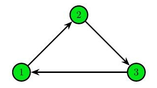
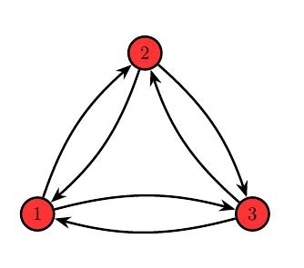
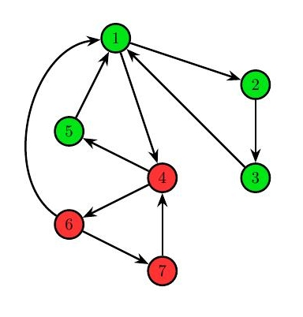
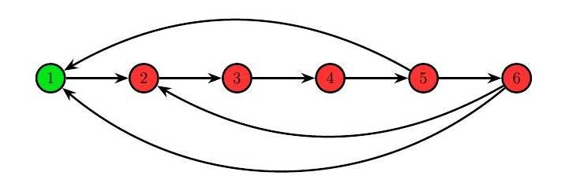

<h1 style='text-align: center;'> E. James and the Chase</h1>

<h5 style='text-align: center;'>time limit per test: 2.5 seconds</h5>
<h5 style='text-align: center;'>memory limit per test: 256 megabytes</h5>

James Bond has a new plan for catching his enemy. There are some cities and directed roads between them, such that it is possible to travel between any two cities using these roads. When the enemy appears in some city, Bond knows her next destination but has no idea which path she will choose to move there. 

The city $a$ is called interesting, if for each city $b$, there is exactly one simple path from $a$ to $b$. By a simple path, we understand a sequence of distinct cities, such that for every two neighboring cities, there exists a directed road from the first to the second city. 

Bond's enemy is the mistress of escapes, so only the chase started in an interesting city gives the possibility of catching her. James wants to arrange his people in such cities. However, if there are not enough interesting cities, the whole action doesn't make sense since Bond's people may wait too long for the enemy.

You are responsible for finding all the interesting cities or saying that there is not enough of them. By not enough, James means strictly less than $20\%$ of all cities. 

### Input

The first line contains one integer $t$ ($1 \leq t \leq 2\,000$) — the number of test cases. Each test case is described as follows:

The first line contains two integers $n$ and $m$ ($1 \leq n \le 10^5$, $0 \leq m \le 2 \cdot 10^5$) — the number of cities and roads between them. Each of the following $m$ lines contains two integers $u$, $v$ ($u \neq v$; $1 \leq u, v \leq n$), which denote that there is a directed road from $u$ to $v$.

You can assume that between each ordered pair of cities there is at most one road. The sum of $n$ over all test cases doesn't exceed $10^5$, and the sum of $m$ doesn't exceed $2 \cdot 10^5$.

### Output

If strictly less than $20\%$ of all cities are interesting, print $-1$. Otherwise, let $k$ be the number of interesting cities. Print $k$ distinct integers in increasing order — the indices of interesting cities.

## Example

### Input


```text
4
3 3
1 2
2 3
3 1
3 6
1 2
2 1
2 3
3 2
1 3
3 1
7 10
1 2
2 3
3 1
1 4
4 5
5 1
4 6
6 7
7 4
6 1
6 8
1 2
2 3
3 4
4 5
5 6
6 1
6 2
5 1
```
### Output


```text
1 2 3 
-1
1 2 3 5 
-1
```
## Note

In all drawings, if a city is colored green, then it is interesting; otherwise, it is colored red.

In the first sample, each city is interesting. 

  In the second sample, no city is interesting. 

  In the third sample, cities $1$, $2$, $3$ and $5$ are interesting. 

  In the last sample, only the city $1$ is interesting. It is strictly less than $20\%$ of all cities, so the answer is $-1$. 

  

#### Tags 

#3000 #NOT OK #dfs_and_similar #graphs #probabilities #trees 

## Blogs
- [All Contest Problems](../Codeforces_Round_647_(Div._1)_-_Thanks,_Algo_Muse!.md)
- [Announcement (en)](../blogs/Announcement_(en).md)
- [Tutorial (en)](../blogs/Tutorial_(en).md)
