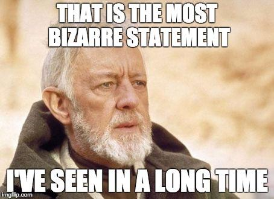
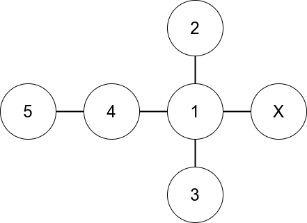
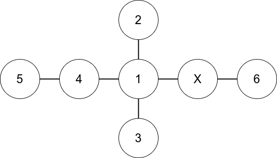
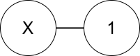
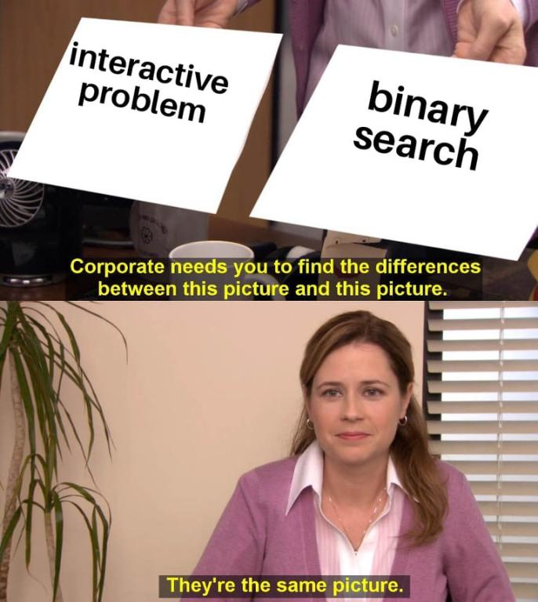
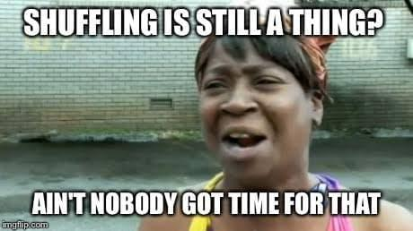

# Tutorial_(en)

Hello, everyone! It was a delight for us to have you participate in our contest. We hope you enjoyed the problems! Here, we present to you the solutions of the problems. I have also prepared some memes for you to enjoy — disclaimer: not all of them were created by me.

 
### [1363A - Odd Selection](../problems/A._Odd_Selection.md "Codeforces Round 646 (Div. 2)")

Key Idea: The sum of xx numbers can only be odd if we have an odd number of numbers which are odd. (An odd statement, indeed).

Detailed Explanation: We first maintain two variables, num_odd and num_even, representing the number of odd and even numbers in the array, respectively. We then iterate over the number of odd numbers we can choose; which are 1,3,5,...1,3,5,... upto min(num_odd,x), and see if num_even ≥x−i≥x−i where ii is the number of odd numbers we have chosen. 

Time complexity: O(N)O(N)

Author of this problem was [Ashishgup](https://codeforces.com/profile/Ashishgup "International Master Ashishgup"). 

 **Relevant Meme**

 **Code for A**
```cpp
#include <bits/stdc++.h>
using namespace std;
 
#define IOS ios::sync_with_stdio(0); cin.tie(0); cout.tie(0);
#define endl "n"
#define int long long
 
const int N = 2e5 + 5;
 
int n, x;
int a[N], f[2];
 
int32_t main()
{
	IOS;
	int t;
	cin >> t;
	while(t--)
	{
	    f[0] = f[1] = 0;
    	cin >> n >> x;
    	for(int i = 1; i <= n; i++)
    	{
    		cin >> a[i];
    		f[a[i] % 2]++;
    	}
    	bool flag = 0;
    	for(int i = 1; i <= f[1] && i <= x; i += 2) //Fix no of odd
    	{
    		int have = f[0], need = x - i;
    		if(need <= f[0])
    	        flag = 1;
    	}
    	if(flag)
    	    cout << "Yes" << endl;
    	else
    	    cout << "No" << endl;
	}
	return 0;
}
```
 
### [1363B - Subsequence Hate](../problems/B._Subsequence_Hate.md "Codeforces Round 646 (Div. 2)")

Key Idea: There are two types of good strings: Those which start with a series of 11's followed by 00's (such as 11111001111100) and those which start with a series of 00's followed by 11's (such as 0011100111). Note that there are strings which do belong to both categories (such as 000000). 

Detailed Explanation: We will use the key idea to compute the minimum change required to achieve every possible string of each of the two types, and then take the minimum across them.

First, let us compute the total number of 11's and 00's in the string, denoted by num_ones and num_zeros. Now, as we iterate through the string, let us also maintain done_ones and done_zeros, which denote the number of 11's and 00's encountered so far.

Let us iterate through the string. When we are at position ii (indexed from 11), we want to answer two questions: what is the cost for changing the string into 11..00011..000 (where number of 11's = ii) and what is the cost for changing the string into 00..11100..111 (where number of 00's = ii). 

Assuming that done_zeros and done_ones also consider the current index, the answer to the first question is done_zeros + num_ones - done_ones. This is because done_zeros 00's must be converted to 11's, and num_ones - done_ones 11's must be converted to 00's. Similarly, the answer for the second question is done_ones + num_zeros - done_zeros.

The answer is the minimum over all such changes possible. Please do not forget to consider the all 11's and all 00's string in the above solution.

Time Complexity: O(N)O(N)

Author of this problem was [Ashishgup](https://codeforces.com/profile/Ashishgup "International Master Ashishgup"). 

 **Relevant Meme**

 **Code for B**
```cpp
#include <bits/stdc++.h>
using namespace std;
 
#define IOS ios::sync_with_stdio(0); cin.tie(0); cout.tie(0);
#define endl "n"
#define int long long
 
const int N = 1e5 + 5;
 
int32_t main()
{
	IOS;
	int t;
	cin >> t;
	while(t--)
	{
		string s;
		cin >> s;
		int suf0 = 0, suf1 = 0;
		for(auto &it:s)
		{
			suf0 += (it == '0');
			suf1 += (it == '1');
		}
		int ans = min(suf0, suf1); //Make whole string 0/1
		int pref0 = 0, pref1 = 0;
		for(auto &it:s)
		{
			pref0 += (it == '0'), suf0 -= (it == '0');
			pref1 += (it == '1'), suf1 -= (it == '1');
			//Cost of making string 0*1*
			ans = min(ans, pref1 + suf0);
			//Cost of making string 1*0*
			ans = min(ans, pref0 + suf1);
		}
		cout << ans << endl;
	}
	return 0;
}
```
 
### [1363C - Game On Leaves](../problems/C._Game_On_Leaves.md "Codeforces Round 646 (Div. 2)")

Key Idea: The main idea of this problem is to think backwards. Instead of thinking about how the game will proceed, we think about how the penultimate state of the game will look like, etc. Also, we take care of the cases where the game will end immediately (i.e, when the special node is a leaf node).

Detailed Explanation: First, let us take care of the cases where the game ends immediately. This only occurs when the special node xx is a leaf node, so all we must do is check that deg[xx] = 1. Please note that n=1n=1 must be handled seperately here (just output Ayush).

Now, in the case where xx is not a leaf node, the answer is as follows: Ashish wins if nn is odd, and Ayush wins if nn is even. I will provide a short sketch of the proof below.

With the hint from the key idea, let us analyze this game backwards. (I will assume that n>10n>10 for the sake of a clear explanation). When xx is removed from the game, it cannot be the only node remaining (because then the previous player could have also removed xx, and thus he did not play optimally). Assume the structure of the game is something like the following WLOG at the last step (The tree attached to xx could be any tree):

Consider also that Ayush won, and the last move was to remove xx. Now, what could have been the state before this move? If Ashish had removed a node from the tree, then he did not play optimally - since he could have removed xx! Thus, he must have removed something from xx, which looks like the following:

Considering this state, Ashish should not infact remove 66, and instead remove something from the tree! Hence, the state that we assumed the game should look like at the end is impossible - and indeed, the tree attached to xx should only consist of only one node (we already proved that xx cannot be the only node remaining). 

Thus, all we have to do is find who's turn it will be when the structure of the tree is as follows:

It is Ashish's turn if nn is odd, and Ayush's turn if nn is even. QED!

Time complexity: O(N)O(N)

Author of this problem was [TheOneYouWant](https://codeforces.com/profile/TheOneYouWant "International Master TheOneYouWant").

 **Relevant Meme**

 **Code for C**
```cpp
#include <bits/stdc++.h>
using namespace std;
 
#define IOS ios::sync_with_stdio(0); cin.tie(0); cout.tie(0);
#define endl "n"
#define int long long
 
const int N = 2e5 + 5;
 
int n, x;
int deg[N];
vector<int> g[N];
 
int32_t main()
{
	IOS;
	int t;
	cin >> t;
	while(t--)
	{
		memset(deg, 0, sizeof(deg));
		cin >> n >> x;
		for(int i = 1; i <= n - 1; i++)
		{
			int u, v;
			cin >> u >> v;
			deg[u]++, deg[v]++;
		}
		if(deg[x] <= 1)
			cout << "Ayush" << endl;
		else
		{
			if(n % 2)
				cout << "Ashish" << endl;
			else
				cout << "Ayush" << endl;
		}
	}
	return 0;
}
```
 
### [1363D - Guess The Maximums](../problems/D._Guess_The_Maximums.md "Codeforces Round 646 (Div. 2)")

Key Idea: The maximum of the array is the password integer for all except atmost 11 position. We find the subset (if the maximum is in a subset) in which the maximum exists using binary search, and then query the answer for this subset seperately. (For all the subsets, the answer is the maximum for the whole array).

Detailed Explanation: I will be working with an example in this explanation; let the array be a=[1,1,2,3,2,5,7,8,9,11,4]a=[1,1,2,3,2,5,7,8,9,11,4], and array of length 1111, and let there be 1010 subsets, with first subset being [1][1], second being [2][2], etc (every index except 1111 is a subset). Thus, a[1]=1,a[3]=2a[1]=1,a[3]=2, etc.

First, let us query the maximum of the whole array using 11 query. This gives 1111 as the output in our case.

Now, we check if the maximum is present in the subsets. We do this in the following manner: we query the first half of the subsets. If the value returned here is not the maximum, then we search in the second half - else, we know that the maximum must be in the first half of subsets. Hence, we binary search in the first half itself. 

To proceed with our example, we query the maximum from subsets 11 to 55, which turns out to be 33. Thus, 1111 must be present in subsets 66 to 1010. Then we will query 66 to 88, which will return the value 88 - thus, the maximum may be present in subset 99, or 1010. Thus, we query subset 99 and find that it does not contain the maximum. This step will require at most 1010 queries, and we will get a subset which (may or may not) contain the maximum element (remember, it is possible that the maximum element was not in any subset!)

Thus, in our final query we ask about the maximum over all indices other than the canditate subset we found above. In our example, We query every index except those in subset 1010 using 11 query, which gives us the answer as 99. Hence, the password is [11,11,11,11,11,11,11,11,11,9][11,11,11,11,11,11,11,11,11,9].

Note: The bound of 1212 queries is tight.

Time complexity: O(N)O(N)

Author of this problem was [FastestFinger](https://codeforces.com/profile/FastestFinger "Grandmaster FastestFinger").

 **Relevant Meme**

 **Code for D**
```cpp
#include<bits/stdc++.h>
using namespace std;
 
#define vint vector<int>
 
int interact(vint S){
	cout << "? " << S.size() << ' ';
	for(int i : S)
		cout << i << ' ';
	cout << endl;
	int x;
	cin >> x;
	return x;
}
 
vint get_complement(vint v, int n){
	vint ask, occur(n + 1);
	for(int i : v)
		occur[i] = 1;
	for(int i = 1; i <= n; i++)
		if(!occur[i])
			ask.push_back(i);
	return ask;
}
 
int main(){
	int tc;
	cin >> tc;
	while(tc--){
		int n, k;
		cin >> n >> k;
		vector<vint> S(k);
		vint ans(k);
		for(int i = 0; i < k; i++){
			int c;
			cin >> c;
			S[i].resize(c);
			for(int j = 0; j < c; j++)
				cin >> S[i][j];
		}
		vint ask;
		for(int i = 1; i <= n; i++)
			ask.push_back(i);
		int max_element = interact(ask);
		//find subset with max element
		int st = 0, en = k - 1;
		while(st < en){
			int mid = (st + en) / 2;
			ask.clear();
			for(int i = 0; i <= mid; i++)
				for(int j : S[i])
					ask.push_back(j);
			int x = interact(ask);
			if(x == max_element)
				en = mid;
			else st = mid + 1;
		}
		ask = get_complement(S[st], n);
		for(int i = 0; i < k; i++)
			if(i == st)
				ans[i] = interact(ask);
			else ans[i] = max_element;
		cout << "! ";
		for(int i : ans)
			cout << i << ' ';
		cout << endl;
		string correct;
		cin >> correct;
	}
}
```
 
### [1363E - Tree Shuffling](../problems/E._Tree_Shuffling.md "Codeforces Round 646 (Div. 2)")

Key Idea: Let the parent of node ii be pp. If a[i]≥a[p]a[i]≥a[p], we can do the shuffling which was done at ii, at pp instead. Thus, we can do the operation a[i]=min(a[i],a[p])a[i]=min(a[i],a[p]).

Detailed Explanation: Let us denote nodes that have bi=1bi=1 and ci=0ci=0 as type 11, and those that have bi=0bi=0 and ci=1ci=1 as type 22. Firstly, the answer is −1−1 if and only if the number of nodes of type 11 and type 22 are unequal.

We also observe that only nodes of type 11 and 22 should be shuffled - it is unoptimal to shuffle those which already have b[i]=c[i]b[i]=c[i]. Thus, we should try to exchange the values of type 11 and type 22 nodes.

We use the key idea by going down from the root, and at every node ii, setting a[i]=min(a[i],a[p])a[i]=min(a[i],a[p]) where pp is the parent node of ii in the tree. Thus, the a[i]a[i]'s now follow a special structure: they are non-increasing from the root to the leaves!

This paves the way for our greedy solution: we will go upwards from the leaves, and at each node ii interchange type 11 and type 22 nodes until we have no nodes in one of these types. Then, we pass on the remaining nodes to the parent to be shuffled.

Time complexity: O(N)O(N)

Author of this problem was [Ashishgup](https://codeforces.com/profile/Ashishgup "International Master Ashishgup"). 

 **Relevant Meme**

 **Code for E**
```cpp
#include <bits/stdc++.h>
using namespace std;
 
#define IOS ios::sync_with_stdio(0); cin.tie(0); cout.tie(0);
#define endl "n"
#define int long long
 
const int N = 2e5 + 5;
 
int n, cost = 0;
int arr[N], b[N], c[N];
vector<int> g[N];
 
pair<int, int> dfs(int u, int par, int mn)
{
	pair<int, int> a = {0, 0};
	if(b[u] != c[u])
	{
		if(b[u])
			a.first++;
		else
			a.second++;
	}
	for(auto &it:g[u])
	{
		if(it == par)
			continue;
		pair<int, int> p = dfs(it, u, min(mn, arr[u]));
		a.first += p.first;
		a.second += p.second;
	}
	if(arr[u] < mn)
	{
		int take = min(a.first, a.second);
		cost += 2 * take * arr[u];
		a.first -= take;
		a.second -= take;
	}
	return a;
}
 
int32_t main()
{
	IOS;
	cin >> n;
	for(int i = 1; i <= n; i++)
		cin >> arr[i] >> b[i] >> c[i];
	for(int i = 1; i <= n - 1; i++)
	{
		int u, v;
		cin >> u >> v;
		g[u].push_back(v);
		g[v].push_back(u);
	}	
	pair<int, int> ans = dfs(1, 0, 2e9);
	if(ans.first || ans.second)
		cout << -1;
	else
		cout << cost;
	return 0;
}
```
 
### [1363F - Rotating Substrings](../problems/F._Rotating_Substrings.md "Codeforces Round 646 (Div. 2)")

Key Idea: We note that a clockwise rotation is the same as taking a character at any position in the string, and inserting it anywhere to it's left. Thus, we process the strings from the end, build the suffixes and move towards the prefix.

Detailed Explanation: The answer is −1−1 if both s and t do not have the same count of every character. Else, we can prove that it is always possible to convert s to t.

Now, let us remove the largest common suffix of both s and t. Now, using the key idea, we consider a move as picking a character at any position in s and inserting it to it's left. So, let us just "pick up" characters, and use them in any order as we iterate through s. Our total cost is equal to the number of characters we picked overall.

After removing common suffixes, suppose the last character of s is c. Since the last characters of s and t differ, we can pick up this c. Now, we want to make s[1,n-1] equal to t[1,n], given that we can insert c anywhere in s.

Let us consider dp[i][j] (only for when j ≥≥ i, which means that we want to make s[1,i] = t[1,j] by inserting some characters that we have picked. What characters can we pick? We can pick the characters whose count in s[i+1,n] > t[j+1,n]. The base case is dp[0][i] = 0. Now, let us write the transitions for this dp solution. Suppose that t[j] = x. There are three possible transitions from dp[i][j]: 

1. If the count of x in s[i+1.n] is greater than it's count in t[j+1,n], then we can reach the state dp[i][j-1].
2. If s[i] = t[j], then we can reach the state dp[i-1][j-1].
3. We can pick up the character at position i (and insert it later) to reach dp[i-1][j] (with an additional cost of 11).

The final answer is dp[n][n]. 

Time complexity: O(N2)O(N2)

Author of this problem was [FastestFinger](https://codeforces.com/profile/FastestFinger "Grandmaster FastestFinger").

 **Relevant Meme**

 **Code for F**
```cpp
#include <bits/stdc++.h>
using namespace std;
 
#define IOS ios::sync_with_stdio(0); cin.tie(0); cout.tie(0);
#define endl "n"
#define int long long
 
const int N = 2005;
 
int n;
string s, t;
int suf[26][N], suf2[26][N];
int cache[N][N];
 
int dp(int i, int j)
{
	if(j == 0)
		return 0;
	int &ans = cache[i][j];
	if(ans != -1)
		return ans;
	ans = 2e9;
	if(i > 0)
	{
		ans = 1 + dp(i - 1, j);
		if(s[i - 1] == t[j - 1])
			ans = min(ans, dp(i - 1, j - 1));
	}
	int ch = t[j - 1] - 'a';
	if(suf[ch][i + 1] - suf2[ch][j + 1] > 0)
		ans = min(ans, dp(i, j - 1));
	return ans;
}
 
int32_t main()
{
	IOS;
	int tc;
	cin >> tc;
	while(tc--)
	{
		cin >> n >> s >> t;
		for(int i = 0; i <= n; i++)
			for(int j = 0; j <= n; j++)
				cache[i][j] = -1;
		for(int i = 0; i <= 25; i++)
			for(int j = 0; j <= n + 1; j++)
				suf[i][j] = suf2[i][j] = 0;
		for(int i = n; i >= 1; i--)
		{
			for(int j = 0; j < 26; j++)
			{
				suf[j][i] = suf[j][i + 1];
				suf2[j][i] = suf2[j][i + 1];
			}
			suf[s[i - 1] - 'a'][i]++;
			suf2[t[i - 1] - 'a'][i]++;
		}
		int ans = dp(n, n);
		if(ans > 1e9)
			ans = -1;
		cout << ans << endl;
	}
	return 0;
}
```
