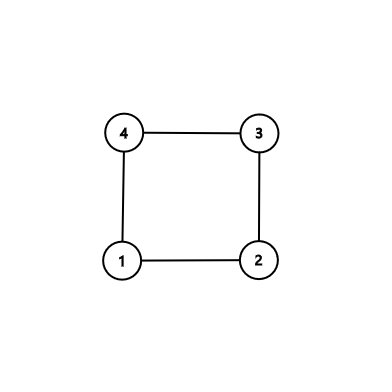
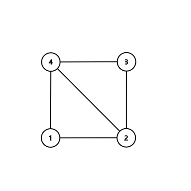
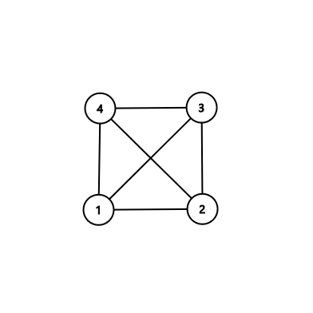

<h1 style='text-align: center;'> D. Ehab's Last Corollary</h1>

<h5 style='text-align: center;'>time limit per test: 1 second</h5>
<h5 style='text-align: center;'>memory limit per test: 256 megabytes</h5>

Given a connected undirected graph with $n$ vertices and an integer $k$, you have to either:

* either find an independent set that has exactly $\lceil\frac{k}{2}\rceil$ vertices.
* or find a simple cycle of length at most $k$.

An independent set is a set of vertices such that no two of them are connected by an edge. A simple cycle is a cycle that doesn't contain any vertex twice. 

I have a proof that for any input you can always solve at least one of these problems, but it's left as an exercise for the reader.

###### Input

The first line contains three integers $n$, $m$, and $k$ ($3 \le k \le n \le 10^5$, $n-1 \le m \le 2 \cdot 10^5$) — the number of vertices and edges in the graph, and the parameter $k$ from the statement.

Each of the next $m$ lines contains two integers $u$ and $v$ ($1 \le u,v \le n$) that mean there's an edge between vertices $u$ and $v$. It's guaranteed that the graph is connected and doesn't contain any self-loops or multiple edges.

###### Output

If you choose to solve the first problem, then on the first line print $1$, followed by a line containing $\lceil\frac{k}{2}\rceil$ distinct integers not exceeding $n$, the vertices in the desired independent set.

If you, however, choose to solve the second problem, then on the first line print $2$, followed by a line containing one integer, $c$, representing the length of the found cycle, followed by a line containing $c$ distinct integers not exceeding $n$, the vertices in the desired cycle, in the order they appear in the cycle.

## Examples

###### Input


```text
4 4 3
1 2
2 3
3 4
4 1
```
###### Output


```text
1
1 3 
```
###### Input

```text

4 5 3
1 2
2 3
3 4
4 1
2 4

```
###### Output


```text
2
3
2 3 4 
```
###### Input

```text

4 6 3
1 2
2 3
3 4
4 1
1 3
2 4

```
###### Output


```text
2
3
1 2 3 
```
###### Input

```text

5 4 5
1 2
1 3
2 4
2 5

```
###### Output


```text

1
1 4 5 
```
## Note

In the first sample:



Notice that printing the independent set $\{2,4\}$ is also OK, but printing the cycle $1-2-3-4$ isn't, because its length must be at most $3$.

In the second sample:



Notice that printing the independent set $\{1,3\}$ or printing the cycle $2-1-4$ is also OK.

In the third sample:



In the fourth sample:


#### Tags 

#2100 #NOT OK #constructive_algorithms #dfs_and_similar #graphs #greedy #implementation #trees 

## Blogs
- [All Contest Problems](../Codeforces_Round_649_(Div._2).md)
- [Announcement (en)](../blogs/Announcement_(en).md)
- [Tutorial (en)](../blogs/Tutorial_(en).md)
