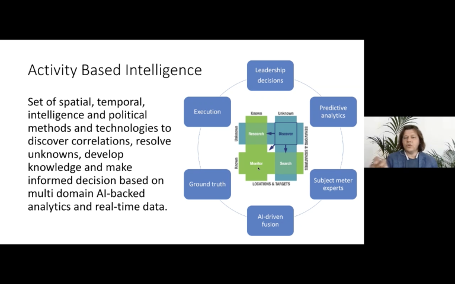

# Announcement

Hello Codeforces!

On [Thursday, June 11, 2020 at 20:35UTC+6](https://codeforces.com/https://www.timeanddate.com/worldclock/fixedtime.html?day=11&month=6&year=2020&hour=17&min=35&sec=0&p1=166) [Educational Codeforces Round 89 (Rated for Div. 2)](https://codeforces.com/contest/1366 "Educational Codeforces Round 89 (Rated for Div. 2)") will start.

Series of Educational Rounds continue being held as [Harbour.Space University](https://codeforces.com/https://harbour.space/) initiative! You can read the details about the cooperation between [Harbour.Space University](https://codeforces.com/https://harbour.space/) and Codeforces in the [blog post](//codeforces.com/blog/entry/51208).

This round will be **rated for the participants with rating lower than 2100**. It will be held on extended ICPC rules. The penalty for each incorrect submission until the submission with a full solution is 10 minutes. After the end of the contest you will have 12 hours to hack any solution you want. You will have access to copy any solution and test it locally.

You will be given **6 or 7 problems** and **2 hours** to solve them.

The problems were invented and prepared by Roman [Roms](https://codeforces.com/profile/Roms "Master Roms") Glazov, Adilbek [adedalic](https://codeforces.com/profile/adedalic "International Master adedalic") Dalabaev, Vladimir [vovuh](https://codeforces.com/profile/vovuh "Master vovuh") Petrov, Ivan [BledDest](https://codeforces.com/profile/BledDest "International Grandmaster BledDest") Androsov, Maksim [Neon](https://codeforces.com/profile/Neon "Candidate Master Neon") Mescheryakov and me. Also huge thanks to Mike [MikeMirzayanov](https://codeforces.com/profile/MikeMirzayanov "Headquarters, MikeMirzayanov") Mirzayanov for great systems Polygon and Codeforces.

Good luck to all the participants!

Our friends at Harbour.Space also have a message for you:

*Hey Codeforces!* 

*A couple of weeks ago, we had the pleasure of hosting a webinar featuring Sergey Gordeichik, CIO of the Inception Institute of Artificial Intelligence and Director of the University’s Cybersecurity Programme.* 

*In his talk, Sergey shared his expertise and insights on how AI is being used both positively and negatively during the COVID-19 global pandemic. He touched on topics such as the ethics of using this technology, and how it was implemented during each phase of the pandemic.* 

*We know not everyone had the chance to tune in during the webinar, so we thought you’d be interested in having a look at the slide deck of his presentation.* 

*You can [check it out here](https://codeforces.com/https://drive.google.com/file/d/18jfX7l7VETUShTzC7PhvRuzr9DzsemuZ/view).* 

*If this was interesting for you, let us know in the comments, and we’ll do our best to try and provide more content like this. Keep an eye out for the final two talks in [our webinar series](https://codeforces.com/https://webinars.harbour.space/) — they might be of interest to you* :) 

*Finally, don’t forget that this July, Sergey is teaching a course on the Cybersecurity of Cloud, Big Data, and AI. The course will be 100% online, so be sure to check it out on our website if you’re interested. [Here’s the link](https://codeforces.com/https://in.harbour.space/cyber-security/cybersecurity-of-cloud-big-data-and-ai-sergey-gordeychik/).*

*That’s all from us!* 

*Good luck in the round, and we’ll see you soon!*

Congratulations to the winners: 

| Rank | Competitor | Problems Solved | Penalty |
| --- | --- | --- | --- |
| 1 | [ksun48](https://codeforces.com/profile/ksun48 "International Grandmaster ksun48") | 7 | 188 |
| 2 | [saketh](https://codeforces.com/profile/saketh "Grandmaster saketh") | 7 | 264 |
| 3 | [hank55663](https://codeforces.com/profile/hank55663 "International Grandmaster hank55663") | 7 | 320 |
| 4 | [244mhq](https://codeforces.com/profile/244mhq "International Grandmaster 244mhq") | 6 | 109 |
| 5 | [Radewoosh](https://codeforces.com/profile/Radewoosh "Legendary Grandmaster Radewoosh") | 6 | 126 |

Congratulations to the best hackers: 

| Rank | Competitor | Hack Count |
| --- | --- | --- |
| 1 | [Hakiobo](https://codeforces.com/profile/Hakiobo "Master Hakiobo") | **70** |
| 2 | [napgod_pk](https://codeforces.com/profile/napgod_pk "Expert napgod_pk") | **67****:-12** |
| 3 | [Zaher](https://codeforces.com/profile/Zaher "Candidate Master Zaher") | **71****:-21** |
| 4 | [VladProg](https://codeforces.com/profile/VladProg "International Master VladProg") | **60** |
| 5 | [BohdanPastuschak](https://codeforces.com/profile/BohdanPastuschak "International Master BohdanPastuschak") | **62****:-26** |

1115 successful hacks and 2003 unsuccessful hacks were made in total!

And finally people who were the first to solve each problem: 

| Problem | Competitor | Penalty |
| --- | --- | --- |
| A | [neal](https://codeforces.com/profile/neal "International Grandmaster neal") | 0:00 |
| B | [neal](https://codeforces.com/profile/neal "International Grandmaster neal") | 0:02 |
| C | [ksun48](https://codeforces.com/profile/ksun48 "International Grandmaster ksun48") | 0:05 |
| D | [BohdanPastuschak](https://codeforces.com/profile/BohdanPastuschak "International Master BohdanPastuschak") | 0:05 |
| E | [ksun48](https://codeforces.com/profile/ksun48 "International Grandmaster ksun48") | 0:15 |
| F | [kort0n](https://codeforces.com/profile/kort0n "International Grandmaster kort0n") | 0:51 |
| G | [rainboy](https://codeforces.com/profile/rainboy "Expert rainboy") | 0:25 |

**UPD:** [Editorial is out](Tutorial.md)

