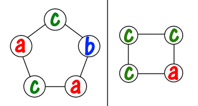
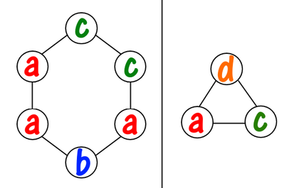

<h1 style='text-align: center;'> E. Necklace Assembly</h1>

<h5 style='text-align: center;'>time limit per test: 2 seconds</h5>
<h5 style='text-align: center;'>memory limit per test: 256 megabytes</h5>

The store sells $n$ beads. The color of each bead is described by a lowercase letter of the English alphabet ("a"–"z"). You want to buy some beads to assemble a necklace from them.

A necklace is a set of beads connected in a circle.

For example, if the store sells beads "a", "b", "c", "a", "c", "c", then you can assemble the following necklaces (these are not all possible options):

  And the following necklaces cannot be assembled from beads sold in the store:

  The first necklace cannot be assembled because it has three beads "a" (of the two available). The second necklace cannot be assembled because it contains a bead "d", which is not sold in the store. We call a necklace $k$-beautiful if, when it is turned clockwise by $k$ beads, the necklace remains unchanged. For example, here is a sequence of three turns of a necklace. 

   As you can see, this necklace is, for example, $3$-beautiful, $6$-beautiful, $9$-beautiful, and so on, but it is not $1$-beautiful or $2$-beautiful.In particular, a necklace of length $1$ is $k$-beautiful for any integer $k$. A necklace that consists of beads of the same color is also beautiful for any $k$.

You are given the integers $n$ and $k$, and also the string $s$ containing $n$ lowercase letters of the English alphabet — each letter defines a bead in the store. You can buy any subset of beads and connect them in any order. Find the maximum length of a $k$-beautiful necklace you can assemble.

### Input

The first line contains a single integer $t$ ($1 \le t \le 100$) — the number of test cases in the test. Then $t$ test cases follow.

The first line of each test case contains two integers $n$ and $k$ ($1 \le n, k \le 2000$).

The second line of each test case contains the string $s$ containing $n$ lowercase English letters — the beads in the store.

It is guaranteed that the sum of $n$ for all test cases does not exceed $2000$.

### Output

### Output

 $t$ answers to the test cases. Each answer is a positive integer — the maximum length of the $k$-beautiful necklace you can assemble.

## Example

### Input


```text
6
6 3
abcbac
3 6
aaa
7 1000
abczgyo
5 4
ababa
20 10
aaebdbabdbbddaadaadc
20 5
ecbedececacbcbccbdec
```
### Output


```text
6
3
5
4
15
10
```
## Note

The first test case is explained in the statement.

In the second test case, a $6$-beautiful necklace can be assembled from all the letters.

In the third test case, a $1000$-beautiful necklace can be assembled, for example, from beads "abzyo".


#### Tags 

#1900 #NOT OK #brute_force #dfs_and_similar #dp #graphs #greedy #number_theory 

## Blogs
- [All Contest Problems](../Codeforces_Round_650_(Div._3).md)
- [Announcement](../blogs/Announcement.md)
- [Tutorial](../blogs/Tutorial.md)
