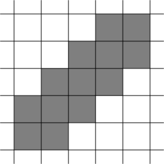
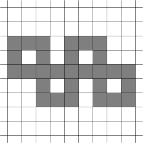
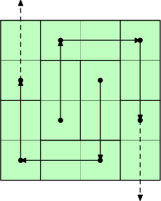
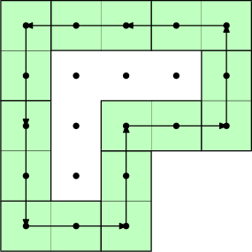
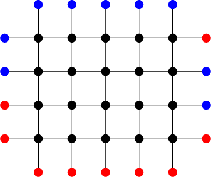
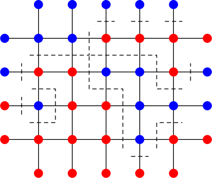
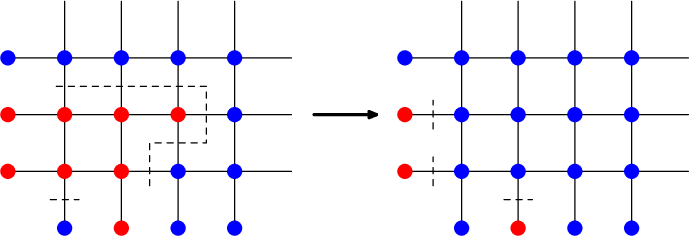
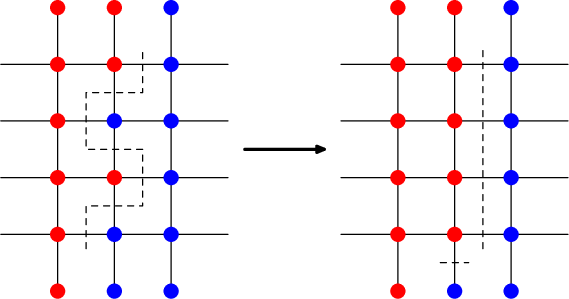

# Tutorial_(en)

Thank you for waiting! I hope you've enjoyed the problems. Let me know what you think in the comments!

**UPD**: I almost forgot but here are some notes, as well as challenges for all problems. For a lot of them I don't have a solution and would be happy to hear your ideas.

 
### [1368A - C+=](../problems/A._C+=.md "Codeforces Global Round 8")

After any operation either a or b becomes a+b. Out of the two options, clearly it is better to increase the smaller number. For example, with numbers 2,3 we can either get a pair 2,5 or 3,5; to obtain larger numbers, the last pair is better in every way.

With this we can just simulate the process and count the number of steps. The worst case is a=b=1, n=109, where each new addition produces the next element of the Fibonacci sequence. At this point we can just run the simulation and find out that 43 steps are always enough. In general, Fibonacci sequence grows exponentially, thus O(logn) steps are needed.

 **Challenge (awful)**Find a closed formula for the answer. For simplicity assume a≤b,

 
### [1368B - Codeforces Subsequences](../problems/B._Codeforces_Subsequences.md "Codeforces Global Round 8")

Suppose that instead of codeforces subsequences we're looking for, say, abcde subsequences. Then in an optimal string all a's appear at the front. Indeed, moving any other occurence of a to the front will leave all the other occurences intact, and can only possibly create new ones. For a similar reason, all b's should immediately follow, then go all c's, and so on.

The only question is how many a's, b's, etc should we take. The answer is we should have quantities of each letter as close as possible to each other. Indeed, the number of subsequences is na×nb×…×ne, where na,nb,… are the number of occurences of each letter. If, say, na−nb>1, then it is not hard to show that transforming an a to a b increases the product. Now the optimal distribution can be obtained simply by increasing na,nb,… one by one in a loop. We should stop once the product is at least k.

This approach will, however, not work quite as well if the subsequence has repeated letters. Still, it is natural to expect that the same pattern applies to optimal strings with codeforces subsequences: it has a lot of unique letters, and repeated letters are far apart. It was hardly necessary, but here's one way to prove that the pattern works (math and casework alert):

* Letters d, f, r, s should form consecutive blocks. If, say, two d's are separated by other letters, we can look which d is present in fewer number of subsequences, and more it next to the more popular one. The same argument works for all other letters.
* It doesn't make sense to put anything other than e's between d's and f's. Indeed, any other letter won't be present in any subsequences. Similarly, there can only be o's between f's and r's. Now we know the string looks like ???dddeeefffooorrr???sss.
* Finally, only c's and o's can precede d's, and it doesn't make sense to place o's before c's. Similarly, c's and e's in this order occupy the space between r's and s's.

It follows that the same solution as above can be applied to solve this problem.

 **Challenge (?)**As mentioned above, the problem is not that easy in general case when there are a lot of repeated letters. Still, is it possible to do? Any solution faster than brute-force would be interesting, or even some ideas or observations.

 **Notes**I find it much harder to create a good easy problem than a good hard problem. This position in paricular gave me a lot of trouble, we had to scratch three or four other versions. Not to say the result is very inspiring, but the previous ones were even worse...

What do you except to see in a good easy problem, say, up to Div1A? What are you favourite easy problems of this level? I would especially appreciate answers from high-rated coders.

 
### [1368C - Even Picture](../problems/C._Even_Picture.md "Codeforces Global Round 8")

The sample picture was a red herring, it's hard to generalize to work for arbitrary n. After drawing for a while you may come up with something like this:

  or like this:

  or something even more complicated. Of course, having a simpler construction (like the first one) saves time on implementation compared to other ones. Don't settle for a solution if it feels too clunky, take a moment and see if you can make it simpler.

 **Challenge (probably doable)**How to minimize the total number of squares for a given n? The squares-on-a-diagonal construction in the first picture is pretty efficient, but e.g. for n=4 the picture in the sample has fewer squares. How does the minimum-square picture look in general?

 
### [1368D - AND, OR and square sum](../problems/D._AND,_OR_and_square_sum.md "Codeforces Global Round 8")

Let's look at a single operation x,y→x AND y,x OR y, let the last two be z and w respectively. We can notice that x+y=z+w. Indeed, looking at each bit separately we can see that the number of 1's in this bit is preserved.

Clearly z≤w, and suppose also that x≤y. Since the sum is preserved, we must have z=x−d, w=y+d for some non-negative d. But then the sum of squares of all numbers changes by z2+w2−x2−y2. Substituting for z and w and simplifying, this is equal to 2d(d+y−x), which is positive when d>0.

Side note: an easier (?) way to spot the same thing is to remember that f(x)=x2 is convex, thus moving two points on the parabola away from each other by the same amount increases the sum of values.

It follows that any operation increases the square sum (as long as any numbers change), and we should keep doing operations while we can.

When can we no longer make meaningful operations? At that point all numbers should be submasks of each other. The only way that could happen is when for any bit only several largest numbers have 1 in that position. We also know that the number of 1's in each bit across all numbers is preserved. Thus, it's easy to recover the final configuration: for each bit count the number of 1's, and move all these 1's to the last (=greatest) numbers. For example, for the array [1,2,3,4,5,6,7] there are four 1's in each of the smallest three bits, thus the final configuration is [0,0,0,7,7,7,7]. Finally, print the sum of squares of all these numbers.

The total complexity is O(nlog2A), where A is the largest possible number (thus log2A is roughly the number of bits involved).

 **Challenge (?)**How to find the smallest number of operations we need to make until there are no more we can make? Any solution polynomial in n and log2maxA would be interesting.

 
### [1368E - Ski Accidents](../problems/E._Ski_Accidents.md "Codeforces Global Round 8")

Let's consider vertices from 1 to n (that is, in topological order). We divide them into three sets V0, V1, V2:

* V0 contains all vertices that only have incoming edges from V2;
* V1 contains all vertices that have an incoming edge from V0, but not from V1;
* V2 contains all vertices that have an incoming edge from V1.

It is not hard to see that erasing all vertices in V2 leaves no two-edge paths. The same solution can be simply rephrased as: go from left to right, and remove current vertex if it is at the end of a two-edge path.

Why does this work? Every vertex of V2 has to have at least one incoming edge from V1. There are at most 2|V1| such edges, thus |V2|≤2|V1|, and |V1|≥|V2|/2. Similarly, |V0|≥|V1|/2≥|V2|/4. But then n=|V0|+|V1|+|V2|≥|V2|(1+1/2+1/4)=7|V2|/4, thus |V2|≤4n/7.

This is very easy to implement in O(n) time.

 **Challenge (???)**It's not hard to construct a test where n/2 spots have to be closed. However, I could not find a test where more that n/2 spots need to be closed, nor do I know of a solution that closes less than 4n/7 spots in the worst case. In other words, if α is the optimal constant such that αn+o(n) spots need to be closed, we know that 1/2≤α≤4/7. Can I find better bounds for α, or even find its precise value?

 **Notes**Huge thanks to our tester [kocko](https://codeforces.com/profile/kocko "Specialist kocko") for pointing out many mistakes in an old version of this problem's statement, and even proposing a revision of a big part of the statement which we've adopted. Sadly, many other parts of the statement still were not very clear...

 
### [1368F - Lamps on a Circle](../problems/F._Lamps_on_a_Circle.md "Codeforces Global Round 8")

Let try to come up with an upper bound on R(n). Let x be the number of currently turned on lamps. Consider our last move that resulted in increasing x (after the response was made), and suppose it turned on k lamps. If the opponent could then find a segment of k consecutive lamps and turn them off, the move could be reverted. From this we can conclude that x could not be too large.

Indeed, after the move x+k lamps should have been divided into segments of length at most k−1 each (since the opponent couldn't turn k lamps off), separated by turned off lamps. The number of segments should have been at least x+kk−1, and the same bound applies to the number of separating lamps. Thus we must have had x+k+x+kk−1≤n. After some boring transformations we obtain x≤n−k−nk+1. It follows that x can not be increased past this threshold with turning on k lamps.

This implies that x can not be increased past maxk(n−k−nk+1) with any move, thus R(n)≤maxk(n−k−⌈nk⌉+1).

On the other hand, let's take such a k that maximizes n−k−⌈nk⌉+1, and adopt the following strategy:

* Pick ⌈nk⌉ lamps that divide the circle into segments of length ≤k−1 each, and never turn these lamps on. We can choose these lamps greedily at distance k from each other, until we go full circle (at that point the distance from the last to the first lamp may be less than k).
* On each move, turn on any k lamps except for the forbidden ones. Since the turned on lamps never form a segment of length k, we will successfully increase x with this move.
* We stop once there are less than k non-forbidden lamps to turn on. At this point we will have x≥n−⌈nk⌉−k+1, thus R(n) can not be less than this value.

We've determined that R(n)=maxk(n−k−⌈nk⌉+1), and provided a quite simple strategy to achieve this result. For large n, the maximum is attained at k≈√n, thus R(n)≈n−2√n.

 **Challenge (probably doable)**If the first player wants to minimize the number of turns until R(n) lamps are lit, and the second player wants to maximize it, what is the resulting number of turns T(n) is going to be? Precise formula would be awesome, but asymptotics or interesting bounds for T(n) would be interesting too.

 
### [1368G - Shifting Dominoes](../problems/G._Shifting_Dominoes.md "Codeforces Global Round 8")

Let's think of how a certain cell can be freed up. One way is to just lift the domino covering it from the start. If we didn't do it, then we must move the domino covering the cell, and there is exactly one way of doing so. But at this point the cell we've moved to should have been free. We can follow this chain of events, and we must eventually arrive to a cell that was covered by the initially removed domino.

This is more readily seen if we draw a graph with vertices being cells, and edges leading from the cell freed up by moving a domino to the cell becoming occupied by doing so. Note that some of the cells are impossible to free up with such a move.

  Let us study this graph a bit more. If we color the board like a chessboard, we can see that edges always connect cells of the same color, so the two subgraphs for white and black cells are independent. Further, since initially a white and a black cell are freed, the two free cells will always have different colors.

In this graph each vertex (= cell) has out-degree at most 1. In general directed graphs of this kind are called [functional graphs](https://codeforces.com/https://en.wikipedia.org/wiki/Pseudoforest#Graphs_of_functions), and look like a bunch of trees linked to directed cycles. However, it turns out that our graph can not have cycles! To prove this, let's look a how this cycle would look like:

  Centers of all the cells in a cycle form a lattice polygon. The area of such a polygon can be found with Pick's formula: S=I+B/2−1, where I and B is the number of lattice points inside and on the boundary respectively. However, we can observe that:

* B is the length of the boundary. The boundary can be broken into segments of length 2. The length of upward and downward arrows is the same, therefore the length of vertical borders is divisible by 4, same for horizontal arrows. Thus B is divisible by 4, and B/2 must be even.
* Inside of the polygon can be broken down into 2×2 squares, therefore S must be even.
* I=S−B/2+1 should therefore be odd. However, the inside of the cycle is isolated from the outside, and therefore should be independently tilable with dominoes. But the number of cells (= vertices) inside the cycle is odd, therefore it's impossible.

Since our directed graph has no cycles, it must be a directed forest, which makes it much easier to handle.

Now consider a pair of cells c1,c2 of different colors, and look at the paths P1 and P2 starting at these cells. If these paths reach the boundary without visiting the same domino, then the pair c1,c2 is impossible to free up, since we would have to remove at least two dominoes.

If the paths do visit at least one common domino, then we argue that the pair is possible to free up. Indeed, consider the first domino D on P1 that is also visited by P2. If we remove D, then the parts of P1 and P2 until D can not intersect, thus it is possible to move dominoes to free c1 and c2 without trying to move any domino twice.

To figure out the answer, consider the two forests F1 and F2 built up by black and white cells of the board. If we label each cell of each forest with the index of the domino covering this cell, then the answer is equal to the number of pairs of cells c1∈F1, c2∈F2 such that the paths starting at c1 and c2 have common labels. To actually compute the answer we will instead count the cell pairs with label-disjoint paths.

This is now a fairly standard data structure problem. Construct Euler tours in both F1 and F2. Then, the subtree of each vertex is a segment in the Euler tour. For a cell c1∈F1 labeled with domino D, suitable cells in F2 are the ones not in the subtree of a cell sharing the label with c1 or with any parent of c1.

Perform a DFS of F1, following edges in reverse. When we enter a cell labeled D, locate the cell with this label in F2 and mark all vertices in its subtree. At this point, we should add the number of unmarked cells in F2 to the answer. When we leave the cell, revert to the previous configuration before marking the subtree. Implementation-wise, this can be done with a segment tree that supports adding on a segment (= subtree in the Euler tour), and finding the number of zeros (= unmarked cells).

Segment tree is the most demanding component of the solution, thus the complexity is O(nmlog(nm)).

 **Challenge (?)**What are the minimum and maximum possible answers among all tilings of the board of given dimensions n and m?

 **Notes**The final version of this problem is due to [300iq](https://codeforces.com/profile/300iq "Legendary Grandmaster 300iq") who proposed an interesting modification to my initial idea.

 
### [1368H2 - Breadboard Capacity (hard version)](../problems/H2._Breadboard_Capacity_(hard_version).md "Codeforces Global Round 8")

We are basically asked to find the maximum flow value from red ports to blue ports in the grid network. All edges can be assumed to be bidirectional and have capacity 1.

  By Ford-Fulkerson theorem, the maximum flow value is equal to the minimum cut capacity. In our context it is convenient to think about minimum cut as a way to paint nodes inside the grid red and blue so that the number of edges connecting differently colored nodes is smallest possible.

For a given coloring, let us construct a cut in the dual graph by connecting the faces separated by multicolored edges.

  Note that the cut can be decomposed into cycles, paths connecting two points on the border, and single edge cuts adjacent to the ports. We may assume that different parts of the cut do not cross each other since we can just reassign parts at the crossing.

The following actions modify the cut without increasing its capacity (the number of crossed edges):

* Interior of any cycle can be recolored, which makes the cycle disappear.
* If a path connects a pair of adjacent sides, we may get rid of the path and instead cut/uncut ports in the corner separated by the path. 
* A path connecting opposite sides can be transformed into a straight segment, possibly with cutting/uncutting some ports. 

Applying these operations to any minimum cut, we can obtain a minimum cut that only consists of port cuts and straight segments parallel to one of the sides. 

Note that a port cut is essentially equivalent to recoloring of that port, with increase 1 towards the cut capacity. Each straight segment contributes n or m to the capacity depending on the orientation.

A minimum cut of the form above can be found with a simple linear dynamic programming. First, choose the direction of straight cuts (say, vertical). All ports along each vertical side should be recolored to the same color. Then, proceeding in the horizontal direction we may decide to recolor ports adjacent to horizontal sides, and/or to make a straight vertical cut. We need to make sure that each connected part between the cuts has uniform color.

In addition to the horizontal position, the only extra parameter for this DP is the color immediately behind the current vertical line. This solves the easy version of the problem.

To solve the hard version, we need to combine this DP with lazy propagation segment tree. We will store a separate segment tree for each direction of straight cuts. Say, for vertical cuts, a node [L,R) should store costs to properly recolor and/or make straight cuts in the horizontal range [L,R) so that the leftmost/rightmost nodes are red/blue (all four options). Make sure to take fixing vertical sides into account when calculating the answer. Merging the cost values from two halves of a node segment follows directly from the original DP recalculation.

To be able to make range flips fast enough, we need to store four more values — the answers assuming that the opposite sides take opposite colors instead of the same colors. Now to flip a node in the segment tree simply exchange the correct values with the opposite ones. Implementation details are left for the reader to work out. =)

With this approach we are able to process each modification query in O(logn+logm) time, although the constant factor is fairly large because of complicated merging process.

 **Challenge (running out of ideas)**Can you solve the same problem in 3D? The breadboard is now an n×m×k parallelepiped, and there are 2(nm+nk+mk) adjacent ports.

