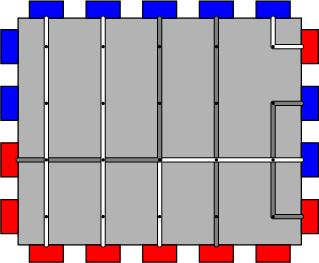

<h1 style='text-align: center;'> H1. Breadboard Capacity (easy version)</h1>

<h5 style='text-align: center;'>time limit per test: 2 seconds</h5>
<h5 style='text-align: center;'>memory limit per test: 512 megabytes</h5>

This is an easier version of the problem H without modification queries.

Lester and Delbert work at an electronics company. They are currently working on a microchip component serving to connect two independent parts of a large supercomputer.

The component is built on top of a breadboard — a grid-like base for a microchip. The breadboard has $n$ rows and $m$ columns, and each row-column intersection contains a node. Also, on each side of the breadboard there are ports that can be attached to adjacent nodes. Left and right side have $n$ ports each, and top and bottom side have $m$ ports each. Each of the ports is connected on the outside to one of the parts bridged by the breadboard, and is colored red or blue respectively.

  Ports can be connected by wires going inside the breadboard. However, there are a few rules to follow:

* Each wire should connect a red port with a blue port, and each port should be connected to at most one wire.
* Each part of the wire should be horizontal or vertical, and turns are only possible at one of the nodes.
* To avoid interference, wires can not have common parts of non-zero length (but may have common nodes). Also, a wire can not cover the same segment of non-zero length twice.

The capacity of the breadboard is the largest number of red-blue wire connections that can be made subject to the rules above. For example, the breadboard above has capacity $7$, and one way to make seven connections is pictured below.

  Up to this point statements of both versions are identical. Differences follow below.

Given the current breadboard configuration, help Lester and Delbert find its capacity efficiently.

### Input

The first line contains three integers $n, m, q$ ($1 \leq n, m \leq 10^5$, $\pmb{q = 0}$). $n$ and $m$ are the number of rows and columns of the breadboard respectively. In this version $q$ is always zero, and is only present for consistency with the harder version.

The next four lines describe initial coloring of the ports. Each character in these lines is either R or B, depending on the coloring of the respective port. The first two of these lines contain $n$ characters each, and describe ports on the left and right sides respectively from top to bottom. The last two lines contain $m$ characters each, and describe ports on the top and bottom sides respectively from left to right.

### Output

Print a single integer — the given breadboard capacity.

## Example

### Input


```text
4 5 0
BBRR
RBBR
BBBBB
RRRRR
```
### Output


```text
7
```


#### Tags 

#3300 #NOT OK #dp #flows #greedy 

## Blogs
- [All Contest Problems](../Codeforces_Global_Round_8.md)
- [Announcement (en)](../blogs/Announcement_(en).md)
- [Tutorial (en)](../blogs/Tutorial_(en).md)
