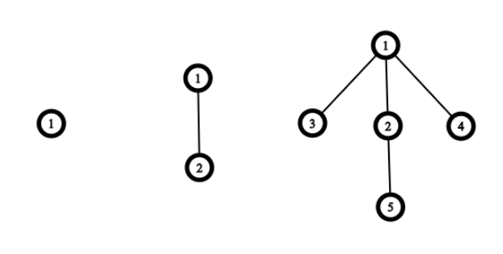
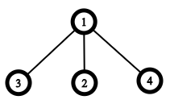
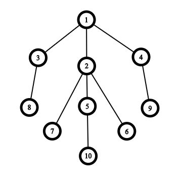

<h1 style='text-align: center;'> D. TediousLee</h1>

<h5 style='text-align: center;'>time limit per test: 2 seconds</h5>
<h5 style='text-align: center;'>memory limit per test: 256 megabytes</h5>

Lee tried so hard to make a good div.2 D problem to balance his recent contest, but it still doesn't feel good at all. Lee invented it so tediously slow that he managed to develop a phobia about div.2 D problem setting instead. And now he is hiding behind the bushes...

Let's define a Rooted Dead Bush (RDB) of level $n$ as a rooted tree constructed as described below.

A rooted dead bush of level $1$ is a single vertex. To construct an RDB of level $i$ we, at first, construct an RDB of level $i-1$, then for each vertex $u$: 

* if $u$ has no children then we will add a single child to it;
* if $u$ has one child then we will add two children to it;
* if $u$ has more than one child, then we will skip it.

  Rooted Dead Bushes of level $1$, $2$ and $3$. Let's define a claw as a rooted tree with four vertices: one root vertex (called also as center) with three children. It looks like a claw:

  The center of the claw is the vertex with label $1$. Lee has a Rooted Dead Bush of level $n$. Initially, all vertices of his RDB are green.

In one move, he can choose a claw in his RDB, if all vertices in the claw are green and all vertices of the claw are children of its center, then he colors the claw's vertices in yellow.

He'd like to know the maximum number of yellow vertices he can achieve. Since the answer might be very large, print it modulo $10^9+7$.

### Input

The first line contains one integer $t$ ($1 \le t \le 10^4$) — the number of test cases.

Next $t$ lines contain test cases — one per line.

The first line of each test case contains one integer $n$ ($1 \le n \le 2 \cdot 10^6$) — the level of Lee's RDB.

### Output

For each test case, print a single integer — the maximum number of yellow vertices Lee can make modulo $10^9 + 7$.

## Example

### Input


```text
7
1
2
3
4
5
100
2000000
```
### Output


```text
0
0
4
4
12
990998587
804665184
```
## Note

It's easy to see that the answer for RDB of level $1$ or $2$ is $0$.

The answer for RDB of level $3$ is $4$ since there is only one claw we can choose: $\{1, 2, 3, 4\}$.

The answer for RDB of level $4$ is $4$ since we can choose either single claw $\{1, 3, 2, 4\}$ or single claw $\{2, 7, 5, 6\}$. There are no other claws in the RDB of level $4$ (for example, we can't choose $\{2, 1, 7, 6\}$, since $1$ is not a child of center vertex $2$).

  Rooted Dead Bush of level 4. 

#### Tags 

#1900 #NOT OK #dp #graphs #greedy #math #trees 

## Blogs
- [All Contest Problems](../Codeforces_Round_652_(Div._2).md)
- [Announcement (en)](../blogs/Announcement_(en).md)
- [Tutorial (en)](../blogs/Tutorial_(en).md)
