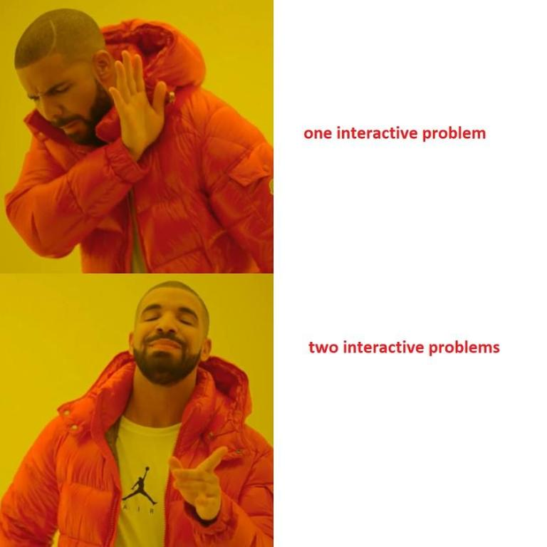
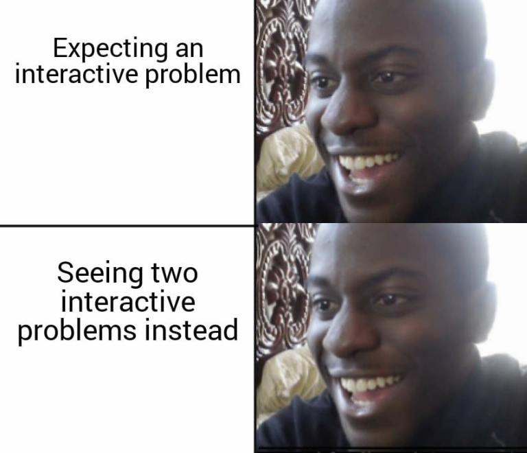

# Tutorial_(en)

[1370A - Maximum GCD](../problems/A._Maximum_GCD.md "Codeforces Round 651 (Div. 2)")

 **Tutorial**
### [1370A - Maximum GCD](../problems/A._Maximum_GCD.md "Codeforces Round 651 (Div. 2)")

Key Idea:

Answer for any $n \ge 2$ is equal to $\lfloor{\frac{n}{2}}\rfloor$ .

Solution:

Let the maximum gcd be equal to $g$. Since the two numbers in a pair are distinct, one of them must be $\gt g$ and both of them must be divisible by $g$. The smallest multiple of $g$, greater than $g$, is $2 \cdot g$. Since each number in the pair must be $\le n$, we must have $2 \cdot g \le n$, or $g \le \lfloor{\frac{n}{2}}\rfloor$. We can achieve $g = \lfloor{\frac{n}{2}}\rfloor$, by choosing $ \lfloor{\frac{n}{2}}\rfloor$ and $2 \cdot \lfloor{\frac{n}{2}}\rfloor$.

Time Complexity: $O(1)$

 **Code**
```cpp

#include < bits/stdc++.h >
using namespace std;
 
#define IOS ios::sync_with_stdio(0); cin.tie(0); cout.tie(0);
#define endl "n"
#define int long long

const int N = 1e5 + 5;

int32_t main()
{
	IOS;
	int t;
	cin >> t;
	while(t--)
	{
		int n;
		cin >> n;
		cout << n / 2 << endl;
	}
	return 0;
}
```
This problem was prepared by [the_hyp0cr1t3](https://codeforces.com/profile/the_hyp0cr1t3 "Expert the_hyp0cr1t3")

[1370B - GCD Compression](../problems/B._GCD_Compression.md "Codeforces Round 651 (Div. 2)")

 **Tutorial**
### [1370B - GCD Compression](../problems/B._GCD_Compression.md "Codeforces Round 651 (Div. 2)")

Key Idea:

It is always possible to form $n-1$ pairs of elements such that their gcd is divisible by $2$.

Solution:

We can pair up the odd numbers and even numbers separately so that the sum of numbers in each pair is divisible by $2$. Note that we can always form $n - 1$ pairs in the above manner because in the worst case, we would discard one odd number and one even number from $a$. If we discarded more than one even or odd numbers, we could instead form another pair with even sum.

Time Complexity: $O(n)$

 **Code**
```cpp

#include < bits/stdc++.h >
using namespace std;
 
#define IOS ios::sync_with_stdio(0); cin.tie(0); cout.tie(0);
#define endl "n"
#define int long long

const int N = 2e5 + 5;

int n;
int a[N];

int32_t main()
{
	IOS;
	int t;
	cin >> t;
	while(t--)
	{
		cin >> n;
		vector< int > even, odd;
		for(int i = 1; i <= 2 * n; i++)
		{
			cin >> a[i];
			if(a[i] % 2)
				odd.push_back(i);
			else
				even.push_back(i);
		}
		vector< pair< int, int > > ans;
		for(int i = 0; i + 1 < odd.size(); i += 2)
			ans.push_back({odd[i], odd[i + 1]});
		for(int i = 0; i + 1 < even.size(); i += 2)
			ans.push_back({even[i], even[i + 1]});
		for(int i = 0; i < n - 1; i++)
			cout << ans[i].first << " " << ans[i].second << endl;
	}
	return 0;
}
```
This problem was prepared by [Ashishgup](https://codeforces.com/profile/Ashishgup "International Master Ashishgup") and [ridbit10](https://codeforces.com/profile/ridbit10 "Expert ridbit10")

[1370C - Number Game](../problems/C._Number_Game.md "Codeforces Round 651 (Div. 2)")

 **Tutorial**Tutorial is loading... **Code**
```cpp

#include< bits/stdc++.h >
using namespace std;

const int N = 50000;

void player_1(){
	cout << "Ashishgup" << endl;
}

void player_2(){
	cout << "FastestFinger" << endl;
}

bool check_prime(int n){
	for(int i = 2; i < min(N, n); i++)
		if(n % i == 0)
			return 0;
	return 1;
}

int main(){
	int tc;
	cin >> tc;
	while(tc--){
		int n;
		cin >> n;
		bool lose = (n == 1);
		if(n > 2 && n % 2 == 0){
			if((n & (n — 1)) == 0)
				lose = 1;
			else if(n % 4 != 0 && check_prime(n / 2))
				lose = 1;
		}
		if(lose)
			player_2();
		else player_1();
	}
}
```
 **Relevant Meme**

This problem was prepared by [FastestFinger](https://codeforces.com/profile/FastestFinger "Master FastestFinger") and [Ashishgup](https://codeforces.com/profile/Ashishgup "International Master Ashishgup")

[1370D - Odd-Even Subsequence](../problems/D._Odd-Even_Subsequence.md "Codeforces Round 651 (Div. 2)")

 **Tutorial**Tutorial is loading... **Code**
```cpp


#include < bits/stdc++.h >
using namespace std;
 
#define IOS ios::sync_with_stdio(0); cin.tie(0); cout.tie(0);
#define endl "n"
#define int long long

const int N = 2e5 + 5;

int n, k;
int a[N];

bool check(int x, int cur)
{
	int ans = 0;
	for(int i = 1; i <= n; i++)
	{
		if(!cur)
		{
			ans++;
			cur ^= 1;
		}
		else
		{
			if(a[i] <= x)
			{
				ans++;
				cur ^= 1;
			}
		}
	}
	return ans >= k;
}

int binsearch(int lo, int hi)
{
	while(lo < hi)
	{
		int mid = (lo + hi) / 2;
		if(check(mid, 0) || check(mid, 1))
			hi = mid;
		else
			lo = mid + 1;
	}
	return lo;
}

int32_t main()
{
	IOS;
	cin >> n >> k;
	for(int i = 1; i <= n; i++)
		cin >> a[i];
	int ans = binsearch(1, 1e9);
	cout << ans;
	return 0;
}

```
This problem was prepared by [Ashishgup](https://codeforces.com/profile/Ashishgup "International Master Ashishgup")

[1370E - Binary Subsequence Rotation](../problems/E._Binary_Subsequence_Rotation.md "Codeforces Round 651 (Div. 2)")

 **Tutorial**Tutorial is loading... **Code**
```cpp

#include < bits/stdc++.h >
using namespace std;
 
#define IOS ios::sync_with_stdio(0); cin.tie(0); cout.tie(0);
#define endl "n"
#define int long long

const int N = 1e6 + 5;

int n;
string s, t;
int a[N];

int get(int x)
{
	int cur = 0, mx = 0;
	for(int i = 1; i <= n; i++)
	{
		cur += x * a[i];
		mx = max(mx, cur);
		if(cur < 0)
			cur = 0;
	}
	return mx;
}

int32_t main()
{
	IOS;
	cin >> n >> s >> t;
	int sum = 0;
	for(int i = 1; i <= n; i++)
	{
		if(s[i - 1] != t[i - 1])
		{
			if(s[i - 1] == '1')
				a[i] = -1;
			else
				a[i] = 1;
		}
		sum += a[i];
	}
	if(sum != 0)
	{
		cout << -1;
		return 0;
	}
	int ans = max(get(1), get(-1));
	cout << ans;
	return 0;
}
```
This problem was prepared by [smartnj](https://codeforces.com/profile/smartnj "Candidate Master smartnj")

[1370F2 - The Hidden Pair (Hard Version)](../problems/F2._The_Hidden_Pair_(Hard_Version).md "Codeforces Round 651 (Div. 2)")

 **Tutorial**Tutorial is loading... **Code**
```cpp


#include< bits/stdc++.h >
using namespace std;

const int N = 1001;

vector< int > adj[N], depth(N), max_depth(N);

int n, root, dist;

void dfs(int i, int par){
	max_depth[i] = depth[i];
	for(int j : adj[i]){
		if(j == par)
			continue;
		depth[j] = 1 + depth[i], dfs(j, i);
		max_depth[i] = max(max_depth[i], max_depth[j]);
	}
}

void find_nodes(int i, int par, int req_depth, vector< int > &nodes){
	if(depth[i] == req_depth){
		nodes.push_back(i);
		return;
	}
	for(int j : adj[i])
		if(j != par && max_depth[j] <= n / 2)
			find_nodes(j, i, req_depth, nodes);
}

pair query(vector< int > nodes){
	cout << "? " << nodes.size() << ' ';
	for(int i : nodes)
		cout << i << ' ';
	cout << endl;
	fflush(stdout);

	int x, dist;
	cin >> x >> dist;

	return {x, dist};
}

int main(){
	int t;
	cin >> t;
	while(t--){
		cin >> n;

		for(int i = 1; i <= n; i++)
			adj[i].clear(), depth[i] = 0, max_depth[i] = 0;

		for(int i = 1; i < n; i++){
			int u, v;
			cin >> u >> v;
			adj[u].push_back(v);
			adj[v].push_back(u);
		}

		vector< int > nodes;
		for(int i = 1; i <= n; i++)
			nodes.push_back(i);

		pair< int, int > res = query(nodes);
		root = res.first, dist = res.second;

		dfs(root, 0);

		int st = 0, en = n / 2, first_node = root;
		while(st <= en){
			int mid = st + en >> 1;

			vector< int > node_set;
			find_nodes(root, 0, mid, node_set);

			if(node_set.empty())
				en = mid — 1;
			else{
				pair< int, int > res = query(node_set);
				if(res.second == dist)
					first_node = res.first, st = mid + 1;
				else en = mid — 1;
			}
		}
		vector< int > candidate_second;
		queue< pair< int, int > > q;
		vector< int > vis(n + 1);
		q.push({first_node, 0});
		while(!q.empty()){
			pair< int, int > node = q.front();
			q.pop();
			vis[node.first] = 1;
			if(node.second == dist)
				candidate_second.push_back(node.first);

			for(int j : adj[node.first])
				if(!vis[j])
					vis[j] = 1, q.push({j, node.second + 1});
		}
		pair< int, int > second_node = query(candidate_second);
		cout << "! " << first_node << ' ' << second_node.first << endl;

		string correct;
		cin >> correct;
	}
}

```
 **Relevant Memes**





This problem was prepared by [FastestFinger](https://codeforces.com/profile/FastestFinger "Master FastestFinger") and [Ashishgup](https://codeforces.com/profile/Ashishgup "International Master Ashishgup")

Meme credits: [ridbit10](https://codeforces.com/profile/ridbit10 "Expert ridbit10") and [the_hyp0cr1t3](https://codeforces.com/profile/the_hyp0cr1t3 "Expert the_hyp0cr1t3") and [FastestFinger](https://codeforces.com/profile/FastestFinger "Master FastestFinger")

