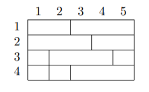
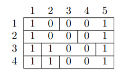

<h1 style='text-align: center;'> E. Omkar and Last Floor</h1>

<h5 style='text-align: center;'>time limit per test: 2 seconds</h5>
<h5 style='text-align: center;'>memory limit per test: 256 megabytes</h5>

Omkar is building a house. He wants to decide how to make the floor plan for the last floor.

Omkar's floor starts out as $n$ rows of $m$ zeros ($1 \le n,m \le 100$). Every row is divided into intervals such that every $0$ in the row is in exactly $1$ interval. For every interval for every row, Omkar can change exactly one of the $0$s contained in that interval to a $1$. Omkar defines the quality of a floor as the sum of the squares of the sums of the values in each column, i. e. if the sum of the values in the $i$-th column is $q_i$, then the quality of the floor is $\sum_{i = 1}^m q_i^2$.

Help Omkar find the maximum quality that the floor can have.

### Input

The first line contains two integers, $n$ and $m$ ($1 \le n,m \le 100$), which are the number of rows and number of columns, respectively.

You will then receive a description of the intervals in each row. For every row $i$ from $1$ to $n$: The first row contains a single integer $k_i$ ($1 \le k_i \le m$), which is the number of intervals on row $i$. The $j$-th of the next $k_i$ lines contains two integers $l_{i,j}$ and $r_{i,j}$, which are the left and right bound (both inclusive), respectively, of the $j$-th interval of the $i$-th row. It is guaranteed that all intervals other than the first interval will be directly after the interval before it. Formally, $l_{i,1} = 1$, $l_{i,j} \leq r_{i,j}$ for all $1 \le j \le k_i$, $r_{i,j-1} + 1 = l_{i,j}$ for all $2 \le j \le k_i$, and $r_{i,k_i} = m$.

### Output

### Output

 one integer, which is the maximum possible quality of an eligible floor plan.

## Example

### Input


```text
4 5
2
1 2
3 5
2
1 3
4 5
3
1 1
2 4
5 5
3
1 1
2 2
3 5
```
### Output


```text
36
```
## Note

The given test case corresponds to the following diagram. Cells in the same row and have the same number are a part of the same interval.

  The most optimal assignment is:

  The sum of the $1$st column is $4$, the sum of the $2$nd column is $2$, the sum of the $3$rd and $4$th columns are $0$, and the sum of the $5$th column is $4$.

The quality of this floor plan is $4^2 + 2^2 + 0^2 + 0^2 + 4^2 = 36$. You can show that there is no floor plan with a higher quality.


#### Tags 

#2900 #NOT OK #dp #greedy #two_pointers 

## Blogs
- [All Contest Problems](../Codeforces_Round_655_(Div._2).md)
- [Tutorial (en)](../blogs/Tutorial_(en).md)
