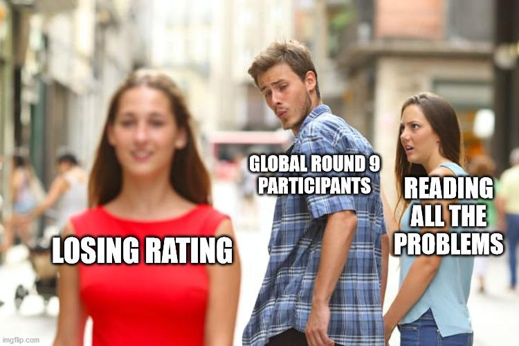

# Announcement_(en)

Hi!

On [Saturday, July 4, 2020 at 20:45UTC+6](https://codeforces.com/https://www.timeanddate.com/worldclock/fixedtime.html?day=4&month=7&year=2020&hour=17&min=45&sec=0&p1=166) we will host [Codeforces Global Round 9](https://codeforces.com/contest/1375 "Codeforces Global Round 9").

It is the third round of a 2020 series of [Codeforces Global Rounds](https://codeforces.com/blog/entry/65002). The rounds are open and rated for everybody.

The prizes for this round:

 * 30 best participants get a t-shirt.
* 20 t-shirts are randomly distributed among those with ranks between 31 and 500, inclusive.

The prizes for the 6-round series in 2020:

 * In each round top-100 participants get points according to the table.
* The final result for each participant is equal to the sum of points he gets in the four rounds he placed the highest.
* The best 20 participants over all series get sweatshirts and place certificates.

Thanks to XTX, which in 2020 supported the global rounds initiative!

The problems of this round were prepared by a team of authors: [adamant](https://codeforces.com/profile/adamant "International Master adamant"), [antontrygubO_o](https://codeforces.com/profile/antontrygubO_o "Grandmaster antontrygubO_o"), [Ari](https://codeforces.com/profile/Ari "International Master Ari"), [dengyaotriangle](https://codeforces.com/profile/dengyaotriangle "Master dengyaotriangle"), [hugopm](https://codeforces.com/profile/hugopm "International Grandmaster hugopm"), [Kuroni](https://codeforces.com/profile/Kuroni "International Grandmaster Kuroni"), [enoone](https://codeforces.com/profile/enoone "Master enoone"), and [Ynoi](https://codeforces.com/profile/Ynoi "Candidate Master Ynoi"). We would like to thank the following people:

 * Our fantastic army of testers: [aryanc403](https://codeforces.com/profile/aryanc403 "Master aryanc403"), [abhayps](https://codeforces.com/profile/abhayps "Candidate Master abhayps"), [DeadlyCritic](https://codeforces.com/profile/DeadlyCritic "Master DeadlyCritic"), [Priyank](https://codeforces.com/profile/Priyank "Candidate Master Priyank"), [benson1029](https://codeforces.com/profile/benson1029 "Master benson1029"), [300iq](https://codeforces.com/profile/300iq "Legendary Grandmaster 300iq"), [Guendabiaani](https://codeforces.com/profile/Guendabiaani "Expert Guendabiaani"), [Arayi](https://codeforces.com/profile/Arayi "Master Arayi"), [thenymphsofdelphi](https://codeforces.com/profile/thenymphsofdelphi "Master thenymphsofdelphi"), [Monogon](https://codeforces.com/profile/Monogon "Master Monogon"), [ainta](https://codeforces.com/profile/ainta "International Grandmaster ainta"), [Elegia](https://codeforces.com/profile/Elegia "International Grandmaster Elegia"), [prabowo](https://codeforces.com/profile/prabowo "Grandmaster prabowo"), [spacewalker](https://codeforces.com/profile/spacewalker "Master spacewalker"), [ko_osaga](https://codeforces.com/profile/ko_osaga "Legendary Grandmaster ko_osaga"), [244mhq](https://codeforces.com/profile/244mhq "International Grandmaster 244mhq"), [tranquility](https://codeforces.com/profile/tranquility "Master tranquility"), [jqdai0815](https://codeforces.com/profile/jqdai0815 "Legendary Grandmaster jqdai0815"), [Aaeria](https://codeforces.com/profile/Aaeria "Expert Aaeria"), [teekteek](https://codeforces.com/profile/teekteek "Pupil teekteek"), [manjpatel](https://codeforces.com/profile/manjpatel "Expert manjpatel"), [Almypa](https://codeforces.com/profile/Almypa "Expert Almypa"), [tfg](https://codeforces.com/profile/tfg "International Grandmaster tfg"), and [tzuyu_chou](https://codeforces.com/profile/tzuyu_chou "Legendary Grandmaster tzuyu_chou") for helping greatly in improving this round's balance and quality!
* [gamegame](https://codeforces.com/profile/gamegame "International Grandmaster gamegame") and [dorijanlendvaj](https://codeforces.com/profile/dorijanlendvaj "Grandmaster dorijanlendvaj"), for their help in improving the humor of the round.
* [MikeMirzayanov](https://codeforces.com/profile/MikeMirzayanov "Headquarters, MikeMirzayanov") for the Codeforces and Polygon platforms.

You will be given 2 hours and 30 minutes to solve 9 problems, and we **highly** encourage you to read all of them :)

   To save testers the work of writing their opinion in the comments, we have compiled some of their opinions for them!

 **Round Feedback*** *As a tester, this round gave me PTSD.*
* *As a tester, I am very happy that I won't participate in the official contest.*
* *As a tester, I can confirm that I am now expecting all contest organizers to pay for my therapy.*
* *As a tester, I am very happy that I can enjoy others suffering in the contest.*
* *As a tester, I agreed to advertise the contest even if I don't like the problems. Please participate!*
* *As a tester, I tested the round.*
* *As a problemsetter, I set a problem ＼(≧▽≦)／*
* *As a tester, where's my t-shirt?*
* *As a tester, I want to advertise our new song!*
* *As a tester, I recommend testing.*
* *As a tester, I tested limits of my Mental health.*
* *As a tester, I recommend you solve as many problems as possible.*
* *As a problemsetter, I am sorry*
Good luck!

**UPD:** Score distribution:

**500 — 750 — 1500 — 1750 — 2000 — 2000 — 2250 — 2750 — 4000**

**UPD2:** [Editorial](Tutorial_(en).md)

**UPD3:** System tests have finished, congratulations to the winners!

 1. [tourist](https://codeforces.com/profile/tourist "Legendary Grandmaster tourist")
2. [scott_wu](https://codeforces.com/profile/scott_wu "Legendary Grandmaster scott_wu")
3. [yosupo](https://codeforces.com/profile/yosupo "International Grandmaster yosupo")
4. [Um_nik](https://codeforces.com/profile/Um_nik "Legendary Grandmaster Um_nik")
5. [Rewinding](https://codeforces.com/profile/Rewinding "International Grandmaster Rewinding")
6. [lqs2015](https://codeforces.com/profile/lqs2015 "Grandmaster lqs2015")
7. [heno239](https://codeforces.com/profile/heno239 "International Grandmaster heno239")
8. [Motarack](https://codeforces.com/profile/Motarack "Grandmaster Motarack")
9. [zeronumber](https://codeforces.com/profile/zeronumber "International Grandmaster zeronumber")
10. [Itst_boyfriend](https://codeforces.com/profile/Itst_boyfriend "Grandmaster Itst_boyfriend")
