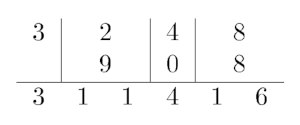

<h1 style='text-align: center;'> F. Strange Addition</h1>

<h5 style='text-align: center;'>time limit per test: 5 seconds</h5>
<h5 style='text-align: center;'>memory limit per test: 256 megabytes</h5>

Let $a$ and $b$ be some non-negative integers. Let's define strange addition of $a$ and $b$ as following:

1. write down the numbers one under another and align them by their least significant digit;
2. add them up digit by digit and concatenate the respective sums together.

Assume that both numbers have an infinite number of leading zeros.

For example, let's take a look at a strange addition of numbers $3248$ and $908$:

  You are given a string $c$, consisting of $n$ digits from $0$ to $9$. You are also given $m$ updates of form: 

* $x~d$ — replace the digit at the $x$-th position of $c$ with a digit $d$.

## Note

 that string $c$ might have leading zeros at any point of time.

After each update print the number of pairs $(a, b)$ such that both $a$ and $b$ are non-negative integers and the result of a strange addition of $a$ and $b$ is equal to $c$.

## Note

 that the numbers of pairs can be quite large, so print them modulo $998244353$.

### Input

The first line contains two integers $n$ and $m$ ($1 \le n, m \le 5 \cdot 10^5$) — the length of the number $c$ and the number of updates.

The second line contains a string $c$, consisting of exactly $n$ digits from $0$ to $9$.

Each of the next $m$ lines contains two integers $x$ and $d$ ($1 \le x \le n$, $0 \le d \le 9$) — the descriptions of updates.

### Output

Print $m$ integers — the $i$-th value should be equal to the number of pairs $(a, b)$ such that both $a$ and $b$ are non-negative integers and the result of a strange addition of $a$ and $b$ is equal to $c$ after $i$ updates are applied.

## Note

 that the numbers of pairs can be quite large, so print them modulo $998244353$.

## Example

### Input


```text
2 3
14
2 4
2 1
1 0
```
### Output


```text
15
12
2
```
## Note

After the first update $c$ is equal to $14$. The pairs that sum up to $14$ are: $(0, 14)$, $(1, 13)$, $(2, 12)$, $(3, 11)$, $(4, 10)$, $(5, 9)$, $(6, 8)$, $(7, 7)$, $(8, 6)$, $(9, 5)$, $(10, 4)$, $(11, 3)$, $(12, 2)$, $(13, 1)$, $(14, 0)$.

After the second update $c$ is equal to $11$.

After the third update $c$ is equal to $01$.


#### Tags 

#2600 #NOT OK #data_structures #dp #matrices 

## Blogs
- [All Contest Problems](../Educational_Codeforces_Round_91_(Rated_for_Div._2).md)
- [Announcement](../blogs/Announcement.md)
- [Tutorial](../blogs/Tutorial.md)
