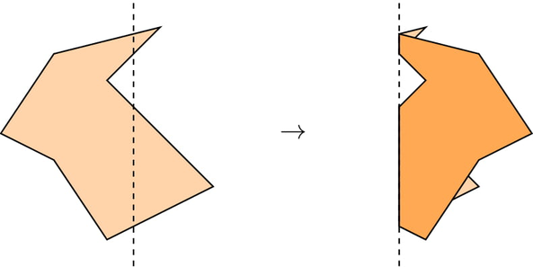
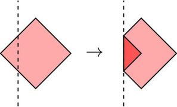
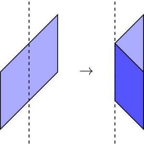
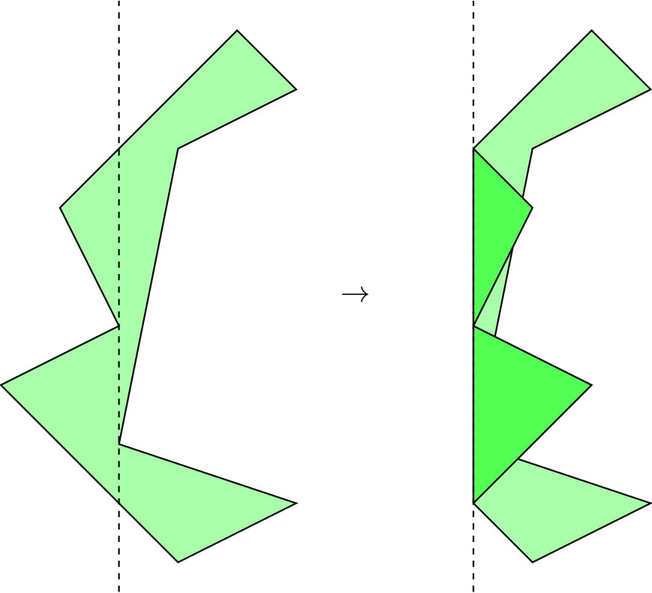

<h1 style='text-align: center;'> E. Origami</h1>

<h5 style='text-align: center;'>time limit per test: 4 seconds</h5>
<h5 style='text-align: center;'>memory limit per test: 256 megabytes</h5>

After being discouraged by 13 time-limit-exceeded verdicts on an ugly geometry problem, you decided to take a relaxing break for arts and crafts.

There is a piece of paper in the shape of a simple polygon with $n$ vertices. The polygon may be non-convex, but we all know that proper origami paper has the property that any horizontal line intersects the boundary of the polygon in at most two points.

If you fold the paper along the vertical line $x=f$, what will be the area of the resulting shape? When you fold, the part of the paper to the left of the line is symmetrically reflected on the right side.

  Your task is to answer $q$ independent queries for values $f_1,\ldots,f_q$.

##### Input

The first line contains two integers $n$, $q$ ($3\le n\le 10^5, 1\le q\le 10^5$)  — the number of polygon vertices and queries, respectively.

Each of the next $n$ lines contains two integers $x_i$, $y_i$ ($|x_i|, |y_i|\le 10^5$)  — the coordinates of the $i$-th point of the polygon. The polygon has an edge connecting each pair of adjacent points in the input, and also an edge between $(x_1,y_1)$ and $(x_n,y_n)$. It is guaranteed that the polygon is non-degenerate and that any horizontal line intersects the boundary of the polygon in at most two points. In particular, no boundary edge is strictly horizontal. Two adjacent sides may be collinear.

Each of the next $q$ lines contains a single integer $f_i$ ($\min\limits_{j=1}^n(x_j)< f_i< \max\limits_{j=1}^n(x_j)$)  — the $x$-coordinate of the $i$-th fold query. It is guaranteed that all $f_i$ are distinct.

##### Output

For each query, output the area $A_i$ of the paper if you fold it along the line $x=f_i$.

Your answer is considered correct if its absolute or relative error does not exceed $10^{-4}$.

Formally, let your answer be $a$, and the jury's answer be $b$. Your answer is accepted if and only if $\frac{|a - b|}{\max{(1, |b|)}} \le 10^{-4}$.

## Examples

##### Input


```text
4 7
0 10
10 0
0 -10
-10 0
-9
-5
-1
0
1
5
9
```
##### Output


```text
199.0000000000
175.0000000000
119.0000000000
100.0000000000
119.0000000000
175.0000000000
199.0000000000
```
##### Input


```text
4 1
0 0
0 2
2 4
2 2
1
```
##### Output


```text
3.0000000000
```
##### Input


```text
9 4
0 -3
2 -2
-1 -1
0 4
2 5
1 6
-2 3
-1 1
-3 0
0
-2
-1
1
```
##### Output


```text
11.1250000000
11.7500000000
10.3446969697
11.3333333333
```
## Note

The first test, with the fold $f=-5$:

  The second test, with the fold $f=1$:

  The third test, with the fold $f=-1$:

  

#### Tags 

#3300 #NOT OK #geometry #math #sortings 

## Blogs
- [All Contest Problems](../Codeforces_Round_658_(Div._1).md)
- [Announcement (en)](../blogs/Announcement_(en).md)
- [Tutorial (en)](../blogs/Tutorial_(en).md)
