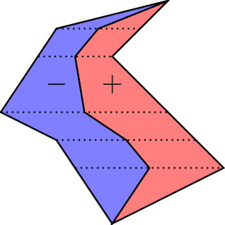

# Tutorial_(en)

I hope you enjoyed the contest! I will add implementations later.

**UPD** I've added implementations.

[1382A - Common Subsequence](../problems/A._Common_Subsequence.md "Codeforces Round 658 (Div. 2)")

 **Tutorial**
### [1382A - Common Subsequence](../problems/A._Common_Subsequence.md "Codeforces Round 658 (Div. 2)")

If there is any common subsequence, then there is a common element of a and b. And a common element is also a common subsequence of length 1. Therefore, we need only find a common element of the two arrays, or say that they share no elements.

Complexity is

* O(nm) if we compare each pair of elements,
* O((n+m)log(n+m)) if we sort the arrays and take their intersection, or use a set data structure, or
* O(n+m) if we use a hash table.
[Implementation](https://codeforces.com/contest/1382/submission/87610208)

[1382B - Sequential Nim](../problems/B._Sequential_Nim.md "Codeforces Round 658 (Div. 2)")

 **Tutorial**
### [1382B - Sequential Nim](../problems/B._Sequential_Nim.md "Codeforces Round 658 (Div. 2)")

Suppose a1>1. If removing the entire first pile is winning, player 1 will do that. Otherwise, player 1 can leave exactly one stone in the first pile, forcing player 2 to remove it, leaving player 1 in the winning position. Otherwise, if a1=1, then it is forced to remove the first pile.

So, whichever player gets the first pile with more than one stone wins. That is, let k be the maximum number such that a1=⋯=ak=1. If k is even, the first player will win. Otherwise, the second player will win. The only exception is when all piles have exactly 1 stone. In that case, the first player wins when k is odd.

Complexity is O(n).

[Implementation](https://codeforces.com/contest/1382/submission/87610287)

[1382C1 - Prefix Flip (Easy Version)](https://codeforces.com/contest/1382/problem/C1 "Codeforces Round 658 (Div. 2)")

 **Tutorial**
### [1382C1 - Prefix Flip (Easy Version)](https://codeforces.com/contest/1382/problem/C1 "Codeforces Round 658 (Div. 2)")

The easy version has two main solutions:

Solution 1: O(n) time with 3n operations

The idea is to fix the bits one-by-one. That is, make s1=t1, then make s2=t2, etc. To fix the bit i (when si≠ti), we can flip the prefix of length i, then flip the prefix of length 1, and again flip the prefix of length i. These three operations do not change any other bits in s, so it's simple to implement in O(n). Since we use 3 operations per bit, we use at most 3n operations overall.

Solution 2: O(n2) time with 2n operations

In this solution, we take a similar approach to solution 1, in that we fix the bits one-by-one. This time, we will fix the bits in reverse order. To fix the bit i, we can either flip the prefix of length i, or flip the first bit and then flip the prefix of length i. Since we do this in reverse order, the previously fixed bits do not get messed up by this procedure. And we use at most 2 operations per bit, so 2n operations overall.

However, we do have to simulate the operations in order to check if we should flip the first bit. Simulating an operation can easily be done in O(n) time per operation, or O(n2) time to simulate all operations.

[Implementation 1](https://codeforces.com/contest/1381/submission/87610374) [Implementation 2](https://codeforces.com/contest/1381/submission/87610452)

[1382C2 - Prefix Flip (Hard Version)](https://codeforces.com/contest/1382/problem/C2 "Codeforces Round 658 (Div. 2)")

 **Tutorial**
### [1382C2 - Prefix Flip (Hard Version)](https://codeforces.com/contest/1382/problem/C2 "Codeforces Round 658 (Div. 2)")

There are several ways to solve the hard version as well.

Solution 1

Given an arbitrary binary string s, we can make all bits 0 in at most n operations. Simply scan the string from left to right. If bits i and i+1 disagree, apply the operation to the prefix of length i. This is also easy to simulate in O(n) time.

We can make s all zeros in at most n operations, and we can make t all zeros in at most n operations. By reversing the order of the operations on t, we have transformed s into t in at most 2n operations, as desired.

Solution 2

Another approach is to optimize the simulation for solution 2 from the easy version. You can do this with a data structure such as a balanced binary search tree in O(nlogn) time, but there is no need.

Instead, we can observe that after making the last k bits correct with our procedure, the prefix of s of length n−k will correspond to some segment of the original string s, except it will be possibly flipped (inverted and reversed). So, we need only keep track of the starting index of this segment, and a flag for whether it is flipped. Complexity is O(n).

Solution 3

A third solution uses randomization to improve the number of operations from 3n in solution 1 of the easy version. We can observe that in a random test case, approximately half the bits of s will be mismatches with t. Solution 1 in the easy version uses 3 operations per mismatch, which is 3n/2 operations in expectation. Obviously, you don't get to decide that all test cases are random. But you can spend a small number of operations initially, flipping random prefixes to make the string more random. If it doesn't work, you can try again repeatedly.

Flipping random prefixes is a complicated process that might be hard to compute the exact probability. But if the probability is p, and we try to flip k prefixes randomly, the time complexity is O((k+1)n)logp.

If you find a deterministic solution with a strictly lower ratio than 2 operations per bit, we would love to hear about it!

[Implementation 1](https://codeforces.com/contest/1381/submission/87610931) [Implementation 2](https://codeforces.com/contest/1381/submission/87610680)

[1382D - Unmerge](https://codeforces.com/contest/1382/problem/D "Codeforces Round 658 (Div. 2)")

 **Tutorial**
### [1382D - Unmerge](https://codeforces.com/contest/1382/problem/D "Codeforces Round 658 (Div. 2)")

Consider the maximum element 2n of p. Assume without loss of generality that it comes from array a. Then the merge algorithm will exhaust array b before it takes the element 2n. Therefore, if 2n appears at index i in p, the entire suffix of p beginning at index i must be a contiguous block in one of the arrays a or b.

Then if we ignore this suffix of p, we should determine if the prefix of p can be the merge of two arrays of certain sizes. We can repeat the same argument, as the maximum remaining element also corresponds to a contiguous block.

Taking this argument all the way, consider all indices i where pi is greater than all elements that come before. This gives us all the lengths of the contiguous blocks, and we should determine if a subset of them add up to n. We've shown this condition is necessary. It is also sufficient because if we assign the blocks to a and b accordingly, the merge algorithm works correctly.

Now, this is just a subset-sum problem. The standard subset-sum DP approach takes O(n2) time, which is good enough.

It's also possible to do O(n√n) by using the fact that sum of values is 2n (as they are the lengths of disjoint blocks), meaning there are only O(√n) distinct values.

[Implementation](https://codeforces.com/contest/1381/submission/87611103)

[1382E - Mastermind](https://codeforces.com/contest/1382/problem/E "Codeforces Round 658 (Div. 2)")

 **Tutorial**
### [1382E - Mastermind](https://codeforces.com/contest/1382/problem/E "Codeforces Round 658 (Div. 2)")

Suppose we have already decided which x indices agree on color. We should shuffle the remaining n−x indices in a way that minimizes the number of matches. We should also replace n−y indices with a color that doesn't contribute to the multiset intersection. Because there are n+1>n colors, there is some color c that doesn't appear in a, and we can use it to fill these n−y indices. Assuming that n−y is greater than or equal to the minimum number of excess matches we're forced to make, we have a solution.

Let f be the number of occurrences of the most frequent color in the n−x indices. Then the number of forced matches is clearly at least 2f−(n−x). And it can be achieved as follows. Let's reindex so that we have contiguous blocks of the same color. Then rotate everything by ⌊n−x2⌋ indices.

Now we need to decide on the x indices that minimize f. This can be done simply by always choosing the most frequent color remaining. We can do this with a priority queue in O(nlogn), or O(n) with counting sort.

To make the solution clearer, let's see how it works on the sixth test case in the sample: [3,3,2,1,1,1] with x=2,y=4. First, we greedily choose the most frequent color two times: [3,_,_,1,_,_]. After choosing 1 the first time, there is a tie between 1 and 3. So alternatively, we could choose the color 1 twice.

Then the remaining indices have colors 3,2,1,1. Rotating by (n−x)/2=2 indices, we can place the colors as 1,1,2,3 to get [3,1,1,1,2,3]. The color 4 does not appear in a, so we should fill n−y=2 indices with 4. (But not where we already forced a match.) For example, we get the solution [3,4,1,1,4,3].

[Implementation](https://codeforces.com/contest/1381/submission/87611187)

[1381D - The Majestic Brown Tree Snake](https://codeforces.com/contest/1381/problem/D "Codeforces Round 658 (Div. 1)")

 **Tutorial**
### [1381D - The Majestic Brown Tree Snake](https://codeforces.com/contest/1381/problem/D "Codeforces Round 658 (Div. 1)")

Let the length of the snake be L.

Let's call a node p a "pivot" if there exist three edge-disjoint paths of length L extending from p. Clearly, if one of the snake's endpoints (head or tail) can reach a pivot, then the snake can rotate through these 3 paths, reversing itself. I claim two things:

1. If a snake's endpoint can reach some pivot, then it can reach all pivots.
2. If a snake's endpoint cannot reach a pivot, the snake cannot reverse itself.

Let's prove claim 1. Say there are two pivots p1 and p2, and a snake's endpoint can reach p1. At most one edge from p1 is on the path between p1 and p2. So let's put the snake in one of the other branches of p1. Then we can move the snake back through p1 and on the path to p2.

Let's prove claim 2. Consider the longest path in the tree. If it is impossible for the snake to enter this path, we may delete the path without changing the possible snake positions, so we apply induction on the smaller tree. Otherwise, if the snake can enter the path, we can show that it can never leave. (And therefore, it is also initially in the path, because snake moves are reversible.)

Assume for contradiction that the snake can leave the path. Then in its last move leaving the path, it occupies a length L path from a node in the longest path. And because we said it was the longest path, both of those branches must have length at least L as well. But then the snake's endpoint is at a pivot, giving us a contradiction. This completes the proof of claim 2.

Solution 1

Now that we understand claims 1 and 2, how can we use them? First, we can detect if any node is a pivot using DP to find the longest 3 paths from each node. If a pivot does not exist, we output NO. Otherwise, root the tree at the pivot p.

Let's move the snake back and forth in a greedy fashion like this: Move the head to the deepest leaf it can reach. Then move the tail to the deepest leaf it can reach. And repeat. If at any point, one endpoint becomes an ancestor of the other, we can move the snake up to p. Otherwise, if no more progress can be made (progress is determined by the smallest reachable depth of an endpoint), then the snake cannot reverse itself. Clearly, the snake can only go back and forth O(n) times before progress stops.

We can simulate the back-and-forth motion by answering k-th ancestor queries with binary lifting. Complexity is O(nlogn).

Solution 2

It's also possible to achieve O(n) with two pointers. Consider the path of nodes initially occupied by the snake, numbered from 1 to L. Each node has a subtree of non-snake nodes. Let ai be the height of the non-snake subtree of node i. We can maintain two pointers ℓ and r, where ℓ is the maximum achievable index of the head, and r is the minimum achievable index of the tail.

We do a similar back-and-forth motion as in solution 1. Send the head to the node that minimizes r, then send the tail to the node that maximizes ℓ, and repeat. The snake can reverse itself if and only if a pivot exists and ℓ,r can swap places.

Bonus: Can you prove that the number of times the snake must switch between moving the head and tail is O(√n)?

[Implementation](https://codeforces.com/contest/1381/submission/87611242)

[1381E - Origami](https://codeforces.com/contest/1381/problem/E "Codeforces Round 658 (Div. 1)")

 **Tutorial**
### [1381E - Origami](https://codeforces.com/contest/1381/problem/E "Codeforces Round 658 (Div. 1)")

First, let's imagine the problem in one dimension. And let's see how the length of the folded segment changes as we sweep the fold line from left to right.

If the fold line is to the left of the paper, it's just the length of the segment. Then as the fold line enters the left side of the paper, we subtract the length of paper to the left of the fold line, since it gets folded onto the right half. Then as the fold line passes the midpoint of the segment, we should add back the length we passed after the midpoint, since the left half gets folded past the right end of the paper. Finally, after the line exits the paper, the answer stays constant again.

Now let's advance to the two-dimensional setting. Imagine the process described above applied to all horizontal segments of the polygon simultaneously. We see that the answer is the integral of the answers for all the segments.

Now, let's split the polygon into two halves by the midpoints of each horizontal segment. For a fold line, the answer is the total area, minus the area left of the sweep line belonging to the first polygon, plus the area left of the sweep line belonging to the second polygon.

  We can sort all line segments and queries, and answer all queries in a sweep line. To simplify the process, it helps to know the standard algorithm to compute the area of a polygon by considering a trapezoid for each line segment and combining their areas with inclusion-exclusion.

Essentially, we have to sweep the integral of a piecewise linear function.

Complexity is O((n+q)log(n+q)).

[Implementation](https://codeforces.com/contest/1381/submission/87611342)

