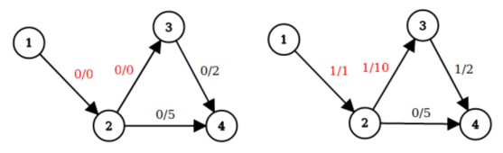

<h1 style='text-align: center;'> F. Special Edges</h1>

<h5 style='text-align: center;'>time limit per test: 5 seconds</h5>
<h5 style='text-align: center;'>memory limit per test: 256 megabytes</h5>

Koa the Koala has a directed graph $G$ with $n$ nodes and $m$ edges. Each edge has a capacity associated with it. Exactly $k$ edges of the graph, numbered from $1$ to $k$, are special, such edges initially have a capacity equal to $0$.

Koa asks you $q$ queries. In each query she gives you $k$ integers $w_1, w_2, \ldots, w_k$. This means that capacity of the $i$-th special edge becomes $w_i$ (and other capacities remain the same).

Koa wonders: what is the [maximum flow](https://en.wikipedia.org/wiki/Maximum_flow_problem#Definition) that goes from node $1$ to node $n$ after each such query?

Help her!

#### Input

The first line of the input contains four integers $n$, $m$, $k$, $q$ ($2 \le n \le 10^4$, $1 \le m \le 10^4$, $1 \le k \le \min(10, m)$, $1 \le q \le 2 \cdot 10^5$) — the number of nodes, the number of edges, the number of special edges and the number of queries.

Each of the next $m$ lines contains three integers $u$, $v$, $w$ ($1 \le u, v \le n$; $0 \le w \le 25$) — the description of a directed edge from node $u$ to node $v$ with capacity $w$.

Edges are numbered starting from $1$ in the same order they are listed in the input. The first $k$ edges are the special edges. It is guaranteed that $w_i = 0$ for all $i$ with $1 \le i \le k$.

Each of the next $q$ lines contains $k$ integers $w_1, w_2, \ldots, w_k$ ($0 \le w_i \le 25$)  — the description of the query. $w_i$ denotes the capacity of $i$-th edge.

#### Output

For the $i$-th query, print one integer $res_i$  — the maximum flow that can be obtained from node $1$ to node $n$ given the $i$-th query's special edge weights.

## Examples

#### Input


```text
2 1 1 3
1 2 0
0
1
2
```
#### Output


```text
0
1
2
```
#### Input


```text
4 4 2 5
1 2 0
2 3 0
2 4 5
3 4 2
0 0
1 10
10 0
7 1
7 2
```
#### Output


```text
0
1
5
6
7
```
## Note

For the second sample, the following images correspond to the first two queries (from left to right respectively). For each edge there is a pair flow/capacity denoting flow pushed through the edge and edge's capacity. The special edges are colored in red.

  As you can see in first query maximum flow from node $1$ to node $4$ equals $0$ and in second query equals $1$.


#### Tags 

#3200 #NOT OK #flows #graphs 

## Blogs
- [All Contest Problems](../Codeforces_Round_659_(Div._1).md)
- [Codeforces Round #659 (en)](../blogs/Codeforces_Round_659_(en).md)
- [Tutorial (en)](../blogs/Tutorial_(en).md)
