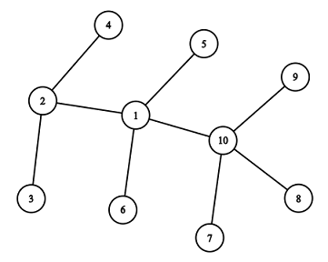
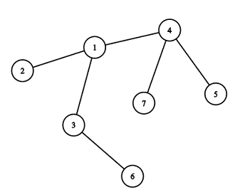

<h1 style='text-align: center;'> F. Removing Leaves</h1>

<h5 style='text-align: center;'>time limit per test: 2 seconds</h5>
<h5 style='text-align: center;'>memory limit per test: 256 megabytes</h5>

You are given a tree (connected graph without cycles) consisting of $n$ vertices. The tree is unrooted — it is just a connected undirected graph without cycles.

In one move, you can choose exactly $k$ leaves (leaf is such a vertex that is connected to only one another vertex) connected to the same vertex and remove them with edges incident to them. I.e. you choose such leaves $u_1, u_2, \dots, u_k$ that there are edges $(u_1, v)$, $(u_2, v)$, $\dots$, $(u_k, v)$ and remove these leaves and these edges.

Your task is to find the maximum number of moves you can perform if you remove leaves optimally.

You have to answer $t$ independent test cases.

### Input

The first line of the input contains one integer $t$ ($1 \le t \le 2 \cdot 10^4$) — the number of test cases. Then $t$ test cases follow.

The first line of the test case contains two integers $n$ and $k$ ($2 \le n \le 2 \cdot 10^5$; $1 \le k < n$) — the number of vertices in the tree and the number of leaves you remove in one move, respectively. The next $n-1$ lines describe edges. The $i$-th edge is represented as two integers $x_i$ and $y_i$ ($1 \le x_i, y_i \le n$), where $x_i$ and $y_i$ are vertices the $i$-th edge connects. It is guaranteed that the given set of edges forms a tree.

It is guaranteed that the sum of $n$ does not exceed $2 \cdot 10^5$ ($\sum n \le 2 \cdot 10^5$).

### Output

For each test case, print the answer — the maximum number of moves you can perform if you remove leaves optimally.

## Example

### Input


```text
4
8 3
1 2
1 5
7 6
6 8
3 1
6 4
6 1
10 3
1 2
1 10
2 3
1 5
1 6
2 4
7 10
10 9
8 10
7 2
3 1
4 5
3 6
7 4
1 2
1 4
5 1
1 2
2 3
4 3
5 3
```
### Output


```text
2
3
3
4
```
## Note

The picture corresponding to the first test case of the example:


There you can remove vertices $2$, $5$ and $3$ during the first move and vertices $1$, $7$ and $4$ during the second move.

The picture corresponding to the second test case of the example:



There you can remove vertices $7$, $8$ and $9$ during the first move, then vertices $5$, $6$ and $10$ during the second move and vertices $1$, $3$ and $4$ during the third move.

The picture corresponding to the third test case of the example:



There you can remove vertices $5$ and $7$ during the first move, then vertices $2$ and $4$ during the second move and vertices $1$ and $6$ during the third move.


#### Tags 

#2300 #NOT OK #data_structures #greedy #implementation #trees 

## Blogs
- [All Contest Problems](../Codeforces_Round_656_(Div._3).md)
- [Announcement](../blogs/Announcement.md)
- [Tutorial](../blogs/Tutorial.md)
