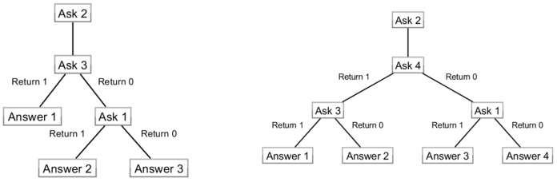

# Tutorial_(en)

### [1386A - Colors](../problems/A._Colors.md "Baltic Olympiad in Informatics 2020, Day 1 (IOI, Unofficial Mirror Contest, Unrated)")

Subtask 1 ($N \leq 64$)

We will use the colors in this order: $1$, $N$, $2$, $N-1$, $3$, $N-2$, $\ldots$; this way we will check each difference $N-1$, $N-2$, $N-3$, $N-4$, $\ldots$ and the answer is the first difference that is not recognized by Archie.

Complexity: $N$ queries.

Subtask 2 ($N \leq 125$)

We can first ask the colors $N/2$ and $1$. If Archie recognizes the difference, then $C \leq N/2$, and as in the Subtask 1, we can ask the queries $N/2-1$, $2$, $N/2-2$, $3$, $N/2-3$, $4$, $\ldots$, until we find the first difference that Archie does not recognize. Otherwise we ask the queries $N$, $2$, $N-1$, $3$, $N-2$, $\ldots$ until we find the first difference that Archie recognizes.

Complexity: $N/2+1$ queries.

Subtask 3 ($N \leq 1000$)

First use $\sqrt N$ values and try to understand $k$ value for which it is true that $C$ is between $k \sqrt N$ and $(k+1) \sqrt N$. For example, if $N = 100$, then use values $5$, $15$, $25$, $\ldots$, $95$ and use the Subtask 1 $N$-query algorithm to find the value of $k$. And then again use the Subtask 1 $N$-query algorithm to calculate the precise $C$ value.

Complexity: $2 \sqrt N$ queries.

Subtask 4 ($N \leq 10^9$)

Let assume that we have a correct strategy for all values of $N$ that do not exceed $k$.

If $k$ is even ($k = 2 j$) we will use the strategy that was used for $j$ numbers and use only even (or odd) numbers. This way each jump in $j$ becomes twice as long and in the result (when the strategy for $j$ has finished) we will know that the answer is $1$ or $2$, $3$ or $4$, $5$ or $6$, and so on. We then know for some $x$ that Archie recognizes the difference $2 x$ and we need to understand whether he recognizes the difference $2 x - 1$. It can be proved that if possible answers are $2x-1$ and $2x$, then the last difference that was checked was either $2x$ or $2x-2$ and in both cases we will be able to make a jump in the opposite direction with length $2x-1$. 

If $k$ is odd ($k = 2 j + 1$) we use the strategy for $j$ colors and use the numbers $2$, $4$, $6$, $8$, $10$, and so on. When the strategy for $j$ is finished, we know that the answer is $1$ or $2$, $3$ or $4$, $5$ or $6$, $\ldots$, $2j-1$ or $2j$ or $2j+1$. And then in almost all cases we can calculate the answer with one additional query, but if the possible answer is one of $2j-1$, $2j$ or $2j+1$ then we need to use two additional queries.

Complexity: $2 \log_2 N$ queries.

For example, for the base cases $N = 3$ and $N = 4$ we can use the following algorithms:

  Then using our construction, we get the following algorithm for $N = 8$:

  Subtask 5 ($N \leq 10^{18}$) Let's assume that we have a correct strategy for all values of $N$ that do not exceed $k$. We will restrict our strategy even more – consecutive jumps need to be made in the opposite directions.

Suppose that $k$ is even ($k = 2 j$) and the first color used in the $j$ strategy is $f$. Then we make the first jump from $f$ to $f+j$ (or from $f+j$ to $f$). With this jump we will understand whether $C$ is bigger than $j$ (if the answer is negative) or smaller or equal than $j$ (if the answer is positive). If the answer is smaller or equal to $j$ then we use strategy for $j$ on numbers from $1$ to $j$ (we already have the color $f$). If the answer is bigger than $j$, then we extend all jumps in the $j$ strategy by $j$ (if we had a jump with length $p$, then now we will make jump with length $p + j$). As we are always jumping back and forth then we will never jump out of range from $1$ to $n$ and will return the answer in the range $j+1$ to $2j$. If $k$ is odd, we can use a similar strategy.

Complexity: $\log_2 N+1$ queries.

In this case, we get the following algorithm for $N = 8$:

   
### [1386B - Mixture](../problems/B._Mixture.md "Baltic Olympiad in Informatics 2020, Day 1 (IOI, Unofficial Mirror Contest, Unrated)")

The crux of solving this problem is to think about it from a geometric perspective and discover a couple of properties, afterwards it's a matter of implementing efficient ways / data structures to process the queries accordingly.

There are a couple of possible approaches, but it seems easiest to translate it to a 2D geometry problem. We first translate all mixtures - the target mixture and the bottles - to 2D points in the following way: given a mixture with proportions $(S, P, G)$ we transform it to a point $(x, y) = (S/(S+P+G), P/(S+P+G))$. Intuitively $x$ and $y$ are the relative amounts of salt and pepper, respectively, in the mixture. Now scaling the proportion values (i.e., multiplying $S$, $P$, $G$ with the same coefficient, which describes an identical mixture) keeps $(x, y)$ constant. Mixing two or more bottles ends up combining these 2D points (or vectors) with positive weights the sum of which is 1.

Having that, we consider these lemmas (proofs are left as an exercise):

Lemma 1. If a bottle point matches the target point, the target mixture can be obtained using only that one bottle.

Lemma 2. If the line segment defined by two different bottle points contains the target point, the target mixture can be obtained using those two bottles.

Lemma 3. If the triangle defined by three different bottle points contains the target point, the target mixture can be obtained using those three bottles.

Lemma 4. If the target point is not contained by any triangle defined by three different bottles, the target mixture cannot be obtained.

Based on these properties we can define the following general algorithm:

1. Maintain the set of points.
2. At each step, check the state to find the answer: 2a. If there is a point matching the target point $\Rightarrow$ 1.

 2b. Otherwise, if there is a pair of points whose line segment contains the target point $\Rightarrow$ 2.

 2c. Otherwise, if there is a triplet of points whose triangle contains the target point $\Rightarrow$ 3.

 2d. Otherwise $\Rightarrow$ 0.

Subtask 1 ($N \leq 50$)

At each step we can simply check each point / pair of points / triplet of points to see if we have case (2a), (2b), or (2c). This takes $O(N)$ / $O(N^2)$ / $O(N^3)$ time for each query, so the total time complexity to process all queries is $O(N^4)$.

Complexity: $O(N^4)$

Subtask 2 ($N \leq 500$)

Full search on all points / pairs of points is still feasible here. We need to speed-up the case (2c): checking the triangles. Here the key observation is that instead of considering all triangles individually we can check whether the target point is inside the convex hull defined all bottle points; namely, if the target point is inside the convex hull there exists at least one triplet of bottle points the triangle of which contains the target point, and if it is outside the hull no such triplet exists. It's possible to build the convex hull and check if the target point is inside it in time $O(N \log N)$, but for this subtask a sub-optimal approach up to $O(N^2)$ is also good enough.

Complexity: $O(N^3)$

Subtask 3 ($N \leq 5000$)

Full search on all single points still feasible. To check triplets we do the same convex hull approach as in the previous subtask, but we have to use the optimal $O(N \log N)$ method this time. For pairs of points we need something better. If we fix a point as one end of the line segment, to have the target point on the segment we know that the other point has to be exactly opposite from the first point relative to the target point (direction-wise, the distance doesn't matter). In other words, after fixing the first point we know exactly at what angle the second point should be (with respect to the target point). So if we have a data structure that we can store points in and test for existence by angle (e.g., using tangent value), we can load all current points in it and then go through each bottle point and quickly check whether an opposite point currently exists. If there is never an opposite point, it means we don't have any line segment containing the target point, and vice versa. It can be done in $O(N \log N)$ for each query.

Complexity: $O(N^2 \log N)$

Subtask 4 ($N \leq 10^5$)

For the previous subtasks we were answering each query completely independently. For the full solution we aim for a $O(\log N)$ time for each query so we need to find a way to maintain the state of points through time so that we can update the state (add / remove bottles) and check the current answer quickly for each query. Let's look at all cases (single point, pair, triplet) separately:

a. For single point checks we can keep the points in a structure that let's us add/remove/find in $O(\log N)$ time. We can also just maintain a counter for matching bottles that we increase/decrease whenever we add/remove a point that matches the target point - then at any step the answer is 1 if the counter is greater than zero.

b. For solving the line segment case we go back to the previous idea. If we have all bottle points stored in an appropriate data structure, we need $O(N \log N)$ time per query to check whether there exist opposite points ($N$ points, $O(\log N)$ check if an opposite point exists), which is too slow. However, we can maintain a counter for the total number of pairs of points that are opposite to each other (with respect to the target point) within the set of all current points, and update it after each query. Then, similarly to the single point case, the answer is 2 if this counter is greater than zero. To achieve this we need to maintain a data structure that stores all angles of points (e.g., tangent value) and checks for (and allows to update) the number of elements with a certain value currently stored. This can be done in $O(\log N)$ time for each operation.

c. For the triplet case we can use the same convex hull idea, but we need a dynamic version that we can update query-to-query (add/remove points) and test whether the target point is inside it. This can be done with an amortized time of $O(\log N)$ per query. However, we don't really need to construct the exact convex hull itself, we just need a way to tell whether the (single fixed) target point is inside of it. If we order all points around the target point by angle, then it's enough to check whether all angles between consecutive points are less than 180 degrees. If that's not the case (i.e., some two consecutive points are more than 180 degrees apart) then the target point is outside the hull (and the answer is 0), otherwise inside (answer 3). We need to maintain the points ordered in such a way by adding/removing points for each query, and be able to check for angles bigger than 180 degrees. There are various ways how to do this technically, and it can be done in $O(\log N)$ time per query.

Complexity: $O(N \log N)$.

Final notes

1. In the end for the final solution all cases can be handled using the same data structure that stores the points/angles, so the solution becomes relatively concise.
2. This problem requires divisions. You can simply use floating point numbers, but there is a risk of making the wrong discrete decisions due to floating point imprecision. The correct way here is to work with rational number, i.e., store and operate with values as numerators and denominators ($p/q$). However, you still have to be careful to not cause overflows. Note that subtasks have varying constraints on the proportion values, which allows more freedom in operations without causing overflows. The full problem has a constraint of $10^6$, and it is possible to implement a solution that only multiplies these values once so we use 2nd order values. (3rd order is also tolerated, but more typical careless approaches that yield 4th or 8th degree values are penalized in later subtasks).
 
### [1386C - Joker](../problems/C._Joker.md "Baltic Olympiad in Informatics 2020, Day 1 (IOI, Unofficial Mirror Contest, Unrated)")

In this task, you are given a graph with NN nodes and MM edges. Furthermore, you are required to answer QQ queries. In every query, all the edges from the interval [li,ri][li,ri] are temporarily removed and you should check whether the graph contains an odd cycle or not.

Thanks for the solutions to the Germany (Subtasks 1-5) and Poland (Subtask 6) BOI teams.

Subtask 1 (N,M,Q≤200N,M,Q≤200) For every query do a DFS from every node and check if an odd cycle is formed.

Complexity: O(QNM)O(QNM).

Subtask 2 (N,M,Q≤2000N,M,Q≤2000)

The graph is bipartite if and only if it contains no odd cycle. Therefore we can color the nodes with two colors (with DFS or BFS) and check if two adjacent nodes share the same color or not.

Complexity: O(QM)O(QM).

Subtask 3 (li=1li=1 for all queries)

We can sort the queries by their right endpoints (riri) and answer them offline. Therefore we insert all the edges in the decreasing order of their indices into a DSU structure.

Complexity: O(QlogQ+Mα(N))O(QlogQ+Mα(N)).

Subtask 4 (li≤200li≤200 for all queries)

We can sort the queries by their left endpoint (lili) and apply our solution from Subtask 3 to all queries with the same lili.

Complexity: O(QlogQ+200Mα(N))O(QlogQ+200Mα(N)).

Subtask 5 (Q≤2000Q≤2000)

We use the "Mo's algorithm" technique. Split the range [1,M][1,M] of edge indices into blocks of size BB and sort the queries by li/Bli/B or by riri if their left endpoint is in the same block. We can now keep two pointers to hold the current range of removed edges. If we answer all queries in the current block, the right pointer moves at most MM steps. The left pointer moves at most QBQB steps in total. Since the left pointer may move to the left and the right inside the current block we need to modify our DSU to allow rollbacks. If we choose B=M/√QB=M/Q−−√ we get the following runtime:

Complexity: O(QlogQ+M√QlogN)O(QlogQ+MQ−−√logN).

Subtask 6 (no further constraints)

For any 1≤l≤M1≤l≤M, let last[l]last[l] be the last index rr such that the answer for the query [l,r][l,r] is positive (or M+1M+1 if no such index exists). That is, the graph exluding the edges [l,r][l,r] is bipartite, but the graph excluding the edges [l,r−1][l,r−1] is not. We can prove that if l1<l2l1<l2, then last[l1]≤last[l2]last[l1]≤last[l2]. We will exploit this fact in order to compute the array lastlast using a divide & conquer algorithm.

We write a recursive function recrec, which takes two intervals: [l1,l2],[r1,r2][l1,l2],[r1,r2] (1≤l1≤l2≤M1≤l1≤l2≤M, 1≤r1≤r2≤M+11≤r1≤r2≤M+1), possibly intersecting, but l1≤r1l1≤r1 and l2≤r2l2≤r2. This function will compute last[l]last[l] for each l∈[l1,l2]l∈[l1,l2], assuming that for these values of ll, we have last[l]∈[r1,r2]last[l]∈[r1,r2]. We will initially call rec([1,M],[1,M+1])rec([1,M],[1,M+1]).

We assume that when rec([l1,l2],[r1,r2])rec([l1,l2],[r1,r2]) is called, then our DSU contains all edges with indices to the left of l1l1 and to the right of r2r2. For instance, when M=9M=9 and rec([2,5],[3,7])rec([2,5],[3,7]) is called, then edges with indices 11, 88, and 99 should be in the DSU. We also assume that the graph in the DSU is bipartite.

We take lmid:=(l1+l2)/2lmid:=(l1+l2)/2 and compute last[lmid]last[lmid]; this can be done by adding all edges [l1,lmid−1][l1,lmid−1] to the DSU, and then trying to add all edges with indices r2,r2−1,r2−2,…r2,r2−1,r2−2,…, until we try to add an edge breaking the bipartiteness. The index rmidrmid of such an edge is exactly last[lmid]last[lmid]. We then rollback all edges added so far in our recursive call.

Now that we know that last[lmid]=rmidlast[lmid]=rmid, we will run two recursive calls: 

* For each l∈[l1,lmid−1]l∈[l1,lmid−1], we know that last[l]∈[r1,rmid]last[l]∈[r1,rmid]. We run rec([l1,lmid−1],[r1,rmid])rec([l1,lmid−1],[r1,rmid]), remembering to add all necessary edges to the right of rmidrmid. After the recursive call, we rollback them.
* For each l∈[lmid+1,l2]l∈[lmid+1,l2], we know that last[l]∈[rmid,r2]last[l]∈[rmid,r2]. We run rec([lmid+1,l2],[max(lmid+1,rmid),r2])rec([lmid+1,l2],[max(lmid+1,rmid),r2]), now adding all necessary edges to the left of lmid+1lmid+1. We rollback them after the recursive call.

We can see that each recursive call uses at most O((l2−l1)+(r2−r1))O((l2−l1)+(r2−r1)) edge additions and rollbacks in DSU, each taking O(logN)O(logN) time pessimistically. Also, on each level of recursion, the total length of all intervals is bounded by 2M2M. Hence, all intervals in all recursive calls have total length bounded by O(MlogM)O(MlogM). Hence, the total time of the preprocessing is O(MlogMlogN)O(MlogMlogN).

With our preprocessing, each query [l,r][l,r] reduces to simply verifying r≤last[l]r≤last[l], which can be done in constant time.

Complexity: O(MlogMlogN+Q)O(MlogMlogN+Q).

