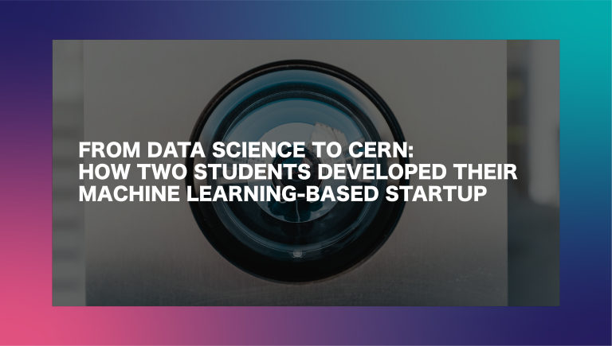

# Announcement

Hello Codeforces!

On [Wednesday, July 29, 2020 at 20:35UTC+6](https://codeforces.com/https://www.timeanddate.com/worldclock/fixedtime.html?day=29&month=7&year=2020&hour=17&min=35&sec=0&p1=166) [Educational Codeforces Round 92 (Rated for Div. 2)](https://codeforces.com/contest/1389 "Educational Codeforces Round 92 (Rated for Div. 2)") will start.

Series of Educational Rounds continue being held as [Harbour.Space University](https://codeforces.com/https://harbour.space/) initiative! You can read the details about the cooperation between [Harbour.Space University](https://codeforces.com/https://harbour.space/) and Codeforces in the [blog post](//codeforces.com/blog/entry/51208).

This round will be **rated for the participants with rating lower than 2100**. It will be held on extended ICPC rules. The penalty for each incorrect submission until the submission with a full solution is 10 minutes. After the end of the contest you will have 12 hours to hack any solution you want. You will have access to copy any solution and test it locally.

You will be given **6 or 7 problems** and **2 hours** to solve them.

The problems were invented and prepared by Roman [Roms](https://codeforces.com/profile/Roms "Master Roms") Glazov, Adilbek [adedalic](https://codeforces.com/profile/adedalic "International Master adedalic") Dalabaev, Vladimir [vovuh](https://codeforces.com/profile/vovuh "Master vovuh") Petrov, Ivan [BledDest](https://codeforces.com/profile/BledDest "International Grandmaster BledDest") Androsov, Maksim [Neon](https://codeforces.com/profile/Neon "Candidate Master Neon") Mescheryakov and me. Also huge thanks to Mike [MikeMirzayanov](https://codeforces.com/profile/MikeMirzayanov "Headquarters, MikeMirzayanov") Mirzayanov for great systems Polygon and Codeforces.

Good luck to all the participants!

Our friends at Harbour.Space also have a message for you:

*Hey Codeforces!* 

*We hope you’ve been doing well these past couples of weeks.*

*This week, we wanted to share a blog post about two of our students. As you might know, Harbour.Space has a unique approach to education — besides classwork and exams, we encourage our students to develop their skills with hands-on projects or even create their startups, so that they’re ready for the workforce when they graduate.* 

*That’s exactly what Jonathan and Khaled, two of our Data Science students, did.*

*After working hard on their Machine Learning-based startup, they were selected by the European Organization for Nuclear Research (CERN) for a 5 Week Student Entrepreneurship Programme, and are now preparing to travel to Geneva in October. We summarized the story of how they went from data scientists to startup founders in this article.* 

*We hope it inspires you to pursue your passions, and work collaboratively to improve the world for those around you.* 

*Good luck on your round, and see you next time!* 

  [Read article→](https://harbour.space/data-science/articles/from-data-science-to-cern-how-two-students-are-building-their-machine-learning-based-startup?utm_source=codeforces&utm_medium=partners)  

| Rank | Competitor | Problems Solved | Penalty |
| --- | --- | --- | --- |
| 1 | [Um_nik](https://codeforces.com/profile/Um_nik "Legendary Grandmaster Um_nik") | 7 | 245 |
| 2 | [tribute_to_Ukraine_2022](https://codeforces.com/profile/tribute_to_Ukraine_2022 "International Grandmaster tribute_to_Ukraine_2022") | 7 | 255 |
| 3 | [244mhq](https://codeforces.com/profile/244mhq "International Grandmaster 244mhq") | 7 | 267 |
| 4 | [Egor](https://codeforces.com/profile/Egor "Legendary Grandmaster Egor") | 7 | 293 |
| 5 | [Farhod](https://codeforces.com/profile/Farhod "International Grandmaster Farhod") | 7 | 364 |

Congratulations to the best hackers: 

| Rank | Competitor | Hack Count |
| --- | --- | --- |
| 1 | [Joney](https://codeforces.com/profile/Joney "Expert Joney") | **20****:-2** |
| 2 | [applese](https://codeforces.com/profile/applese "Grandmaster applese") | **19****:-1** |
| 3 | [FelixArg](https://codeforces.com/profile/FelixArg "Candidate Master FelixArg") | **7****:-2** |
| 4 | [liouzhou_101](https://codeforces.com/profile/liouzhou_101 "Master liouzhou_101") | **10****:-10** |

 116 successful hacks and 492 unsuccessful hacks were made in total!And finally people who were the first to solve each problem: 

| Problem | Competitor | Penalty |
| --- | --- | --- |
| A | [noimi](https://codeforces.com/profile/noimi "Grandmaster noimi") | 0:00 |
| B | [noimi](https://codeforces.com/profile/noimi "Grandmaster noimi") | 0:05 |
| C | [Ari](https://codeforces.com/profile/Ari "Grandmaster Ari") | 0:04 |
| D | [HanaYukii](https://codeforces.com/profile/HanaYukii "International Master HanaYukii") | 0:17 |
| E | [244mhq](https://codeforces.com/profile/244mhq "International Grandmaster 244mhq") | 0:22 |
| F | [nitixkrai](https://codeforces.com/profile/nitixkrai "Master nitixkrai") | 0:23 |
| G | [MyK_00L](https://codeforces.com/profile/MyK_00L "Master MyK_00L") | 1:05 |

**UPD:** [Editorial is out](Tutorial_(en).md)

