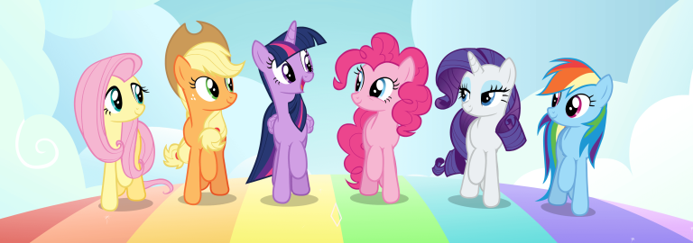

# Announcement

Hello, Codeforces!

[74TrAkToR](https://codeforces.com/profile/74TrAkToR "Master 74TrAkToR") and I are glad to invite you to our [Codeforces Round 662 (Div. 2)](https://codeforces.com/contest/1393 "Codeforces Round 662 (Div. 2)"), which will be held at [Friday, August 7, 2020 at 20:35UTC+6](https://codeforces.com/https://www.timeanddate.com/worldclock/fixedtime.html?day=7&month=8&year=2020&hour=17&min=35&sec=0&p1=166). **The round will be rated for all the participants with rating strictly less than 2100.**

The problems were created and prepared by [AlFlen](https://codeforces.com/profile/AlFlen "Master AlFlen") and [74TrAkToR](https://codeforces.com/profile/74TrAkToR "Master 74TrAkToR"). We would also like to thank everyone who helped us a lot with round preparation.

 * Our coordinator [300iq](https://codeforces.com/profile/300iq "Legendary Grandmaster 300iq") for patience and help with ideas.
* Our dear friend [lapochka_queen](https://codeforces.com/profile/lapochka_queen "Unrated, lapochka_queen") for the idea of one of the tasks.
* Our testers [isaf27](https://codeforces.com/profile/isaf27 "Grandmaster isaf27"), [Astralpirate](https://codeforces.com/profile/Astralpirate "Master Astralpirate"), [sava-cska](https://codeforces.com/profile/sava-cska "Grandmaster sava-cska"), [Siberian](https://codeforces.com/profile/Siberian "Master Siberian"), [voventa](https://codeforces.com/profile/voventa "Expert voventa"), [romanasa](https://codeforces.com/profile/romanasa "International Master romanasa"), [antontrygubO_o](https://codeforces.com/profile/antontrygubO_o "Grandmaster antontrygubO_o"), [DIvanCode](https://codeforces.com/profile/DIvanCode "Master DIvanCode"), [_overrated_](https://codeforces.com/profile/_overrated_ "Master _overrated_"), [Mlxa](https://codeforces.com/profile/Mlxa "International Master Mlxa"), [plagues](https://codeforces.com/profile/plagues "Candidate Master plagues"), [Prokhor08](https://codeforces.com/profile/Prokhor08 "Specialist Prokhor08") for high-quality testing and valuable advices.
* And our team testers: **ainta** ([ksun48](https://codeforces.com/profile/ksun48 "Legendary Grandmaster ksun48"), [300iq](https://codeforces.com/profile/300iq "Legendary Grandmaster 300iq")) и **акацуки** ([p1rattttt](https://codeforces.com/profile/p1rattttt "Master p1rattttt"), [kostyamyasso2002](https://codeforces.com/profile/kostyamyasso2002 "Candidate Master kostyamyasso2002")) for proper testing.
* [MikeMirzayanov](https://codeforces.com/profile/MikeMirzayanov "Headquarters, MikeMirzayanov") for amazing Codeforces and Polygon platforms.

On the round you will be asked to help main ponies from My Little Pony animated series (Fluttershy, Applejack, Twilight Sparkle, Pinkie Pie, Rarity, Rainbow Dash) and to solve **5 problems, one of which has two subtasks**. You will have **2 hours** to solve them.

Score distribution will be announced shortly before the round.

UPD: Score distribution: **500 — 1000 — 1500 — 1750 — (1500 + 1500)**

UPD2: [Editorial](Tutorial.md)

We wish you good luck and high rating!

