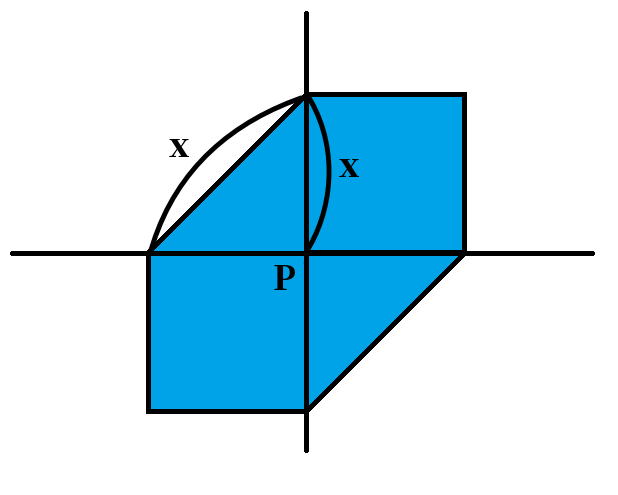
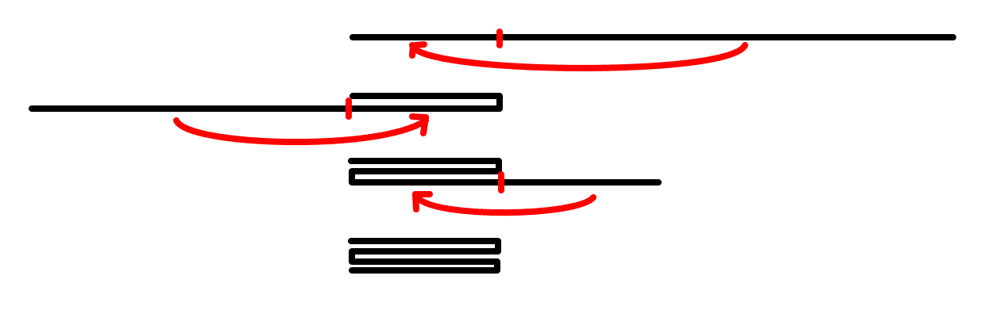
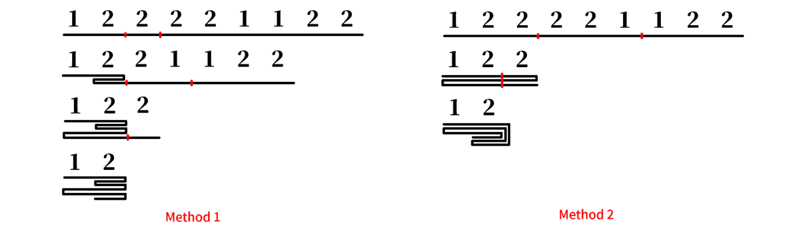
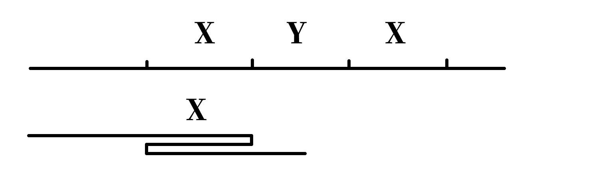
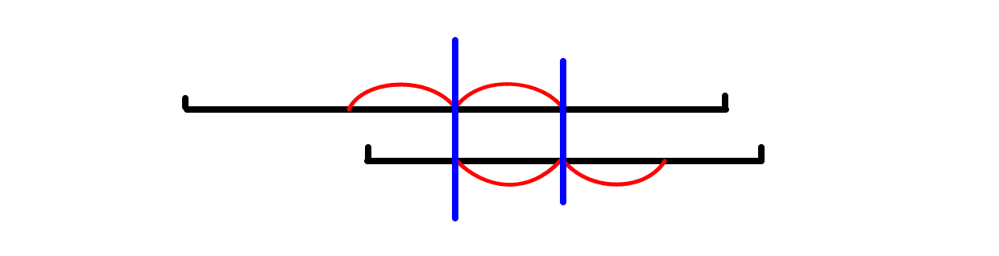
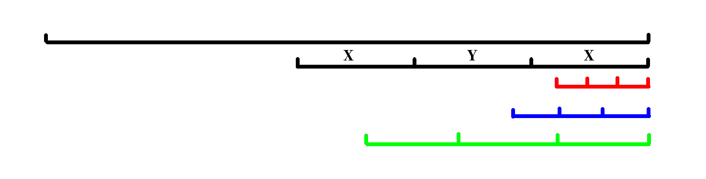
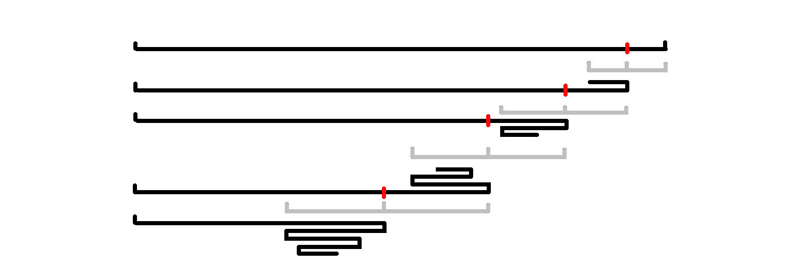
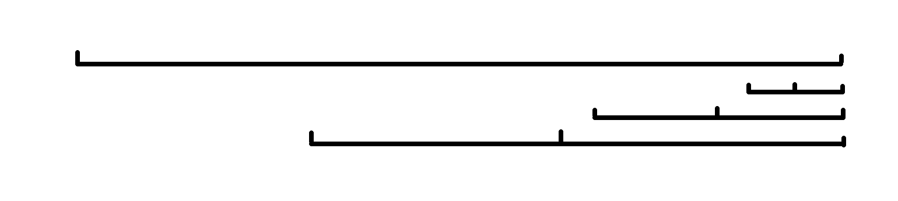

# Tutorial_(en)

Thank you for participating, and I hope you enjoyed the problems!

### [1395A - Boboniu Likes to Color Balls](https://codeforces.com/contest/1395/problem/A "Codeforces Round 664 (Div. 2)")

Idea: [dqa2021](https://codeforces.com/profile/dqa2021 "Master dqa2021")

 **Tutorial**
### [1395A - Boboniu Likes to Color Balls](https://codeforces.com/contest/1395/problem/A "Codeforces Round 664 (Div. 2)")

If there are less than or equal to one odd number in $r$, $b$, $g$, $w$, then you can order them to be a palindrome.

Otherwise, do the operation once (if you can) and check the condition above.

It is meaningless to do operation more than once because we only care about the parity of $r$, $b$, $g$, $w$.

 **Solution**
```cpp
def check(r,g,b,w):
    return False if r%2 + g%2 + b%2 + w%2 > 1 else True

if __name__ == '__main__':
    T = int(input())
    for ttt in range(T):
        r,g,b,w = map(int,input().split())
        if check(r,g,b,w):
            print("Yes")
        elif r>0 and g>0 and b>0 and check(r-1,g-1,b-1,w+1):
            print("Yes")
        else :
            print("No")
```
### [1395B - Boboniu Plays Chess](https://codeforces.com/contest/1395/problem/B "Codeforces Round 664 (Div. 2)")

Idea: [Xiejiadong](https://codeforces.com/profile/Xiejiadong "International Master Xiejiadong")

 **Tutorial**
### [1395B - Boboniu Plays Chess](https://codeforces.com/contest/1395/problem/B "Codeforces Round 664 (Div. 2)")

There are many solutions and I will describe one of them.

Let say $f(i,j) = ( (i+S_x-2)\bmod n+1, (j+S_y-2)\bmod m+1 )$.

Iterate $i$ from $1$ to $n$:

* if $i$ is odd, print $f(i,1),f(i,2),\ldots,f(i,m)$.
* Else print $f(i,m),f(i,m-1),\ldots,f(i,1)$.
 **Solution**
```cpp
#include<bits/stdc++.h>
using namespace std;
#define FOR(i,a,b) for(int i=(a);i<=(b);++i)
#define ROF(i,a,b) for(int i=(a);i>=(b);--i)

int n,m,sx,sy;

void f(int i,int j){
    printf("%d %dn",(i+sx-2)%n+1,(j+sy-2)%m+1);
}
int main(){
    scanf("%d%d%d%d",&n,&m,&sx,&sy);
    FOR(i,1,n){
        if(i&1)FOR(j,1,m)f(i,j);
        else ROF(j,m,1)f(i,j);
    }
    return 0;
}	
```
### [1395C - Boboniu and Bit Operations](https://codeforces.com/contest/1395/problem/C "Codeforces Round 664 (Div. 2)")

Idea: [Retired_xryjr233](https://codeforces.com/profile/Retired_xryjr233 "Master Retired_xryjr233")

 **Tutorial**
### [1395C - Boboniu and Bit Operations](https://codeforces.com/contest/1395/problem/C "Codeforces Round 664 (Div. 2)")

Suppose the answer is $A$. Thus for all $i$ ($1\le i\le n$), $c_i | A = A$.

Since $a_i, b_i <2^9$, we can enumerate all integers from $0$ to $2^9-1$, and check if there exists $j$ for each $i$ that $(a_i \\& b_j) | A = A$. The minimum of them will be the answer.

The time complexity is $O(2^9\cdot n^2)$

 **Solution**
```cpp
#include<bits/stdc++.h>
#define ci const int&
using namespace std;
int n,m,p[210],d[210],ans;
bool Check(ci x){
	for(int i=1;i<=n;++i){
		for(int j=1;j<=m;++j)if(((p[i]&d[j])|x)==x)goto Next;
		return 0;
		Next:;
	}
	return 1;
}
int main(){
	scanf("%d%d",&n,&m);
	for(int i=1;i<=n;++i)scanf("%d",&p[i]);
	for(int i=1;i<=m;++i)scanf("%d",&d[i]);
	ans=(1<<9)-1;
	for(int i=8;i>=0;--i)Check(ans^(1<<i))?ans^=(1<<i):0;
	printf("%d",ans);
	return 0;
}
```
### [1394A - Boboniu Chats with Du](../problems/A._Boboniu_Chats_with_Du.md "Codeforces Round 664 (Div. 1)")

Idea: [sshwyR](https://codeforces.com/profile/sshwyR "International Master sshwyR")

 **Tutorial**
### [1394A - Boboniu Chats with Du](../problems/A._Boboniu_Chats_with_Du.md "Codeforces Round 664 (Div. 1)")

If $a_i>m$, we consider it as a big item with value $a_i$, else a small item with value $a_i$. We are asked to choose some items and maximize the total value. If an item is not chosen, it means we put it on a muzzled day.

Enumerate the number of chosen big item, which is denoted by $x$. Thus they take $(x-1)(d+1)+1$ days. The remaining days are used to place small item on it. Choose items greedily. i. e. We sort items by value from largest to smallest, choose previous $x$ big items and previous $n-(x-1)(d+1)-1$ small items and update the answer.

The total time complexity is $O(n\log n)$.

 **Solution**
```cpp
#include <bits/stdc++.h>
#define rep(i, a, b) for (int i = (a); i <= int(b); i++)
using namespace std;

typedef long long ll;
const int maxn = 1e5;
int n, d, m, k, l;
ll a[maxn + 5], b[maxn + 5];

void solve(ll a[], int n) {
	sort(a + 1, a + n + 1);
	reverse(a + 1, a + n + 1);
	rep(i, 1, n) a[i] += a[i - 1];
}

int main() {
	scanf("%d %d %d", &n, &d, &m);
	for (int i = 0, x; i < n; i++) {
		scanf("%d", &x);
		if (x > m) a[++k] = x;
		else b[++l] = x;
	}
	if (k == 0) {
		ll s = 0;
		rep(i, 1, n) s += b[i];
		printf("%lldn", s);
		exit(0);
	}
	solve(a, k);
	solve(b, l);
	fill(b + l + 1, b + n + 1, b[l]);
	ll res = 0;
	rep(i, (k + d) / (1 + d), k) if (1ll * (i - 1) * (d + 1) + 1 <= n) {
		res = max(res, a[i] + b[n - 1ll * (i - 1) * (d + 1) - 1]);
	}
	printf("%lldn", res);
	return 0;
}	
```
### [1394B - Boboniu Walks on Graph](../problems/B._Boboniu_Walks_on_Graph.md "Codeforces Round 664 (Div. 1)")

Idea: [sshwyR](https://codeforces.com/profile/sshwyR "International Master sshwyR")

 **Tutorial**
### [1394B - Boboniu Walks on Graph](../problems/B._Boboniu_Walks_on_Graph.md "Codeforces Round 664 (Div. 1)")

Let $\deg u$ denote the out degree of $u$. Let $nex_{u,i}$ denote the vertex, which the edge with the $i$-the smallest weight among all edges start from $u$ ends at.

For a fixed tuple $(t_1,t_2,\ldots,t_k)$, if $\{ nex_{i,t_{\deg i}} | 1\le i\le n \}=\{1,2,\ldots,n\}$ (i. e. each vertex appears exactly once), then it is a correct tuple.

Let $S_{i,j}$ denote if $c_i=j$, the set for vertex with out degree $i$, which is $\{ nex_{u,j} | \deg u=i \}$. Thus the condition above can be changed to: $S_{1,t_1} \cup S_{2,t_2} \cup \ldots \cup S_{k,t_k}=\{1,2,\ldots,n\} $.

Let's enumerate all $k!$ situations and use hash to check if it's correct.

The hash function is diverse. For example, for a integer set $T$, we can use $h(T)=\sum_{x\in T}val_x\bmod p$ or $h(T)=\prod_{x\in T}val_x\bmod p$. Just make sure it has [associative property](https://codeforces.com/https://en.wikipedia.org/wiki/Associative_property). Here $val_x$ may be a random number. Let alone using multiple hash.

The total time complexity is $O(n+m+k!)$.

 **Solution**
```cpp
//by Sshwy
#include<bits/stdc++.h>
using namespace std;
#define pb push_back
#define FOR(i,a,b) for(int i=(a);i<=(b);++i)
#define ROF(i,a,b) for(int i=(a);i>=(b);--i)

mt19937 mt_rand(chrono::high_resolution_clock::now().time_since_epoch().count());
const int N=2e5+5,HS=3,K=10;
int n,m,k;
vector< pair<int,int> > g[N];

int mod[HS];

struct hash_number{
    int a[HS];
    hash_number(){ fill(a,a+HS,0); }
    hash_number(long long x){
        FOR(i,0,HS-1)a[i]=(x%mod[i]+mod[i])%mod[i];
    }
    hash_number operator+(hash_number x){
        hash_number res;
        res.a[0]=(a[0]+x.a[0])%mod[0];
        res.a[1]=(a[1]*1ll*x.a[1])%mod[1];
        res.a[2]=(a[2]+x.a[2])%mod[2];
        return res;
    }
    bool operator==(const hash_number& x)const {
        FOR(i,0,HS-1)if(a[i]!=x.a[i])return 0;
        return 1;
    }
}val[N],c[K][K],s;
int ans;
int status[K];
void dfs(int x,hash_number hsh){
    if(x==k){
        if(hsh == s) ++ans;
        return;
    }
    FOR(i,1,x+1){
        status[x+1]=i;
        dfs(x+1,hsh+c[x+1][i]);
    }
}
int main(){
    mod[0]=998244353;
    mod[1]=1e9+7;
    mod[2]=std::uniform_int_distribution<int>(1e8,1e9)(mt_rand);

    fprintf(stderr,"%d %d %dn",mod[0],mod[1],mod[2]);

    scanf("%d%d%d",&n,&m,&k);
    FOR(i,1,m){
        int u,v,w;
        scanf("%d%d%d",&u,&v,&w);
        g[u].pb({w,v});
    }
    std::uniform_int_distribution<long long> rg(1,1e18);
    FOR(i,1,n)val[i]=hash_number(rg(mt_rand));
    FOR(i,1,n)s=s+val[i];
    FOR(u,1,n){
        int d=g[u].size();
        sort(g[u].begin(),g[u].end());
        for(int i=1;i<=g[u].size();++i){
            int v=g[u][i-1].second;
            c[d][i]=c[d][i]+val[v];
        }
    }
    dfs(0,hash_number());
    printf("%dn",ans);
    return 0;
}
```
### [1394C - Boboniu and String](../problems/C._Boboniu_and_String.md "Codeforces Round 664 (Div. 1)")

Idea: [sshwyR](https://codeforces.com/profile/sshwyR "International Master sshwyR")

 **Tutorial**
### [1394C - Boboniu and String](../problems/C._Boboniu_and_String.md "Codeforces Round 664 (Div. 1)")

It's obvious that the operation of BN-string is equivalent to the operation of BN-set, which I'm talking about, for a multi set $s$ contains only B and N:

* Remove a B or an N (if exists) from $s$.
* Insert a B or an N into $s$.
* Remove a B and an N from $s$.
* Insert a B and an N into $s$.

So let's use pair $(x,y)$ to denote a BN-set, which means there are $x$ B and $y$ N in it. We can do an operation to move to $(x,y\pm 1),(x\pm 1,y),(x\pm 1,y\pm 1)$.

The definition of similar of BN-set $(x_1,y_1)$ and $(x_2,y_2)$ is simply $x_1=x_2$ and $y_1=y_2$. 

Now the problem is to find a $(x_t,y_t)$ and minimize $\max_{i=1}^n\text{dist}(s_i,t)$. There are many algorithms to solve it and I'll describe two of them.

We can figure out the distance between $s_1=(x_1,y_1)$ and $s_2=(x_2,y_2)$ is: $$ \text{dist}(s_1,s_2)=\begin{cases} |x_1-x_2|+|y_1-y_2| & (x_1-x_2)(y_1-y_2)<0\\\ \max(|x_1-x_2|,|y_1-y_2|) & (x_1-x_2)(y_1-y_2) \ge 0 \end{cases} $$ It can be shown that the answer is a unimodal function on $xOy$. So by using Hill Climbing Algorithm, we can solve the problem in $O(nT)$, where $T$ denotes the times of iteration.

We also have non randomized algorithm. It can be shown that for a fixed pair $P=(p_x,p_y)$, all the pair with distance $x$ from $P$ forms a hexagon:

  So if we draw a hexagon centered on $(x_t,y_t)$ with radius $\max_{i=1}^n\text{dist}(s_i,t)$, then it must cover all $s_i$.

So we can try to find a hexagon with minimal radius $r$ to cover all $s_i$ and then we can easily calculate $(x_t,y_t)$. Let's use binary search and do some condition tests to calculate $r$. The total time complexity is $O(n\log_2n)$.

 **Solution**
```cpp
//by Sshwy
#include<bits/stdc++.h>
using namespace std;
#define FOR(i,a,b) for(int i=(a);i<=(b);++i)
#define ROF(i,a,b) for(int i=(a);i>=(b);--i)
const int INF=1e9;

int n;

int main(){
    cin>>n;
    int lx=INF,rx=-INF,ly=INF,ry=-INF,lz=INF,rz=-INF;
    FOR(i,1,n){
        string s;
        cin>>s;
        int x=0,y=0;
        for(char c:s){
            if(c=='B')++x;
            else ++y;
        }
        //printf("%d %dn",x,y);
        lx=min(lx,x), rx=max(rx,x);
        ly=min(ly,y), ry=max(ry,y);
        lz=min(lz,x-y), rz=max(rz,x-y);
    }

    int ans=INF,ax=0,ay=0,az=0;
    auto calc = [&](){
        int l=0,r=lz-(lx-ry),mid;
        auto check = [&](int a){
            return lx+a+a>=rx && lx-ry+a+a+a>=rz && ry-a-a<=ly;
        };
        if(check(r)==0)return INF;
        while(l<r)mid=(l+r)>>1, check(mid)?r=mid:l=mid+1;
        return l;
    };
    FOR(_,1,6){
        assert(lx<=rx && ly<=ry && lz<=rz);
        int v=calc();
        if(v<ans){
            ans=v;
            ax=lx+v, ay=ry-v, az=ax-ay;
        }
        int Lx=ly,Rx=ry,Ly=-rz,Ry=-lz,Lz=lx,Rz=rx;
        lx=Lx, rx=Rx, ly=Ly, ry=Ry, lz=Lz, rz=Rz;
        int Ax=ay,Ay=-az,Az=ax;
        ax=Ax,ay=Ay,az=Az;
    }
    cout<<ans<<endl;
    FOR(i,1,ax)cout<<'B';
    FOR(i,1,ay)cout<<'N';
    cout<<endl;
    return 0;
}
```
### [1394D - Boboniu and Jianghu](../problems/D._Boboniu_and_Jianghu.md "Codeforces Round 664 (Div. 1)")

Idea: [Z18](https://codeforces.com/profile/Z18 "Grandmaster Z18")

 **Tutorial**
### [1394D - Boboniu and Jianghu](../problems/D._Boboniu_and_Jianghu.md "Codeforces Round 664 (Div. 1)")

Generally speaking, you're asked to use some simple directed paths (challenges) to cover the original tree and minimize the total cost (tiredness). Those edges with $h_u \neq h_v$ are already oriented, and for the other ones, we need to determine their directions.

At first, let's consider the case where each edge has already been oriented (or, for all edges $(u, v)$, $h_u \neq h_v$ holds).

We use $P(u, v)$ to denote the directed path from $u$ to $v$.

In the beginning, for each edge $u \to v$, let's set up $P(u, v)$ to cover it. Thus the total cost of it is obviously $\sum_{i = 1}^{n} \text{deg}(i) \cdot t_i$, where $\text{deg}_i$ denotes the degree of vertex $i$.

We can choose two challenge $P(x, y)$ and $P(y, z)$ ($y$ should be on $P(x, z)$) and merge them together to get a single challenge $P(x, z)$. This operation will reduce the total tiredness by $t_y$. Thus we try to do such operation to maximize the total reduction.

For vertex $i$, suppose that there are $\text{in}_i$ challenges end at $i$ and $\text{out}_i$ challenges start from $i$. Thus the total reduction is $\sum_{i = 1}^{n} \min(\text{in}_i, \text{out}_i) \cdot t_i$.

Now, let's try to solve the original problem.

For the directed edges, we calculate $\text{in}'_i$ and $\text{out}'_i$ for every vertex $i$, and we can delete them from the tree. For the undirected edges, they form several small trees (a forest).

Let's choose an arbitrary root for each tree and do a DP on it. Let $p_u$ be the father of $u$. For a non-root vertex $u$ and its subtree, $f_u$ denotes the maximum reduction when we orient $p_u \to u$ (down), and $g_u$ denotes the maximum reduction when we orient $u \to p_u$ (up).

Take $f_u$ for example. To calculate it, we should know the in degree and out degree of $u$ (after directing the edges).

Suppose that $u$ has $c$ children. If $x$ of them are oriented end at $u$ (up) and $(s - x)$ of them are oriented start from $u$ (down), the reduction of $u$ is $\min(\text{in}'_u + 1 + x, \text{out}'_u + (s - x)) \cdot t_u$ ($+ 1$ because $p_u \to u$).

Now the question changes to: You are given $c$ vertices $v_1, v_2,\ldots, v_c$, choose $x$ of them forming a set $A$. Maximize $\sum_{v \in A} g_v + \sum_{v \notin A} f_v$. Calculate the maximum value for all $0 \le x \le c$. Actually, you can sort $[v_1, v_2, \cdots, v_c]$ by $(f_v - g_v)$ and calculate the prefix sum $s_i$. The answer for $x = i$ is simply $s_i + \sum_v g_v$.

The calculation for $g_u$ and the root is similar. The total time complexity is $O(n \log n)$.

 **Solution**
```cpp
#include <bits/stdc++.h>
using namespace std;

typedef long long ll;
const int maxn = 2e5;
int n, h[maxn + 3], t[maxn + 3], in[maxn + 3], out[maxn + 3];
vector<int> G[maxn + 3];
bool vis[maxn + 3];
ll ans, f[maxn + 3], g[maxn + 3], a[maxn + 3];

void dfs(int u, int fa = 0) {
	vis[u] = true;
	for (int i = 0, v; i < G[u].size(); i++) {
		if ((v = G[u][i]) == fa) continue;
		dfs(v, u);
	}
	int s = 0;
	ll cur = 0;
	for (int i = 0, v; i < G[u].size(); i++) {
		if ((v = G[u][i]) == fa) continue;
		cur += g[v], a[++s] = f[v] - g[v];
	}
	sort(a + 1, a + s + 1);
	reverse(a + 1, a + s + 1);
	for (int i = 0; i <= s; i++) {
		cur += a[i];
		if (fa) {
			f[u] = max(f[u], 1ll * min(in[u] + 1 + s - i, out[u] + i) * t[u] + cur);
			g[u] = max(g[u], 1ll * min(in[u] + s - i, out[u] + 1 + i) * t[u] + cur);
		} else {
			f[u] = max(f[u], 1ll * min(in[u] + s - i, out[u] + i) * t[u] + cur);
		}
	}
}

int main() {
	scanf("%d", &n);
	for (int i = 1; i <= n; i++) scanf("%d", &t[i]);
	for (int i = 1; i <= n; i++) scanf("%d", &h[i]);
	for (int i = 1, u, v; i < n; i++) {
		scanf("%d %d", &u, &v);
		ans += t[u] + t[v];
		if (h[u] == h[v]) {
			G[u].push_back(v), G[v].push_back(u);
		} else {
			if (h[u] > h[v]) swap(u, v);
			in[u]++, out[v]++;
		}
	}
	for (int i = 1; i <= n; i++) if (!vis[i]) {
		dfs(i), ans -= f[i];
	}
	printf("%lldn", ans);
	return 0;
}
```
### [1394E - Boboniu and Banknote Collection](../problems/E._Boboniu_and_Banknote_Collection.md "Codeforces Round 664 (Div. 1)")

Idea: [sshwyR](https://codeforces.com/profile/sshwyR "International Master sshwyR")

 **Tutorial**
### [1394E - Boboniu and Banknote Collection](../problems/E._Boboniu_and_Banknote_Collection.md "Codeforces Round 664 (Div. 1)")

At first, I'd like to explanation the fold operation in a intuitive way.

Section 1 Fold

To be exact, the origin problem isn't ask us to calculate the number of folds, but the number of folding marks.

Section 1.1 Example 1

For example, you can fold $[1,1,1,1]$ three times, but you have different method to fold it:

Method 1:

  Method 2:

  The first method can be represent by folding sequence (defined in the statement) $[1,-1,1,-1]$. The second method seems to be invalid under the definition of fold (in statement). But really?

In fact, those methods are equivalent. The position of their folding marks are exactly the same, but different in whether it's [valley folds or mountain folds](https://codeforces.com/https://en.wikipedia.org/wiki/Origami#Techniques).

* For the first method, the folding type of each fold mark is: mountain, valley, mountain.
* For the second method, it's: mountain, mountain, valley.

(Try it yourself!)

Although the second method does only two folds, it folds two layers of paper together so it gets two folding marks in one fold.

Section 1.2 Example 2

For $[1,2,2,2,2,1,1,2,2]$, there are different folding methods. I'll display two of them:

  Firstly to be notice, they have same number of folding marks. The first method can be represent by folding sequence $[1,1,-1,1,-1,-1,1,1,1]$.

We can change the result of the second method to the first method:

  Just change the blue part to red part.

Section 1.3 Summary

In fact, the definition of fold in statement always lead to alternate mountain and valley folds. But you can also use different folding method, because any results can be transform into alternate mountain and valley folds. 

key point 1: While folding, we don't care whether it's mountain or valley folds, we just care about the position of folding marks (and the rule in statement).

key point 2: Fix the sequence $a$, for all folding methods of $a$, as long as the results of them don't have any available folds, then the number of folding marks of them must be equal, and their results must be the same (or simply reverse sequence).

Although I'll provide proof for these key points, I want you to first think of it intuitively.

Section 2 X-Y-X Folding Method

If understanding the folding operation intuitively, it'll be quite easy to come up with a naive algorithm runs in polynomial time. Now I'll describe a general folding method.

Note: I will consider sequence as a string (with a large character set). The definition of substring, palindrome is similar for sequence.

Let's consider $[\ldots,a,b,b,b,c,\ldots]$, we can fold three $b$ into one $b$ with a mountain fold and a valley fold.

Similarly, consider three continuous substring $\textit{XYX}$, where $Y$ is the reverse string of $X$:

  We can fold them into one $X$ with a mountain fold and a valley fold, according to the first two key points.

Let's call it X-Y-X substring and the folding method X-Y-X fold.

The questions are:

* How many layers of paper are folded during a X-Y-X fold? Can we find a proper folding method where each fold contains only one layer of paper?
* How to fold a string which doesn't contain X-Y-X substring?

Section 3 Key Points

(For high level competitor) I display all the key points firstly which may lead you to final solution quickly.

Intuitively, we will fold $a$ from left to right. Let's maintain another string $b$. Each time:

* Push $a_i$ to the end of $b$ and check if $b$ contains new X-Y-X substring. If it does, then fold it.
* Calculate the number of folds of $b$. Note that this step won't actually change $b$. After that you get the answer of $[a_1,a_2,\cdots,a_i]$.

key point 3: Using this folding method, each fold contains exactly one layer of paper.

key point 4: After pushing $a_i$ to the end of $b$, $b$ contains at most one X-Y-X substring and it must be a suffix if exists.

lemma: For string $s$ and two even palindromic substring $s[l_1,r_1]$, $s[l_2,r_2]$ of it, if $[l_1,r_1]$ contains center position of $s[l_2,r_2]$ and $[l_2,r_2]$ contains center position of $s[l_1,r_1]$, then $s$ must contain X-Y-X substring.

Use information above, we can figure out a $O(n^3)$ or $O(n^2)$ solution.

key point 5: For a string $b$ which doesn't contain X-Y-X substring, we can only fold its prefix or suffix. And it can be folded at most $O(\sqrt{|b|})$ times.

key point 6: For a string $b$ which doesn't contain X-Y-X substring, after pushing an element to the end of $b$, it has at most $O(\log_2|b|)$ even palindromic suffixes.

Use information above, we can figure out a $O(n\log_2n+n\sqrt{n})$ or $O(n\log_2n)$ solution, which is enough to pass.

Section 3.1 Example

Let's say $a=[1,2,2,2,2,1,1,2,2]$. So the folding method performs like:

1. $b=[1]$. It doesn't have any available folds. The answer is $0$.
2. $b=[1,2]$. It doesn't have any available folds. The answer is $0$.
3. $b=[1,2,2]$. It can be folded once. The answer is $1$.
4. $b=[1,2,2,2]$, has X-Y-X substring $[2,2,2]$, so $b$ is changed to $[1,2]$. Plus X-Y-X counter by $2$. After that, $b$ doesn't have any available folds. The answer is $2$.
5. $b=[1,2]+a_5=[1,2,2]$. It can be folded once. The answer is $3$.
6. $b=[1,2,2]+a_6=[1,2,2,1]$. It can be folded once. The answer is $3$.
7. $b=[1,2,2,1]+a_7=[1,2,2,1,1]$. It can be folded twice. The answer is $4$.
8. $b=[1,2,2,1,1]+a_8=[1,2,2,1,1,2]$, has X-Y-X substring $[1,2,2,1,1,2]$, so $b$ is changed to $[1,2]$. Plus X-Y-X counter by $2$. After that, $b$ doesn't have any available folds. The answer is $4$.
9. $b=[1,2]+a_9=[1,2,2]$. It can be folded once. The answer is $5$.

Each time the answer is the sum of X-Y-X counter and number of folds of $b$.

So the total output will be $[0,0,1,2,3,3,4,4,5]$.

Section 4 Proof and Understanding

Now I'll describe the proof of some key points. If you have already understand them, skip this section and read the algorithm part.

Section 4.1 Lemma

Description: For string $S$ and two even palindromic substring $S[l_1,r_1]$, $S[l_2,r_2]$ of it, if $[l_1,r_1]$ contains center position of $S[l_2,r_r]$ and $[l_2,r_2]$ contains center position of $S[l_1,r_1]$, then $S$ must contain X-Y-X substring.

Lets say $l_1<l_2$ and $|r_1-l_1|\ge |r_2-l_2|$. By construction we can get:

  Blue lines denotes the center position of two substrings and the red part forms a X-Y-X substring.

Q. E. D.

Section 4.2 X-Y-X and Simple X-Y-X

Let define Simple X-Y-X substring (S-X-Y-X) as a X-Y-X string which doesn't contain any X-Y-X substring except itself.

key point 7: S-X-Y-X string contains exactly one even palindromic suffix. i. e. the Y-X part of it.

Proof: Use reduction to absurdity and the lemma.

Section 4.3 Key Point 4

Description: After pushing $a_i$ to the end of $b$, $b$ contains at most one X-Y-X substring and it must be a suffix if exists.

Let $b'=b+a_i$.

  Just like the picture above, if $b'$ contains two or more X-Y-X substring, there are three cases:

* black and red
* black and blue
* black and green

All of the three cases can be negate by the lemma or plain discovery.

Q. E. D.

By the way:

* key point 4 shows us that if $b'$ has a X-Y-X substring, it must be a S-X-Y-X substring.
* key point 7 shows us that that if $b'$ has a X-Y-X substring, it must be produced by its shortest even palindromic suffix.

Section 4.4 Key Point 5

Description: For a string $b$ which doesn't contain X-Y-X substring, we can only fold its prefix or suffix. And it can be folded at most $O(\sqrt{|b|})$ times.

Let's take suffix for example. Each time you can fold an even palindromic suffix if exists. And the length of it must be increasing:

  So that it won't contain X-Y-X substring. Similar for prefix. So the folds will end up being

  Thus you can fold less than $2\sqrt{|b|}$ times.

Q. E. D.

Section 4.5 Key Point 6

Description: For a string $b$ which doesn't contain X-Y-X substring, after pushing an element to the end of $b$, it has at most $O(\log_2|b|)$ even palindromic suffixes.

Because of the lemma, even palindromic suffixes of $b$ cannot both contain center position of each other, so that if we sort them by length, then every even palindromic suffix must be at least twice as long as the previous one:

  Thus $b$ has at most $O(\log_2|b|)$ even palindromic suffixes.

Q. E. D.

Section 5 Algorithm

The algorithm itself is quite simple. Remember that:

Intuitively, we will fold $a$ from left to right. Let's maintain another string $b$. Each time:

* Push $a_i$ to the end of $b$ and check if $b$ contains new X-Y-X substring. If so, then fold it.
* Calculate the number of folds of $b$. Note that this step won't change $b$. After that you get the answer of $[a_1,a_2,\cdots,a_i]$.

Section 5.1 Part 1

Let's maintain $S_i$, the set of even palindromic suffixes of $b$ after the $i$-th time. Since the size of it is $O(\log_2n)$, use any data structure you want.

Calculate $S_i$ from $S_{i-1}$ in $O(\log_2n)$ is trivial.

Then we simply find the shortest even palindromic suffix of $b$ and check if it produce a X-Y-X substring in $O(\log_2n)$.

If it does produce, then we simply fold it, which means remove the shortest even palindromic suffix of $b$.

Don't forget to update X-Y-X counter.

Section 5.2 Part 2

To calculate the number of folds of $b$, which doesn't contain X-Y-X substring:

* Let $p_i$ denote the length of shortest even palindromic suffix of $b[1,i]$ (index starts from $1$).
* Let $q_i$ denote that, if we fold the shortest even palindromic prefix start from $b[1,i]$ and repeat folding until you can't fold, the position of the first character of the result. i. e. $b[1,i]$ is folded to $b[q_i,i]$ finally. Let $c_i$ denote the number of folds during the process.

Calculate $q_i$ from $q_{i-1}$ in $O(\log_2n)$. Don't forget $c_i$.

Get $p_i$ from $S_i$.

$c_i$ denotes the number of prefix folds of $b$.

You can fold suffix of $b$ using $p$ and calculate the number of suffix folds in $O(\sqrt{n})$.

The sum of two above is the number of folds of $b$. Plus it by X-Y-X counter you'll get the answer.

Remove suffix of $b$ is trivial.

The total time complexity is $O(n\log_2n+n\sqrt{n})$.

Section 5.3 Bonus

Can you optimize the time complexity of part 2 to $O(\log_2n)$ and implement the algorithm in $O(n\log_2n)$?

 **Solution**
```cpp
//by Sshwy
#include<bits/stdc++.h>
using namespace std;
#define pb push_back
#define FOR(i,a,b) for(int i=(a);i<=(b);++i)
#define ROF(i,a,b) for(int i=(a);i>=(b);--i)

const int N=1e5+5;
int n,a[N],xyx,q[N],c[N],p[N];
vector<int> v[N];

int pos;

void get_v(int pos){
    v[pos].clear();
    if(pos==1)return;
    if(a[pos]==a[pos-1])v[pos].pb(2);
    for(auto x:v[pos-1])if(a[pos]==a[pos-x-1])v[pos].pb(x+2);
}
bool check_even_pal(int L,int R){
    assert(R<=pos);
    for(auto x:v[R])if(x==R-L+1)return 1;
    return 0;
}

int qry(){
    int res=xyx+c[pos];
    int cur=pos;
    while(p[cur] && q[pos]<=cur-p[cur]/2){
        cur-=p[cur]/2;
        ++res;
    }
    return res;
}

int main(){
    scanf("%d",&n);
    q[0]=1;
    FOR(i,1,n){
        ++pos;
        scanf("%d",&a[pos]);
        get_v(pos);
        int x;
        if(v[pos].size() && (x=v[pos][0], check_even_pal(pos-x/2-x+1,pos-x/2))){
            pos-=x;
            xyx+=2;
        }else {
            p[pos]=v[pos].size()? v[pos][0]:0;
            q[pos]=q[pos-1],c[pos]=c[pos-1];
            if(check_even_pal(q[pos],pos)){
                q[pos]+=(pos-q[pos]+1)/2;
                c[pos]++;
            }
        }
        printf("%d%c",qry()," n"[i==n]);
    }
    return 0;
}
```
