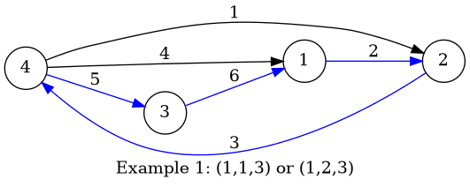
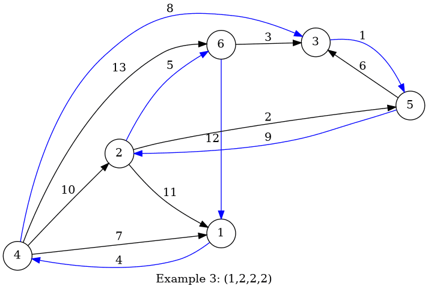

<h1 style='text-align: center;'> B. Boboniu Walks on Graph</h1>

<h5 style='text-align: center;'>time limit per test: 1 second</h5>
<h5 style='text-align: center;'>memory limit per test: 256 megabytes</h5>

Boboniu has a directed graph with $n$ vertices and $m$ edges.

The out-degree of each vertex is at most $k$.

Each edge has an integer weight between $1$ and $m$. No two edges have equal weights.

Boboniu likes to walk on the graph with some specific rules, which is represented by a tuple $(c_1,c_2,\ldots,c_k)$. If he now stands on a vertex $u$ with out-degree $i$, then he will go to the next vertex by the edge with the $c_i$-th $(1\le c_i\le i)$ smallest weight among all edges outgoing from $u$.

Now Boboniu asks you to calculate the number of tuples $(c_1,c_2,\ldots,c_k)$ such that

* $1\le c_i\le i$ for all $i$ ($1\le i\le k$).
* Starting from any vertex $u$, it is possible to go back to $u$ in finite time by walking on the graph under the described rules.
##### Input

The first line contains three integers $n$, $m$ and $k$ ($2\le n\le 2\cdot 10^5$, $2\le m\le \min(2\cdot 10^5,n(n-1) )$, $1\le k\le 9$).

Each of the next $m$ lines contains three integers $u$, $v$ and $w$ $(1\le u,v\le n,u\ne v,1\le w\le m)$, denoting an edge from $u$ to $v$ with weight $w$. It is guaranteed that there are no self-loops or multiple edges and each vertex has at least one edge starting from itself.

It is guaranteed that the out-degree of each vertex is at most $k$ and no two edges have equal weight.

##### Output

Print one integer: the number of tuples.

## Examples

##### Input


```text
4 6 3
4 2 1
1 2 2
2 4 3
4 1 4
4 3 5
3 1 6
```
##### Output


```text
2
```
##### Input


```text
5 5 1
1 4 1
5 1 2
2 5 3
4 3 4
3 2 5
```
##### Output


```text
1
```
##### Input


```text
6 13 4
3 5 1
2 5 2
6 3 3
1 4 4
2 6 5
5 3 6
4 1 7
4 3 8
5 2 9
4 2 10
2 1 11
6 1 12
4 6 13
```
##### Output


```text
1
```
## Note

For the first example, there are two tuples: $(1,1,3)$ and $(1,2,3)$. The blue edges in the picture denote the $c_i$-th smallest edges for each vertex, which Boboniu chooses to go through.

  For the third example, there's only one tuple: $(1,2,2,2)$.

  The out-degree of vertex $u$ means the number of edges outgoing from $u$.


#### Tags 

#2300 #NOT OK #brute_force #dfs_and_similar #graphs #hashing 

## Blogs
- [All Contest Problems](../Codeforces_Round_664_(Div._1).md)
- [Codeforces Round #664 (en)](../blogs/Codeforces_Round_664_(en).md)
- [Tutorial (en)](../blogs/Tutorial_(en).md)
