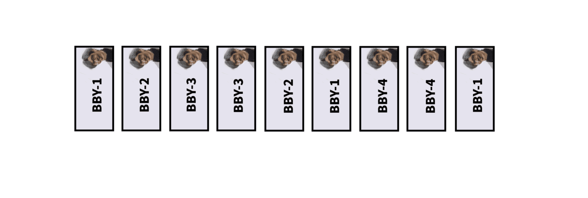

<h1 style='text-align: center;'> E. Boboniu and Banknote Collection</h1>

<h5 style='text-align: center;'>time limit per test: 1 second</h5>
<h5 style='text-align: center;'>memory limit per test: 256 megabytes</h5>

No matter what trouble you're in, don't be afraid, but face it with a smile.

I've made another billion dollars!

 — Boboniu

Boboniu has issued his currencies, named Bobo Yuan. Bobo Yuan (BBY) is a series of currencies. Boboniu gives each of them a positive integer identifier, such as BBY-1, BBY-2, etc.

Boboniu has a BBY collection. His collection looks like a sequence. For example:

  We can use sequence $a=[1,2,3,3,2,1,4,4,1]$ of length $n=9$ to denote it.

Now Boboniu wants to fold his collection. You can imagine that Boboniu stick his collection to a long piece of paper and fold it between currencies:

  Boboniu will only fold the same identifier of currencies together. In other words, if $a_i$ is folded over $a_j$ ($1\le i,j\le n$), then $a_i=a_j$ must hold. Boboniu doesn't care if you follow this rule in the process of folding. But once it is finished, the rule should be obeyed.

A formal definition of fold is described in notes.

According to the picture above, you can fold $a$ two times. In fact, you can fold $a=[1,2,3,3,2,1,4,4,1]$ at most two times. So the maximum number of folds of it is $2$.

As an international fan of Boboniu, you're asked to calculate the maximum number of folds. 

You're given a sequence $a$ of length $n$, for each $i$ ($1\le i\le n$), you need to calculate the maximum number of folds of $[a_1,a_2,\ldots,a_i]$.

###### Input

The first line contains an integer $n$ ($1\le n\le 10^5$).

The second line contains $n$ integers $a_1,a_2,\ldots,a_n$ ($1\le a_i\le n$).

###### Output

Print $n$ integers. The $i$-th of them should be equal to the maximum number of folds of $[a_1,a_2,\ldots,a_i]$.

## Examples

###### Input


```text
9
1 2 3 3 2 1 4 4 1
```
###### Output


```text
0 0 0 1 1 1 1 2 2
```
###### Input


```text
9
1 2 2 2 2 1 1 2 2
```
###### Output


```text
0 0 1 2 3 3 4 4 5
```
###### Input


```text
15
1 2 3 4 5 5 4 3 2 2 3 4 4 3 6
```
###### Output


```text
0 0 0 0 0 1 1 1 1 2 2 2 3 3 0
```
###### Input


```text
50
1 2 4 6 6 4 2 1 3 5 5 3 1 2 4 4 2 1 3 3 1 2 2 1 1 1 2 4 6 6 4 2 1 3 5 5 3 1 2 4 4 2 1 3 3 1 2 2 1 1
```
###### Output


```text
0 0 0 0 1 1 1 1 1 1 2 2 2 2 2 3 3 3 3 4 4 4 5 5 6 7 3 3 3 4 4 4 4 3 3 4 4 4 4 4 5 5 5 5 6 6 6 7 7 8
```
## Note

Formally, for a sequence $a$ of length $n$, let's define the folding sequence as a sequence $b$ of length $n$ such that:

* $b_i$ ($1\le i\le n$) is either $1$ or $-1$.
* Let $p(i)=[b_i=1]+\sum_{j=1}^{i-1}b_j$. For all $1\le i<j\le n$, if $p(i)=p(j)$, then $a_i$ should be equal to $a_j$.

($[A]$ is the value of boolean expression $A$. i. e. $[A]=1$ if $A$ is true, else $[A]=0$).

Now we define the number of folds of $b$ as $f(b)=\sum_{i=1}^{n-1}[b_i\ne b_{i+1}]$.

The maximum number of folds of $a$ is $F(a)=\max\{ f(b)\mid b \text{ is a folding sequence of }a \}$.


#### Tags 

#3500 #NOT OK #strings 

## Blogs
- [All Contest Problems](../Codeforces_Round_664_(Div._1).md)
- [Codeforces Round #664 (en)](../blogs/Codeforces_Round_664_(en).md)
- [Tutorial (en)](../blogs/Tutorial_(en).md)
