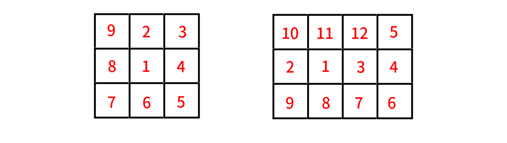

<h1 style='text-align: center;'> B. Boboniu Plays Chess</h1>

<h5 style='text-align: center;'>time limit per test: 1 second</h5>
<h5 style='text-align: center;'>memory limit per test: 512 megabytes</h5>

Boboniu likes playing chess with his employees. As we know, no employee can beat the boss in the chess game, so Boboniu has never lost in any round.

You are a new applicant for his company. Boboniu will test you with the following chess question:

Consider a $n\times m$ grid (rows are numbered from $1$ to $n$, and columns are numbered from $1$ to $m$). You have a chess piece, and it stands at some cell $(S_x,S_y)$ which is not on the border (i.e. $2 \le S_x \le n-1$ and $2 \le S_y \le m-1$).

From the cell $(x,y)$, you can move your chess piece to $(x,y')$ ($1\le y'\le m, y' \neq y$) or $(x',y)$ ($1\le x'\le n, x'\neq x$). In other words, the chess piece moves as a rook. From the cell, you can move to any cell on the same row or column.

Your goal is to visit each cell exactly once. Can you find a solution?

## Note

 that cells on the path between two adjacent cells in your route are not counted as visited, and it is not required to return to the starting point.

#### Input

The only line of the input contains four integers $n$, $m$, $S_x$ and $S_y$ ($3\le n,m\le 100$, $2 \le S_x \le n-1$, $2 \le S_y \le m-1$) — the number of rows, the number of columns, and the initial position of your chess piece, respectively.

#### Output

You should print $n\cdot m$ lines.

The $i$-th line should contain two integers $x_i$ and $y_i$ ($1 \leq x_i \leq n$, $1 \leq y_i \leq m$), denoting the $i$-th cell that you visited. You should print exactly $nm$ pairs $(x_i, y_i)$, they should cover all possible pairs $(x_i, y_i)$, such that $1 \leq x_i \leq n$, $1 \leq y_i \leq m$.

We can show that under these constraints there always exists a solution. If there are multiple answers, print any.

## Examples

#### Input


```text
3 3 2 2
```
#### Output


```text
2 2
1 2
1 3
2 3
3 3
3 2
3 1
2 1
1 1
```
#### Input


```text
3 4 2 2
```
#### Output


```text
2 2
2 1
2 3
2 4
1 4
3 4
3 3
3 2
3 1
1 1
1 2
1 3
```
## Note

Possible routes for two examples:

  

#### Tags 

#1100 #NOT OK #constructive_algorithms 

## Blogs
- [All Contest Problems](../Codeforces_Round_664_(Div._2).md)
- [Codeforces Round #664 (en)](../blogs/Codeforces_Round_664_(en).md)
- [Tutorial (en)](../blogs/Tutorial_(en).md)
