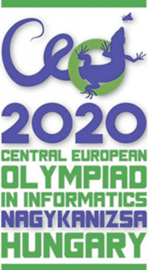

# CEOI_2020_Online_Mirror_(en)

Hi Codeforces!

The [27th Central-European Olympiad in Informatics](https://codeforces.com/http://ceoi2020.inf.elte.hu/) takes place from 23-29 August in Nagykanizsa, Hungary. The mirror contests will be held on [Wednesday, August 26, 2020 at 18:05UTC+6](https://codeforces.com/https://www.timeanddate.com/worldclock/fixedtime.html?day=26&month=8&year=2020&hour=15&min=5&sec=0&p1=166) and [Friday, August 28, 2020 at 18:05UTC+6](https://codeforces.com/https://www.timeanddate.com/worldclock/fixedtime.html?day=28&month=8&year=2020&hour=15&min=5&sec=0&p1=166) (one day after each official contest day) here on Codeforces in the usual IOI format (it is *unrated*, the best scoring submission counts, scoreboard is not visible during the contest and there's full feedback throughout the whole contest).

In this year's CEOI, the 4 best problem solvers going to secondary schools of Austria, Croatia, Czech Republic, Germany, Hungary, Italy, Lithuania, Poland, Romania, Slovakia, Slovenia, Switzerland, and The Netherlands will compete. Due to the current situation, unfortunately not everyone will be able to make it onsite, but we hope the offsite participants will also enjoy the event, although without the magical week in Nagykanizsa.

Each day will feature a 5-hour contest. In both contests, you will be given 3 problems with a maximum of 100 points to score on each. Every task has subtasks of varying difficulties, so we hope everyone from newbie to legendary grandmaster will have fun solving the problems (well, legendary grandmasters might want to refer to the instructions [here](https://codeforces.com/blog/entry/68646)). 

We would like to thank [MikeMirzayanov](https://codeforces.com/profile/MikeMirzayanov "Headquarters, MikeMirzayanov") for creating Codeforces and Polygon platforms and his invaluable help in making this mirror contest possible, and all of the [organizers and sponsors](https://codeforces.com/http://ceoi2020.inf.elte.hu/organizers/).

We wish you will enjoy the contest just as much as we enjoyed preparing it!

CEOI 2020 Scientific Committee

Gyula Horváth, Attila Gáspár, [birka0](https://codeforces.com/profile/birka0 "Candidate Master birka0"), [busamate](https://codeforces.com/profile/busamate "Master busamate"), [csandras](https://codeforces.com/profile/csandras "Expert csandras"), [Emarci15](https://codeforces.com/profile/Emarci15 "Candidate Master Emarci15"), [leanil](https://codeforces.com/profile/leanil "Candidate Master leanil"), [mraron](https://codeforces.com/profile/mraron "International Master mraron"), [lacito](https://codeforces.com/profile/lacito "Master lacito"), [uno20001](https://codeforces.com/profile/uno20001 "Specialist uno20001")

**UPD1:** The tutorial for day 1 is [here](Editorial_(en).md).

**UPD2:** The tutorial for day 2 is [here](https://codeforces.com/blog/entry/82022).

Sorry for the issues with the queue and with the bug interactor of potion causing python solutions to fail. Hope you still enjoyed the problems!

Congratulations to everyone who participated, here are the top 5 combined scores:

 * [WZYYN](https://codeforces.com/profile/WZYYN "Legendary Grandmaster WZYYN") 600pts!
* [jiangly](https://codeforces.com/profile/jiangly "Legendary Grandmaster jiangly") 600pts!
* [mnbvmar](https://codeforces.com/profile/mnbvmar "Legendary Grandmaster mnbvmar") 573pts
* [wucstdio](https://codeforces.com/profile/wucstdio "Grandmaster wucstdio") 573pts
* [142857](https://codeforces.com/profile/142857 "International Grandmaster 142857") 530pts

The rest of the combined scores can be found [here](https://codeforces.com/spectator/ranklist/2b0864398b84ebe60cc17b63979aa427). 

You can also check how would you fare against the official contestants on this [ranklist](https://codeforces.com/https://ranking.cms.inf.elte.hu/rws/Ranking.html).

