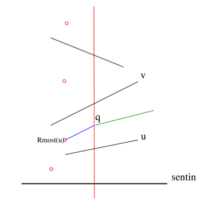

# Editorial_(en)

We hope you liked the problems. See you on day 2 :D

 **Problem A**Problem author: [busamate](https://codeforces.com/profile/busamate "Master busamate") 

### [1402A - Fancy Fence](../problems/A._Fancy_Fence.md "Central-European Olympiad in Informatics, CEOI 2020, Day 1 (IOI, Unofficial Mirror Contest, Unrated)")

Subtask 2

$N, h_i \leq 50, w_i = 1$

 There are at most $50^4$ different rectangles. For all of them, we can check if they are fancy or not. This can be done in constant time with some precomputation.

Subtask 3

$h_i = 1$ or $h_i = 2$ for all $i$.

 Consider a rectangle with height $1$ and width $K$. Lemma: There are $\binom{K+1}{2}$ fancy rectangles in it. Proof: There are $K-p+1$ fancy rectangles with width $p$: $$\sum_{p=1}^{K} (K-p+1) = \binom{K+1}{2}$$

Now we can solve subtask 3: There are 2 types of fancy rectangles, the ones with height $1$, and the ones with height $2$.

We can easily calculate the answer, applying the previous lemma in $O(N)$ time.

A helpful observation

Consider a rectangle with height $A$ and width $B$. Let's denote the number of fancy rectangles contained within this big rectangle by $T_{A,B}$. Now we have $$T_{A,B} = \binom{A+1}{2} \cdot \binom{B+1}{2}$$ Proof: We can chose $\binom{A+1}{2}$ different horizontal lines to form the horizontal side of a fancy rectangle. The same holds for the vertical side.

Note that $\binom{X}{2} = \dfrac{X(X-1)}{2}$, where $X(X-1)$ is always divisible by 2.

Subtask 4

The solution follows easily from the previous lemma.

This subtask can be solved in $O(N)$ time.

Subtask 5

The heights are in increasing order.

 Let $W_i$ be the sum of section widths from the $i$th to the $N$th section. The answer is given by the formula: $$\sum_{i=1}^{N} T_{h_i,W_i} - T_{h_{i-1},W_i},$$ where $h_0 = 0$.

This way, the subtask can be solved in $O(N)$ time.

Subtask 6

$N \leq 1000$

 For all $1 \leq i \leq j \leq N$, we calculate the number of fancy rectangles whose left side is part of the $i$th section and right side is part of the $j$th section. Let $H$ be the minimum of section heights from the $i$th to the $j$th section. Let $W$ be the sum of section widths from the $i$th to the $j$th section. The number of fancy rectangles is (if $i \ne j$): $$T_{H,W} - T_{H,W-w_i} - T_{H,W-w_j} + T_{H,W-w_i-w_j},$$ which can be precomputed for all $H$.

This subtask can be solved in $O(N^2)$.

Subtask 7

Original constraints.

Sorting

Let's sort the sections in decreasing order according to their heights.

Let us denote the original index of the $i$ section by $p_i$. In the $i$th step, we calculate the number of fancy rectangles lying exclusively on the first $i$ sections.

Let $x$ be the smallest index for which the $x$th, $x+1$th ... $p_i-1$th sections preceed the $p_i$th section. Let $y$ be the biggest index for which the $p_i+1$th, $p_i+2$th ... $y$th sections succeed the $p_i$th section. Write $$X_i = \sum_{j=x}^{p_i-1} w_j, \qquad Y_i = \sum_{j=p_i+1}^{y} w_j.$$ In the $i$th step, the answer increases by $T_{h_{p_i}, X_i+Y_i+w_{p_i}}-T_{h_{p_i},X_i}-T_{h_{p_i},Y_i}$. To calculate values $X_i$ and $Y_i$ efficiently, we have to combine consecutive intervals (e.g. using DSU or similar, more simple methods). At the start, there are $N$ intervals, each one consists of exactly one section. In the $i$th step, we shall combine the sections from the $x$th to the $y$th. For all intervals, the sum of widths of sections contained by the interval has to be stored as well.

This subtask can be solved in $O(NlogN)$ time.

Linear

Let's iterate through the sectionss from left to right maintaining a stack of sections with the following property: from bottom to top the height of sections are increasing and after the $i$th section is processed every fancy rectangle not present in the stack is already counted.

When at the $i$th section three cases are possible, let the top of the stack contain a section with dimensions $H\times W$: 

* if $h_i=H$ we can easily modify $W$ and increase it by $w_i$ not hurting the invariant described above
* if $h_i>H$ we can just push a $h_i \times w_i$ rectangle to the top of the stack
* if $h_i<H$ then we have to pop some elements from the stack until $h_i$ will be greater or equal to the height of the section on the top of the stack. While doing the popping we accumulate the width of the new top element (i.e. the sum of widths of all elements popped plus $w_i$) and also with a similar strategy to subtask 5 the number of fancy rectangles that will not be present in the stack should be calculated.

 After processing every section we can use the solution to subtask 5 to count the remaining fancy rectangles or even better just create a $0 \times 0$ dummy section after the ones in the input.Overall the time complexity of this solution is $O(N)$ since every rectangle is pushed and popped exactly once while doing a constant amount of operations.

 **Problem B**Problem author: Gyula Horváth 

### [1402B - Roads](../problems/B._Roads.md "Central-European Olympiad in Informatics, CEOI 2020, Day 1 (IOI, Unofficial Mirror Contest, Unrated)")

We assume that for segment $s=(p,q)$ the relation $p.x<q.x$ or $p.x=q.x$ and $p.y<q.y$ holds, therefore we can say that $p$ is the left endpoint of the segment. Consider the sequence of segment endpoints ordered by their x-coordinates. We apply the sweep-line method, the event points of the sweeping are the x-coordinates of the endpoints. For a given $sx$ coordinate let us denote by $Sl(sx)$ the set of segments intersecting the vertical line whose $x$ coordinate is $sx$. Elements of the set $Sl$ are ordered according to the $y$-coordinate of the intersection points. As the sweep progresses from left to right, if the point is a left endpoint, then it is inserted into $Sl$, and deleted if it is a right endpoint.

 We add a sentinel, as the figure shows. 

Each segment endpoint which is on the left of the sweep-line is already a node of the tree, the partial output.

 For each segment $u \in Sl$ we compute a segment endpoint $Rmost(u)$, with the following property. Let $u \in Sl$ and $v \in Sl$ be segments such that $v$ is directly next to $u$ according to the ordering. Then for every point $q$ on the sweep-line located between the intersection points of $u$ and $v$, if the $\overline{Rmost(u), q}$ intersects any old or newly added segment then the intersection point must be an endpoint.

Therefore if we insert a left endpoint $q$ into $Sl$ then the segment $(Rmost(u), q)$ will be added to the solution. Moreover, during both insertion and deletion we can update $Rmost(u)$ value in $O(log\, N)$ time if we represent the set $Sl$ by STL ordered set. The running time of the whole algorithm is $O(N \log N)$.

Subtask 1

Constraint: All segments are vertical. This subtask can be solved by sorting the segments and connecting consecutive segments' left and right endpoints. The sorting relation is easy to compute: $s_1=(p_1,q_1) < s_2=(p_2, q_2)$ iff $p_1.x<p_2.x$ or $p_1.x=p_2.x$ and $p_1.y< p_2.y$.

Subtask 2

Constraint: Each pair of segments are parallel. This subtask also admits solution by sorting, but the computation of the sorting relation is not so easy. Namely, $s_1=(p_1,q_1) < s_2=(p_2, q_2)$ iff both $p_1$ and $q_1$ located on the left of the line determined by $s_2$ or $s_1$ and $s_2$ are colinear and $q_1$ is inbetween $p_2$ and $q_2$.

Subtask 3

Constraint: Each segment is either horizontal or vertical. This subtask can be solved by a simplified implementation of the model solution algorithm, because it is easy to compute the sorting relation of the set $Sl$.

Subtask 4

Constraint: $N \le 10000$ There is an $O(N^2)$running time algorithm that can solve this subtask. For example if we represent the set $Sl(sx)$ by sorted array.

 **Problem C**Problem author: [busamate](https://codeforces.com/profile/busamate "Master busamate") 

### [1402C - Star Trek](../problems/C._Star_Trek.md "Central-European Olympiad in Informatics, CEOI 2020, Day 1 (IOI, Unofficial Mirror Contest, Unrated)")

Subtask 2

$N = 2$

 The Captain always wins. A possible winning strategy: she uses only tunnels. In this way, Gábor is forced to use only portals. After using a portal they will be in a new universe where the Captain can use the tunnel. So Captain can always move after Gábor, but there is a point where Gábor can't move. That's why Gábor can't win. The answer is the total number of possible placements: $4^D$. it can be computed in $O(logD)$ operations via fast exponentiation.

This subtask can be solved in $O(logD)$

Winning-Losing states

Lets play this game in a rooted tree where the first player moves from the root $r$. Let's call a node L(osing)-state if the player moving from there can't win. Call that node W(inning)-state otherwise. The players can only increase the distance from $r$; that's why every leaf is an L-state. A node is W-state iff it has an L-state child. The root's state can be calculated in $O(N)$ operation with dfs if the size of the tree is $N$.

 $\mathbf{L}$ : set of nodes that are L-states as the root $\mathbf{W}$ : set of nodes that are W-states as the root

Subtask 3

$N \leq 100, D = 1$

 We test all possible placements. A placement will give us a tree of size $2N$ rooted at $P_1^0$. For all possibility we check the root's state. There are $O(N^2)$ different placements and it takes $O(N)$ operation to check a single one.

This subtask can be solved in $O(N^3)$

Critical L-state

It's clear that we have $D+1$ trees of the same structure and they are connected into a bigger tree. This big tree is rooted at $P_1^0$, but all small trees have a root-like node in the big tree ($P_1^0$ in the first universe and $P_{B_{i-1}}^i$ in the $i$th parallel universe). We will work now with the small tree of size $N$.

 Let's root this tree in an arbitrary node $r$. Let's call this tree $tree_r$. Let's denote the parent of node $c$ by $P(c)$. Connecting a new node $y$ with a given state to a node $x$ (of the original tree) may change some states.

 It can be proved that the state of $x$ changes iff $x$ and $y$ are both L-states. In this case, $x$ will become W-state. This may cause further changes in the tree: If $P(x)$ has only one L-state child ($x$), then its state will also change from W to L. If $P(P(x))$ is L-state, then its state will also change from L to W. $P(P(P(x)))$ will act like $P(x)$. This wave of change will stop at some node $z$, where $z$ will be the uppermost node whose state changed. We call $x$ a critical L-state if $z = r$.

 $\mathbf{C_r}$ : set of nodes that are critical L-states when $r$ is the root. $\mathbf{C_r}$ can be computed in $O(N)$ time for a given $r$ using dfs.

Subtask 4

$N \leq 1000$ and $D = 1$

 We should connect 2 uniform trees of size N. The first tree is rooted at index 1 (the starting node). If the root of $tree_1$ is W-state it will only change it's state if we connect a L-state to one of its critical node. That's why; the answer is $N*|W| + (N-|C_1|)*|L|$. If the root of $tree_1$ is L-state it will only change it's state if we connect a L-state to one of its critical node. That's why; the answer is $|C_1|*|L|$.

Calculating $|C_1|$ requires $O(N)$ time while calculating $|L|$ and $|W|$ requires $O(N^2)$.

This subtask can be solved in $O(N^2)$

Subtask 5

$D = 1$

 We must calculate $|L|$ and $|W|$ faster than in subtask 4. Let's say the original tree is rooted in $v$ and we want to reroot this tree in one of its neighbors, $u$. We can see that only $v$'s and $u$'s state may change while doing this. The new states can be computed in constant time if we know the number of L-state children for every node (which can be computed by a single dfs). We can reroot the tree easily in all nodes with one dfs.

This subtask can be solved in $O(N)$

Subtask 6

$N \leq 1000, D \leq 10^5$

 For all possible roots $r$ we calculate $|C_r|$. This takes $O(N^2)$ time. Let us define $L_D$ as the number of ways to 

* choose a starting node, and
* install portals,

 such that the first player will lose, when considering the game with $D$ parallel universes (plus the starting one).By definition, the W/L status of the starting node $v$ will change if and only if we add an edge from a node in $\mathbf{C_v}$ leading to an L state. Therefore, the number of ways to add all $D$ portals in a way that changes the status of the starting node is $$\left|\mathbf{C_v}\right| L_{D-1}.$$

We can now calculate $(L_D)_v$, the number of ways to make $v$ a losing root with respect to the remaining $D$ (plus one) universes: if $v$ is W, then we have to add the remaining portals in a way that changes the status of $v$; if $v$ is L, then we have to add them in any other way. Hence, $$(L_D)_v = \begin{cases} \left|\mathbf{C_v}\right| L_{D-1}& \textit{if } v\in W\\\ N^{2D} - \left|\mathbf{C_v}\right| L_{D-1} & \textit{if }v\in L. \end{cases}$$ Clearly, $$ L_D = \sum_{v} (L_D)_v\\\ = \sum_{v\in W}\left|\mathbf{C_v}\right| L_{D-1} + \sum_{v\in L}(N^{2D} - \left|\mathbf{C_v}\right| L_{D-1})\\\ = \left|\mathbf{L}\right|N^{2D} + \left(\sum_{v\in W}\left|\mathbf{C_v}\right| - \sum_{v\in L}\left|\mathbf{C_v}\right|\right) L_{D-1}\\\ = \left|\mathbf{L}\right|N^{2D} + E \cdot L_{D-1} \textit{where }E\triangleq \left(\sum_{v\in W}\left|\mathbf{C_v}\right| - \sum_{v\in L}\left|\mathbf{C_v}\right|\right). $$

In the last universe, we have $L_0 = |\mathbf{L}|$, by definition.

The answer to the original question is the number of ways to make the starting node $v_1$ into W, which is given by $$\textit{Solution} = N^{2D} - (L_D)_{v_1}.$$

We can calculate this value in $O(D)$ time using dynamic programming.

This subtask can be solved in $O(N^2+D)$

Subtask 7

$D \leq 10^5$

 We must calculate $|C_r|$ for all $r$ faster than in subtask 6. We can use the idea described in subtask 5 (when calculating $|L|$ and $|W|$ fast).

This subtask can be solved in $O(N+D)$

Subtask 8

Original constraints.

Solution 1:

This subtask can be solved like subtask 6 but we calculate $L_1$, $L_2$, $L_4$, $L_8$ ... (i.e. $L_{2^i}$), where we can compute $L_{2^i}$ from $L_{2^{i-1}}$. With the bit-representation of $D-1$ we can calculate $L_{D-1}$ in $O(logD)$ operations.

This subtask can be solved in $O(N+logD)$

Solution 2: Closed Form

To solve the last subtask, we need to calculate $L_{D-1}$ in sub-linear time. To do this, we can solve the recurrence relation, which yields the closed form $$L_{D-1} = |L| \frac{N^{2D} - E^{D}}{N^2 - E}.$$

This could be calculated via $O(\log D)$ exponentiation and modular inverse, but this is not necessary: we can easily eliminate the division by writing $a \triangleq N^2$ and $b \triangleq E$, and using the well-known identity for $(a^D - b^D)$ to get $$L_X = |L| \sum_{k=0}^{X} a^{k} b^{X-k}.$$ This can be calculated in $O(\log D)$ time, by repeatedly halving: $$ L_{2X+1} = (b^{X+1} + a^{X+1}) L_{X}\\\ L_{2X} = b^{X+1} L_{X-1} + |L| a^X b^X + a^{X+1} L_{X-1}. $$

