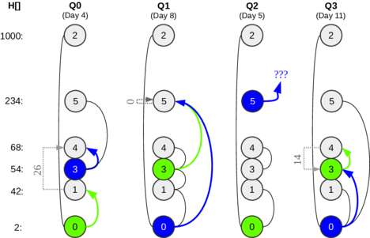
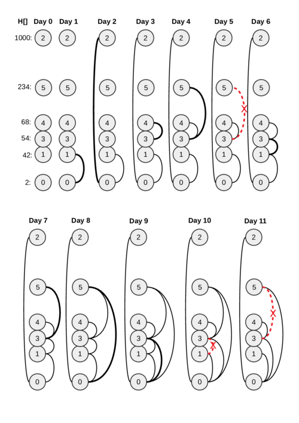

<h1 style='text-align: center;'> A. The Potion of Great Power</h1>

<h5 style='text-align: center;'>time limit per test: 3 seconds</h5>
<h5 style='text-align: center;'>memory limit per test: 256 megabytes</h5>

Once upon a time, in the Land of the Shamans, everyone lived on the Sky-High Beanstalk. Each shaman had a unique identifying number $i$ between $0$ and $N-1$, and an altitude value $H_i$, representing how high he lived above ground level. The distance between two altitudes is the absolute value of their difference.

All shamans lived together in peace, until one of them stole the formula of the world-famous Potion of Great Power. To cover his/her tracks, the Thief has put a Curse on the land: most inhabitants could no longer trust each other...

Despite the very difficult circumstances, the Order of Good Investigators have gained the following information about the Curse: 

* When the Curse first takes effect, everyone stops trusting each other.
* The Curse is unstable: at the end of each day (exactly at midnight), one pair of shamans will start or stop trusting each other.
* Unfortunately, each shaman will only ever trust at most $D$ others at any given time.

 They have also reconstructed a log of who trusted whom: for each night they know which pair of shamans started/stopped trusting each other.They believe the Thief has whispered the formula to an Evil Shaman. To avoid detection, both of them visited the home of one of their (respective) trusted friends. During the visit, the Thief whispered the formula to the Evil Shaman through the window. (
## Note

: this trusted friend did not have to be home at the time. In fact, it's even possible that they visited each other's houses – shamans are weird.)

Fortunately, whispers only travel short distances, so the Order knows the two trusted friends visited (by the Thief and the Evil Shaman) must live very close to each other.

They ask you to help with their investigation. They would like to test their suspicions: what if the Thief was $x$, the Evil Shaman was $y$, and the formula was whispered on day $v$? What is the smallest distance the whispered formula had to travel? That is, what is the minimum distance between the apartments of some shamans $x'$ and $y'$ (i.e. $\min\left(\left|H_{x'} - H_{y'}\right|\right)$), such that $x'$ was a trusted friend of $x$ and $y'$ was a trusted friend of $y$ on day $v$?

They will share all their information with you, then ask you a number of questions. You need to answer each question immediately, before receiving the next one.

## Interaction

The interaction will begin with a line containing $N$, $D$, $U$ and $Q$ $(2 \leq N \leq 100000$, $1 \leq D \leq 500$, $0 \leq U \leq 200000$, $1 \leq Q \leq 50000)$ – the number of shamans, the maximum number of trusted friends a shaman can have at any given point, the number of days, and the number of questions.

On the next line $N$ space separated integers will follow, the $i$th $(1\leq i \leq N)$ of which being $H_{i-1}$ $(0\leq H_{i-1} \leq 10^9)$, the altitude of shaman $i-1$.

On the next $U$ lines there will be two integers each, on the $i$th ($1 \leq i \leq U$) $A_i$ and $B_i$ $(0 \leq A_i, B_i < N$ and $A_i \neq B_i)$, which represents a pair of shamans who started or stopped trusting each other at the end of day $i-1$. That is, if $A_i$ and $B_i$ trusted each other on day $i-1$, they did not trust each other on day $i$, or vice versa. Read all of these integers.

The interactor now will ask you $Q$ question, so the following interaction should happen $Q$ times: 

1. Read $3$ integers describing the current query: $x,y$ and $v$ ($x \neq y$, $0 \leq x,y < N$ and $0 \leq v \leq U$), where $x$ is the suspected Thief, $y$ is the suspected Evil Shaman, and $v$ is the suspected day..
2. Then print the answer to this query on a single line, i.e. you should print the minimum distance the whispered formula had to travel from some trusted friend $x'$ of $x$ to a trusted friend $y'$ of $y$.
	* In case someone trusted both $x$ and $y$ (i.e. $x'=y'$), you should print $0$.
	* If $x$ or $y$ had no trusted friends, print $10^9$.

After printing each line do not forget to output end of line and flush the output. Otherwise, you will get Idleness limit exceeded. To do this, use: 

* fflush(stdout) or cout.flush() in C++;
* System.out.flush() in Java;
* flush(output) in Pascal;
* stdout.flush() in Python;
* see documentation for other languages.
## Scoring

 $ \begin{array}{|c|c|c|} \hline \text{Subtask} & \text{Points} & \text{Constraints} \\\ \hline 1 & 0 & \text{samples}\\\ \hline 2 & 17 & Q,U \leq 1000 \\\ \hline 3 & 14 & v=U \: \text{for all questions} \\\ \hline 4 & 18 & H_i \in \left\{0,1\right\} \: \text{for all shamans} \: i \\\ \hline 5 & 21 & U,N \leq 10000\\\ \hline 6 & 30 & \text{no additional constraints}\\\ \hline \end{array} $ 
## Example

#Input
```text

6 5 11 4
2 42 1000 54 68 234
0 1
2 0
3 4
3 5
3 5
1 3
5 3
0 5
3 0
1 3
3 5
0 3 4
3 0 8
0 5 5
3 0 11
```
#Output
```text


26
0
1000000000
14
```
## Note

## Example

 queries: 

Evolution of friendships: 


#### Tags 

#2400 #NOT OK #*special #2-sat #binary_search #data_structures #graphs #interactive #sortings #two_pointers 

## Blogs
- [All Contest Problems](../Central-European_Olympiad_in_Informatics,_CEOI_2020,_Day_2_(IOI,_Unofficial_Mirror_Contest,_Unrated).md)
- [CEOI 2020 Online Mirror (en)](../blogs/CEOI_2020_Online_Mirror_(en).md)
- [Tutorial (en)](../blogs/Tutorial_(en).md)
