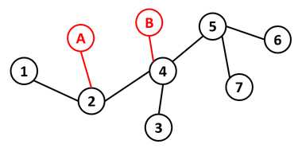

<h1 style='text-align: center;'> B. Spring cleaning</h1>

<h5 style='text-align: center;'>time limit per test: 1 second</h5>
<h5 style='text-align: center;'>memory limit per test: 256 megabytes</h5>

Spring cleanings are probably the most boring parts of our lives, except this year, when Flóra and her mother found a dusty old tree graph under the carpet.

This tree has $N$ nodes (numbered from $1$ to $N$), connected by $N-1$ edges. The edges gathered too much dust, so Flóra's mom decided to clean them. 

Cleaning the edges of an arbitrary tree is done by repeating the following process: She chooses 2 different leaves (a node is a leaf if it is connected to exactly one other node by an edge), and cleans every edge lying on the shortest path between them. If this path has $d$ edges, then the cost of cleaning this path is $d$.

She doesn't want to harm the leaves of the tree, so she chooses every one of them at most once. A tree is cleaned when all of its edges are cleaned. The cost of this is the sum of costs for all cleaned paths.

Flóra thinks the tree they found is too small and simple, so she imagines $Q$ variations of it. In the $i$-th variation, she adds a total of $D_i$ extra leaves to the original tree: for each new leaf, she chooses a node from the original tree, and connects that node with the new leaf by an edge. 
## Note

 that some nodes may stop being leaves during this step.

For all these $Q$ variations, we are interested in the minimum cost that is required to clean the tree.

### Input

The first line contains two space-separated integer, $N$ and $Q$ ($3 \leq N \leq 10^{5}$, $1 \leq Q \leq 10^{5}$) – the number of nodes the tree has and the number of variations.

 Each of the next $N-1$ lines contains two space-separated integers $u$ and $v$ denoting that nodes $u$ and $v$ are connected by an edge ($1 \leq u, v \leq N$).

 The next $Q$ lines describe the variations. The first integer in the $i$th line is $D_i$ ($1 \leq D_i \leq 10^{5}$). Then $D_i$ space-separated integers follow: if the $j$th number is $a_j$, it means that Flóra adds a new leaf to node $a_j$ ($1 \leq a_j \leq N$). We may add more than one leaf to the same node. $\sum_{1}^{Q} D_i \leq 10^{5}$ i.e. the sum of $D_i$ in all varations is at most $10^5$.

After each variation, Flóra restarts and adds extra leaves to the original tree.

### Output

You should print $Q$ lines. In the $i$-th line, print a single integer: the minimum cost required to clean the $i$-th variation of the tree. If the tree cannot be cleaned, print $-1$.

## Scoring

 $ \begin{array}{|c|c|l|} \hline \text{Subtask} & \text{Points} & \text{Constraints} \\\ \hline 1 & 0 & \text{samples}\\\ \hline 2 & 9 & Q = 1, \text{there is an edge between node} \: 1 \: \text{and} \: i \: \text{for every} \: i \: (2 \leq i \leq N), \\\ & & \text{Flóra can't add extra leaf to node} \: 1 \\\ \hline 3 & 9 & Q = 1, \text{there is an edge between node} \: i \: \text{and} \: i+1 \: \text{for all} \: (1 \leq i < N), \\\ & & \text{Flóra can't add extra leaf to node} \: 1 \: \text{nor node} \: N \\\ \hline 4 & 16 & N \leq 20000, Q \leq 300\\\ \hline 5 & 19 & \text{the original tree is a perfect binary tree rooted at node $1$} \\\ & & \text{(i.e. each internal node has exactly $2$ children, and every leaf} \\\ & & \text{has the same distance from the root)}\\\ \hline 6 & 17 & D_i = 1 \: \text{for all} \: i\\\ \hline 7 & 30 & \text{no additional constraints}\\\ \hline \end{array} $
## Example

### Input


```text
7 3
1 2
2 4
4 5
5 6
5 7
3 4
1 4
2 2 4
1 1
```
### Output


```text
-1
10
8
```
## Note

The following picture shows the second variation. A possible solution is to clean the path between leaves $1 - 6$, $A - 7$ and $ B - 3$.



You can download the above example and an additional (bigger) sample input here: <https://gofile.io/d/8QlbsS>


#### Tags 

#2300 #NOT OK #*special #data_structures #dfs_and_similar #graphs #trees 

## Blogs
- [All Contest Problems](../Central-European_Olympiad_in_Informatics,_CEOI_2020,_Day_2_(IOI,_Unofficial_Mirror_Contest,_Unrated).md)
- [CEOI 2020 Online Mirror (en)](../blogs/CEOI_2020_Online_Mirror_(en).md)
- [Tutorial (en)](../blogs/Tutorial_(en).md)
