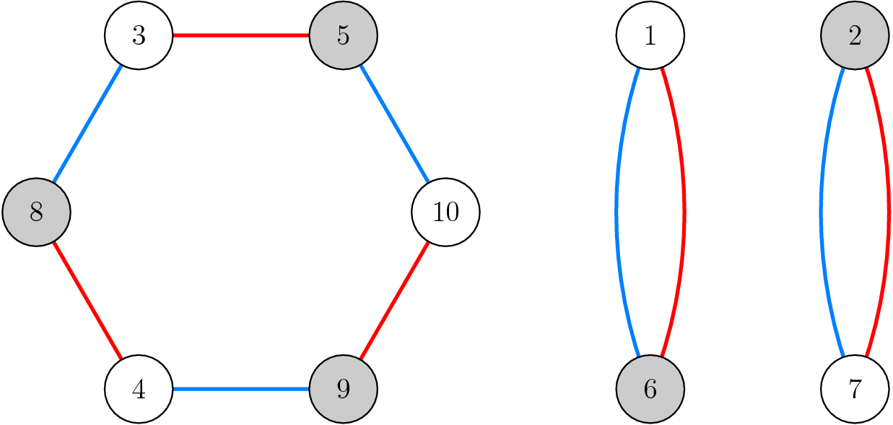
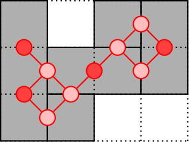

# Tutorial_(en)

I hope everyone enjoyed the contest!

UPD: Added implementations for all problems.

[1405A - Permutation Forgery](https://codeforces.com/contest/1405/problem/A "Codeforces Round 668 (Div. 2)")

Author: [antontrygubO_o](https://codeforces.com/profile/antontrygubO_o "International Grandmaster antontrygubO_o")

 **Tutorial**
### [1405A - Permutation Forgery](https://codeforces.com/contest/1405/problem/A "Codeforces Round 668 (Div. 2)")

Let p′=reverse(p). Then

1. p′ is a permutation, since every value from 1 to n appears exactly once.
2. p′≠p since p′1=pn≠p1. (Here, we use n≥2.)
3. F(p′)=F(p) since any two adjacent values in p remain adjacent in p′.
[Implementation](https://codeforces.com/contest/1405/submission/92082926)

[1405B - Array Cancellation](https://codeforces.com/contest/1405/problem/B "Codeforces Round 668 (Div. 2)")

Author: [hugopm](https://codeforces.com/profile/hugopm "International Grandmaster hugopm")

 **Tutorial**
### [1405B - Array Cancellation](https://codeforces.com/contest/1405/problem/B "Codeforces Round 668 (Div. 2)")

The answer is the maximum suffix sum, which can be computed in O(n).

Formal proof.

Define ci=ai+ai+1+⋯+an (partial suffix sum). Note M=max(c).

We can observe that a1=⋯=an=0 if and only if c1=⋯=cn=0. (If c is null, ai=ci−ci+1=0−0=0.)

A free operation on i<j is equivalent to incrementing ci+1,…,cj. Free operations can only increment elements of c, so we obviously need at least M coins.

Let's do M times the operation (i=n,j=1), which decrement every element M times. 

Now, for every i, ci≤0 and we can make it equal to 0 by performing −ci times the free operation (i−1,i).

[Implementation](https://codeforces.com/contest/1405/submission/92082965)

[1405C - Balanced Bitstring](https://codeforces.com/contest/1405/problem/C "Codeforces Round 668 (Div. 2)")

Author: [Kuroni](https://codeforces.com/profile/Kuroni "International Grandmaster Kuroni")

 **Tutorial**
### [1405C - Balanced Bitstring](https://codeforces.com/contest/1405/problem/C "Codeforces Round 668 (Div. 2)")

Let's denote the balanced bitstring (if any) deriving from s to be t. Also, for the ease of the tutorial, let the strings be 0-indexed (so the first character has index 0 and the last character has index n−1).

First of all, let's prove a very important observation: for every i such that 0≤i<n−k, ti=ti+k. This is because the length k substrings starting at i and i+1 share the k−1 characters ti+1…ti+k−1, so in order for both strings to have the same number of 1 characters, their remaining characters ti and ti+k must both be 1, or both be 0.

 Extending this fact, we can easily prove that ti=tj if i≡j(modk). So first of all, for each 0≤i<k, we need to find out if all sj such that j mod k=i can be converted to the same character (i.e. there can't exist both 0 and 1 among these characters). Furthermore, we can deduce some information for ti: it must be 0 if at least one character among sj is 0, must be 1 if at least one character among sj is 1, or it can be undecided and can be freely assigned to 0 or 1 if all sj are ?.

 An illustration for n=9, k=4. The positions highlighted with the same colors must have the same characters. By using the information from the known characters we can fill some of the unknown positions.  

Lastly, we need to check if we can make the substring t0t1…tk−1 have exactly half of the characters are equal to 1 (we don't need to check for any other substring, because the condition ti=ti+k implies that all the substrings of size k will have the same number of 1 characters). We simply need to check if the number of decided 1 characters and the number of decided 0 characters do not exceed k2. It can easily be shown that if these numbers don't exceed this value then we can assign the undecided characters so that half of the characters are 1, and if one exceeds then it is impossible to do so.

[Implementation](https://codeforces.com/contest/1404/submission/92083038)

[1405D - Tree Tag](https://codeforces.com/contest/1405/problem/D "Codeforces Round 668 (Div. 2)")

Author: [JettyOller](https://codeforces.com/profile/JettyOller "International Grandmaster JettyOller")

 **Tutorial**
### [1405D - Tree Tag](https://codeforces.com/contest/1405/problem/D "Codeforces Round 668 (Div. 2)")

Let's consider several cases independently.

Case 1: dist(a,b)≤da

Unsurprisingly, Alice wins in this case by tagging Bob on the first move.

Case 2: 2da≥tree diameter

Here, the diameter of a tree is defined as the length of the longest simple path.

In this case, Alice can move to a center of the tree. Once Alice is there, it doesn't matter where Bob is, since Alice can reach any vertex in the tree in just one move, winning the game.

Case 3: db>2da

In this case, let's describe a strategy for Bob to win. Because we are not in case 1, Bob will not lose before his first move. Then it is sufficient to show that Bob can always end his turn with distance greater than da from Alice.

Since we are not in case 2, there is at least one vertex with distance at least da from Alice. If Bob is at such a vertex at the start of his turn, he should simply stay there. Otherwise, there is some vertex v with dist(a,v)=da+1. Then dist(b,v)≤dist(b,a)+dist(a,v)≤da+(da+1)=2da+1≤db, so Bob can jump to v on his turn.

Case 4: db≤2da

In this case, Alice's strategy will be to capture Bob whenever possible or move one vertex closer to Bob otherwise. Let's prove that Alice will win in a finite number of moves with this strategy.

Let's root the tree at a. Bob is located in some subtree of a, say with k vertices. Alice moves one vertex deeper, decreasing Bob's subtree size by at least one vertex. Since db≤2da, Bob cannot move to another subtree without being immediately captured, so Bob must stay in this shrinking subtree until he meets his inevitable defeat.

Solution

The only non-trivial part in the implementation is checking for cases 1 and 2. Case 1 is simply checked with DFS. Case 2 only requires computing the diameter of the tree, which is a standard problem.

Complexity is O(n).

[Implementation](https://codeforces.com/contest/1404/submission/92083068)

[1405E - Fixed Point Removal](https://codeforces.com/contest/1405/problem/E "Codeforces Round 668 (Div. 2)")

Author: [hugopm](https://codeforces.com/profile/hugopm "International Grandmaster hugopm")

 **Tutorial**
### [1405E - Fixed Point Removal](https://codeforces.com/contest/1405/problem/E "Codeforces Round 668 (Div. 2)")

Convenient transformation

Replace ai by i−ai. The new operation becomes: remove a zero, and decrement all elements after by one.

For each query, note l=1+x and r=n−y the endpoints of the non-protected subarray.

The main idea of the solution is iterating over r, maintaining answers for each l in a BIT (increment on prefix) and answer queries offline (when we meet a right endpoint). What follows is a detailed explanation of this idea.

Simplified version

Let's suppose that l=1 holds for all queries.

We can intuitively see that ai is removable iff ai≥0 and we can remove at least ai elements before. We're going to rewrite this more formally.

Let f(r) be the maximum number of elements we can remove in the subarray a[1…r]. If ar<0 or ar>f(r−1), then it's obviously impossible to remove ar and in that case, f(r):=f(r−1).

Otherwise, if 0≤ar≤f(r−1), then f(r):=f(r−1)+1. We can reach this with the following strategy: 

* Perform the ar first steps in the prefix [1,r−1]
* Remove ar (which is equal to 0 at that moment)
* Perform the remaining f(r−1)−ar steps in the prefix [1,r−1].

Hence, we can compute successively f(1),f(2),…,f(n) with a single loop: maintain current f(r) in a variable s, and at each iteration increment s if and only if 0≤ar≤s.

Complete version

Note f(l,r) the maximum number of elements we can remove in the subarray a[l…r] (zero if l>r). During our iteration over r, we're going to maintain the answers for each l: s=[f(1,r),f(2,r),…,f(n,r)]

When the iteration continues, discovering a new element ar, what happens? If ar<0, nothing happens. Otherwise, sl is incremented by one if and only if sl≥ar.

Let lmax be the greatest l such that l≤r and slmax≥ar. We should increment the prefix ending here by one:

s1≥…≥slmax≥ar>slmax+1≥…≥sn

A binary indexed tree (aka Fenwick tree) is obviously the structure we need in order to maintain s, since it allows to add on segment and get one element in O(logn) (segment tree could work, but is slower in practice).

In order to find lmax, the easiest solution is to binary search, it takes O(log2n) time which is fast enough to get AC. We can also use binary lifting in order to optimize the search in O(logn). This technique is explained in [this blog](https://codeforces.com/blog/entry/61364).

We have to read all queries in advance (offline algorithm). When the iteration over r meets the right endpoint of a query, we set its answer to the current weight of sl.

In order to get an online algorithm (answer the query before reading the next one), we would have to use a persistent data structure.

Final complexity: O((n+q)logn) with low constant factor.

Under given time limit, log2 solutions with reasonable constant factor could also pass.

[Implementation](https://codeforces.com/contest/1404/submission/92083138)

[1404D - Game of Pairs](../problems/D._Game_of_Pairs.md "Codeforces Round 668 (Div. 1)")

Author: [Ari](https://codeforces.com/profile/Ari "Grandmaster Ari")

 **Tutorial**
### [1404D - Game of Pairs](../problems/D._Game_of_Pairs.md "Codeforces Round 668 (Div. 1)")

We split the problem into two cases:

n is even

We claim that First can guarantee a win by forming the pairs (1,n+1),…,(n,2n). Note that no matter which elements Second chooses, he will always take one element having each remainder modulo n. Thus the total sum is

0+1+2+⋯+n−1≡n(n−1)2(modn)

Say n=2m, then this reduces to m(2m−1)(mod2m). Since 2m−1 is an odd integer this is nonzero, and the sum isn't even divisible by n, let alone 2n.

n is odd

This is the more difficult part of the problem. We claim that now Second is able to win, and present a strategy. We have two important claims:

Claim 1. It is enough for Second to find a choice of elements from each pair such that the sum of the chosen numbers is divisible by n (instead of 2n).

Proof. Notice that the sum of all the numbers is 1+2+⋯+2n=n(2n+1), which is congruent to n(mod2n). If the sum of some numbers, one from each pair, is divisible by n, then it is either 0(mod2n) or n(mod2n). In the first case, we have already won. Otherwise, if we take every other number instead, the sum of those numbers will be 0(mod2n), and we will also win.

Claim 2. It is always possible to take one element from each pair such that each of the remainders modulo n appears exactly once.

Proof. Consider a graph with 2n vertices 1,2,…,2n and regard the pairs chosen by First as red edges in this graph. We will additionally create n edges connecting the vertices i and i+n for each i≤n, and paint them blue. Then every vertex is adjacent to one red edge and one blue edge. In particular, all vertices have degree 2, so the graph splits into disjoint cycles.

 An illustration for the case n=5. The pairs are (1,6), (2,7), (3,5), (4,8) and (9,10). The numbers 1,7,3,4,10 on the white vertices cover all residues modn. 

Since the edges in each cycle alternate between being red and blue, they all have even lengths, so it's possible to color their vertices alternately black and white, and we can construct such a coloring by a simple DFS. Finally, after doing this for all cycles, take the numbers corresponding to all the white vertices. Since no two of them are joined by a red edge, they are all in different pairs, and since no two of them are joined by a blue edge, their residues modulo n are all different, and thus each one appears exactly once.

Finally, by combining the two previous claims the problem is solved, since 0+1+⋯+n−1≡0(modn).

Complexity: O(n).

[Implementation](https://codeforces.com/contest/1404/submission/92083197)

[1404E - Bricks](../problems/E._Bricks.md "Codeforces Round 668 (Div. 1)")

Author: [Monogon](https://codeforces.com/profile/Monogon "International Master Monogon")

 **Tutorial**
### [1404E - Bricks](../problems/E._Bricks.md "Codeforces Round 668 (Div. 1)")

Instead of placing a minimum number of bricks into the cells, let's imagine that we start out with all 1×1 bricks and delete the maximum number of borders. Of course, we need to make sure that when we delete borders, all the regions are in fact bricks.

A region is a brick if and only if it contains no "L" shape. Let's construct a graph where each vertex is a border between two black cells, and we connect two vertices if deleting both would create an "L" shape.

Then the tilings correspond exactly with the independent vertex sets in this graph, and the optimal tiling corresponds to the maximum independent set. The number of bricks is simply the total number of black cells minus the size of our independent set. Here is the graph and independent vertex set corresponding to a tiling:

  In general, computing the maximum independent vertex set of a graph is NP-complete. But in our special case, this graph is bipartite (the bipartition being horizontal borders and vertical borders). And Kőnig's Theorem states that for bipartite graphs, the size of the maximum matching is equal to the size of the minimum vertex cover. Recall that the complement of a minimum vertex cover is a maximum independent set.

The maximum matching can be computed using maximum flow. In particular, Dinic's algorithm runs in O(√VE) time. For our graph, V and E are both O(nm). Overall complexity is therefore O(nm√nm).

[Implementation](https://codeforces.com/contest/1404/submission/92083253)

