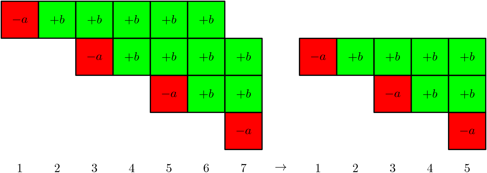
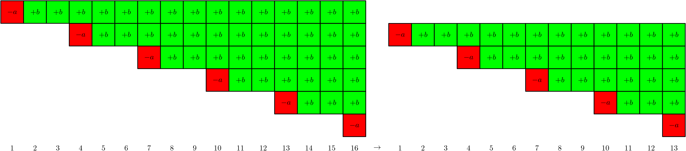
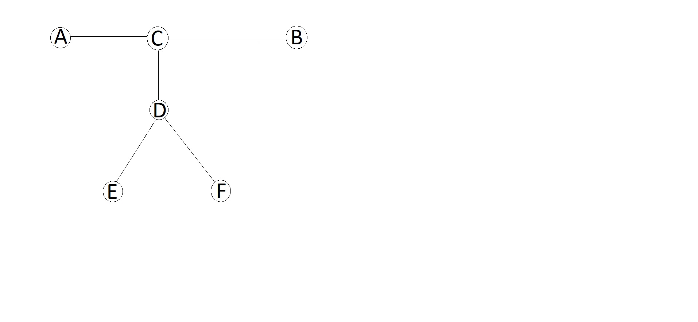

# Tutorial

Sorry for the issues with a couple of problems

 **Problem A of tc/div2 (Finding Sasuke)**
### [1413A - Finding Sasuke](../problems/A._Finding_Sasuke.md "Technocup 2021 - Elimination Round 1")

The following is always a valid answer: $-a_2$, $a_1$, $-a_4$, $a_3$, ..., $-a_n$, $a_{n-1}$.

 **Problem B of tc/div2 (A New Technique)**
### [1413B - A New Technique](../problems/B._A_New_Technique.md "Technocup 2021 - Elimination Round 1")

To solve this problem it's sufficient to find the position of each row in the table. If we consider the first number of each row and find a column containing it, we will automatically obtain the position of the row. Since all numbers are distinct, the positions will be determined uniquely.

 **Problem C of tc/C div2/A div1 (Perform Easily)**
### [1413C - Perform Easily](../problems/C._Perform_Easily.md "Technocup 2021 - Elimination Round 1")

Consider all possible frets we may need to use. To do this we sort all the pairs $(b_j - a_i, j)$ lexicographically. Now we need to find a subsegment with the minimal range containing the first fields and also so that all numbers from $1$ to $n$ occur among the second fields (so it will mean that for each note there is at least one string-fret combination).

For each $l$, denote the minimal $right(l)$ so that $[l, right(l)]$ is a valid subsegment. It's easy to see that $right(l) \leq right(l + 1)$, because if $[l + 1, right(l + 1)]$ contains all numbers from $1$ to $n$ among the second fields, then so does $[l, right(l + 1)]$. So to find all $right(l)$ one can just use two pointers, maintaining the set of notes that occur on the segment.

Once we calculated it, we just print the minimal difference between the first fields of the endpoints of all possible segments $[l, right(l)]$. The final complexity is $O(nm\log(nm))$.

 **Problem D of tc/D div2/B div1 (Shurikens)**
### [1413D - Shurikens](../problems/D._Shurikens.md "Technocup 2021 - Elimination Round 1")

Let's note that if a shuriken of price $x$ is being bought right now, then the only information we obtain about all the remaining shurikens is that they are of prices $\geq x$. It's also clear that if we consider two shurikens on the showcase then the one which was placed earlier has the stronger constraints (as written above).

Now consider all events that can happen when the shuriken of price $x$ is bought. If for all shurikens that are currently on the showcase we know that they must have prices $> x$, then the answer is negative. Otherwise, for all shurikens that had a lower bound of something less than $x$ we increase it to $x$, and remove any one of them, because we cannot remove any other shuriken, and these are indistinguishable. However, since we know that the last placed shuriken has the weakest constraint, we can just remove the last placed shuriken each time and check the consistency in the end. This verification can be done using any min-heap. The final time complexity is $O(n \cdot \log{n})$.

 **Problem E of tc/E div2/C div1 (Solo mid Oracle)**
### [1413E - Solo mid Oracle](../problems/E._Solo_mid_Oracle.md "Technocup 2021 - Elimination Round 1")

It will be easier to explain using illustrations. We will use timelines, where each cast spell instance will occupy a separate row; and each second will be represented as a column.

First of all, if $a > b\cdot c$ then the answer is $-1$. Indeed, after time $t$ the total amount of damage dealt is $(a - bc)$ for each spell which has expired completely plus some damage from spells which have not expired. The first summand can be as great as we want it to, and the second one is bounded by, say, $-bc^2$ as there are at most $c$ spells which have not yet expired, and each of them healed the enemy by at most $b$ units each second, for at most $c$ seconds. Therefore, the damage may be arbitrarily huge.

On the other hand, if $a\leq bc$, then the answer always exists, and here is why. First of all, let's only look at the moments divisible by $d$ — that is, the moments when damage was dealt. It is obvious that for every other moment $t$ the enemy had less (or the same amount of) health at time $t-1$. Second, if $t\geq c$, then the enemy had no more health than now at the moment $t-d$. Indeed, the difference between damages then and now is exactly one full-lasted spell, which is non-negative, as we know. For clarity take a look at the pictures below:

  So now we know that we may consider only $t < c$, and it follows in particular that the answer exists. Also, when in general should we subtract $d$ from $t$ to obtain a more damaged enemy? One can see that if $t < c$ then the damage we subtract is $a - tb$, and since $t = dk$ for some integer nonnegative $k$, then we subtract $a - bdk$ damage. It makes sense to do this while $a - bdk < 0$:

  In other words, we have reduced the task to the following: find the greatest $k$ so that $a \geq bdk$, and cast the spell $(k+1)$ time. The enemy will have the least amount of health just after we cast the spell for the $(k+1)$-st time. The answer is thus $a(k+1) - \dfrac{k(k+1)}{2}bd$. The time complexity of this solution is $O(1)$ per test.

One could also find out that the enemy's health is convex over time and use ternary search to find the minimum. It requires $O(\log{maxanswer})$ per test, which is still ok.

 **Problem F of tc/D div1 (Roads and Ramen)**
### [1413F - Roads and Ramen](../problems/F._Roads_and_Ramen.md "Technocup 2021 - Elimination Round 1")

Fix any diameter of the tree. One of the optimal paths always starts at one of the diameter's endpoints.

Proof:

Let $AB$ be a diameter of the tree, and the optimal answer be $EF$. Then the parity of the number of stone roads on $DE$ is the same as on $DF$, and also the same holds for $CE$ and $CF$. Since a diameter has the greatest length among all paths in the tree, the stone roads parity is different on $AC$ and on $BC$ (otherwise, the diameter would be an answer). Hence, the stone roads parity on $CE$ coincides with one of $AC$ and $BC$. Assume without loss of generality that the stone roads parities of $AC$ and $CE$ are the same. Then the path $AE$ contains an even number of stone roads. Note that since $AB$ is a diameter, $AC$ is no shorter than $CF$, hence $AD$ is no shorter than $DF$, which implies that $AE$ is not shorter than $EF$. This means that there is an optimal path starting at one of the diameter's endpoints.

Now remaining is to solve the problem if one of the endpoints is fixed. If we root the tree from it, and write down for each vertex the stone roads parity between it and the root, then each query is basically changing the parity of a subtree. In an euler-tour traversal every such subtree is represented by a contiguous subsegment. Now the original problem can be reformulated in a following way: we have a binary array, there are queries of type "flip a subsegment", and after each query we need to find a zero with the greatest depth parameter. This can be done via a segment tree, where in each node we store the deepest zero and the deepest one on the subsegment corresponding to that node. The final time complexity is $O(n\log{n})$.

 **Problem E of div1 (A Convex Game)**
### [1434E - A Convex Game](https://codeforces.com/contest/1434/problem/E "Codeforces Round 679 (Div. 1, based on Technocup 2021 Elimination Round 1)")

It's sufficient to calculate the Grundy value for each game instance. Consider a single game. Let $maxc$ be the maximal value in the sequence $v$. We are going to prove that the Grundy value does not exceed $\sqrt{2 \cdot maxc} + 1$. 

Proof: Assume the contrary; that is, that the Grundy value equals $ d > \sqrt{2 \cdot maxc} + 1$. Then, by definition, there is a sequence $v_{i_0}$, $v_{i_1}$, ..., $v_{i_{d - 1}}$ which is a valid sequence of moves. Indeed, initially there is a move into a position in game with the value $d - 1$, then there is a move from it to the position with value $d - 2$, and so on. It's easy to see that $v_{i_{j + 1}} - v_{i_j} \geq j + 1$ for all $j\leq d - 2$. Then $v_{i_{d - 1}} - v_{i_0} \geq \frac {d (d - 1)} {2} \geq \frac {(d - 1) (d - 1)} {2} \geq maxc$, which leads to a contradiction.

It is clear from the statement that the outcome of the game is defined by the index of the last move and the last difference between the elements. It follows from the Grundy theory that if we fix the last index and gradually decrease the last difference, the grundy value will not decrease. It'd be great to calculate the value of $dp[i][d]$ standing for the maximal possible last difference so that the Grundy value equals $d$, for each index $i$ and each possible Grundy value $d$. This, in its turn, can be done by calculating $maxv[d][i]$ being the maximal $v_j$ so that after the move from $v_i$ to $v_j$ the Grundy value will equal $d$. If we know it, then, standing at some index $j$ and knowing the range of last differences so that the Grundy value equals $d$ for all $d$ (we can obtain it from the values of $dp[i]$), we need to remax the values of $maxv[d]$ on some subsegment. Hence, we can already implement a segment tree solution working for $O(n \cdot maxc + \sum m_i \cdot \sqrt{2 \cdot maxc} \cdot log(m_i))$. However, it's too long.

Now recall that the initial array is increasing in each game. This means that during the calculation of $dp$ and $maxv$ from left to right, we only need to remax something a single time (the first time). This operation can be done via DSU, if we compress subsegments of all already calculated values and one not yet calculated into a single component. Then the final time complexity will be $O(n \cdot maxc + \sum m_i \cdot \sqrt{2 \cdot maxc} \cdot \alpha(m_i))$.

