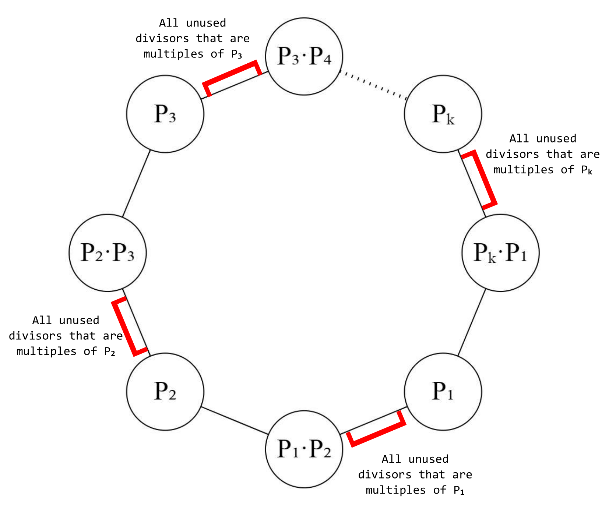

# Tutorial

All problems were prepared on Polygon by me, so if you faced any problems (we know about A) I am really sorry about it.

 
### [1419A - Digit Game](../problems/A._Digit_Game.md "Codeforces Round 671 (Div. 2)")

Let's say that digits on odd positions are blue and digits on even positions are red. If n is even the remaining digit will be red. If there is at least one even red digit then Breach wins (he can mark all digits except the one that will remain in the end). In other case Raze wins, because any digit that may remain is odd.

If n is odd the remaining digit will be blue. If there is at least one odd blue digit then Raze wins (using the same strategy applied to her). In other case Breach wins.

Idea: [shishyando](https://codeforces.com/profile/shishyando "Expert shishyando")

Jury solution: [pastebin](https://codeforces.com/https://pastebin.com/bGgZTAFw)

 
### [1419B - Stairs](../problems/B._Stairs.md "Codeforces Round 671 (Div. 2)")

Let's prove, that the minimal amount of squares needed to cover the staircase is not less than n, where n is the height of a staircase. To highest cell of each stair is the top left cell of some square. That's why we need at least n squares. You need exactly n squares if and only if the top left cell of each stair is a top left cell of some sqaure.

Let's consider a square that covers the lowest cell in the last stair. Its top left corner should contain the highest cell with index n+12 for odd n. Then the staircase is divided into 2 staircases, each n−12 stairs high. These staircases should be nice, too. It means that nice staircases are 2k−1 stairs high, where k≥1. To maximize the amount of different staircases we should create staircases greedily. 

If n is even, then we can consider a square that will have the lowest cell of the last stair. The top left corner of this square may not contain any top cells of a staircase, that's why you will need more than n squares. This means that a staircase with an even height may not be nice.

Idea: [Artyom123](https://codeforces.com/profile/Artyom123 "Master Artyom123")

Jury solution: [pastebin](https://codeforces.com/https://pastebin.com/Sd3hNAPd)

 
### [1419C - Killjoy](../problems/C._Killjoy.md "Codeforces Round 671 (Div. 2)")

If all n accounts have the rating equal to x then the answer is 0. Now let's consider other cases. Let's try to make all ratings equal to x in a single contest. It's possible only in two cases:

1. If at least one account is already infected we can infect all other accounts in a single contest. Let's say that some account i is already infected, then we can change all other accounts to x except i. Let's say that summary changes are d, then we can decrease i-th account's rating by d and every account will be infected while the summary changes will be equal to zero. So this will take only 1 contest.

2. n∑i=1 (ai−x)=0. In this case we can just make all ratings equal x and the sum of all changes will be 0 because of the equality, which means that we can infect everyone in only 1 contest.

In all other cases the answer is 2. Let's prove that. We can make the ratings of first (n−1) accounts equal to x after the first contest and the last account will have rating equal to an − n−1∑i=1 (ai−x) so that the sum of rating changes is still equal to zero. After that first (n−1) accounts are already infected and we can change the rating of the last account by d so it's equal to x and we will decrease the rating of the first account by d so that the sum of rating changes is still equal to zero. After such two contests all accounts will be infected.

Idea: [shishyando](https://codeforces.com/profile/shishyando "Expert shishyando")

Jury solution: [pastebin](https://codeforces.com/https://pastebin.com/u7ybmiPR)

 
### [1419D2 - Sage's Birthday (hard version)](../problems/D2._Sage's_Birthday_(hard_version).md "Codeforces Round 671 (Div. 2)")

Let's learn how to check whether it's possible to buy x ice spheres. Let's sort the array a in the non-decreasing order and then take x smallest elements of it. We will suppose that these x ice spheres will be cheap. To make these ice spheres cheap, we need x+1 ice spheres more, so let's take x+1 most expensive ice spheres. Why it's always good to take x+1 most expensive ice spheres? If we had an ice sphere with the price y and we took an ice sphere with price z≥y the answer will not become worse. Now we know how to check whether it's possible to buy x ice spheres. If we can buy x ice spheres then it's also possible to buy x−1 ice spheres. For that reason the binary search for the answer is working.

Idea: [Artyom123](https://codeforces.com/profile/Artyom123 "Master Artyom123")

Jury solution: [pastebin](https://codeforces.com/https://pastebin.com/8zJPxg21)

 
### [1419E - Decryption](../problems/E._Decryption.md "Codeforces Round 671 (Div. 2)")

Let's factorize n: n=pq11⋅pq22⋅⋯⋅pqkk

* If k=2 and q1=q2=1 (i.e. n is the product of two different prime numbers)Divisors p1 and p2 will definately be adjacent and they are coprime so we should make one operation to insert their lcm between them. After that the circle will be

 p1, p1⋅p2=n, p2, p1⋅p2=n and there will be no such two adjacent numbers that are coprime. The answer is 1.
* If k=2 and q1>1 or q2>1, then we can firstly place numbers p1,p1⋅p2,p2,n. After that we can insert all unused divisors that are multiples of p1 between p1 and n, all divisors that are multiples of p2 between p2 and n. It is easy to see that in this case the answer is 0.
* In another case it is possible to arrange the divisors so that there are no such two adjacent numbers that are coprime. Firstly, we need to arrange in a circle these numbers: p1, p2, p3, ..., pk After that we need to write down the products of these numbers between them:

 p1, p1⋅p2, p2, p2⋅p3, ..., pk, pk⋅p1 From now on we can just place unused numbers that way: insert all unused divisors, that are multiples of p1, after p1, insert all unused divisors, that are multiples of p2, after p2 and so on. If the solution is still unclear you may take a look at the image below. The answer in this case is 0.

 
Idea: [shishyando](https://codeforces.com/profile/shishyando "Expert shishyando")

Jury solution: [pastebin](https://codeforces.com/https://pastebin.com/C7sPc6BN)

 
### [1419F - Rain of Fire](../problems/F._Rain_of_Fire.md "Codeforces Round 671 (Div. 2)")

We can consider a graph where vertices are the points (detachments), and there is an edge between two points, if it's possible to move from one point to another. It is possible if these points are on the same line (xi=xj or yi=yj) and the distance between them is ≤T.

Now we can check, whether current t value is good (whether it is possible to check all detachments). It is easy to see, that it is only possible, when the graph is connected. This means, that we can make a binary search for t. Let's now learn how to check, whether it is possible to add at most one point to make the graph connected.

If there is 1 component, then the graph is already connected.

If there are 2 components, then we can search through all such pairs of points, that one point is from the first component, and another point is from the second component. We can connect these points, if they are on one line, and the distance between them is ≤2T or the differences |x1−x2|≤T and y1−y2≤T.

If 3 are three components, then we should consider triples of points. Two of these points should be on the same line. The added point should be on a segment between these two points, and there are O(n) such segments. Now let's search through all such pairs (segment, point) and check whether it is possible to place a point on the segment and connect it with the point from the pair.

If there are 4 components, then you can search trough pairs (segment, segment), so that one segment is horizontal and another one is vertical (they should make a cross). Now we just need to check whether it is possible to connect their intersection point with all 4 endpoints of the segments.

If there are more, than 4 components, then it is not possible to connect them adding only one point, because there are 4 movement directions. If your binary search did not find the answer even for T=2⋅109, then the answer is −1, because the maximal distance between any two points is ≤2⋅109.

Idea: [isaf27](https://codeforces.com/profile/isaf27 "International Grandmaster isaf27") + [Kotehok3](https://codeforces.com/profile/Kotehok3 "Master Kotehok3")

Jury solution: [pastebin](https://codeforces.com/https://pastebin.com/9tPzKi8q)

