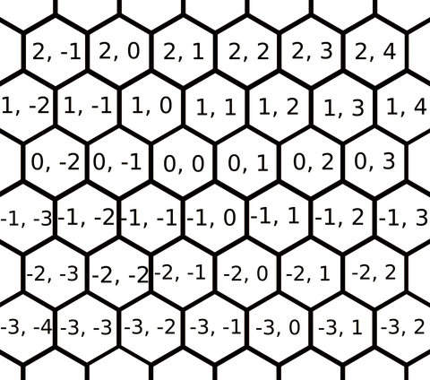
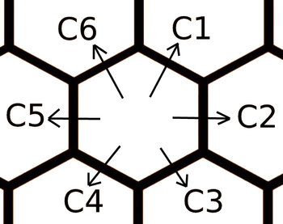
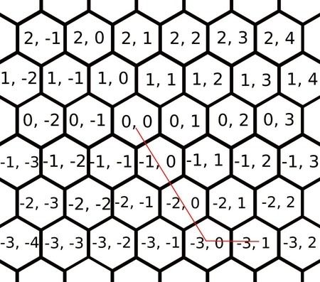

<h1 style='text-align: center;'> D. Hexagons</h1>

<h5 style='text-align: center;'>time limit per test: 2 seconds</h5>
<h5 style='text-align: center;'>memory limit per test: 256 megabytes</h5>

Lindsey Buckingham told Stevie Nicks ["Go your own way"](https://www.youtube.com/watch?v=6ul-cZyuYq4). Nicks is now sad and wants to go away as quickly as possible, but she lives in a 2D hexagonal world.

Consider a hexagonal tiling of the plane as on the picture below.

  Nicks wishes to go from the cell marked $(0, 0)$ to a certain cell given by the coordinates. She may go from a hexagon to any of its six neighbors you want, but there is a cost associated with each of them. The costs depend only on the direction in which you travel. Going from $(0, 0)$ to $(1, 1)$ will take the exact same cost as going from $(-2, -1)$ to $(-1, 0)$. The costs are given in the input in the order $c_1$, $c_2$, $c_3$, $c_4$, $c_5$, $c_6$ as in the picture below.

  Print the smallest cost of a path from the origin which has coordinates $(0, 0)$ to the given cell.

### Input

Each test contains multiple test cases. The first line contains the number of test cases $t$ ($1 \le t \le 10^{4}$). Description of the test cases follows.

The first line of each test case contains two integers $x$ and $y$ ($-10^{9} \le x, y \le 10^{9}$) representing the coordinates of the target hexagon.

The second line of each test case contains six integers $c_1$, $c_2$, $c_3$, $c_4$, $c_5$, $c_6$ ($1 \le c_1, c_2, c_3, c_4, c_5, c_6 \le 10^{9}$) representing the six costs of the making one step in a particular direction (refer to the picture above to see which edge is for each value).

### Output

For each testcase output the smallest cost of a path from the origin to the given cell.

## Example

### Input


```text
2
-3 1
1 3 5 7 9 11
1000000000 1000000000
1000000000 1000000000 1000000000 1000000000 1000000000 1000000000
```
### Output


```text
18
1000000000000000000
```
## Note

The picture below shows the solution for the first sample. The cost $18$ is reached by taking $c_3$ 3 times and $c_2$ once, amounting to $5+5+5+3=18$.

  

#### Tags 

#1900 #NOT OK #brute_force #constructive_algorithms #greedy #implementation #math #shortest_paths 

## Blogs
- [All Contest Problems](../Codeforces_Round_676_(Div._2).md)
- [Announcement (en)](../blogs/Announcement_(en).md)
- [Tutorial (en)](../blogs/Tutorial_(en).md)
