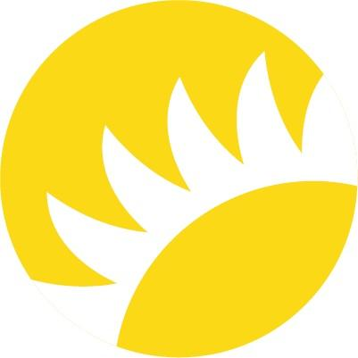

# Announcement

Tryam, Codeforces!

Perhaps you are waiting for us to announce the final of BSUIR championship, but for now we are only glad to invite you to [Codeforces Round 675 (Div. 2)](https://codeforces.com/contest/1422 "Codeforces Round 675 (Div. 2)"), which will be held on [Sunday, October 4, 2020 at 22:05UTC+6](https://codeforces.com/https://www.timeanddate.com/worldclock/fixedtime.html?day=4&month=10&year=2020&hour=19&min=5&sec=0&p1=166). **This round will be rated for the participants with rating lower than 2100.**

The problems were prepared for you by [andrew](https://codeforces.com/profile/andrew "Grandmaster andrew"), [hloya_ygrt](https://codeforces.com/profile/hloya_ygrt "Grandmaster hloya_ygrt"), [AleXman111](https://codeforces.com/profile/AleXman111 "Candidate Master AleXman111") and [Vladik](https://codeforces.com/profile/Vladik "Master Vladik") together with me. We think that we have prepared good problems for [contest:297213]. After that we selected the best ones for this round.

The company [Andersen](https://codeforces.com/https://contest.andersenlab.com/) has been holding a competition for the second year already, which is primarily intended to support students of regional universities in Belarus and Ukraine (starting this year).

First of all, we would like to thank [MikeMirzayanov](https://codeforces.com/profile/MikeMirzayanov "Headquarters, MikeMirzayanov") and everyone involved in the development of Codeforces and Polygon platforms. No less thanks to [KAN](https://codeforces.com/profile/KAN "Legendary Grandmaster KAN") for coordination — thanks to him you will be able to understand our problems. And also to all our coaches and parents who taught us to do everything that we can do.

The score distribution promises to be like this: **500 — 750 — 1000 — 1500 — 2000 — 2750**.

Good luck and clean code to everyone!

**UPD**

Congratulations to the winners of the official standings:  
1. [Yukikaze_](https://codeforces.com/profile/Yukikaze_ "Expert Yukikaze_")  
2. [lunabbit](https://codeforces.com/profile/lunabbit "Candidate Master lunabbit")  
3. [kamer](https://codeforces.com/profile/kamer "Candidate Master kamer")  
4. [Potassium_Fan](https://codeforces.com/profile/Potassium_Fan "Pupil Potassium_Fan")  
5. [2018LZY](https://codeforces.com/profile/2018LZY "Candidate Master 2018LZY")

And overall winners:  
1. [awoo](https://codeforces.com/profile/awoo "Grandmaster awoo")  
2. [dlalswp25](https://codeforces.com/profile/dlalswp25 "International Grandmaster dlalswp25")  
3. [tfg](https://codeforces.com/profile/tfg "International Grandmaster tfg")  
4. [Sugar_fan](https://codeforces.com/profile/Sugar_fan "International Grandmaster Sugar_fan")  
5. [hank55663](https://codeforces.com/profile/hank55663 "International Grandmaster hank55663")

The editorial will come later.

**UPD**

**The [editorial](Tutorial.md) came.**

