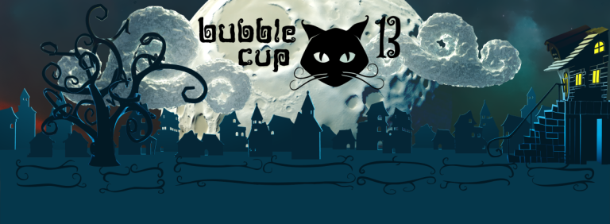

# Announcement_(en)

Hello, Codeforces!

Hope you're all safe and well.

[Microsoft Development Center Serbia](https://codeforces.com/https://www.microsoft.com/sr-latn-rs/mdcs) is thrilled to announce the finals of the **13th edition of Bubble Cup competition**! Bubble Cup is an international, **ACM-style team contest** aimed at university and high school students.

Contest will take place on [Sunday, 4th of October at 11AM CEST](https://codeforces.com/https://www.timeanddate.com/worldclock/fixedtime.html?msg=Bubble+Cup+13+Finals&iso=20201004T11&p1=35&ah=3), virtually. Live results will be available on the official Bubble Cup website (results will be frozen during the last 45 minutes of the competition). Winners will be announced at the closing ceremony. You can find more info on the [BubbleCup website](https://codeforces.com/https://www.bubblecup.org/).

Just like the previous editions, this final will be followed by an online mirror competition on Codeforces. Mirror will take place on [Monday, 5th of October at 15:05 CEST](https://codeforces.com/https://www.timeanddate.com/worldclock/fixedtime.html?day=5&month=10&year=2020&hour=16&min=5&sec=0&p1=166). Contest will last for 3 hours and ACM ICPC rules will be applied. It will be a competition for teams of 1-3 members. There will be at least eight problems.

Just like last year, the finals are divided in two "divisions", called Premier League and Rising Stars. The two contests will have most of their problems in common, but the Rising Stars competition will feature some easier tasks targeted at high school contestants.

Both of the contests will be mirrored here on Codeforces, with Premier League mapping to the Div1 contest and Rising Stars mapping to the Div2 contest. The mirror will use native Codeforces ACM-ICPC team contest rules.

We kindly ask participants of the virtual finals to hold off discussing problems publicly until the mirror is over.

Contest was mainly prepared by employees of MDCS with help from our alumni member Lazar Milenković ([milenkoviclazar](https://codeforces.com/profile/milenkoviclazar "Candidate Master milenkoviclazar")). We give our thanks to Nikolay Kalinin ([KAN](https://codeforces.com/profile/KAN "Legendary Grandmaster KAN")) for the round coordination, Mike Mirzayanov ([MikeMirzayanov](https://codeforces.com/profile/MikeMirzayanov "Headquarters, MikeMirzayanov")) and the team behind Codeforces and Polygon platforms. Special thanks goes to Alexandr Lyashko ([knightL](https://codeforces.com/profile/knightL "Grandmaster knightL")) for helping out with problem testing.

The contest will be unrated. The reason for this is because rules of this contest are not common for Codeforces.

Editorial will be available in the [booklets section on the Bubble Cup website](https://codeforces.com/https://www.bubblecup.org/Archive) sometime after the online mirror ends.

You can find problems from previous finals on our Codeforces online mirror competitions:

[Bubble Cup 8 — Finals [Online Mirror]](https://codeforces.com/contest/575)

[Bubble Cup 9 — Finals [Online Mirror]](https://codeforces.com/contest/717)

[Bubble Cup X — Finals [Online Mirror]](https://codeforces.com/contest/852)

[Bubble Cup 11 — Finals [Online Mirror, Div. 1]](https://codeforces.com/contest/1045)

[Bubble Cup 11 — Finals [Online Mirror, Div. 2]](https://codeforces.com/contest/1046)

[Bubble Cup 12 — Finals [Online Mirror, Div. 1]](https://codeforces.com/contest/1218)

[Bubble Cup 12 — Finals [Online Mirror, Div. 2]](https://codeforces.com/contest/1219)

We wish you best of luck in competition!

**Update #1:** Given the current situation we want everyone to be safe and enjoy the Bubble Cup finals from their home and that's why team members will be allowed to work on different machines.

**Update #2:** Congratulations to the winners!

Div1:

 1. Omatase-Trinity: [hos.lyric](https://codeforces.com/profile/hos.lyric "International Grandmaster hos.lyric"), [maroonrk](https://codeforces.com/profile/maroonrk "Legendary Grandmaster maroonrk"), [yosupo](https://codeforces.com/profile/yosupo "Legendary Grandmaster yosupo")
2. Almost Retired Dandelion: [Merkurev](https://codeforces.com/profile/Merkurev "Legendary Grandmaster Merkurev"), [Um_nik](https://codeforces.com/profile/Um_nik "Legendary Grandmaster Um_nik")
3. times187: [Cyanic](https://codeforces.com/profile/Cyanic "International Grandmaster Cyanic"), [ix35](https://codeforces.com/profile/ix35 "Grandmaster ix35"), [s_r_f](https://codeforces.com/profile/s_r_f "Grandmaster s_r_f")
4. [tourist](https://codeforces.com/profile/tourist "Legendary Grandmaster tourist")
5. Itst两小时阿克离场: [newbiegcz](https://codeforces.com/profile/newbiegcz "Grandmaster newbiegcz"), [Itst](https://codeforces.com/profile/Itst "Legendary Grandmaster Itst"), [pupiI](https://codeforces.com/profile/pupiI "Master pupiI")

Div2:

 1. 2-sad walk: [Dart-Xeyter](https://codeforces.com/profile/Dart-Xeyter "Master Dart-Xeyter"), [tem_shett](https://codeforces.com/profile/tem_shett "Master tem_shett"), [sevlll777](https://codeforces.com/profile/sevlll777 "International Master sevlll777")
2. TeamSeven: [liit_mixer](https://codeforces.com/profile/liit_mixer "Expert liit_mixer"), [sachin208](https://codeforces.com/profile/sachin208 "Expert sachin208"), [jnarutoj](https://codeforces.com/profile/jnarutoj "Candidate Master jnarutoj")
3. Fast but not Furious: [amirmohammad-nezami](https://codeforces.com/profile/amirmohammad-nezami "Expert amirmohammad-nezami"), [armin.atarod](https://codeforces.com/profile/armin.atarod "Expert armin.atarod"), [ymmparsa](https://codeforces.com/profile/ymmparsa "Master ymmparsa")
4. （￣ー￣）: [noneTP](https://codeforces.com/profile/noneTP "Unrated, noneTP")
5. heh: [Eyed](https://codeforces.com/profile/Eyed "Expert Eyed"), [penguinhacker](https://codeforces.com/profile/penguinhacker "Master penguinhacker"), [el_heffeh](https://codeforces.com/profile/el_heffeh "Expert el_heffeh")

Preliminarily version of the editorial can be found [here](https://codeforces.com/https://bubblecup.org/Content/Media/FinalsEditorial2020.pdf). Full version of the booklet will be published at a later time.

