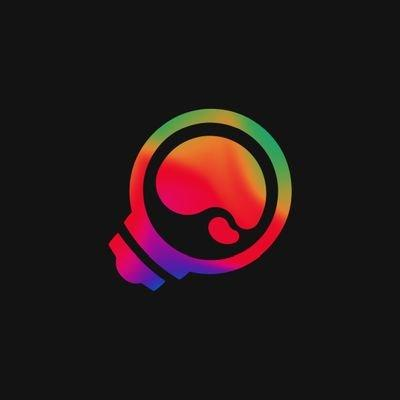

# Announcement_(en)

Hello Codeforces Community. I would like to invite you all for [ICPC Indonesia COMPFEST 12 Multi-Provincial Contest Online Mirror](https://codeforces.com/contests/1425). I am the Person In Charge of the event. 

I want to thank: 

 * Faculty of Computer Science, The University of Indonesia, for providing guidance and support for the official event.
* Our committee: [hocky](https://codeforces.com/profile/hocky "Master hocky"), [JulianFernando](https://codeforces.com/profile/JulianFernando "Master JulianFernando"), [faustaadp](https://codeforces.com/profile/faustaadp "International Master faustaadp"), [dewa251202](https://codeforces.com/profile/dewa251202 "Expert dewa251202"), [Defy_AK12](https://codeforces.com/profile/Defy_AK12 "Newbie Defy_AK12"), [faishol27](https://codeforces.com/profile/faishol27 "Specialist faishol27").
* Our testers: [AMnu](https://codeforces.com/profile/AMnu "Expert AMnu"), [stevenwjy](https://codeforces.com/profile/stevenwjy "Master stevenwjy"), [Yehezkiel](https://codeforces.com/profile/Yehezkiel "Master Yehezkiel")
* [MikeMirzayanov](https://codeforces.com/profile/MikeMirzayanov "Headquarters, MikeMirzayanov"): for giving us the opportunity to host this online mirror. Also, for Codeforces and Polygon platform.

The online mirror will be held on [Sunday, September 27, 2020 at 11:00UTC+6](https://codeforces.com/https://www.timeanddate.com/worldclock/fixedtime.html?day=27&month=9&year=2020&hour=8&min=0&sec=0&p1=166), 3 hours after the official contest starts. Teams are allowed. The duration of the contest is 5 hours. For the official contestants, please refrain from joining this mirror contest.

Our problems are relatively easier than ICPC regional contests. However, we promise an interesting and diverse problem set. I'd say the overall difficulty is slightly more challenging than div two rounds. There might be an interactive problem. So make sure to [familiarize yourself](https://codeforces.com/blog/entry/45307)

About COMPFEST: COMPFEST is an annual event hosted by the University of Indonesia. It is the largest student-run IT event in Indonesia, and Competitive Programming Contest (CPC COMPFEST) is one of the competitions hosted. 

[Our contest on regional finder](https://codeforces.com/https://icpc.global/regionals/finder/Indonesia-COMPFEST-Multi-Provincial-2020) 

Note: this contest is unrated.

UPD1: Editorial and contest review will be posted in a few hours, after we finish the official contest duty.

UPD2: Editorial is available [here](Tutorial_(en).md)

Congratulations to the winners!

 1. Extra Registration ([LJC00118](https://codeforces.com/profile/LJC00118 "Grandmaster LJC00118"), [xay5421](https://codeforces.com/profile/xay5421 "Grandmaster xay5421"), [Sulfox](https://codeforces.com/profile/Sulfox "International Grandmaster Sulfox"))
2. [jiangly](https://codeforces.com/profile/jiangly "Legendary Grandmaster jiangly")
3. Bajetii ([theodor.moroianu](https://codeforces.com/profile/theodor.moroianu "Master theodor.moroianu"), [freak93](https://codeforces.com/profile/freak93 "International Grandmaster freak93"), [bicsi](https://codeforces.com/profile/bicsi "International Grandmaster bicsi"))
4. 未来ガジェット研究所 ([wasa855](https://codeforces.com/profile/wasa855 "International Master wasa855"), [frame233](https://codeforces.com/profile/frame233 "International Master frame233"), [memset0c](https://codeforces.com/profile/memset0c "Grandmaster memset0c"))
5. [QAQAutoMaton](https://codeforces.com/profile/QAQAutoMaton "International Grandmaster QAQAutoMaton")
6. [wlzhouzhuan](https://codeforces.com/profile/wlzhouzhuan "Master wlzhouzhuan")
7. 2016wudi fan club ([ChthollyNotaSeniorious](https://codeforces.com/profile/ChthollyNotaSeniorious "Candidate Master ChthollyNotaSeniorious"), [leukocyte](https://codeforces.com/profile/leukocyte "Newbie leukocyte"), [Cirno_9baka](https://codeforces.com/profile/Cirno_9baka "International Grandmaster Cirno_9baka"))
8. [wucstdio](https://codeforces.com/profile/wucstdio "International Grandmaster wucstdio")
9. [Sugar_fan](https://codeforces.com/profile/Sugar_fan "International Grandmaster Sugar_fan")
10. Teams Are For The Weak ([IceKnight1093](https://codeforces.com/profile/IceKnight1093 "Master IceKnight1093"))
