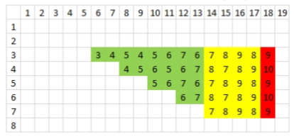

# Tutorial_(en)

Hi everyone, sorry for the considerable delay. It turns out, we were exhausted yesterday from supervising two contests back-to-back. We are surprised by the number of participants in the online mirror. And I hope you enjoy the problems :) 

Our big surprise was problem B. We were setting it to be a medium problem. Turns out, maybe the observation is not that obvious. 

**fun fact:** Initially, we don't plan to have any particular naming theme other than the obligatory first letter matches the problem order. However, when naming 6 out of 9 problems, one of my committee member noticed that **5 problems** have A of B theme. So, we decided to continue using this theme.

Here are the authors and first solvers for all problems:

**A — Arena of Greed**

Author: [JulianFernando](https://codeforces.com/profile/JulianFernando "Master JulianFernando")

Expected difficulty: Medium

Tag: greedy

First solver: [kotamanegi](https://codeforces.com/profile/kotamanegi "International Grandmaster kotamanegi")

**B — Blue and Red of Our Faculty!**

Author: [dewa251202](https://codeforces.com/profile/dewa251202 "Expert dewa251202"), [hiddentesla](https://codeforces.com/profile/hiddentesla "Master hiddentesla")

Expected difficulty: Medium-hard

Tag: dynamic programming

First solver: team NeedHelpPls: [MiricaMatei](https://codeforces.com/profile/MiricaMatei "Master MiricaMatei"), [AlexLuchianov](https://codeforces.com/profile/AlexLuchianov "Master AlexLuchianov"), [loan](https://codeforces.com/profile/loan "Grandmaster loan")

**C — Captain of Knights**

Author: [AMnu](https://codeforces.com/profile/AMnu "Expert AMnu")

Expected difficulty: Very hard

Tag: math

First solver: team Extra Registration: [LJC00118](https://codeforces.com/profile/LJC00118 "Grandmaster LJC00118"), [xay5421](https://codeforces.com/profile/xay5421 "Grandmaster xay5421"), [Sulfox](https://codeforces.com/profile/Sulfox "International Grandmaster Sulfox")

**D — Danger of Mad Snakes**

Author: [hiddentesla](https://codeforces.com/profile/hiddentesla "Master hiddentesla")

Expected difficulty: medium

Tag: Inclusion-exclusion, DP prefix sum.

First solver: team hsy-DD: [Yukikaze_](https://codeforces.com/profile/Yukikaze_ "Candidate Master Yukikaze_"), [Fuyuki](https://codeforces.com/profile/Fuyuki "International Grandmaster Fuyuki"), [xzx34](https://codeforces.com/profile/xzx34 "Expert xzx34")

**E — Excitation of Atoms**

Author: [hiddentesla](https://codeforces.com/profile/hiddentesla "Master hiddentesla")

Expected difficulty: easy-medium

tag: Adhoc, casework.

First solver: [jiangly](https://codeforces.com/profile/jiangly "Legendary Grandmaster jiangly")

**F — Flamingoes of Mystery**

Author: [hocky](https://codeforces.com/profile/hocky "Master hocky")

Expected Difficulty: easy

Tag: Adhoc

First solver: Team LCA on Cactus: [tem_shett](https://codeforces.com/profile/tem_shett "Master tem_shett"), [Dart-Xeyter](https://codeforces.com/profile/Dart-Xeyter "Master Dart-Xeyter"), [sevlll777](https://codeforces.com/profile/sevlll777 "International Master sevlll777")

**H — Huge Boxes of Animal Toys**

Author: [hocky](https://codeforces.com/profile/hocky "Master hocky")

Expected Difficulty: easy

Tag: Adhoc

First solver: idea guy, snake wrangler, and deep learner: [oof_ouch_owie](https://codeforces.com/profile/oof_ouch_owie "Unrated, oof_ouch_owie"), [tenth](https://codeforces.com/profile/tenth "Candidate Master tenth"), [WolfBlue](https://codeforces.com/profile/WolfBlue "Expert WolfBlue").

**I — Impressive Harvest of The Orchad**

Author: [hocky](https://codeforces.com/profile/hocky "Master hocky"), [hiddentesla](https://codeforces.com/profile/hiddentesla "Master hiddentesla")

Expected Difficulty: Hard

Tags: SQRT algorithms, Segment tree beats.

First solver: IIT Patna: [ravik1](https://codeforces.com/profile/ravik1 "Candidate Master ravik1"), [Sixpathsguy](https://codeforces.com/profile/Sixpathsguy "Candidate Master Sixpathsguy"), [darklight13](https://codeforces.com/profile/darklight13 "Candidate Master darklight13")

 
### [1425A - Arena of Greed](../problems/A._Arena_of_Greed.md "2020 ICPC, COMPFEST 12, Indonesia Multi-Provincial Contest (Unrated, Online Mirror, ICPC Rules, Teams Preferred)")

We can solve this problem greedily. The tricky case is if the current number of coins is a multiple of $4$ greater than $8$, it is optimal to take 1 coin instead of taking $\frac{N}{2}$ coins. The proof:

Lets say the number of of coins is $4k$ for some $k>0$. If we take $2k$ coins:

1. Mr. Chanek takes $2k$ coins. (remaining: $2k$)
2. Opponent takes $k$ coins. (remaining: $k$)

The number of coins Mr. Chanek gets is $2k$ coins.

Lets say we take $1$ coin:

1. Mr. Chanek takes $1$ coin. (remaining: $4k-1$)
2. Opponent takes $1$ coin. (remaining: $4k-2$)
3. Mr. Chanek takes $2k -1$ coins. (remaining: $2k-1$).
4. Opponent takes $1$ coin. (remaining: $2k-2$).

In both cases, Mr. Chanek ends up with $2k$ coins. However, there are $2k-2$ coins remaining in the second example, while only $k$ coins remain in the first example. So, if $2k-2 > k$, we take the second case. It turns out, $2k - 2 \le k$ is only true if $k = 1$. So if the number of coins is $4$, we take $2$ coins, else we take $1$ coin. 

Alternatively, you can also look at the number of coins the opponent gained. On the first case, the opponent gains $k$ coins, while on the second case, the opponent gains $2$ coins. In both cases, we gain $2k$ coins. So, it's optimal to choose the option that maximizes the difference of coins gained ($k$ or $2$). 

For other possible number of coins: 

* if the number of coins is even not multiple of $4$, we take half coins.
* If the number of coins is odd, we take $1$ coin.

Time complexity: $O(T log N)$

Code: [94148836](https://codeforces.com/contest/1425/submission/94148836 "Submission 94148836 by hiddentesla")

 
### [1425B - Blue and Red of Our Faculty!](../problems/B._Blue_and_Red_of_Our_Faculty!.md "2020 ICPC, COMPFEST 12, Indonesia Multi-Provincial Contest (Unrated, Online Mirror, ICPC Rules, Teams Preferred)")

First, we must notice that the graph is a clover graph. The graph has cycles with vertex $1$ in common. We can transform the graph into an array $A$, where $A_i$ is the number of edges in cycle $i$.

On the final configuration, each cycle has three possible endings: 

* The whole cycle is colored red or blue
* The whole cycle is gray
* exactly one cycle is colored in two different colors (can be red and blue, red and gray, blue and gray). This is the last cycle they visit.

The third point suggests a dynamic programming approach: for each cycle in $A$, set this cycle as the last cycle, and count how many configurations. So for the other cycles, we can calculate $DP[i][diff][takeAll]$, the number of configurations using the first $i$ cycles, where $diff$ is the absolute difference between the number edges blue and red took, and $takeAll$ is a boolean that indicates all cycles 1...i must be taken by either $red$ or $blue$. The transitions are quite straightforward, and its easier to see the code if you are confused. Calculating this DP is done in $O(N^2)$

Why flag $takeAll$? because for a fixed last cycle, there are two possible final positions for $red$ and $blue$, assuming $C$ is the size of the fixed cycle: 

1. If one player ends in vertex $1$: $2 \cdot DP[N][C-1][1]$. All other cycles must be colored, else both players can still move.
2. If both players ends inside the cycle: $2 \cdot \sum\limits_{i=0}^{C-2}DP[N][i][0]$

There is an additional case where both players finish at vertex $1$. TO find this, we recalculate DP using the whole array. The number of configurations is $DP[N][0][1]$.

Calculating this for all elements of $A$ will give an $O(N^3)$ solution. However, since $\sum A = N$, there are atmost $\sqrt{N}$ different values in $A$. So, we can calculate DP for only these $\sqrt{N}$ values. This gives a $O(N^2 \sqrt{N})$ solution which if sufficient to get accepted.

Bonus $O(N^2)$ solution: The solution can be optimized further by partitioning $A$ into two parts: 

1. first part consists of all distinct values in the area (each appears once). The size of this part is at most $\sqrt{N}$.
2. the second part is all other elements

We notice that when fixing cycles, the second part does not change so we can calculate DP on this part exactly once in $O(N^2)$. We can then only recalculate DP in the first part. Since there are $\sqrt{N}$ elements, calculating DP on this is $O(N \sqrt{N})$. Since we calculate DP $\sqrt{N}$ times, the total complexity is $O(N^2)$. Then, merges with the first DP.

O(N2√N)O(N2N−−√) code: [94149019](https://codeforces.com/contest/1425/submission/94149019 "Submission 94149019 by hiddentesla")

O(N2)O(N2) code: [94149066](https://codeforces.com/contest/1425/submission/94149066 "Submission 94149066 by hiddentesla")

 
### [1425C - Captain of Knights](../problems/C._Captain_of_Knights.md "2020 ICPC, COMPFEST 12, Indonesia Multi-Provincial Contest (Unrated, Online Mirror, ICPC Rules, Teams Preferred)")

An important observation is that it is guaranteed there is a sequence of moves from $(1, 1)$ to $(X, Y)$ where we only visit squares in the rectangle $(1, 1)$ to $(X, Y)$. So we can calculate $F(X, Y)$ independently without concerning $N$ dan $M$.

To ease the implementation and explanation, we define $\int(f(x)) = \sum_{i = 1}^{x}f(i)$. So the sum of an order two polynomial $F(x) = a \cdot x^2 + b \cdot x + c$ is $\int{F(x} = \frac{a}{3} x^3 + \frac{a + b}{2} x^2 + \frac{a + 3b + 6c}{6} x$

Since the number of formulas in this problem tutorial is quite large, we will omit the method to find it because then the editorial will be quite long Lets define $P(x,y) = \sum_{i = 3}^{x} \sum_{j = 3}^{y} F(i,j)$. If we can find $P(x, y)$ fast, the answer is $P(N,M) - P(X-1,M) - P(N,Y-1) + P(X-1,Y-1)$.

Calculating $P$ can be divided into three cases:

$\bullet$ Case 1, For $x = 3$, $y \le 5$. we can use brute force.

$\bullet$ Case 2,For $x < 2y$ and $y < 2x$. Let $z = (x + y - 2)$, $F(x, y) = s(z) = \frac{z}{3} + z \bmod 3$. Assume $t(x) = \int(s(x))$. For rows $i$ from 4 to $\frac{y}{2}$, the sum of $F$ is $t(3(i-1)) - t(\frac{3i}{2}-2)$. For rows $i$ greater than $\frac{y}{2}$ next rows, the sum of $F$ is $t(i+y-2) - t(\frac{3i}{2}-2)$. To ease in finding the sum, we define: 

* $a(x) = t(1) + t(2) + ... + t(x)$
* $b(x) = t(3) + t(6) + ... + t(3x)$
* $c(x) = t(1) + t(2) + t(4) + t(5) + ... + t(\frac{3x-1}{2})$

 So, we get: * $t(3x) = \int(3x+1)$,
* $a(3x) = \int(3 \int(3x+1) - (3x+1))$
* $b(x) = \int(\int(3x+1))$
* $c(2x) = a(3x) - b(x)$.

 Now, the sum of $F$ for all squares in this case is: $a(x+y-2) - a(\frac{3y}{2}-2) + b(\frac{y}{2}-1) - b(2) - c(x-1) + c(2)$$\bullet$ Case 3, for $2y \le 2 \cdot x$ or $x \le 2 \cdot y$. First see the illustration below for context. 

   To ease the formula, let $N = min\left(N, \frac{M}{2}\right) - 2$ and $M = M - 5$.The sum of $F(x, y)$ for each blocks of two columns starting at an even number is the same. We define $blocks$ as these columns. So, block $1$ is the $[3, 4]$ block, block $2$ is the $[5, 4]$ block, and so on. The sum of a row in block $i$ is $(2 \cdot x + 5)$. Since there are $i$ rows in block $i$, the sum of all rows in block $i$ is $i(2 \cdot i + 5)$. To ease, lets define two functions: 

1. $d(x) = \int{x (2 \cdot x + 5)}$. Sum of all $F$ for the first $x$ blocks.
2. $e(x) = \int{(2 \cdot x + 5 )}$. Sum of a row for the first $x$ blocks.

 The sum of this part is divided into three regions which is also described in the image above (red, yellow, green). 

1. the sum on the green area is $d(N-1)$.
2. There is a square of height $N$ from colums $N-1$ to $\frac{M}{2}$. So, the sum of this region is $N(e(\frac{M}{2})-e(N-1))$
3. The red area. This is a single row at the end if $M$ is odd. If $N$ is even, the sum is $\frac{N}{2} \cdot (M + 6)$. If N is odd, we add an additional square which is $F(N + 2, M + 5)$ (remember we simplify $N$ and $M$ at the beginning.

So, the sum of case three is $d(N-1) + N(e(\frac{M}{2})-e(N-1)) $ + red area. Calculate this formula again with the rows swapped to for case $y \ge 2 \cdot x$.

note: Calculating $t(x)$ and $a(x)$ when $x$ is not a multiple of $3$ can be done by finding the closest multiple of $3$ and then bruteforcing the last columns. That can also be used to calculate $c(x)$ and $e(x)$ when $x$ is odd.

Time Complexity: $O(T)$

code: [94149150](https://codeforces.com/contest/1425/submission/94149150 "Submission 94149150 by hiddentesla")

 
### [1425D - Danger of Mad Snakes](../problems/D._Danger_of_Mad_Snakes.md "2020 ICPC, COMPFEST 12, Indonesia Multi-Provincial Contest (Unrated, Online Mirror, ICPC Rules, Teams Preferred)")

We are going to count the contribution of two snakes $(I, J)$ separately. Assume that the current snake we are interested in has danger value $B_1$ and $B_2$. The terms where they are killed must be on the form $(... + B_1 + B_2 + ...)^2$. Expanding this gives $B_1^2 + B_2^2 + 2B_1B_2$. So, the contribution of $B_1B_2$ to the answer is the number of attack strategies where both $I$ and $J$ are killed. We can find this using the inclusion-exclusion principle. First, let's define: 

* $W$: the number of squares where when hit will result in $I$ and $J$ being killed.
* $U$: the number of squares where when hit will result in $I$ killed, but not $J$.
* $V$: the number of squared where when hit will result in $J$ killed, but not $I$.

We can calculate all these values easily using prefix sum DP. Then, there are two cases to consider: 

1. Case 1: a square in $W$ is hit. The number of ways is $C(N, M) - C(N - W, M)$
2. Case 2: a square in $W$ is not hit. However, a square in $U$ and $V$ is hit. Lets define $N' = N - W$. The number of ways is $C(N', M) - C(N' - U, M) - C(N' - V, M) + C(N' - U - V, M)$

Sum the number of ways times $2B_1B_2$ to the answer. Don't also forget to count the contribution of $B_{1}^2$.

Time Complexity: $O(N^2)$

code: [94149327](https://codeforces.com/contest/1425/submission/94149327 "Submission 94149327 by hiddentesla")

 Tutorial is loading...code: [93947185](https://codeforces.com/contest/1425/submission/93947185 "Submission 93947185 by hocky")

 
### [1425F - Flamingoes of Mystery](../problems/F._Flamingoes_of_Mystery.md "2020 ICPC, COMPFEST 12, Indonesia Multi-Provincial Contest (Unrated, Online Mirror, ICPC Rules, Teams Preferred)")

First get the values of the first three elements using three queries: 

1. "? 1 3"
2. "? 1 2"
3. "? 2 3"

Once you get $A_i$, element $A_{i+1}$ can be obtained using "? i i+1"

Time complexity: $O(N)$

code: [94151055](https://codeforces.com/contest/1425/submission/94151055 "Submission 94151055 by hiddentesla")

 
### [1425H - Huge Boxes of Animal Toys](../problems/H._Huge_Boxes_of_Animal_Toys.md "2020 ICPC, COMPFEST 12, Indonesia Multi-Provincial Contest (Unrated, Online Mirror, ICPC Rules, Teams Preferred)")

The main observation of this problem is that the sewing order does not matter. The final fun value is the multiplication of fun values of all toys. There are two separate cases we must consider: 

* Cek the sign of the toy. If $(A + B)$ is even, the sign is positive. Else, it's negative.
* Cek whether it is possible to make a fun value with absolute value lower than 1 and greater than 1. The former is possible if $(B+ C) > 0$, the latter is possible if $(A + D) > 0$.

Combining these two cases will give you the solution.

Time Complexity: $O(T)$

code: [94151563](https://codeforces.com/contest/1425/submission/94151563 "Submission 94151563 by hiddentesla")

 
### [1425I - Impressive Harvesting of The Orchard](../problems/I._Impressive_Harvesting_of_The_Orchard.md "2020 ICPC, COMPFEST 12, Indonesia Multi-Provincial Contest (Unrated, Online Mirror, ICPC Rules, Teams Preferred)")

We classify each vertex $i$ into two types. heavy if $A_i > \sqrt{Q}$ and light if $A_i \le \sqrt{Q}$. We craft two different algorithms to solve each case separately.

heavy nodes:

Flatten the tree using pre-order transversal. Now querying a subtree becomes querying a subarray. Maintain a global set $S$ with all currently heavy node harvestable bushes, sorted by their pre-order index. We simulate each query. When querying subtree of $X$, we find all harvestable nodes in the set, remove them, and then add to the answer their contribution. The node is re-added the next time it is available to be queried. We can do this by maintaining a list of vectors denoting which nodes are harvestable again at each time.

Since all nodes have $A_i > \sqrt{Q}$, each node is removed and re-added at most $\sqrt{Q}$ times. Since we are using set, it adds a log factor. So the total complexity of this is $O(N \sqrt{Q} log N)$.

light nodes:

We solve separately for each different value of $A_i$. Assume the current value we are solving is $A$. We build a segment tree beats aggeration directly on the tree. we do not flatten the tree; you will see why in the proof below. In each vertex, we store $R_i$, when this bush is available to be harvested. We also store $max_i$ and $min_i$, the maximum and minimum value of $R_i$ on the subtrees of $i$, respectively. Initially, $R_i = 0$ for all $i$.

We do the following in order for each query $X$: 

1. Find all highest depth $i$ vertices in the subtree of $X$ with $max_i = 0$. Add their contribution to the answer and then lazily update the vertex and all of it's child's $R_i$ to $A$.
2. Update the values of all $R_i$ to be $max(R_i - 1, 0)$.

.We can achieve this using segment tree beats. The break condition is when $min_i > 0$, the tag condition is when $max_i = 0$. We are going to prove that is yields an average complexity of $log N$. We are using the jargon from https://www.youtube.com/watch?v=UJyBHCXa-1g:

Assume $mark$ is the maximum $R_i$ of a subtree. If a vertex has mark $M$, all marks $M$ on its subtree is deleted. We define $F(X)$ as the number of vertices with mark $0$ on the $ X $ subtree. We also define P as the sum of $F(X)$ for all $X$. Initially, $P = F(1) = 1$.

We observe the change of $P$ for each query when we query in the subtree of $X$: 

1. We put tag $A$ of $X$. Note that this does not increase the value of $P$. However, this gives an important property: each nonzero mark can appear at most once at any given time. This does not hold if we flatten the tree.
2. $P$ will increase at most $log N$ for each $mark$ that decreases from $1$ to $0$ from our subtraction update. Since there can be at most one mark $1$ at any given time, the maximum increase of $P$ is $log N$ per query.
3. $P$ will decrease by at least $1$ for each extra node we visit. And this is the only way to decrease $P$.

Since option $2$ is the only way to increase $P$, we find our maximum value of $P$ is $Q log N$. Since option $3$ is the only way to decrease $P$ and $P$ cannot be negative, we find the number of extra nodes we visit is at most $Q log N$, giving us a $Q log N$ solution.

Note: it is possible to omit the lazy propagation by storing the last time each vertex is harvested, instead of $R_i$. Dropping lazy propagation will speed up the code almost two times faster!

Since we are solving for each $A_i < \sqrt{Q}$, the total complexity of this part is $O(Q \sqrt{N} log N)$.

Combining the two algorithms (heavy and light), we get the accepted solution. In practice, the optimal bucket size is arround $\sqrt{Q}/2$, since STB has a larger constant factor.

Sadly, it turns out a sophisticated $O(NQ)$ solution can pass. We should've made all $A's$ have the same value, so the solution is in $O(Q log N)$. Oh well, we hope this problem can be educational to you all :)

Code (without lazy propagation): [94152055](https://codeforces.com/contest/1425/submission/94152055 "Submission 94152055 by hiddentesla")

Code (with lazy propagation): [94152123](https://codeforces.com/contest/1425/submission/94152123 "Submission 94152123 by hiddentesla")

**Honorable mention:** the fastest O(NQ)O(NQ) solution during the contest: [93941953](https://codeforces.com/contest/1425/submission/93941953 "Submission 93941953 by Bajetii")

About problem G
===============

Problem G was really saddening. We had a cool solution using convex hulls. The solution idea is for we find all connected components of "#". For each CC, we push to a set all non-"#" squares connected in the top, right, left, and down of each '#' and then build a \textbf{convex hull} from the set. The convex hull is then marked the safe zone. If the thief can reach one of these safe zones, the answer is "lolos".

However, after the contest, one participant found the counter case on solutions like this:

 
```cpp
5 5
M....
.....
..#..
...C.
.....
```
The distance from the thief to each safe zone is not less than Mr. Chanek. However, the thief can move to bottom-right, which can then react to Mr. Chanek's next move. (output is "lolos", jury will print "tertangkap").

We are sad and are currently finding the correct answer. We have also taken down the problem (for now). We manually verify every test case during the test generation of this problem, so they are correct. During the contest (official and mirror), nobody managed to pass the test cases (except [jiangly](https://codeforces.com/profile/jiangly "Legendary Grandmaster jiangly")), so it does not affect the standings. However, broken is still broken. We hope it does not reduce the enjoyment of the other problems that much :(.

