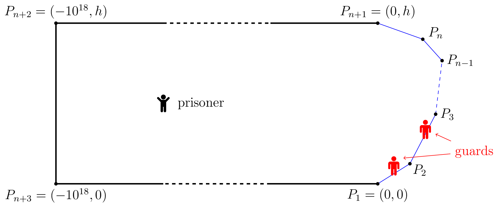

<h1 style='text-align: center;'> H. Prison Break</h1>

<h5 style='text-align: center;'>time limit per test: 4 seconds</h5>
<h5 style='text-align: center;'>memory limit per test: 256 megabytes</h5>

A prisoner wants to escape from a prison. The prison is represented by the interior of the convex polygon with vertices $P_1, P_2, P_3, \ldots, P_{n+1}, P_{n+2}, P_{n+3}$. It holds $P_1=(0,0)$, $P_{n+1}=(0, h)$, $P_{n+2}=(-10^{18}, h)$ and $P_{n+3}=(-10^{18}, 0)$.

  The prison walls $P_{n+1}P_{n+2}$, $P_{n+2}P_{n+3}$ and $P_{n+3}P_1$ are very high and the prisoner is not able to climb them. Hence his only chance is to reach a point on one of the walls $P_1P_2, P_2P_3,\dots, P_{n}P_{n+1}$ and escape from there. On the perimeter of the prison, there are two guards. The prisoner moves at speed $1$ while the guards move, remaining always on the perimeter of the prison, with speed $v$.

If the prisoner reaches a point of the perimeter where there is a guard, the guard kills the prisoner. If the prisoner reaches a point of the part of the perimeter he is able to climb and there is no guard there, he escapes immediately. Initially the prisoner is at the point $(-10^{17}, h/2)$ and the guards are at $P_1$. 

Find the minimum speed $v$ such that the guards can guarantee that the prisoner will not escape (assuming that both the prisoner and the guards move optimally).

Notes: 

* At any moment, the guards and the prisoner can see each other.
* The "climbing part" of the escape takes no time.
* You may assume that both the prisoner and the guards can change direction and velocity instantly and that they both have perfect reflexes (so they can react instantly to whatever the other one is doing).
* The two guards can plan ahead how to react to the prisoner movements.
####### Input

The first line of the input contains $n$ ($1 \le n \le 50$).

The following $n+1$ lines describe $P_1, P_2,\dots, P_{n+1}$. The $i$-th of such lines contain two integers $x_i$, $y_i$ ($0\le x_i, y_i\le 1,000$) — the coordinates of $P_i=(x_i, y_i)$.

It is guaranteed that $P_1=(0,0)$ and $x_{n+1}=0$. The polygon with vertices $P_1,P_2,\dots, P_{n+1}, P_{n+2}, P_{n+3}$ (where $P_{n+2}, P_{n+3}$ shall be constructed as described in the statement) is guaranteed to be convex and such that there is no line containing three of its vertices.

####### Output

Print a single real number, the minimum speed $v$ that allows the guards to guarantee that the prisoner will not escape. Your answer will be considered correct if its relative or absolute error does not exceed $10^{-6}$.

## Examples

####### Input


```text
2
0 0
223 464
0 749
```
####### Output


```text
1
```
####### Input


```text
3
0 0
2 2
2 4
0 6
```
####### Output


```text
1.0823922
```
####### Input


```text
4
0 0
7 3
7 4
5 7
0 8
```
####### Output


```text
1.130309669
```
####### Input


```text
5
0 0
562 248
460 610
281 702
206 723
0 746
```
####### Output


```text
1.148649561
```
####### Input


```text
7
0 0
412 36
745 180
747 184
746 268
611 359
213 441
0 450
```
####### Output


```text
1.134745994
```


#### Tags 

#3500 #NOT OK #binary_search #games #geometry #ternary_search 

## Blogs
- [All Contest Problems](../Codeforces_Global_Round_11.md)
- [Announcement (en)](../blogs/Announcement_(en).md)
- [Tutorial (en)](../blogs/Tutorial_(en).md)
