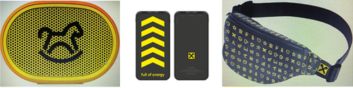

# Announcement

Hello, Codeforces!

Welcome to the [Codeforces Raif Round 1 (Div. 1 + Div. 2)](https://codeforces.com/contest/1428) supported by Raiffeisenbank, that will start on [Saturday, October 17, 2020 at 19:05UTC+6](https://codeforces.com/https://www.timeanddate.com/worldclock/fixedtime.html?day=17&month=10&year=2020&hour=16&min=5&sec=0&p1=166). **It will be a combined rated round for both divisions. Note that the start time is unusual.**

All problems were authored and prepared by [bensonlzl](https://codeforces.com/profile/bensonlzl "Master bensonlzl"), [oolimry](https://codeforces.com/profile/oolimry "Master oolimry"), [errorgorn](https://codeforces.com/profile/errorgorn "Grandmaster errorgorn"), [dvdg6566](https://codeforces.com/profile/dvdg6566 "Grandmaster dvdg6566"), [shenxy13](https://codeforces.com/profile/shenxy13 "Grandmaster shenxy13").

[Ari](https://codeforces.com/profile/Ari "Grandmaster Ari") gato to:

 * [isaf27](https://codeforces.com/profile/isaf27 "International Grandmaster isaf27") and [KAN](https://codeforces.com/profile/KAN "International Grandmaster KAN") for round coordination and help with preparation
* [zhangguangxuan99](https://codeforces.com/profile/zhangguangxuan99 "International Master zhangguangxuan99") for being epic IOI trainer <3
* Our army of testers: [Ari](https://codeforces.com/profile/Ari "Grandmaster Ari"), [KAN](https://codeforces.com/profile/KAN "International Grandmaster KAN"), [Monogon](https://codeforces.com/profile/Monogon "Grandmaster Monogon"), [prabowo](https://codeforces.com/profile/prabowo "Grandmaster prabowo"), [SYY](https://codeforces.com/profile/SYY "Expert SYY"), [SleepyShashwat](https://codeforces.com/profile/SleepyShashwat "Master SleepyShashwat"), [TeaTime](https://codeforces.com/profile/TeaTime "Candidate Master TeaTime"), [Tlatoani](https://codeforces.com/profile/Tlatoani "International Grandmaster Tlatoani"), [-rs-](https://codeforces.com/profile/-rs- "Master -rs-"), [agul](https://codeforces.com/profile/agul "Master agul"), [cstuart](https://codeforces.com/profile/cstuart "Master cstuart"), [dantoh](https://codeforces.com/profile/dantoh "Master dantoh"), [jhkoh](https://codeforces.com/profile/jhkoh "Expert jhkoh"), [kai824](https://codeforces.com/profile/kai824 "Master kai824"), [kymmykym](https://codeforces.com/profile/kymmykym "Expert kymmykym"), [lperovskaya](https://codeforces.com/profile/lperovskaya "Specialist lperovskaya"), [mango_lassi](https://codeforces.com/profile/mango_lassi "International Grandmaster mango_lassi"), [morzer](https://codeforces.com/profile/morzer "Expert morzer"), [Retired_cherry](https://codeforces.com/profile/Retired_cherry "Specialist Retired_cherry"), [socho](https://codeforces.com/profile/socho "International Master socho"), [zhangguangxuan99](https://codeforces.com/profile/zhangguangxuan99 "International Master zhangguangxuan99"), [zscoder](https://codeforces.com/profile/zscoder "International Grandmaster zscoder") for their invaluable advice and suggestions.
* [MikeMirzayanov](https://codeforces.com/profile/MikeMirzayanov "Headquarters, MikeMirzayanov") for great systems Codeforces and Polygon.

**You will be given 8 problems, one of which would be divided into easy and hard versions, and 150 minutes to solve them.**

We hope that statements are short and pretests are strong and that you find the problems interesting! Good luck, have fun and we wish everyone high ratings!

The scoring distribution will be announced closer to the beginning of the round.

Thanks to Raiffeisenbank, winners will get awesome swag:

 * 1st-3rd place = Bluetooth speaker
* 4th-10th place = Bumbag
* 11th-20th place = Power Bank

Random 50 participants outside of top-20, who solved at least one problem will receive: 

 * Thermos Mugs
* Raiffeisenbank t-shirt

About Algorithmic Trading team in Raiffeisenbank 

We develop a high-frequency trading (HFT) system for equity, currency and derivative markets. Our business edge is in technology. The main goal is to create a top-notch platform based on fundamental and statistical models and machine learning, with low latency and high throughput. The efficiency and scalability of our code give us a competitive advantage. We are passionate about code quality and strive for highest standards in product development.

If you are interested in internship and employment opportunities in the Raiffeisenbank algo-trading team Capital Markets, or want to get in touch with the bank's recruitment , fill out a form below.

  [FILL OUT FORM →](https://codeforces.com/userForm/1b6c5aa3c06b8fb4) **UPD: Scoring distribution:** 500 — 1000 — 1000 — 1500 — 1750 — 1750 — (2250+750) — 4000

**UPD2:** [Editorial out!](Tutorial_(en).md)

**UPD 3: First ACs and winners**

*First ACs* 

A: [300iq](https://codeforces.com/profile/300iq "International Grandmaster 300iq") 

B: [icecuber](https://codeforces.com/profile/icecuber "International Grandmaster icecuber")

C: [Not-Afraid](https://codeforces.com/profile/Not-Afraid "Expert Not-Afraid")

D: [Radewoosh](https://codeforces.com/profile/Radewoosh "Legendary Grandmaster Radewoosh")

E: [Errichto](https://codeforces.com/profile/Errichto "International Grandmaster Errichto")

F: [fmota](https://codeforces.com/profile/fmota "Master fmota")

G: [Radewoosh](https://codeforces.com/profile/Radewoosh "Legendary Grandmaster Radewoosh")

H: [Radewoosh](https://codeforces.com/profile/Radewoosh "Legendary Grandmaster Radewoosh")

*Top 5*

 1. [Radewoosh](https://codeforces.com/profile/Radewoosh "Legendary Grandmaster Radewoosh")
2. [Um_nik](https://codeforces.com/profile/Um_nik "Legendary Grandmaster Um_nik")
3. [kczno1](https://codeforces.com/profile/kczno1 "International Grandmaster kczno1")
4. [ecnerwala](https://codeforces.com/profile/ecnerwala "Legendary Grandmaster ecnerwala")
5. [littlelittlehorse](https://codeforces.com/profile/littlelittlehorse "Grandmaster littlelittlehorse")

Congratulations to everyone!

