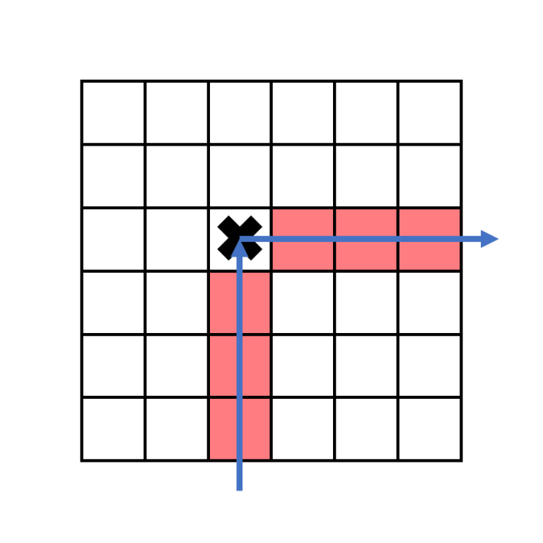
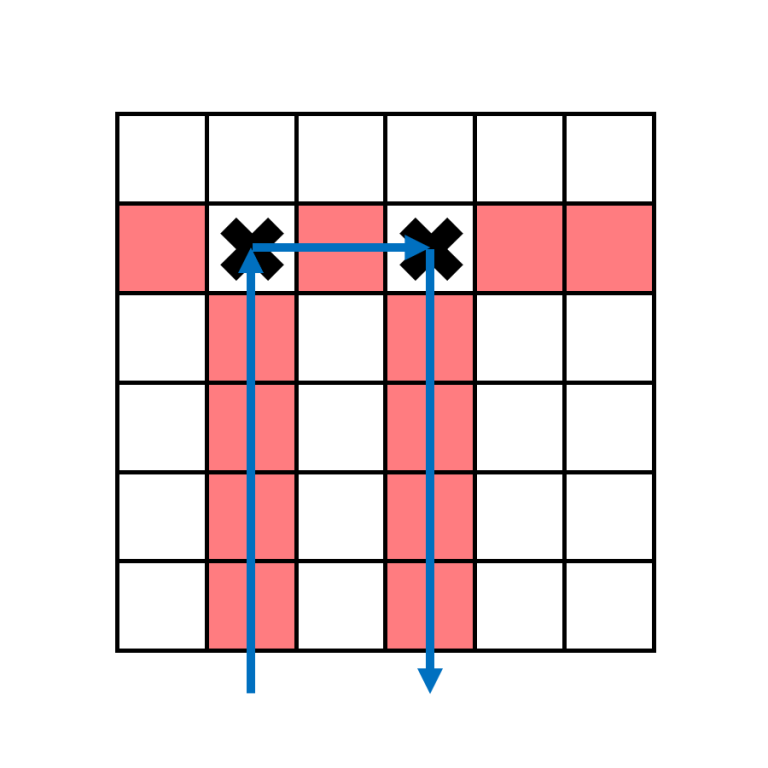
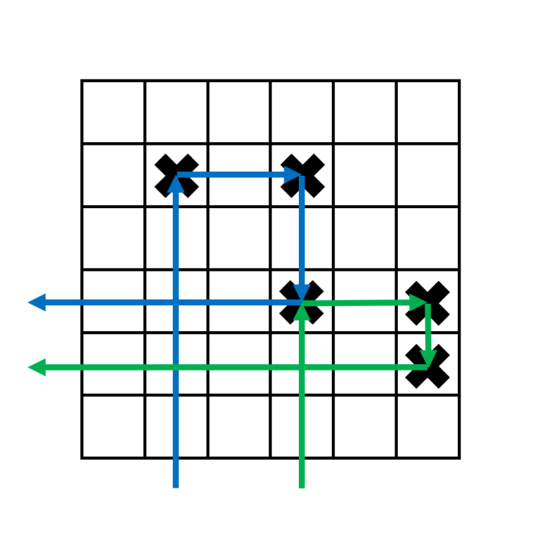
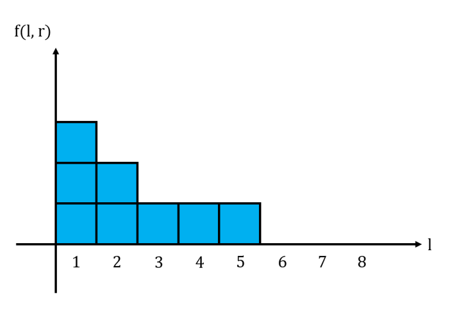
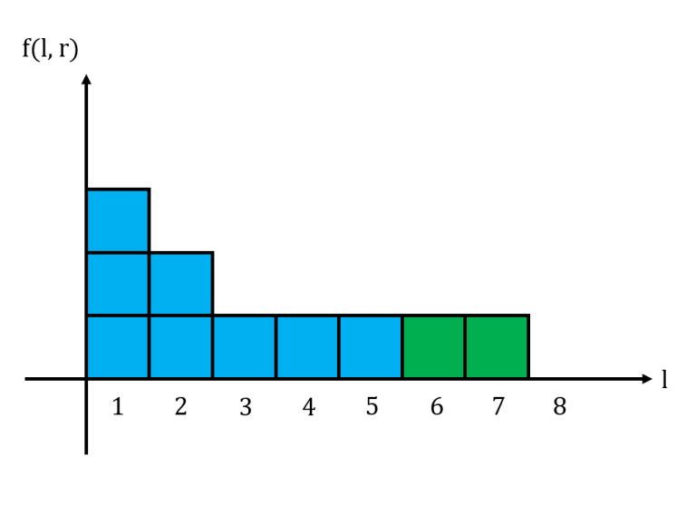
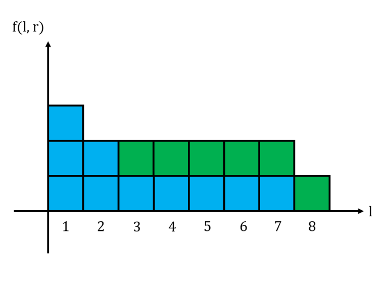

# Tutorial_(en)

[1428A - Box is Pull](../problems/A._Box_is_Pull.md)
---------------------------------------------------------------------

Setter: [bensonlzl](https://codeforces.com/profile/bensonlzl "Master bensonlzl")  
Prepared by: [errorgorn](https://codeforces.com/profile/errorgorn "Grandmaster errorgorn")

 **Hint 1**Consider when x1=x2

 **Hint 2**Consider when x1≠x2

 **Solution**We consider 2 cases. 

The first is that the starting and ending point lie on an axis-aligned line. In this case, we simply pull the box in 1 direction, and the time needed is the distance between the 2 points as we need 1 second to decrease the distance by 1.

The second is that they do not lie on any axis-aligned line. Wabbit can pull the box horizontally (left or right depends on the relative values of x1 and x2) for |x1−x2| seconds, take 2 seconds to move either above or below the box, then take another |y1−y2| seconds to move the box to (x2,y2).

 **Code (C++)**
```cpp
#include <bits/stdc++.h>

using namespace std;

int main(){
	ios_base::sync_with_stdio(false);
	cin.tie(0);
	int t, x1, y1, x2, y2;
	cin >> t;
	for (int i = 1; i <= t; ++i){
		cin >> x1 >> y1 >> x2 >> y2;
		if (x1 == x2 || y1 == y2){
			cout << abs(x1-x2) + abs(y1-y2) << 'n';
		}
		else cout << abs(x1-x2) + abs(y1-y2) + 2 << 'n';
	}
}
```
 **Code (Python)**
```cpp
tc=int(input())
for i in range(tc):
    a,b,c,d=map(int,input().split(" "))

    ans=abs(a-c)+abs(b-d)
    if (a!=c and b!=d): ans+=2

    print(ans)
```
[1428B - Belted Rooms](../problems/B._Belted_Rooms.md)
----------------------------------------------------------------------

Setter: [oolimry](https://codeforces.com/profile/oolimry "Master oolimry")  
Prepared by: [oolimry](https://codeforces.com/profile/oolimry "Master oolimry")

 **Hint 1**There are 2 cases to consider for a room to be returnable.

 **Hint 2**For a room to be returnable, either go one big round around all the rooms or move to an adjacent room and move back.

 **Solution**Let's consider two ways to return to the start point. The first is to go one big round around the circle. The second is to move 1 step to the side, and return back immediately.

Going one big round is only possible if and only if:

 * There are no clockwise belts OR
* There are no anticlockwise belts

If we can go one big round, all rooms are returnable.

If there are both clockwise and anticlockwise belts, then we can't go one big round. For any room to be returnable, it must have an **off** belt to the left or to the right. 

In summary, check if clockwise belts are absent or if anticlockwise belts are absent. If either is absent, the answer is n. Otherwise, we have to count the number of rooms with an **off** belt to the left or to the right.

 **Other comments**Sorry for the unclear statement for B, we should've explained each sample testcase more clearly with better diagrams. Additionally, we're also sorry for the weak pretests. We should've added more testcases of smaller length, and thanks to hackers for adding stronger tests.

 **Code (C++)**
```cpp
#include <bits/stdc++.h>
using namespace std;

int main(){
	ios_base::sync_with_stdio(false); cin.tie(0);
	
	int TC; cin >> TC;
	while(TC--){
		int n; cin >> n;
		string s; cin >> s;
		
		bool hasCW = false;
		bool hasCCW = false;
		for(int i = 0;i < n;i++){
			if(s[i] == '<') hasCW = true;
			if(s[i] == '>') hasCCW = true;
		}
		
		if(hasCW && hasCCW){
			int ans = 0;
			s += s[0];
			for(int i = 0;i < n;i++){
				if(s[i] == '-' || s[i+1] == '-') ans++;
			}
			cout << ans << "n";
		}
		else{
			cout << n << "n";
		}
	}
}
```
 **Code (Python)**
```cpp
TC = int(input())
for tc in range(TC):
    n = int(input())
    s = input()

    hasCW = False
    hasCCW = False 
    for c in s:
        if c == '>':
            hasCW = True
        if c == '<':
            hasCCW = True
            
    if hasCW and hasCCW:
        s += s[0]
        ans = 0;
        for i in range(n):
            if s[i] == '-' or s[i+1] == '-':
                ans += 1
        print(ans)
        
    else:
        print(n)
```
[1428C - ABBB](../problems/C._ABBB.md)
--------------------------------------------------------------

Setter: [errorgorn](https://codeforces.com/profile/errorgorn "Grandmaster errorgorn") and [shenxy13](https://codeforces.com/profile/shenxy13 "Grandmaster shenxy13")  
Prepared by: [errorgorn](https://codeforces.com/profile/errorgorn "Grandmaster errorgorn") and [oolimry](https://codeforces.com/profile/oolimry "Master oolimry")

 **Hint 1**`AB` and `BB` means that `?B` can be removed.

 **Hint 2**The final string is `BAAA...` or `AAA...`.

 **Solution**This game is equivalent to processing left to right and maintaining a stack. If the current processed character is `A`, we add it to the stack, if the current processed character is `B`, we can either add it to the stack or pop the top of the stack.

In the optimal solution, we will always pop from the stack whenever possible. To prove this, we will use the stay ahead argument. 

Firstly, we notice that the contents of the stack do not actually matter. We actually only need to maintain the length of this stack. Decrementing the size of the stack whenever possible is optimal as it is the best we can do. And in the case where we must push `B' to the stack, this is optimal as the parity of the length of the stack must be the same as the parity of the processed string, so obtaining a stack of length 0 is impossble.

**Bonus:** what is the length of the longest string that Zookeeper can make such that there are no moves left?

 **Other comments**We're also sorry for the weak pretests in this problem. About 1 hour before the contest, we found out that c++ O(N2) solution using `find` and `erase` would pass. Then we added testcases to kill the c++ solutions, but we didn't test the O(N2) solution for python using `replace`.

 **Code (C++)**
```cpp
//雪花飄飄北風嘯嘯
//天地一片蒼茫

#include <bits/stdc++.h>
#include <ext/pb_ds/assoc_container.hpp>
#include <ext/pb_ds/tree_policy.hpp>
#include <ext/rope>
using namespace std;
using namespace __gnu_pbds;
using namespace __gnu_cxx;
#define ll long long
#define ii pair<ll,ll>
#define iii pair<ii,ll>
#define fi first
#define se second
#define endl 'n'
#define debug(x) cout << #x << " is " << x << endl

#define rep(x,start,end) for(auto x=(start)-((start)>(end));x!=(end)-((start)>(end));((start)<(end)?x++:x--))
#define all(x) (x).begin(),(x).end()
#define sz(x) (int)(x).size()

#define indexed_set tree<ll,null_type,less<ll>,rb_tree_tag,tree_order_statistics_node_update>
//change less to less_equal for non distinct pbds, but erase will bug

mt19937 rng(chrono::system_clock::now().time_since_epoch().count());

int main(){
	ios::sync_with_stdio(0);
	cin.tie(0);
	cout.tie(0);
	cin.exceptions(ios::badbit | ios::failbit);
	
	int TC;
	cin>>TC;
	
	while (TC--){
		string s;
		cin>>s;
		
		int stk=0;
		
		rep(x,0,sz(s)){
			if (stk && s[x]=='B') stk--;
			else stk++;
		}
		
		cout<<stk<<endl;
	}
}
```
 **Code (Python)**
```cpp
TC = int(input())
for tc in range(TC):
	s = input()
	ans=0
	for i in s:
		if (i=='B' and ans!=0): ans-=1
		else: ans+=1
	print(ans)
```
[1428D - Bouncing Boomerangs](../problems/D._Bouncing_Boomerangs.md)
-----------------------------------------------------------------------------

Setter: [bensonlzl](https://codeforces.com/profile/bensonlzl "Master bensonlzl")  
Prepared by: [bensonlzl](https://codeforces.com/profile/bensonlzl "Master bensonlzl")

 **Hint 1**Consider ai∈{0,1,2}.

 **Hint 2**Consider ai={3,3,3,…,3,1}.

 **Solution**Clearly, columns with aj=0 are completely empty and we can ignore them.

Let's first consider just columns with 1 s and 2 s. When a boomerang strikes its first target, it will change directions from upwards to rightwards. If aj=1, the boomerang in column j exits the grid on the right. 



This means that if the target that it hits in on row r, there is no other target to its right on row r.

For columns with aj=2, the boomerang in column j has to hit second target in some column k before moving downwards. 



The 2 targets that this boomerang hits must be in the same row, and since no row contains more than 2 targets, these are the only 2 targets in the row. Additionally, there isn't any target below the second target. This means ak=1. 

This tells us that columns j with aj=2 must be matched with columns k with ak=1 to its right with j<k. If we only had aj=1 and aj=2, we can simply greedily match 2 s to 1 s that are available. 

3 s initially seem difficult to handle. The key observation is that 3 s can "link" to 3 s to its right. The way to do this for the have the first target for one boomerang be the third target for another boomerang. 



This allows us to "chain" the 3 s together in one long chain.

Thus, we only care about the first 3, which has to use either a 2 or a 1 (if it uses a 1, that 1 cannot be matched with a 2). We should always use a 2 if possible since it will never be used by anything else, and the exact 1 that we use also doesn't matter.

Thus the solution is as follows: Process from right to left. If the current value is a 1, add it to a list of available ones. If the current value is a 2, match it with an available 1 and remove the 1 from the list. If the current value is a 3, match it with 3,2 or 1 in that order of preference. 

Once we have found the chains and matches, we can go from left to right and give each chain / match some number of rows to use so that they do not overlap. The final time complexity is O(n).

**Bonus 1:** Show that the directly simulating the path of each boomerang is overall O(n).

**Bonus 2 (unsolved):** Solve for 0≤aj≤4.

 **Code (C++)**
```cpp
#include <bits/stdc++.h>

using namespace std;

int N, A[100005], T;

vector<pair<int,int> > targets;
vector<int> ones, twos, threes;

int currow = 1, col[100005], twomatch[100005], threematch[100005];

int main(){
	ios_base::sync_with_stdio(false);
	cin.tie(0);
	cin >> N;
	for (int i = 1; i <= N; ++i){
		cin >> A[i];
	}
	for (int i = N; i >= 1; --i){
		if (A[i] == 1){
			ones.push_back(i);
		}
		else if (A[i] == 2){
			if (ones.size() == 0){
				cout << -1 << 'n';
				return 0;
			}
			else{
				twomatch[i] = ones.back();
				ones.pop_back();
			}
			twos.push_back(i);
		}
		else if (A[i] == 3){
			if (threes.size() > 0){
				threematch[i] = threes.back();
			}
			else if (twos.size() > 0){
				threematch[i] = twos.back();
			}
			else if (ones.size() > 0){
				threematch[i] = ones.back();
				ones.pop_back();
			}
			else{
				cout << -1 << 'n';
				return 0;
			}
			threes.push_back(i);
		}
	}
	for (int i = 1; i <= N; ++i){
		if (col[i] == 1 || A[i] == 0) continue;
		int curcol = i;
		while (curcol != 0){
			col[curcol] = 1;
			if (A[curcol] == 1){
				targets.emplace_back(currow,curcol);
				curcol = 0;
				currow++;
			}
			else if (A[curcol] == 2){
				targets.emplace_back(currow,curcol);
				curcol = twomatch[curcol];
			}
			else if (A[curcol] == 3){
				targets.emplace_back(currow,curcol);
				curcol = threematch[curcol];
				targets.emplace_back(currow,curcol);
				currow++;
			}
		}
	}
	cout << targets.size() << 'n';
	for (auto it : targets){
		cout << it.first << ' ' << it.second << 'n';
	}
}
```
 **Code (Python)**
```cpp
def die():
    print(-1)
    exit(0)
 
ones = []
ans = []
H = 1
lastThree = (-1,-1)
 
n = int(input())
arr = list(map(int,input().split(" ")))
 
for i in range(n-1, -1, -1):
    if arr[i] == 0:
        continue
    elif arr[i] == 1:
        ones.append((i,H))
        ans.append((i,H))
        H += 1
    elif arr[i] == 2:
        if len(ones) == 0:
            die()
        T = ones[-1]
        ones.pop()
        ans.append((i, T[1]))
        lastThree = (i,T[1])
    elif arr[i] == 3:
        if lastThree[0] == -1:
            if len(ones) == 0:
                die()
            else:
                lastThree = ones[-1]
                ones.pop()
        ans.append((i, H))
        ans.append((lastThree[0], H))
        lastThree = (i,H)
        H += 1
 
print(len(ans))
for ii in ans:
    print(n-ii[1] + 1, end = ' ')
    print(ii[0] + 1)
```
[1428E - Carrots for Rabbits](../problems/E._Carrots_for_Rabbits.md)
-----------------------------------------------------------------------------

Setter: [errorgorn](https://codeforces.com/profile/errorgorn "Grandmaster errorgorn")  
Prepared by: [errorgorn](https://codeforces.com/profile/errorgorn "Grandmaster errorgorn")  
Orz proof by: [oolimry](https://codeforces.com/profile/oolimry "Master oolimry")

 **Hint 1**Greedy.

 **Hint 2**Let us define f(l,p) as the sum of time needed when we have a single carrot of length l and it is split into p pieces.

We can show that f(l,p−1)−f(l,p)≥f(l,p)−f(l,p+1).

 **Solution**Let us define f(l,p) as the sum of time needed when we have a single carrot of length l and it is split into p pieces.

 **More details**In an optimal cutting for a single carrot, we will only cut it into pieces of length w and w+1, for some w. 

Such cutting is optimal as suppose we have 2 pieces of length α and β, and α+2≤β. Then, it is better to replace those 2 pieces of carrots with length α+1 and β−1, since (α+1)2+(β−1)2≤α2+β2. 

To calculate f(l,p), we need to find p1,p2 such that p1(w)+p2(w+1)=l and p1+p2=p, minimizing p1(w)2+p2(w+1)2.

Clearly, w=⌊lp⌋ and p2=lmodp. Thus, calculating f(l,p) can be done in O(1).

We can use the following greedy algorithm. We consider making zero cuts at first. We will make k cuts one by one. When deciding where to make each cut, consider for all the carrots, which carrot gives us the largest decrease in cost when we add an extra cut. If a carrot of length l currently is in p pieces, then the decrease in cost by making one extra cut is f(l,p)−f(l,p+1).

The important observation here is that f(l,p−1)−f(l,p)≥f(l,p)−f(l,p+1). 

 **Proof**Consider f(2l,2p).

Since the length is even and we have an even number of pieces, we know that the will be one cut down the middle and each half will have p pieces. As such, f(2l,2p)=2f(l,p) This is because there even number of w length pieces and an even number of w+1 length pieces, hence the left half and the right half are the same. 

Also, f(l,p−1)+f(l,p+1)≥f(2l,2p), since f(l,p−1)+f(l,p+1) is describing cutting a carrot of length 2l first into 2 carrots of length l and cutting it into p−1 and p+1 pieces respectively. The inequality must hold because this is a way to cut a carrot of length 2l into 2p pieces.

Since we have f(l,p−1)+f(l,p+1)≥f(2l,2p) and f(2l,2p)=2f(l,p).

We have f(l,p−1)+f(l,p+1)≥f(l,p)+f(l,p).

Rearranging terms gives f(l,p−1)−f(l,p)≥f(l,p)−f(l,p+1)

In other words, the more cuts we make to a carrot, there is a diminishing returns in the decrease in cost per cut. As such, For any carrot, we don't need to think about making the (p+1)-th cut before making the p-th cut.

Hence, all we need to do is choose carrot with the largest decrease in cost, and add one extra cut for that. Which carrot has the largest decrease in cost can be maintained with a priority queue. Hence, we get a time complexity of O(klog(n)).

**Bonus:** solve this problem for k≤1018.

 **Other comments**When preparing this problem, I started with putting n,k≤5000 because i thought if I put larger values it would be guessforces. However, several testers made O(nklogn) and O(nk) dp solutions. Which version of the problem do you think is better?

 **Code (C++)**
```cpp
//雪花飄飄北風嘯嘯
//天地一片蒼茫

#include <bits/stdc++.h>
#include <ext/pb_ds/assoc_container.hpp>
#include <ext/pb_ds/tree_policy.hpp>
#include <ext/rope>
using namespace std;
using namespace __gnu_pbds;
using namespace __gnu_cxx;
#define ll long long
#define ii pair<ll,ll>
#define iii pair<ll,ii>
#define fi first
#define se second
#define endl 'n'
#define debug(x) cout << #x << " is " << x << endl;

#define rep(x,start,end) for(auto x=(start)-((start)>(end));x!=(end)-((start)>(end));((start)<(end)?x++:x--))
#define all(x) (x).begin(),(x).end()
#define sz(x) (int)(x).size()

#define indexed_set tree<ll,null_type,less<ll>,rb_tree_tag,tree_order_statistics_node_update>
//change less to less_equal for non distinct pbds, but erase will bug

mt19937 rng(chrono::system_clock::now().time_since_epoch().count());

int n,k;
ll cost=0;
priority_queue<iii> pq;

ll sq(ll i){
	return i*i;
}

ll val(ll len,ll nums){
	ll unit=len/nums;
	ll extra=len-unit*nums;
	
	return (nums-extra)*sq(unit)+extra*sq(unit+1);
}

int main(){
	ios::sync_with_stdio(0);
	cin.tie(0);
	cout.tie(0);
	
	cin>>n>>k;
	
	rep(x,0,n){
		ll t;
		cin>>t;
		cost+=sq(t);
		
		pq.push(iii(val(t,1)-val(t,2),ii(t,2)));
	}
	
	rep(x,0,k-n){
		cost-=pq.top().fi;
		int a=pq.top().se.fi,b=pq.top().se.se;
		pq.pop();
		
		pq.push(iii(val(a,b)-val(a,b+1),ii(a,b+1)));
	}
	
	cout<<cost<<endl;
}
```
 **Code (Python)**
```cpp
from heapq import *

n,k=map(int,input().split(" "))


def val(l,nums):
    unit=l//nums
    extra=l-unit*nums
    return (nums-extra)*unit*unit+extra*(unit+1)*(unit+1)
    
pq=[]
arr=list(map(int,input().split(" ")))

total=0
for x in range(n):
    total+=arr[x]*arr[x]
    heappush(pq,(-val(arr[x],1)+val(arr[x],2),arr[x],2))

for x in range(k-n):
    temp=heappop(pq)
    total+=temp[0]
    a,b=temp[1],temp[2]
    heappush(pq,(-val(a,b)+val(a,b+1),a,b+1))

print(total)
```
[1428F - Fruit Sequences](../problems/F._Fruit_Sequences.md)
-------------------------------------------------------------------------

Setter: [bensonlzl](https://codeforces.com/profile/bensonlzl "Master bensonlzl")  
Prepared by: [dvdg6566](https://codeforces.com/profile/dvdg6566 "Grandmaster dvdg6566")

 **Hint 1**Line sweep.

 **Hint 2**How does f(l,r) change when we increase r?

 **Solution**For a fixed r, let us graph f(l,r) in a histogram with l as the x-axis. We notice that this histogram is non-increasing from left to right. Shown below is the histogram for the string 11101011 with r=6, where 1 box represents 1 unit.



The area under this histogram is the sum of all f(l,r) for a fixed r. Consider what happens to the histogram when we move from r to r+1. If sr+1=0, then the histogram does not change at all. If sr+1=1, then we may need to update the histogram accordingly.



Above is the histogram for 11101011 when r=7.



And this is the histogram for 11101011 when r=8.

When adding a new segment of k 1s, we essentially fill up the bottom k rows of the histogram. Thus, we let Lx be the largest l such that f(l,r)=x. We maintain these Lx values in an array. When we process a group of k 1s, we update the values for L1,L2,⋯,Lk, change the area of the histogram and update the cumulative sum accordingly.

With proper processing of the segments of 1s, this can be done in O(n) time.

 **Other comments**Interestingly, many testers found F not much harder than E, as such we gave them the same score. However, it seems that F was signficicantly harder than E based on the number of solves. Another thing was that FST for this problem were caused by testdata that involved sequences of '1's of increasing length.

 **Code (C++)**
```cpp
#include <bits/stdc++.h>

using namespace std;

typedef long long ll;

ll hist[2000005], tot = 0, cur = 0;
int N, S[2000005];

int main(){
	ios_base::sync_with_stdio(false);
	cin.tie(0);
	cin >> N;
	for (int i = 1; i <= N; ++i){
		char x;
		cin >> x;
		S[i] = (x - '0');
	}
	for (int i = 1; i <= N; ++i){
		if (S[i] == 0) tot += cur;
		else{
			int l = i, r = i;
			while (r < N && S[r+1] == 1) r++;
			for (int x = 1; x <= (r-l+1); ++x){
				cur += (l-1+x) - hist[x];
				tot += cur;
				hist[x] = r-x+1;
			}
			i = r;
		}
	}
	cout << tot << 'n';
}
```
 **Code (Python)**
```cpp
import sys
range = xrange
input = raw_input

inp=sys.stdin.read().split()

n = int(inp[0])
s=inp[1]

tot=0
cur=0

hist=[0]*1000005

i=0

while (i<n):
    if (s[i]=='0'):
        tot+=cur
    else:
        l=i
        r=i
        while (r+1<n and s[r+1]=='1'): r+=1
        for x in range(r-l+1):
            cur+=(l+x+1)-hist[x]
            tot+=cur
            hist[x]=r-x+1
    
        i=r
    i+=1

print(tot)
```
[1428G1 - Lucky Numbers (Easy Version)](../problems/G1._Lucky_Numbers_(Easy_Version).md), [1428G2 - Lucky Numbers (Hard Version)](../problems/G2._Lucky_Numbers_(Hard_Version).md)
----------------------------------------------------------------------------------------------------------------------------------------------------------------------------------

Setter: [oolimry](https://codeforces.com/profile/oolimry "Master oolimry")  
Prepared by: [oolimry](https://codeforces.com/profile/oolimry "Master oolimry")

 **Hint 1**0 is a lucky number as well.

 **Hint 2**There is at most one number whose digits is not entirely 0, 3, 6, 9.

 **Hint 3**Knapsack.

 **Hint 4**Group same items.

 **Solution**Suppose in our final solution, there is a certain position (ones, tens...) that has two digits which are not 0, 3, 6, or 9. Let these two digits are a and b. If a+b≤9, we can replace these two digits with 0, and a+b. Otherwise, we can replace these two digits with 9 and a+b−9. By doing this, our solution is still valid as the sum remains the same, and the total fortune will not decrease since a and b are not 3, 6 or 9.

As such, in the optimal solution, there should be at most one number that consists of digits that are not 0, 3, 6 or 9. Let's call this number that has other digits x.

### Easy Version

Since there's only one query, we can try all possibilities of x. The question reduces to finding the maximum sum of fortune among k−1 numbers containing the digits 0, 3, 6 and 9 that sum up to exactly n−r. We can model this as a 0-1 knapsack problem, where the knapsack capacity is n−r.

For the ones position, the value (fortune) can be increased by F0 for a weight of 3 a total of 3(k−1) times, so we can create 3(k−1) objects of weight 3 and value F0. For tens it's F1 for a weight of 30, and so on. Since there are many duplicate objects, we can group these duplicate objects in powers of 2. For example, 25 objects can be grouped into groups of 1, 2, 4, 8, 10.

This runs in O(ndlogk) where d is the number of digits (6 in this case) 

### Hard Version

In the hard version, we are not able to search all n possibilities for the last number x as there are many queries.

Using the 0-1 knapsack with duplicates, we have computed the dp table for the first k−1 numbers. The rest is incorporating the last number into the dp table. We can do this by considering each digit separately. Then, we can update the dp table by considering all possible transitions for all digits from 0 to 9.

 **Code (easy version)**
```cpp
#include <bits/stdc++.h>
using namespace std;

static long long inf = (1LL << 58LL);
static long long F[6];
static long long ten[6] = {1, 10, 100, 1000, 10000, 100000};
static long long dp[1000005];
int N, K;

int main(){
	cin >> K;
	for(int i = 0;i <= 5;i++) cin >> F[i];
	
	int Q; cin >> Q;
	assert(Q == 1);
	
	int N; cin >> N;
	
	///0-1 knapsack with duplicate elements
	fill(dp,dp+N+1,-inf); dp[0] = 0;
	for(int d = 0;d <= 5;d++){
		long long left = 3 * (K - 1);
		long long group = 1;
		
		///grouping 3*(K-1) elements into groups of powers of 2
		while(left > 0){
			group = min(group, left);
			
			long long value = group * F[d];
			long long weight = group * ten[d] * 3;
			for(int i = N;i >= weight;i--) dp[i] = max(dp[i], dp[i-weight] + value); ///knapsack DP
			
			left -= group;
			group *= 2;
		}
	}
	
	long long ans = 0;
	for(int X = 0;X <= N;X++){
		///calculating the fortune of X
		long long fortune = 0;
		int x = X;
		for(int d = 0;d <= 5;d++){
			int rem = x % 10;
			if(rem == 3 || rem == 6 || rem == 9) fortune += (rem / 3) * F[d];
			x /= 10;
		}
		
		ans = max(ans, fortune + dp[N-X]);
	}
	
	cout << ans;
}
```
 **Code (hard version)**
```cpp
#include <bits/stdc++.h>
using namespace std;

const long long inf = (1LL << 58LL);
long long F[6];
long long fortune[10] = {0, 0, 0, 1, 0, 0, 2, 0, 0, 3};
long long ten[6] = {1, 10, 100, 1000, 10000, 100000};
long long dp[1000005];

int main(){
	ios_base::sync_with_stdio(false); cin.tie(0);
	int K; int N = 999999;
	
	cin >> K;
	for(int i = 0;i <= 5;i++) cin >> F[i];
	
	
	fill(dp,dp+N+1,-inf); dp[0] = 0;
	for(int d = 0;d <= 5;d++){
		long long left = 3 * (K - 1);
		long long group = 1;
		
		///grouping 3*(K-1) elements into groups of powers of 2
		while(left > 0){
			group = min(group, left);
			
			long long value = group * F[d];
			long long weight = group * ten[d] * 3;
			for(int i = N;i >= weight;i--) dp[i] = max(dp[i], dp[i-weight] + value); ///knapsack DP
			
			left -= group;
			group *= 2;
		}
	}
	
	for(int d = 0;d <= 5;d++){
		for(int i = N;i >= 0;i--){
			for(int b = 1;b <= 9;b++){
				int pre = i - ten[d] * b;
				if(pre < 0) break;
				dp[i] = max(dp[i], dp[pre] + fortune[b] * F[d]);
			}
		}
	}
	
	int Q; cin >> Q;
	while(Q--){
		int n; cin >> n;
		cout << dp[n] << "n";
	}
}
```
[1428H - Rotary Laser Lock](../problems/H._Rotary_Laser_Lock.md)
---------------------------------------------------------------------------

Setter: [bensonlzl](https://codeforces.com/profile/bensonlzl "Master bensonlzl") and [oolimry](https://codeforces.com/profile/oolimry "Master oolimry")  
Prepared by: [bensonlzl](https://codeforces.com/profile/bensonlzl "Master bensonlzl")

 **Hint 1**Using only arc 0, find at least 1 position where arc 0 exactly matches another arc.

 **Hint 2**Binary Search.

 **Solution**
### Algorithm Analysis

Flatten the circle such that it becomes n rows of length nm with vertical sections numbered from 0 to nm−1 that loops on the end. We say that the position of an arc is x if the left endpoint of the arc is at section x. Indices are taken modulo nm at all times. Moving arcs right is equivalent to rotating them clockwise, and moving arcs left is equivalent to rotating them counter-clockwise.

Notice that if we shift arc 0 right and the display increases, then the leftmost section of arc 0 had no other arcs in the same section. Thus, if we shift arc 0 right again and the display does not increase, we are certain that there was another arc at that position, so we shift arc 0 left. We now enter the **detection stage** to find any arc that coincides with arc 0 (of which there exists at least 1) at this position. Let's note down this positions as x.

Let S be the set of arcs that we do not know the positions of yet (this set initially contains all arcs from 1 to N−1) and T and F be an empty sets. T will be the set of all candidate arcs (those that **may** coincide here) and F will contain all arcs that we have shifted leftwards. Take all elements in S and put them in T, and pick half of the elements in S and add them to the set F. We now shift all elements in F left. 

We move arc 0 left to check if any arc is at position x−1. 

If there is, then we know that an arc that initially coincided at x lies in F. In this case, we set T to T∩F (elements of T that are in F), pick half of the elements in T to move right and remove those from F. 

If no arc is at position x−1, then the arc we are looking for lies in T ∖ F (elements in T that are not in F). We set T to be T ∖ F and pick half of T to move left and add those to F. We then shift arc 0 right and recurse.

When we have narrowed T to exactly 1 arc, we know where exactly that arc is now. We shift that arc left such that its right endpoint is at x−2 so that it does not cover position x−1, which we may still need for future tests. Now we remove the arc found from S and leave the **detection stage** and continue searching for the other arcs.

Once we have found all n−1 other arcs, we find the relative position to arc 0 and print them as the final output.

### Query Analysis

Whenever we shift arc 0 right and are not in the **detection stage**, we use 1 shift. This occurs at most 2nm−m times because it takes up to nm−m shifts right to find the first position where arc 0 coincides, and another nm to traverse the entire circle again to find all of the arcs.

Whenever we enter the **detection stage**, we find one arc and use 2 shifts initially when we move arc 0 right then left, yielding a total of 2n−2 such shifts. Each binary search requires 2log|T| shifts of arc 0 (left and right), so across the n−1 **detection stages** this is at most 2nlogn when summed across all stages.

The way we perform the binary search is quite important here. Performing it in a naive manner (e.g. shifting half left, test and shifting them back) can use up to n2 queries. 

Instead, we set the number of elements that move in / out of F at each iteration of the binary search to be the smaller half. This way we can guarantee that the number of shifts done by the candidate arcs is at most the total number of candidate arcs in the first place. This becomes n(n−1)2 since we start with n−1 candidate arcs and reduce that number by 1 after each **detection stage**.

When we shift each of the arcs left by m or m+1 (depending on whether they were in F when we narrowed it down to 1 arc), we use at most (n−1)(m+1)=nm+n−m−1 shifts.

Thus in total, we use at most 2nm−m+2n−2+2nlogn+n(n−1)2+nm+n−m−1 shifts. For n=100,m=20, this is less than 13000, which is much lower than the query limit of 15000.

### Other Comments

The limit was set higher than the provable bound to allow for other possible solutions. At least 1 tester found a different solution that used around 13500 queries.

Some other optimizations that empirically improve the number of queries:

 * Instead of using arc 0 as the detector, we can randomly pick one of the n arcs as the detector arcs.
* At the very beginning, we perform some constant number of random shifts of the arcs (e.g. 300 to 400 random shifts). This helps to break up long groups of arcs that overlap, which speeds up the initial nm search.

The official solution, augmented with these optimizations uses well below 11500 queries and is very consistent for non-handcrafted test cases.

 **Code**
```cpp
#include <bits/stdc++.h>

using namespace std;

int queryRotation(int r, int d){ // Auxiliary function to print query and receive answer
	int res;
	cout << "? " << r << ' ' << d << endl << flush; 	// Print query
	cout.flush();
	cin >> res; 										// Get response
	if (res == -1) exit(1); 							// Error occured, exit immediately
	else return res; 									// Return result
}


int main(){
	ios_base::sync_with_stdio(false);
	cin.tie(0);

	int N, M; 				// Number of rings and number of sections per ring
	int totalPositions; 	// totalPositions = N*M
	int newNum; 
	int currentNum; 		// track the current number on the display (responses from interactor)
	int state = 0;			// 0 means searching for rings, 1 means finding the ring at this position
	int relpos[105] = {}; 		// Array to store the final relative positions

	cin >> N >> M;
	totalPositions = N*M;

	// While this statement doesn't do anything, 
	// it serves as a reminder that we are taking 
	// the initial starting position of ring 0 
	// to be position 0
	relpos[0] = 0; 
	
	currentNum = queryRotation(0,1);
	relpos[0] = (relpos[0] + 1) % totalPositions;
	

	// Now we prepare the set of unknown rings S
	vector<int> S;
	for (int i = 1; i < N; ++i){
		S.push_back(i);
	}

	// We now perform a preliminary rotation of ring 0 around until 
	// we are certain that ring 0 coincides with another ring 
	// at its leftmost point and the section to its left is empty

	// This occurs when the difference changes from increasing when 
	// ring 0 moves right to non-increasing when ring 0
	// moves right
	int hasIncreased = 0; 
	while (1){
		// Rotate once, get the new number
		newNum = queryRotation(0,1);
		relpos[0] = (relpos[0] + 1) % totalPositions;
		// Check if the number has increased		
		if (newNum > currentNum){
			hasIncreased = 1;	
			currentNum = newNum;
		} 	
		else{ // Otherwise the number hasn't increased		
			currentNum = newNum;
			// Check if we have increased before
			if (hasIncreased){ 

				// If we have, it means that our previous position 
				// coincided with the left endpoint of another arc
				// Time to begin the detection stage
				state = 1;
				currentNum = queryRotation(0,-1);
				relpos[0] = (relpos[0] - 1 + totalPositions) % totalPositions;
				break;
			}							
		}
		
	}
	
	while (!S.empty()){ // While we haven't found all of the rings yet
		if (state == 1){ // If we are searching for an arc here
			int curArc = 0; // to store the new arc

			vector<int> T = S;	// set of candiate arcs
			vector<int> F;		// set of arcs that have been moved left

			for (int i = 0; i < T.size()/2; ++i){ // take the smaller half
				F.push_back(T[i]);
				currentNum = queryRotation(T[i],-1);
			}

			while (T.size() > 1){ // while the number of candidate arcs is > 1, we binary search on the remaining arcs
				int newNum = queryRotation(0,-1);
				relpos[0] = (relpos[0] - 1 + totalPositions) % totalPositions;
				if (newNum >= currentNum){ // the arc that we are looking for lies in F

					// Set T to F
					T.clear();
					for (auto it : F){
					    T.push_back(it);
					}	

					// Half the size of F by moving the smaller half to the right							
					int sz = F.size()/2;
					for (int i = 0; i < sz; ++i){
						int revRing = F.back();
						currentNum = queryRotation(revRing,1);
						F.pop_back();
					}

				}
				else{ // the arc we are looking for does not lie in F
					vector<int> temp;
					for (auto it1 : T){
					    int check = 0;
					    for (auto it2 : F){
					        if (it1 == it2) check = 1;
					    }
					    if (!check) temp.push_back(it1);
					}
					T = temp;
					F.clear();
					for (int i = 0; i < T.size()/2; ++i){ // take the smaller half once again
						currentNum = queryRotation(T[i],-1);
						F.push_back(T[i]);
					}
				}	
				currentNum = queryRotation(0,1); // bring arc 0 back
				relpos[0] = (relpos[0] + 1) % totalPositions;
			}
            
			curArc = T[0]; // we have found the arc
			

			// we want this arc to be M+1 sections away from the current position 
			// of arc 0 so that it does not interfere with later searches

			if (!F.empty()){ // the arc we found still lies in F
				for (int i = 0; i < M; ++i){ // move the arc back by M sections
					currentNum = queryRotation(curArc,-1);
				}
				relpos[curArc] = relpos[0] - M - 1;
			}
			else{ // the arc we found does not lie in F
				for (int i = 0; i <= M; ++i){ // move the arc back by M+1 sections
					currentNum = queryRotation(curArc,-1);
				}
				relpos[curArc] = relpos[0] - M - 1;
			}
			// We now remove curArc from S
			vector<int> temp;
			for (auto it : S){
				if (it != curArc) temp.push_back(it); 
			}
			S.clear();
			for (auto it : temp) S.push_back(it);
			
			
			state = 0;
			currentNum = queryRotation(0,-1);
			relpos[0] = (relpos[0] - 1 + totalPositions) % totalPositions;
			hasIncreased = 0;
		}
		else{ // keep moving right
		    
			newNum = queryRotation(0,1);
			relpos[0] = (relpos[0] + 1) % totalPositions;
			if (newNum <= currentNum && hasIncreased == 1){ // start searching
				newNum = queryRotation(0,-1);
				relpos[0] = (relpos[0] - 1 + totalPositions) % totalPositions;
				state = 1;
			}
			else if (newNum > currentNum) hasIncreased = 1;
			currentNum = newNum;
		}

	}
	cout << "! ";
	for (int i = 1; i < N; ++i){
		cout << (((relpos[i] - relpos[0] + 5 * totalPositions)%totalPositions) + totalPositions) % totalPositions << ' ';
	}
	cout << endl << flush;

}
```
