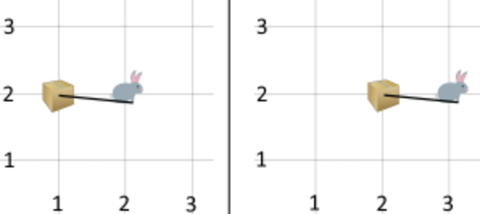

<h1 style='text-align: center;'> A. Box is Pull</h1>

<h5 style='text-align: center;'>time limit per test: 1 second</h5>
<h5 style='text-align: center;'>memory limit per test: 256 megabytes</h5>

Wabbit is trying to move a box containing food for the rest of the zoo in the coordinate plane from the point $(x_1,y_1)$ to the point $(x_2,y_2)$.

He has a rope, which he can use to pull the box. He can only pull the box if he stands exactly $1$ unit away from the box in the direction of one of two coordinate axes. He will pull the box to where he is standing before moving out of the way in the same direction by $1$ unit. 

  For example, if the box is at the point $(1,2)$ and Wabbit is standing at the point $(2,2)$, he can pull the box right by $1$ unit, with the box ending up at the point $(2,2)$ and Wabbit ending at the point $(3,2)$.

Also, Wabbit can move $1$ unit to the right, left, up, or down without pulling the box. In this case, it is not necessary for him to be in exactly $1$ unit away from the box. If he wants to pull the box again, he must return to a point next to the box. Also, Wabbit can't move to the point where the box is located.

Wabbit can start at any point. It takes $1$ second to travel $1$ unit right, left, up, or down, regardless of whether he pulls the box while moving.

Determine the minimum amount of time he needs to move the box from $(x_1,y_1)$ to $(x_2,y_2)$. 
## Note

 that the point where Wabbit ends up at does not matter.

### Input

Each test contains multiple test cases. The first line contains a single integer $t$ $(1 \leq t \leq 1000)$: the number of test cases. The description of the test cases follows.

Each of the next $t$ lines contains four space-separated integers $x_1, y_1, x_2, y_2$ $(1 \leq x_1, y_1, x_2, y_2 \leq 10^9)$, describing the next test case.

### Output

For each test case, print a single integer: the minimum time in seconds Wabbit needs to bring the box from $(x_1,y_1)$ to $(x_2,y_2)$.

## Example

### Input


```text
2
1 2 2 2
1 1 2 2
```
### Output


```text
1
4
```
## Note

In the first test case, the starting and the ending points of the box are $(1,2)$ and $(2,2)$ respectively. This is the same as the picture in the statement. Wabbit needs only $1$ second to move as shown in the picture in the statement.

In the second test case, Wabbit can start at the point $(2,1)$. He pulls the box to $(2,1)$ while moving to $(3,1)$. He then moves to $(3,2)$ and then to $(2,2)$ without pulling the box. Then, he pulls the box to $(2,2)$ while moving to $(2,3)$. It takes $4$ seconds.


#### Tags 

#800 #NOT OK #math 

## Blogs
- [All Contest Problems](../Codeforces_Raif_Round_1_(Div._1_+_Div._2).md)
- [Announcement](../blogs/Announcement.md)
- [Tutorial (en)](../blogs/Tutorial_(en).md)
