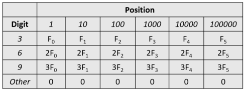

<h1 style='text-align: center;'> G1. Lucky Numbers (Easy Version)</h1>

<h5 style='text-align: center;'>time limit per test: 3 seconds</h5>
<h5 style='text-align: center;'>memory limit per test: 256 megabytes</h5>

This is the easy version of the problem. The only difference is that in this version $q=1$. You can make hacks only if all versions of the problem are solved.

Zookeeper has been teaching his $q$ sheep how to write and how to add. The $i$-th sheep has to write exactly $k$ non-negative integers with the sum $n_i$.

Strangely, sheep have superstitions about digits and believe that the digits $3$, $6$, and $9$ are lucky. To them, the fortune of a number depends on the decimal representation of the number; the fortune of a number is equal to the sum of fortunes of its digits, and the fortune of a digit depends on its value and position and can be described by the following table. For example, the number $319$ has fortune $F_{2} + 3F_{0}$. 

  Each sheep wants to maximize the sum of fortune among all its $k$ written integers. Can you help them?

#### Input

The first line contains a single integer $k$ ($1 \leq k \leq 999999$): the number of numbers each sheep has to write. 

 The next line contains six integers $F_0$, $F_1$, $F_2$, $F_3$, $F_4$, $F_5$ ($1 \leq F_i \leq 10^9$): the fortune assigned to each digit. 

 The next line contains a single integer $q$ ($q = 1$): the number of sheep.

Each of the next $q$ lines contains a single integer $n_i$ ($1 \leq n_i \leq 999999$): the sum of numbers that $i$-th sheep has to write. In this version, there is only one line.

#### Output

Print $q$ lines, where the $i$-th line contains the maximum sum of fortune of all numbers of the $i$-th sheep. In this version, you should print only one line.

## Examples

#### Input


```text
3
1 2 3 4 5 6
1
57
```
#### Output


```text
11
```
#### Input

```text

3
1 2 3 4 5 6
1
63

```
#### Output


```text

8
```
## Note

In the first test case, $57 = 9 + 9 + 39$. The three $9$'s contribute $1 \cdot 3$ and $3$ at the tens position contributes $2 \cdot 1$. Hence the sum of fortune is $11$.

In the second test case, $63 = 35 + 19 + 9$. The sum of fortune is $8$.


#### Tags 

#2900 #NOT OK #dp #greedy 

## Blogs
- [All Contest Problems](../Codeforces_Raif_Round_1_(Div._1_+_Div._2).md)
- [Announcement](../blogs/Announcement.md)
- [Tutorial (en)](../blogs/Tutorial_(en).md)
