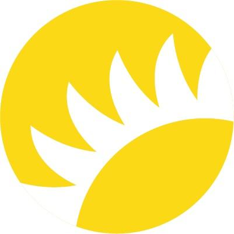

# Announcement

 Hi Codeforces!

I am glad to announce and invite you to [Codeforces Round 678 (Div. 2)](https://codeforces.com/contest/1436 "Codeforces Round 678 (Div. 2)"), which will be held on [Saturday, October 24, 2020 at 20:05UTC+6](https://codeforces.com/https://www.timeanddate.com/worldclock/fixedtime.html?day=24&month=10&year=2020&hour=17&min=5&sec=0&p1=166). A couple of weeks ago, we held [Codeforces Round 675 (Div. 2)](https://codeforces.com/contest/1422 "Codeforces Round 675 (Div. 2)") based on the tasks of the [contest:297213], and this time we want to offer you to solve the best 5-6 problems of the finals.

**Please note the unusual start time of the round. This round will be rated for the participants with rating lower than 2100.** 

This is the second year that [Andersen](https://codeforces.com/https://contest.andersenlab.com/) has been holding the competition, which is primarily intended to support students of regional Universities in Belarus and Ukraine (starting this year). This year, [60 students](//apc2020.contest.codeforces.com/group/vBi1GNDIyR/contestRegistrants/297218) from regional universities in Belarus and Ukraine will take part in the finals of the competition.

 * The authors of the round are: Aleksey [aropan](https://codeforces.com/profile/aropan "Grandmaster aropan") Ropan, Yuri [hloya_ygrt](https://codeforces.com/profile/hloya_ygrt "Grandmaster hloya_ygrt") Shilyaev, Andrei [andrew](https://codeforces.com/profile/andrew "Grandmaster andrew") Mishchanka, Alexander [AleXman111](https://codeforces.com/profile/AleXman111 "Candidate Master AleXman111") Krivosheev and me.
* The round was coordinated by Nikolay [KAN](https://codeforces.com/profile/KAN "International Grandmaster KAN") Kalinin and Ildar [300iq](https://codeforces.com/profile/300iq "Legendary Grandmaster 300iq") Gainullin.
* The round was tested by: Boris [PuRpLe_FoReVeR](https://codeforces.com/profile/PuRpLe_FoReVeR "International Master PuRpLe_FoReVeR") Serenkov, Yahor [244mhq](https://codeforces.com/profile/244mhq "Legendary Grandmaster 244mhq") Dubovik, [cckk4467](https://codeforces.com/profile/cckk4467 "Expert cckk4467") and [rafaelgo](https://codeforces.com/profile/rafaelgo "Candidate Master rafaelgo").
* And, of course, thank you very much Mike [MikeMirzayanov](https://codeforces.com/profile/MikeMirzayanov "Headquarters, MikeMirzayanov") Mirzayanov for creating the polygon and codeforces platforms.

Thanks a lot for your contribution to the preparation of the round!

Good luck to everyone in the upcoming competition! :)

**UPD:** The [editorial](Tutorial.md) was posted.

Congratulations to the winners of **div 2**:

 1. [kuticpcer](https://codeforces.com/profile/kuticpcer "Specialist kuticpcer")
2. [SevenDawns](https://codeforces.com/profile/SevenDawns "Expert SevenDawns")
3. [Clix](https://codeforces.com/profile/Clix "Candidate Master Clix")
4. [iamgqr](https://codeforces.com/profile/iamgqr "Candidate Master iamgqr")
5. [rishant_m](https://codeforces.com/profile/rishant_m "Candidate Master rishant_m")

as well as **div 1** winners:

 1. [jiangly](https://codeforces.com/profile/jiangly "Legendary Grandmaster jiangly")
2. [dorijanlendvaj](https://codeforces.com/profile/dorijanlendvaj "International Grandmaster dorijanlendvaj")
3. [vepifanov](https://codeforces.com/profile/vepifanov "International Grandmaster vepifanov")
4. [krijgertje](https://codeforces.com/profile/krijgertje "International Grandmaster krijgertje")
5. [darkkcyan](https://codeforces.com/profile/darkkcyan "Master darkkcyan")

Thank you all for participating!

