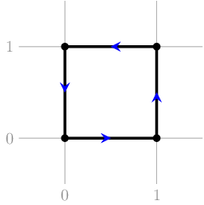
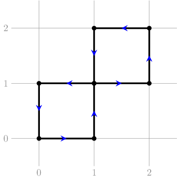
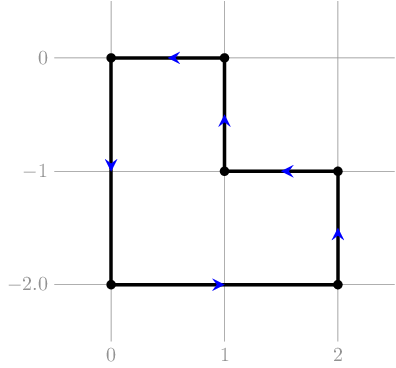
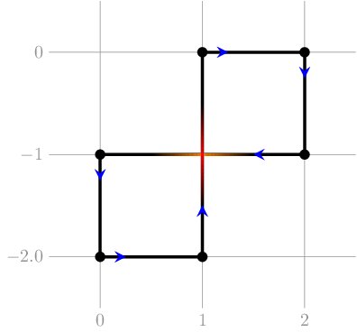

<h1 style='text-align: center;'> D. Rectangular Polyline</h1>

<h5 style='text-align: center;'>time limit per test: 2 seconds</h5>
<h5 style='text-align: center;'>memory limit per test: 512 megabytes</h5>

One drew a closed polyline on a plane, that consisted only of vertical and horizontal segments (parallel to the coordinate axes). The segments alternated between horizontal and vertical ones (a horizontal segment was always followed by a vertical one, and vice versa). The polyline did not contain strict self-intersections, which means that in case any two segments shared a common point, that point was an endpoint for both of them (please consult the examples in the notes section).

Unfortunately, the polyline was erased, and you only know the lengths of the horizonal and vertical segments. Please construct any polyline matching the description with such segments, or determine that it does not exist.

##### Input

The first line contains one integer $t$ ($1 \leq t \leq 200$) —the number of test cases.

The first line of each test case contains one integer $h$ ($1 \leq h \leq 1000$) — the number of horizontal segments. The following line contains $h$ integers $l_1, l_2, \dots, l_h$ ($1 \leq l_i \leq 1000$) — lengths of the horizontal segments of the polyline, in arbitrary order.

The following line contains an integer $v$ ($1 \leq v \leq 1000$) — the number of vertical segments, which is followed by a line containing $v$ integers $p_1, p_2, \dots, p_v$ ($1 \leq p_i \leq 1000$) — lengths of the vertical segments of the polyline, in arbitrary order.

Test cases are separated by a blank line, and the sum of values $h + v$ over all test cases does not exceed $1000$.

##### Output

For each test case output Yes, if there exists at least one polyline satisfying the requirements, or No otherwise. If it does exist, in the following $n$ lines print the coordinates of the polyline vertices, in order of the polyline traversal: the $i$-th line should contain two integers $x_i$ and $y_i$ — coordinates of the $i$-th vertex.

## Note

 that, each polyline segment must be either horizontal or vertical, and the segments should alternate between horizontal and vertical. The coordinates should not exceed $10^9$ by their absolute value.

## Examples

##### Input


```text
2
2
1 1
2
1 1

2
1 2
2
3 3
```
##### Output


```text
Yes
1 0
1 1
0 1
0 0
No
```
##### Input


```text
2
4
1 1 1 1
4
1 1 1 1

3
2 1 1
3
2 1 1
```
##### Output


```text
Yes
1 0
1 1
2 1
2 2
1 2
1 1
0 1
0 0
Yes
0 -2
2 -2
2 -1
1 -1
1 0
0 0
```
##### Input


```text
2
4
1 4 1 2
4
3 4 5 12

4
1 2 3 6
2
1 3
```
##### Output


```text
Yes
2 0
2 3
3 3
3 7
4 7
4 12
0 12
0 0
No
```
## Note

In the first test case of the first example, the answer is Yes — for example, the following picture illustrates a square that satisfies the requirements: 

   In the first test case of the second example, the desired polyline also exists. 
## Note

 that, the polyline contains self-intersections, but only in the endpoints: 

   In the second test case of the second example, the desired polyline could be like the one below: 

   
## Note

 that the following polyline is not a valid one, since it contains self-intersections that are not endpoints for some of the segments: 

   

#### Tags 

#2900 #NOT OK #constructive_algorithms #dp #geometry 

## Blogs
- [All Contest Problems](../Codeforces_Round_680_(Div._1,_based_on_Moscow_Team_Olympiad).md)
- [Announcement](../blogs/Announcement.md)
- [Tutorial](../blogs/Tutorial.md)
