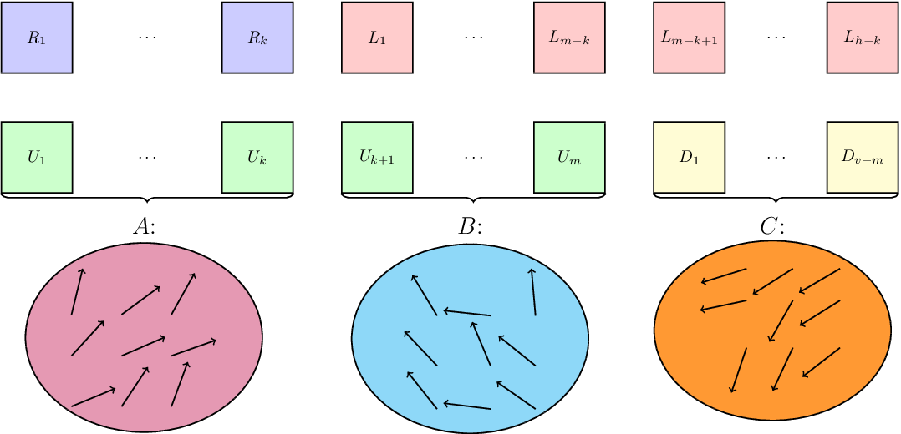
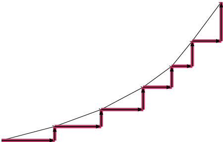
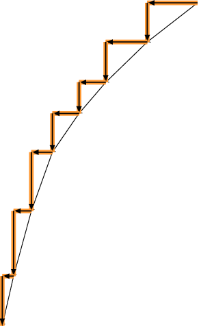
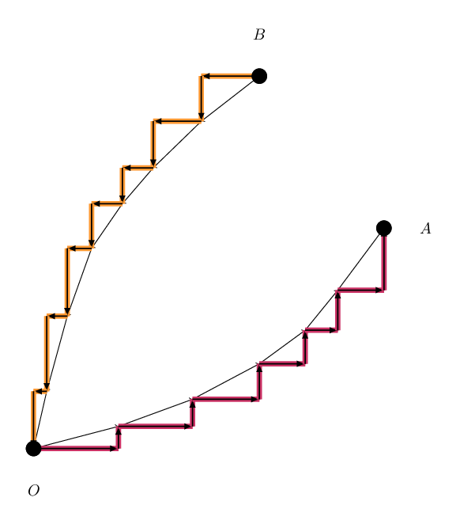
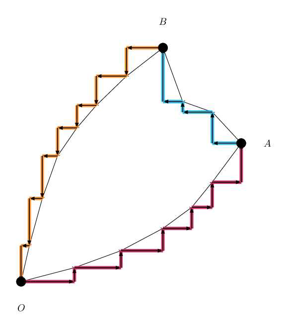
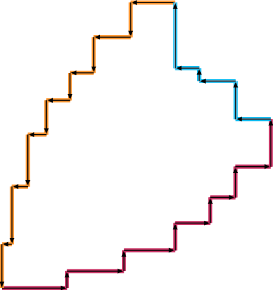

# Tutorial

Thanks for the participation!

[1445A - Array Rearrangment](../problems/A._Array_Rearrangment.md "Codeforces Round 680 (Div. 2, based on Moscow Team Olympiad)") was authored by [meshanya](https://codeforces.com/profile/meshanya "Grandmaster meshanya") and prepared by [ch_egor](https://codeforces.com/profile/ch_egor "International Grandmaster ch_egor")

[1445B - Elimination](../problems/B._Elimination.md "Codeforces Round 680 (Div. 2, based on Moscow Team Olympiad)") was authored by Helen Andreeva and prepared by [ismagilov.code](https://codeforces.com/profile/ismagilov.code "Grandmaster ismagilov.code")

[1444A - Division](https://codeforces.com/contest/1444/problem/A "Codeforces Round 680 (Div. 1, based on Moscow Team Olympiad)") was authored by [vintage_Vlad_Makeev](https://codeforces.com/profile/vintage_Vlad_Makeev "International Grandmaster vintage_Vlad_Makeev") and prepared by [grphil](https://codeforces.com/profile/grphil "Master grphil")

[1444B - Divide and Sum](https://codeforces.com/contest/1444/problem/B "Codeforces Round 680 (Div. 1, based on Moscow Team Olympiad)") was authored and prepared by [NiceClock](https://codeforces.com/profile/NiceClock "Master NiceClock")

[1444C - Team-Building](https://codeforces.com/contest/1444/problem/C "Codeforces Round 680 (Div. 1, based on Moscow Team Olympiad)") was authored by [V--o_o--V](https://codeforces.com/profile/V--o_o--V "Legendary Grandmaster V--o_o--V") and prepared by [wrg0ababd](https://codeforces.com/profile/wrg0ababd "Expert wrg0ababd")

[1444D - Rectangular Polyline](https://codeforces.com/contest/1444/problem/D "Codeforces Round 680 (Div. 1, based on Moscow Team Olympiad)") was authored by [Zlobober](https://codeforces.com/profile/Zlobober "International Grandmaster Zlobober") and prepared by [DebNatkh](https://codeforces.com/profile/DebNatkh "Master DebNatkh")

[1444E - Finding the Vertex](https://codeforces.com/contest/1444/problem/E "Codeforces Round 680 (Div. 1, based on Moscow Team Olympiad)") was authored by [V--o_o--V](https://codeforces.com/profile/V--o_o--V "Legendary Grandmaster V--o_o--V") and prepared by [300iq](https://codeforces.com/profile/300iq "Legendary Grandmaster 300iq")

 
### [1445A - Array Rearrangment](../problems/A._Array_Rearrangment.md "Codeforces Round 680 (Div. 2, based on Moscow Team Olympiad)")

It's enough to sort $a$ in non-decreasing order and sort $b$ in non-increasing order and check, whether $a_i + b_i \leq x$ for all $i$.

Correctness can be proven by induction: let's show that if answer exists, there is a solution with minimum in $a$ and maximum in $b$ are paired. Let $m_a$ be minimum in $a$ and $m_b$ be maximum in $b$. Let $p$ be number paired with $m_a$ and $q$ be number paired with $m_b$. Since solution is correct, $m_a + p \leq x$ and $m_b + q \leq x$. Since $m_a \leq q$, $m_a + m_b \leq x$. Since $p \leq m_b$, $p + q \leq x$. So, $m_a$ can be paired with $m_b$.

 
### [1445B - Elimination](../problems/B._Elimination.md "Codeforces Round 680 (Div. 2, based on Moscow Team Olympiad)")

The answer is at least $\max(a + b, d + c)$ because we have at least $100$ participants with the sum of $a + b$ and at least $100$ participants with the sum of $d + c$. 

If we have $99$ participants with points equal to $(a, c)$, and $2$ participants with points equal to $(a, b)$ and $(d, c)$, then the 100th participant will have a total of $\max(a + b, d + c)$ points, and the condition will be met, because $a \ge d$, $c \ge b$ and $a + c \ge \max(a + b, d + c)$.

 
### [1444A - Division](https://codeforces.com/contest/1444/problem/A "Codeforces Round 680 (Div. 1, based on Moscow Team Olympiad)")

Let $y = p / x$. Let's assume, that there exists prime $a$, such that $a$ divides $y$, but $q$ is not divisible by $a$. Then we can multiply $x$ and $a$ and the result will still divide $p$, but will not be divisible by $q$. So for maximal $x$ there is no such $a$.

Let's assume, that there are two primes $a$ and $b$, such that they both divide $y$, and both divide $q$. Because $q$ is not divisible by $x$, there exists some prime $c$ ($c$ can be equal to $a$ or $b$), such that number of occurrences of $c$ in $x$ is less than number of occurrences of $c$ in $q$. One of $a$ and $b$ is not equal to $c$, so if we will multiply $x$ and such number, the result will not be divisible by $q$. So for maximal $x$ there are no such $a$ and $b$.

That means that $x = p / $(power of some primal divisor of $q$). So to find maximal $x$, we have to find all prime divisors of $q$ (we have to factorise $q$ for it in time $O(\sqrt{q})$) and for each of them divide $p$ by it until result is not divisible by $q$. That will be all our candidates for greatest $x$. We will do all of that in time $O(\sqrt{q} + \log q \cdot \log p)$.

 
### [1444B - Divide and Sum](https://codeforces.com/contest/1444/problem/B "Codeforces Round 680 (Div. 1, based on Moscow Team Olympiad)")

No matter how we split the array, the cost of a partition will always be the same.

Let's prove it. Without loss of generality we will consider that the array $a$ sorted and denote for $L$ the set of elements with indexes from $1$ to $n$, and for $R$ the set of elements with indexes from $n + 1$ to $2n$.

Then split the array $a$ into any two arrays $p$ and $q$ of size $n$. Let's sort $p$ in non-decreasing order and $q$ by non-increasing order. Any difference $|p_i - q_i|$ in our sum will be the difference of one element of $R$ and one element of $L$.

If this is not the case, then there is an index $i$ such that both $p_i$ and $q_i$ belong to the same set. Let's assume that this is $L$.

1. All elements with indexes less than or equal to $i$ in $p$ belong to $L$ ($i$ elements)
2. All items with indexes greater than or equal to $i$ in $q$ belong to $L$ ($n - (i - 1)$ elements)

Then $L$ has at least $i + n - (i-1) = n + 1$ elements, but there must be exactly $n$. Contradiction. For the set $R$ the proof is similar.

Then the answer to the problem is (the sum of the elements of the set $R$ minus the sum of the elements of the set $L$) multiplied by the number of partitions of the array $C^{n}_{2n}$.

Complexity: $O(n \log n)$ (due to sorting)

 
### [1444C - Team-Building](https://codeforces.com/contest/1444/problem/C "Codeforces Round 680 (Div. 1, based on Moscow Team Olympiad)")

You're given an undirected graph without loops and multiple edges, each vertex has some color from $1$ to $k$. Count the number of pairs of colors such that graph induced by vertices of these two colors will be bipartite.

Let's check for each color whether the graph induced by it is bipartite (for example, using depth-first search). This can be done in $O(n + m)$. We will not use non-bipartite colors further since they can't be in any pairs.

Now let's construct a slow solution that we will make faster later.

Consider some color $x$. There're edges from vertices of this color to vertices of colors $y_1, y_2, \ldots, y_k$. Let's check whether the graphs induced by pairs $(x, y_1), (x, y_2), \ldots, (x, y_k)$ are bipartite (also using depth-first search), thereby finding out which colors cannot be in pair with $x$. The others can. After doing this for each color $x$, we can find the asnwer.

How fast does this work? Notice that any edge between different colors we will use in DFS only two times. The problem are edges between vertices of the same color, we can use them up to $k$ times, and there can be a lot of them.

Let's solve this problem and construct a faster solution.

A graph is bipartite if and only if it doesn't contains odd cycles. Consider some connected bipartite component induced by color $x$. If a cycle goes through this component, it doesn't matter how exactly it does it. If the path of the cycle in this component ends in the same side where it has started, then it has even length, and odd otherwise. This fact lets us compress this component to two vertices (one for each side) connected by one edge. For each color this way we compress all components formed by it.

Now we have the compressed graph, where all connected components are either one vertex or two vertices connected by one edge. Let's do the same process we did in slow solution and check every connected pair of colors whether the graph induced by it is bipartite. 

To check the pair $(x, y)$, for each edge between vertices of colors $x$ and $y$ in the original graph add a new edge to the compressed graph between corresponding vertices. After that use DFS to check if graph is bipartite, rollback the changes and do the same for all other pairs. 

How long does this work for one pair $(x, y)$?

Let's start DFS only from components that were connected by added edges, since the others do not affect whether the graph is bipartite or not, but there can be a lot of them. This way DFS will use only added edges and some edges between vertices of the same color $x$ or $y$. However, there will be at most two times more of the latter than the added, because each added edge connects at most two new components, and each new component has at most one edge. So, we check one pair in the time proportional to amount of edges between its colors, and it sums up to $O(m)$ for all pairs.

So, the whole solution works in $O(n + m)$ or $O(m \log n)$, depending on the implementation.

 
### [1444D - Rectangular Polyline](https://codeforces.com/contest/1444/problem/D "Codeforces Round 680 (Div. 1, based on Moscow Team Olympiad)")

First, note that in a correct polyline, since the horizontal and vertical segments alternate, $h=v$: if this equality does not hold, the answer is negative. Now let's fix a vertex and go around the polyline in some direction. Then in the process of traversin, we will move in one of four possible directions: up, down, right or left. Since the polyline is closed, this means that we will move to the left in total by the same distance as we will move to the left in total. The same is true for moving up and down.

This means that if we split all the segments into four sets named $Up$, $Down$, $Left$, $Right$, then the total length of the segments in $Up$ will be equal to the total length of the segments in $Down$, and the total length of the segments in $Right$ will be equal to the total length of the segments in $Left$. But it means that the set of lengths of all horizontal segments can be divided into two sets with the same sum. The same should hold for vertical segments.

Let's check whether it is possible to divide the set of lengths of horizontal segments into two sets of the same sum. This classic problem can be solved by applying the dynamic programming method to solve the backpack problem. The complexity of this solution will be $ \mathcal O\left({nC^2}\right)$ If it is impossible to split horizontal or vertical lengths into two sets of equal length, the answer is "No". Now we will show how to construct a correct answer if such divisions exist.

Let us divide all horizontal lengths into two sets of equal total length. We denote the smaller set as $R$, and the larger set as $L$. We will do the same with the set of lengths of vertical segments: we will denote the smaller set as $D$, and the larger one as $U$. Since $|R| \leq |L|$, $ |R| \leq h / 2 = v / 2$. Similarly, we have $v / 2 \leq |U|$, which follows that $|R| \leq |U/$, $|D| \leq |L|$.

Now let's divide all the segments into pairs as follows: each segment of $R$, we match with a segment from $U$. All remaining segments of $L$ are matched with one of the remaining vertical segments. Thus, we have divided all these segments into three sets of pairs: in the first one, a segment from $R$ is paired with a segment from $U$. In the second set a segment from $L$ is paired with a segment from $U$. In the third set a segment from $D$ is paired with a segment from $L$.

  From the first set of pairs, we make up the set of vectors directed up and to the right (from the pair (r, u), we construct the vector (r, u)). This way we can construct a set of vectors $A$. We will do the same with the second set of pairs (constructing a set of vectors $B$) and the third set of pairs (constructing a set of vectors $C$). for a better understanding, see the picture above. Note that the set $B$ may be empty, while the other two can not.

Let's make a convex polyline from the vectors of $A$. In order to do this, sort them in ascending order by the polar angle and make a polyline from them in this order (see the picture below).

Now we will replace each of the vectors of our polyline with two vectors: one vector directed to the right and one vector directed upwards.

  We will do the same for vectors from $C$: sort them in ascending order by the polar angle and make a convex polyline from them:

  Let's combine these two polylines so that the first one goes from the point $O$ to the point $A$ and the second one goes from the point $B$ to the point $O$:

  We don't have much left to do: we hate to connect the points $A$ and $B$ using vectors from the set $B$. Let's take these vectors (directed up and to the left) in any arbitrary order, then, since the sum of all vectors is 0, the resulting polyline, if you draw it with the beginning at the point $A$, will end at the point $B$. Since the first two polylines were convex, this means that none of the points of the first two polylines will lie strictly inside the angle $AOB$, which means that if you replace each of the vectors of the third polyline with two vectors, one directed to the left and one directed upwards, the resulting closed polyline will not contain self-intersections.

  It is easy to show that the resulting polyline will be closed and will satisfy all the conditions of the problem:

   
### [1444E - Finding the Vertex](https://codeforces.com/contest/1444/problem/E "Codeforces Round 680 (Div. 1, based on Moscow Team Olympiad)")

Consider the optimal strategy.

Some edge will be your first query, mark it with a number $0$.

After that, build similar colourings (recursively) for components on both sides of the edge, but increase their weights by one (to have only one zero in total).

This colouring corresponds to the strategy, and if $k$ is the maximum weight of an edge in it, then this strategy can find a vertex in $k+1$ queries in the worst case.

This colouring has a wonderful property that helps us identify the vertex: on a path between any two edges with the same colour an edge with the smaller colour presents.

And any colouring with this property corresponds to a proper strategy! (Each time you can ask an edge with the smallest weight in the current component)

To make it easier for us, "invert" all weights in the colouring, mark the first edge with the weight $k-1$, and then use the same construction as we had before for our colouring, but now subtract $1$ from the edges (weights should remain non-negative).

Now our goal is to find colouring with the min weight of the max edge, such that each pair of edges with the same colours have an edge with the larger colour between them.

We will build this colouring using subtree DP.

For the fixed colouring of a subtree of the vertex $v$, let's see which colours are visibile if you will look from $v$ towards the subtree.

The colour is visible, if there is such an edge of this colour, that there are no edges with the larger colour on a path from this edge to $v$.

Potential function of our colouring is the sum $2^{c_1} + 2^{c_2} + \ldots + 2^{c_k}$, where $c_i$ are visible colours. Note that this value is a long number! Because our answer can be large.

Lemma: we are interested only in the colouring of our subtree with the smallest potential.

Assume that all subtrees of vertex $v$ are already coloured into colourings with the smallest potentials.

Then we have to choose some weights of edges outgoing from $v$, such that after adding these edges to $v$, different subtrees won't have common visible colours (otherwise you will get a bad pair of edges of the same colour). 

You can color an edge from vertex $v$ to its child $u$ in a colour $c$, if a colour $c$ is not visible from $u$. After that, all weights smaller than $c$ will disappear from the set of visible colours, but the colour $c$ will be added.

You have to change colourings of the subtrees in this way, to not have carries during the addition of the potentials (it will correspond to the situation without common visible colours). Under this constraint, we have to minimize the total sum, the potential of $v$.

From this setting, the proof of the previous lemma is clear: for larger values of the potential, possible choices are not better.

You have to solve a problem: you are given an array $a_1, a_2, \ldots, a_k$ of long binary numbers. You have to find an array with the smallest sum $b_1, b_2, \ldots, b_k$, such that $b_i > a_i$, and no carries will happen during the addition $b_1 + b_2 + \ldots + b_k$.

You can solve this problem with a quite simple greedy algorithm: we will set bits greedily from left to right, and check that we can finish our goal with the fixed prefix. To check that you can get some answer with the fixed prefix of bits and the upper bound on the used bits, you can go from left to right and each time when you have to replace some number to the current bit, replace the number with the largest suffix. You can implement it in a naive way in $\mathcal{O}{(n^3)}$, but it also can be implemented in $\mathcal{O}{(n \log n)}$.

You have to solve this subtask $n$ times, and we will get the solution with complexity $\mathcal{O}{(n \cdot T(n))} = \mathcal{O}{(n^2 \log n \ldots n^4)}$.

