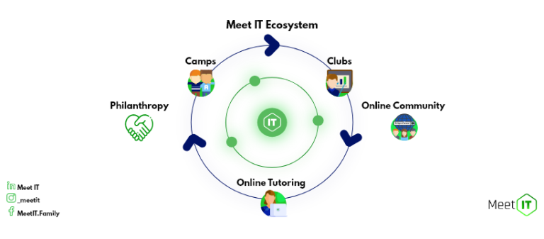

# Announcement_(en)

Hello, Codeforces!

On behalf of Meet IT, I'm glad to invite you to ([Codeforces Round #683 by Meet IT (Div1, Div2)](https://codeforces.com/contests/1446,1447) which will take place [this Sunday (15th November)](https://codeforces.com/https://www.timeanddate.com/worldclock/fixedtime.html?day=15&month=11&year=2020&hour=17&min=35&sec=0&p1=166). 

The round lasts 2.5 hours and is **rated** for both divisions. 

### What is Meet IT?

We are a family of enthusiastic and motivated young people passionate about programming and mathematics. We build a community where people learn together, motivate and help each other.

 **Please expand the spoiler to find out more about us.**
### Our values

 * We teamwork, not compete,
* Active learning is more effective than passive,
* We all work on the same goal: a better education for everyone,
* We don’t teach people; we show them how to discover by themselves,
* We are curious, ask questions, and explore,
* 1 hour practising is worth more than 10 hours watching someone else

### How to join Meet IT family?

To find out what we do visit our [website](https://codeforces.com/https://meetit.eu/). To join the community and get notified about our events follow us on [Facebook](https://codeforces.com/https://www.facebook.com/MeetIT.Family) and join [Meet IT family group](https://codeforces.com/https://www.facebook.com/groups/meetit).

Our upcoming event is a **competitive programming online workshop on 28.11** organised by [edsa](https://codeforces.com/profile/edsa "Master edsa") and [arsijo](https://codeforces.com/profile/arsijo "International Grandmaster arsijo"). Check it out and sign up [here](https://codeforces.com/https://www.eventbrite.com/e/meet-it-workshops-tickets-128201017695).

Meet IT family members worked hard over the last few months to provide you with our favourite challenges we came up with. We hope that you will enjoy them as much as we did :)

We are enthusiasts of short and clear problem statements, strong pretests, and happy participants!

Every effort is valuable for us, and therefore I'd like to thank everyone who has contributed to the creation of this round:

 * Co-founders of Meet IT: Mateusz and Paweł for guiding Meet IT projects and making things happen.
* Maciej, Piotr and Michał. Without their commitment in early years of Meet IT the Family would not exist.
* Round coordinator [antontrygubO_o](https://codeforces.com/profile/antontrygubO_o "International Grandmaster antontrygubO_o") for **endless** discussions about the problemset.
* [pawelek1](https://codeforces.com/profile/pawelek1 "Master pawelek1") for coming up with problem ideas.
* [tnowak](https://codeforces.com/profile/tnowak "Grandmaster tnowak") for massive support in the work on harder tasks.
* [staniewzki](https://codeforces.com/profile/staniewzki "Grandmaster staniewzki") and [jjaworska](https://codeforces.com/profile/jjaworska "International Master jjaworska") for developing the most challenging problem of the round.
* [pasawicki](https://codeforces.com/profile/pasawicki "Expert pasawicki") for interest in tennis which was an inspiration to one of the problems, and for preparing another problem.
* [lcaonmst](https://codeforces.com/profile/lcaonmst "Expert lcaonmst") for preparing a problem quickly and diligently.
* [Mohamed.Sobhy](https://codeforces.com/profile/Mohamed.Sobhy "Expert Mohamed.Sobhy") for coming up with a nice easy problem and preparing it.
* [Amtek](https://codeforces.com/profile/Amtek "Master Amtek") for enduring my repetitive reminders to prepare a problem.
* [flaviu2001](https://codeforces.com/profile/flaviu2001 "Master flaviu2001") for his excitement about the round after testing and help to improve the shortcomings.
* [_h_](https://codeforces.com/profile/_h_ "International Grandmaster _h_") for help in providing a high-quality editorial to one of the problems.
* [dorijanlendvaj](https://codeforces.com/profile/dorijanlendvaj "International Grandmaster dorijanlendvaj") for firmly complaining about one edgy problem that pushed us towards substituting it with a better one.
* [kobor](https://codeforces.com/profile/kobor "Master kobor") for providing beautiful pictures for the removed problem. :(
* [Devil](https://codeforces.com/profile/Devil "International Master Devil") for coming up with the substitution problem :), without you we would be still finalizing the problemset.
* [arsijo](https://codeforces.com/profile/arsijo "International Grandmaster arsijo") for paying special attention to statements clarity during testing.
* [zdolna_kaczka](https://codeforces.com/profile/zdolna_kaczka "International Grandmaster zdolna_kaczka") for winning the virtual contest among testers.
* [Anadi](https://codeforces.com/profile/Anadi "International Grandmaster Anadi") for inventing an alternative solution to one of the hard problems as well as his kind comments and suggestions.
* [Farhan132](https://codeforces.com/profile/Farhan132 "Candidate Master Farhan132") for his ideas on how to improve the problemset in the second division.
* [Linkus](https://codeforces.com/profile/Linkus "Master Linkus") and [a.piasta](https://codeforces.com/profile/a.piasta "Master a.piasta") for showing the need to reduce the round difficulty a bit.
* The Army of Testers: [ffao](https://codeforces.com/profile/ffao "International Grandmaster ffao"), [RetiredPlayer](https://codeforces.com/profile/RetiredPlayer "Candidate Master RetiredPlayer"), [Retired_cherry](https://codeforces.com/profile/Retired_cherry "Expert Retired_cherry"), [Whistleroosh](https://codeforces.com/profile/Whistleroosh "Expert Whistleroosh"), [ijontichy](https://codeforces.com/profile/ijontichy "Unrated, ijontichy"), [coderz189](https://codeforces.com/profile/coderz189 "Expert coderz189"), [AwesomeHunter](https://codeforces.com/profile/AwesomeHunter "Expert AwesomeHunter"), [H4ckOm](https://codeforces.com/profile/H4ckOm "Specialist H4ckOm"), [TeaTime](https://codeforces.com/profile/TeaTime "Candidate Master TeaTime"), [hg333](https://codeforces.com/profile/hg333 "Expert hg333").
* [MikeMirzayanov](https://codeforces.com/profile/MikeMirzayanov "Headquarters, MikeMirzayanov") for the amazing platforms Codeforces and Polygon.
* all the people who strive for Meet IT Family to grow.
* Last but not least, my dear wife Marta who was very supportive throughout the **long** process of preparing the round.

**UPD**

I'm also thankful for [Swistakk](https://codeforces.com/profile/Swistakk "International Grandmaster Swistakk") for testing the round thoroughly. Sorry for forgetting! I wrote the announcement sometime before that. I totally don't get why he got downvoted, please give him as much contribution as he deserves!

**UPD 2**

There will be 66 problems in each division, with 44 problems shared. One of those will have a subtask!

We **strongly** recommend to read all the problems. You have been warned :)

**Scoring:**

**Div 2: 500 — 1000 — 1250 — 2000 — 2250 — (2500 + 750)**

**Div 1: 500 — 1000 — 1250 — (1750+750) — 3000 — 3000**

**UPD 3**

We would like to host a stream shortly after the contest. We haven't yet figured out the details, you can expect some backstage stories about the round, Meet IT, and casual discussion. Stay tuned!

**UPD 4**

We've added the link to the stream which shows on the *Streams* pannel on the right. You're more than welcome to join [our stream](https://codeforces.com/https://www.youtube.com/watch?v=FZZGYMs_-f8&feature=youtu.be&fbclid=IwAR1GCdUBGHgv9iRlwYIGXcNYRjirDQ5adOlzXIAm-Inh25enTfJ-ezLGzaM)

**UPD 5**

[Editorial is ready!](E_(en).md)

**UPD 6**

We hope you've all enjoyed the round despite some minor issues. Congratulations to the winners! 

Division 1:

 1. [Um_nik](https://codeforces.com/profile/Um_nik "Legendary Grandmaster Um_nik") (the only person to solve all problems!)
2. [ecnerwala](https://codeforces.com/profile/ecnerwala "Legendary Grandmaster ecnerwala")
3. [Benq](https://codeforces.com/profile/Benq "Legendary Grandmaster Benq")
4. [ainta](https://codeforces.com/profile/ainta "Legendary Grandmaster ainta")
5. [ksun48](https://codeforces.com/profile/ksun48 "Legendary Grandmaster ksun48")

Division 2:

 1. [shb](https://codeforces.com/profile/shb "Master shb")
2. [jz_597](https://codeforces.com/profile/jz_597 "Candidate Master jz_597")
3. [1700012703](https://codeforces.com/profile/1700012703 "Newbie 1700012703")
4. [XueYJ](https://codeforces.com/profile/XueYJ "Candidate Master XueYJ")
5. [zybkl](https://codeforces.com/profile/zybkl "Master zybkl")
